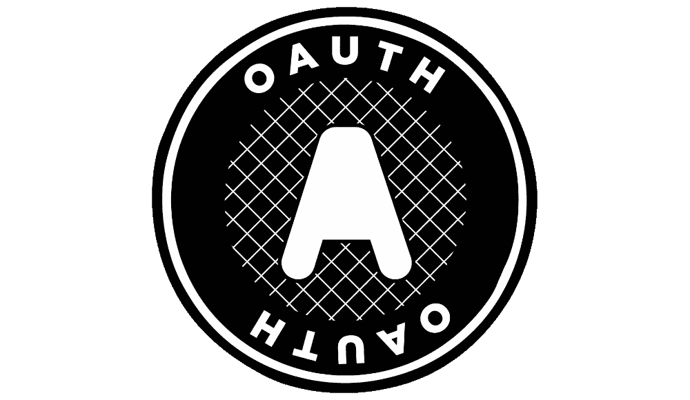

# OAuth 对单页应用程序、jsdild 和 Codepen 的隐式授权

> 原文：<https://javascript.plainenglish.io/oauth-implicit-grant-for-single-page-applications-jsfiddle-and-codepen-10c2c7946f05?source=collection_archive---------19----------------------->

OAuth logo

随着电脑和智能手机变得越来越强大，单页面应用程序(SPAs)的吸引力持续上升。SPA 是一个主要在浏览器中运行*的应用程序。*最著名的 SPA 是 Gmail 应用程序。如今，温泉到处都是。

更复杂的 SPA 应用程序通常使用 React、Vue 或类似的框架。不管有没有 jQuery，JavaScript 都可以很好地工作。

对于快速开发和原型制作来说，jsFiddle 和 Codepen 是构建 spa 的优秀工具。在本文中，我将向您展示如何将 OAuth 隐式授权流用于您的 jsFiddle 或 Codepen JS 项目。

**OAuth 授权码和隐式授权流**

OAuth v2.0 包括多个授权应用程序访问资源的流程。经常使用的授权码授权流由包括安全服务器后端的应用程序使用，该安全服务器后端可以适当地保护其客户端秘密值。

因为纯 SPA 没有安全的服务器后端，所以需要不同的 OAuth 解决方案。有两种选择，OAuth v2.0 推荐的 OAuth 隐式授权流，以及即将推出的 OAuth v2.1 要求的授权码授权(没有客户端秘密)+ PKCE(代码交换的证明密钥)流

**单页申请和 OAuth 隐式授权流程**

OAuth v2.0 隐式授权流可用于任何单页应用程序:

1.  向 OAuth 授权服务器(AS)注册 SPA 的返回 URL，并接收客户端 ID。客户端 id 不是秘密，它们是客户端应用程序的公共标识符。
2.  为了获得访问令牌，SPA 将浏览器重定向到 AS，或者为 AS 打开新的浏览器选项卡。AS URL 包括客户端 ID 和其他数据。
3.  AS 返回一个登录页面，使应用程序的用户能够向身份提供者进行身份验证。
4.  AS 将浏览器重定向到注册的返回 URL。访问令牌包含在片段标识符中。例如`https://app.example.com/#access_token=eyJ0eXAiOiJNl1aBmkCllvQ&expires_in=28800&token_type=bearer&scope=signature&state=3CDOtfb9e0cRsJQFp`

**重定向或打开新的浏览器窗口？**

客户端应用程序可以向 OAuth 授权服务器打开一个新的浏览器窗口，或者重定向浏览器。标准要求不得使用 iFrame。

打开一个新的浏览器选项卡或窗口是更简单的解决方案:SPA 仍在其原始浏览器窗口中运行，并保持其状态。在授权流程中不会重置。一旦用户通过 as 进行了身份验证，它就可以关闭登录浏览器选项卡。注意，OAuth 安全标准需要新的浏览器选项卡或窗口来显示授权服务器的 URL。这使用户能够验证 URL。

重定向单页应用程序的浏览器窗口本身要求 SPA 首先存储其状态，因为当 AS 将浏览器重定向回 SPA 时，SPA 将重新启动。SPA 状态可以本地存储在浏览器中，也可以远程存储在服务器中。

**jsFiddle 和 code pen vs OAuth 隐式授权流**

不幸的是，jsFiddle、Codepen 和类似的工具不能直接使用隐式授权流。这些工具的 JavaScript 应用程序在 iFrames 中运行，与 jsFiddle 和 Codepen URLs 一起使用的片段标识符对其托管的 JavaScript 应用程序不可用。

解决方案是使用一个“[重定向页面](https://docusign.github.io/jsfiddleImplicitGrantReturn.html)，一个单独托管的 HTML/JavaScript 文件，用于来自授权服务器的重定向。重定向页面使用 [Window.postMessage](https://developer.mozilla.org/en-US/docs/Web/API/Window/postMessage) 将授权服务器的响应发送回在 jsFiddle 或 Codepen 中运行的 JavaScript 应用程序。

**OAuth 流程示例**

1.  应用程序向 OAuth 授权服务器注册。对于这些例子，使用了 DocuSign developer OAuth 服务器。应用程序的 OAuth 返回 URL 被设置为[重定向页面](https://docusign.github.io/jsfiddleImplicitGrantReturn.html) ( [源](https://github.com/docusign/docusign.github.io/blob/master/jsfiddleImplicitGrantReturn.html))。
2.  JavaScript 注册一个事件监听器来接收传入的窗口消息。
3.  用户单击登录按钮。
4.  JavaScript 从[random.org](https://www.random.org)获得一个随机数字符串。nonce 作为`state`属性被发送(并且稍后被检查)以防止[访问令牌注入攻击](https://oauth.net/articles/authentication/#access-token-injection)。
5.  将打开一个新的浏览器选项卡，指向隐式授权流的起始 URL。
6.  用户通过 OAuth 身份验证服务进行身份验证。
7.  身份验证服务将浏览器重定向到重定向页面。访问令牌包含在重定向 URL 中。
8.  重定向 URL 页面使用`Window.postMessage`将其传入的片段(散列)字符串发送到浏览器标签的父标签，即运行在 Codepen 或 jsFiddler 中的 JavaScript。
9.  JavaScript 接收消息。它解码消息，检查`state`值，并存储访问令牌。
10.  访问令牌现在可以用于其他 API 调用。

**活生生的例子**

OAuth Implicit grant with Codepen

OAuth Implicit grant with jsFiddle

**结论**

由于它们的速度和非常低的延迟，单页应用程序通常是构建优秀应用程序的最佳答案。但是没有一个应用是孤岛，所以经常需要 API 访问和 OAuth 授权。这些 jsFiddle 和 Codepen 示例为构建下一个 unicorn 应用程序提供了一个良好的开端。

**参考文献**

机密与公共 OAuth 客户 [RFC 6749 2.1](https://tools.ietf.org/html/rfc6749#section-2.1)

隐式授权 [RFC 6749 4.2](https://www.rfc-editor.org/rfc/rfc6749.html#section-4.2)

PKCE [RFC 7636](https://www.rfc-editor.org/rfc/rfc7636.html)

[OAuth v2.1(草案)](https://datatracker.ietf.org/doc/html/draft-ietf-oauth-v2-1-06)

*更多内容看* [***说白了。报名参加我们的***](https://plainenglish.io/) **[***免费周报***](http://newsletter.plainenglish.io/) *。关注我们关于*[***Twitter***](https://twitter.com/inPlainEngHQ)，[***LinkedIn***](https://www.linkedin.com/company/inplainenglish/)*，*[***YouTube***](https://www.youtube.com/channel/UCtipWUghju290NWcn8jhyAw)*，以及* [***不和***](https://discord.gg/GtDtUAvyhW) *。***