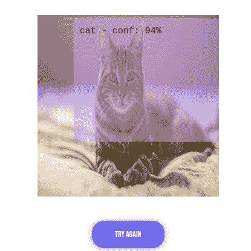
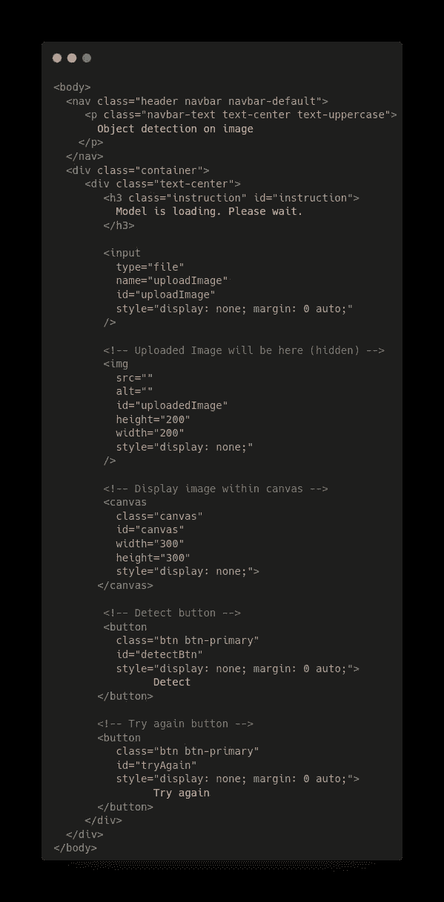
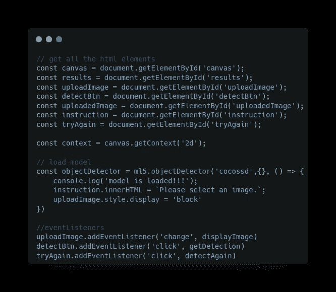
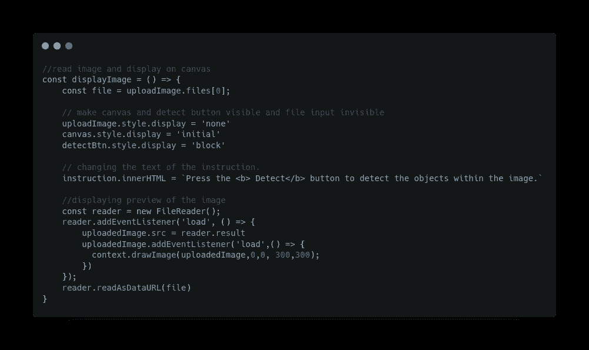
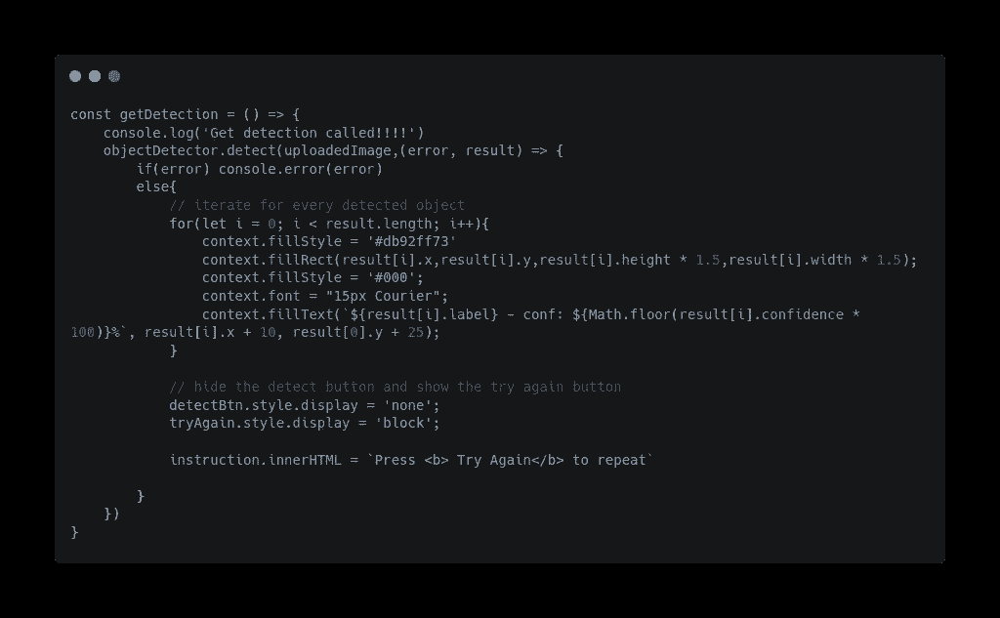
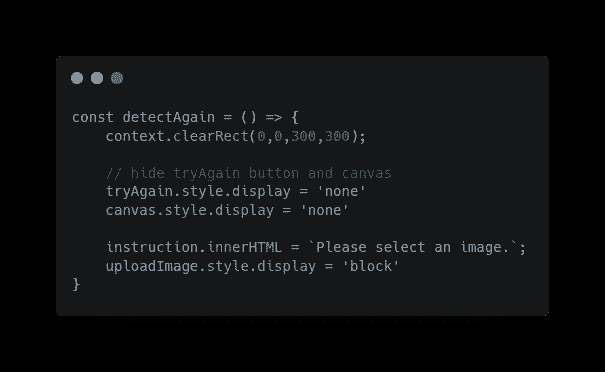

# 如何以最简单的方式在你的网站上添加物体检测

> 原文：<https://javascript.plainenglish.io/object-detection-in-browser-with-ml5-js-9f61da9aaedc?source=collection_archive---------5----------------------->

## 关于如何在带有 ml5js 的浏览器中添加对象检测的指南。

Object Detection with ml5js

在本文中，我们将研究如何使用 ml5.js 在浏览器中进行对象检测。

该应用的现场演示是[这里](https://s0npari11.github.io/object-detection-on-images/)。

# 什么是 ml5.js

Ml5.js 是一个 JavaScript 机器学习库，在浏览器中提供对 Ml 算法的访问，构建在`tensorflow.js`之上。

Ml5.js 非常容易使用。它还提供了一些预训练的模型，如`MobileNet`、`PoseNet`等。你也可以用它来建立和训练你自己的神经网络！

你可以在他们的网站[ml5js.org](https://ml5js.org/)了解更多关于 ml5.js 的信息。

今天这篇文章的灵感来自于网站上提供的例子 ObjectDetector example， [COCOSSD 普通 javascript 中的单个图像](https://github.com/ml5js/ml5-library/tree/main/examples/javascript/ObjectDetector/COCOSSD_single_image)。

# 浏览器中的对象检测

在`Index.html`中，

index.html

我们使用`bootstrap`来使我们的用户界面对手机友好，我们也通过 CDN 导入`ml5.min.js`。

注意:上面给出的实时演示使用了一些额外的 CSS 样式，但是为了简化文章，我们在这里省略了它们。

现在，该做物体检测了。

在`app.js`中，

app.js

我们正在获取我们需要的所有 HTML 元素，将`eventListeners`添加到按钮和输入字段，并加载预先训练好的`cocossd`模型。模型加载后，我们启用图像上传。

现在，让我们为`eventListeners`定义回调。

displayImage() — app.js

在`displayImage()`中，我们抓取选定的图像文件，将其作为数据 URL 读取，并在画布上显示其预览。

getDetection() — app.js

在`getDetection()`中，我们运行`ml5.objectDetector`提供的 detect()方法。在结果中，它给出了:

*   被检测图像的标签
*   置信度得分
*   和检测到物体的区域。

我们遍历每个检测到的对象，在检测到的区域上画一个矩形，并显示它的标签和置信度得分。

detectAgain() — app.js

在`detectAgain()`中，我们准备在新图像上运行对象检测。

因此，我们在浏览器中构建了一个对象检测器！！

应用程序的现场演示是[这里是](https://s0npari11.github.io/object-detection-on-images/)。

这篇文章的代码可以在 [Github](https://github.com/S0npaRi11/object-detection-on-images) 上找到。

链接到我的其他文章:

 [## 用 JavaScript 实现滚动动画的简单方法

### 这里有一个简单快捷的方法，可以用 CSS 关键帧动画来制作 HTML 元素的滚动动画。

paragwebdev.medium.com](https://paragwebdev.medium.com/an-easy-way-to-implement-scroll-animations-with-javascript-aef9b9fdc704)  [## 用 JavaScript 轻松实现无限滚动

### 无限滚动有助于网站显示分页数据，而无需导航到其他页面。这也有助于…

paragwebdev.medium.com](https://paragwebdev.medium.com/infinitely-scrolling-a-webpage-with-javascript-52325a415f4e) 

*更多内容看* [***说白了就是***](https://plainenglish.io/) *。报名参加我们的* [***免费周报***](http://newsletter.plainenglish.io/) *。关注我们关于*[***Twitter***](https://twitter.com/inPlainEngHQ)*和*[***LinkedIn***](https://www.linkedin.com/company/inplainenglish/)*。查看我们的* [***社区不和谐***](https://discord.gg/GtDtUAvyhW) *加入我们的* [***人才集体***](https://inplainenglish.pallet.com/talent/welcome) *。*