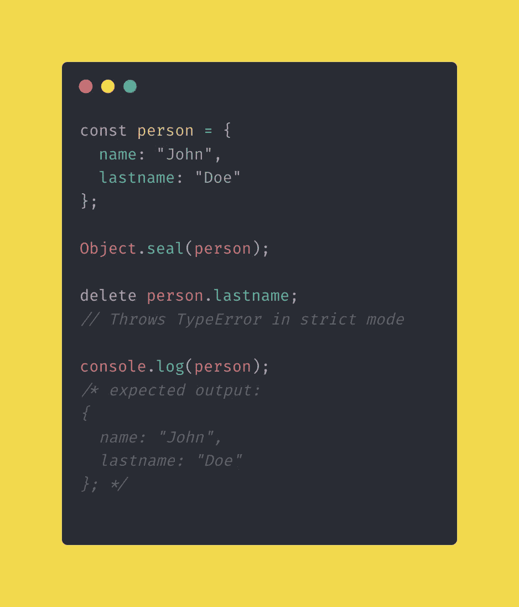

# Object.freeze()与 Object.seal()的简单对比

> 原文：<https://javascript.plainenglish.io/object-freeze-vs-object-seal-in-plain-english-813f27a71eb8?source=collection_archive---------8----------------------->

## 这两种方法的主要区别，简单地说就是并列。

# 它们是什么？

`Object.freeze()`和`Object.seal()`是 JavaScript 中两个非常相似的对象方法。但它们只是第一眼看上去相似。简而言之，它们都防止对象的突变，然而，它们有一些不同之处！时刻。在本文中，我将把它们放在一起，看看它们在特定情况下是如何工作的。

## 添加新属性

如您所见，当您尝试添加新属性时，它们的行为完全相同。所以不管对象是冻结的还是密封的，它都不会让你添加新的属性。如果代码没有严格模式，它将会悄悄地失败，但是如果你这样做了，它会抛出一个`TypeError`，就像这样:`TypeError: can’t define property “city”: Object is not extensible.`

## 删除新属性

从对象中删除属性也是一样的，它们的行为是一样的。没有`use strict`，它会无声地失败，但是如果代码处于严格模式，它会抛出一个`TypeError`，就像这样:`TypeError: property “lastname” is non-configurable and can’t be deleted`

## 更改现有属性

在这里，他们最终采取了不同的行动，现在让我们来看看发生了什么。`Object.freeze()`顾名思义，冻结对象，所以不会发生突变。如果你尝试使用`Object.defineProperty()`也是如此。值得一提的是，当一个对象被冻结时，它的原型也被冻结。

然而，它做得很浅，但我们稍后会回来。另一方面，`Object.seal()`只是不允许您添加或删除新的属性，但是您仍然可以更改现有的属性。如果您尝试使用`Object.defineProperty()`更改该值，它仍然会工作。

从图片中可以看出，当对象被冻结时，你不能改变现有属性的值，它会抛出一个`TypeError`像这样:`TypeError: “lastname” is read-only`。而当它被密封时，值很容易被更改，这可以在登录到控制台时看到。

## 更改可枚举性、可配置性和可写性

在这两种情况下，它都会抛出一个`TypeError`，就像这样:`TypeError: can’t define property “city”: Object is not extensible,`不管代码是否处于严格模式。

## 额外收获:深度冷冻物品

记得我在上面写了`Object.freeze()`只是浅冻结物体，这就是我的意思:

虽然对象被冻结了，但是我仍然能够改变它的属性值，不管你是否使用`use strict`，不管这个值是另一个对象、数组、布尔还是原始类型，它仍然是可变的。所以`Object.freeze()`只冻结了对象的第一层，因此称之为 shallow。

现在让我们看看如何冻结整个对象，而不仅仅是第一层。

我创建了接受一个应该是 T4 的 T3 的 T2 函数。然后我们用`Object.getOwnPropertyNames(obj)`获取给定对象的所有属性，它从`obj`返回所有属性的数组。

所以之后，我在数组中循环，对于每一项，我检查以确保它们的类型是`“object”`并且对象是**而不是**冻结的。如果条件返回`true`，函数`deepFreeze()`递归调用自身，直到条件返回`false.`

最后，当我尝试编辑任何值时，没有任何反应。除非在严格模式下，在那种情况下`TypeError`被抛出，`TypeError: “state” is read-only`。

# 概括起来

这两种方法有很多相似之处，但它们并不相同。当一个物体被冻结时，它不能以任何形状或形式变异。然而，`Object.freeze()`只是浅度冻结对象，但是有一个简单的解决方案来实现如上图所示的深度冻结功能。通过该函数运行对象后，它会完全冻结，无法更改、添加或删除任何属性。

另一方面，`Object.seal()`允许改变当前属性的值，但不允许添加或删除新属性。因为它已经允许值的突变，所以不需要深度密封函数或类似的东西。

最后，还有两种方法来检查对象是否被冻结或密封。这是它们的样子，`Object.isFrozen(obj)`和`Object.isSealed(obj)`。它们都返回一个`Boolean`值，如果对象被冻结或密封，它们返回`true,`，否则返回`false`。

 [## 通过我的推荐链接加入 Medium-Ken Nersisyan

### 用媒介释放你的潜能。立即加入，阅读我和其他顶尖作家的文章。读书，学习，变得更好…

medium.com](https://medium.com/@kens_visuals/membership) 

## 进一步阅读

 [## 作为程序员如何掌握解决问题的能力

### 14 种练习解决问题的资源以及我是如何掌握技能的。

javascript.plainenglish.io](/how-to-master-problem-solving-as-a-programmer-d16a0b8780ab)  [## 注意事项或如何在媒体中插入代码

### 有许多方法可以做到这一点，但我将向您展示最有效的方法。

javascript.plainenglish.io](/dos-and-don-ts-or-how-to-insert-code-in-medium-6c98fab86948)  [## 这是你开始写博客的标志

### 首先，让我告诉你，我不相信迹象，迷信，或任何这类事情。

medium.com](https://medium.com/@kens_visuals/this-is-your-sign-to-start-blogging-c9c39739ba65) 

## 让我们连接

 [## 在推特上关注我﹫kens_visuals

### 👨🏻‍💻👾

twitter.com](https://twitter.com/kens_visuals)  [## kens-视觉效果-概述

### 前端开发者| JS 爱好者|科技写手。kens-visual 有 58 个可用的存储库。遵循他们的准则…

github.com](https://github.com/kens-visuals) 

*更多内容请看*[***plain English . io***](http://plainenglish.io/)*。报名参加我们的* [***免费周报***](http://newsletter.plainenglish.io/) *。在我们的* [***社区***](https://discord.gg/GtDtUAvyhW) *获得独家获得写作机会和建议。*