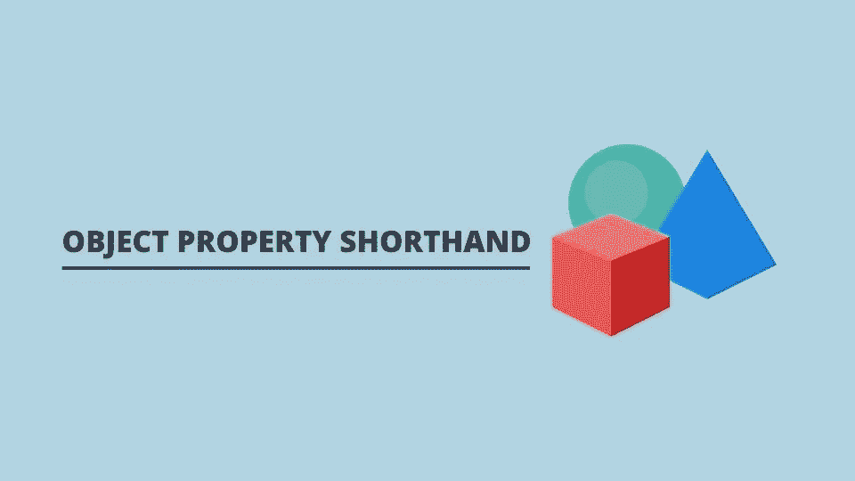

# 使用对象属性速记法的对象文字

> 原文：<https://javascript.plainenglish.io/object-literals-using-object-property-shorthand-6360825c60ef?source=collection_archive---------3----------------------->

## JavaScript 中的对象属性简写如何使我们的代码简洁。



假设我们正在编写一个程序，要求我们对一些服装的数据进行建模。为此，我们可以使用一个对象。在 ES6 之前，如果我们使用一个对象文字，那么我们将以如下方式对数据建模:

```
function createWardrobe() { var hat = 1;
  var shorts = 5;
  var jumper = 8;
  var socks = 2; var myWardrobe = {
    hat: hat,
    shorts: shorts,
    jumper: jumper,
    socks: socks
  };

  return myWardrobe;};console.log(createWardrobe());//Returns ---> {hat: 1, shorts: 5, jumper: 8, socks: 2}
```

在上面的代码中，我们声明了一个名为*create wardroom 的函数。*在函数内部，我们为衣柜项目声明变量，这些变量用值初始化。然后创建一个对象文字并存储在变量*my wardroom*中。键在对象文本中设置，值是函数开始时衣柜项目的变量。然后返回该对象。当函数运行时，我们可以从*控制台日志*中看到具有相应值的对象。

当 ES6 被创建时，对象属性简写被引入。对象属性简写使我们能够简单地传递键的名称，而不是重复名称和键。

```
//PRE ES6var myObject = {
  myKeyName: myKeyName
};//ES6 Object property shorthandvar myObject = {
  myKeyName
};
```

代码的工作方式没有任何改变，但是简写帮助我们编写更少的代码！这就是所谓的句法糖。让我们用*create warehouse*函数再看一遍，但这次使用对象属性简写。

```
const createWardrobe = () => { let hat = 1;
  let shorts = 5;
  let jumper = 8;
  let socks = 2; let myWardrobe = {
    hat,
    shorts,
    jumper,
    socks
  };

  return myWardrobe;};console.log(createWardrobe());//Returns ---> {hat: 1, shorts: 5, jumper: 8, socks: 2}
```

控制台日志的输出是相同的，但是代码本身更简单！

我希望你喜欢这篇文章，请随时发表任何意见，问题或反馈，并关注我的更多内容！

*更多内容看* [***说白了。报名参加我们的***](https://plainenglish.io/) **[***免费周报***](http://newsletter.plainenglish.io/) *。关注我们关于*[***Twitter***](https://twitter.com/inPlainEngHQ)*和**[***LinkedIn***](https://www.linkedin.com/company/inplainenglish/)*。加入我们的* [***社区***](https://discord.gg/GtDtUAvyhW) *。****