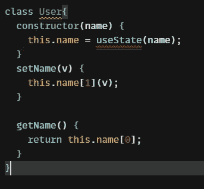
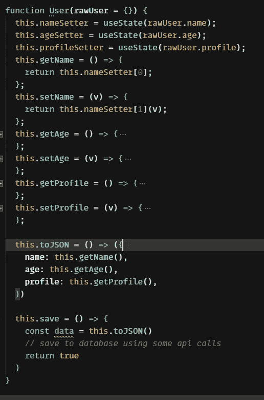
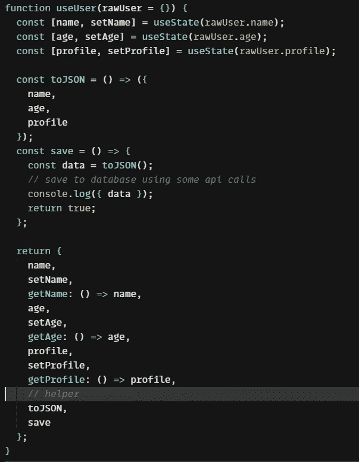

# React 中的面向对象编程

> 原文：<https://javascript.plainenglish.io/object-oriented-programming-in-react-ba0ad4275e35?source=collection_archive---------2----------------------->


Photo by [Lautaro Andreani](https://unsplash.com/@lautaroandreani?utm_source=medium&utm_medium=referral) on [Unsplash](https://unsplash.com?utm_source=medium&utm_medium=referral)

为了使应用程序更加健壮，必须在应用程序中使用 OOPs 概念。尽管如此，ReactJS 本身得到了增强，因此您必须遵循它的原则来创建任何应用程序。今天，我们将看到如何以及使用什么替代方案来使我们的应用程序更加面向对象

# React 中的面向对象编程是什么？

面向对象编程是一种让你的代码在整个应用和服务中更加可重用的方式。一个对象可以比普通的 javascript 对象更有效地与其他对象、程序和用户交互

## 如何才能实现这一点？

如果您喜欢在应用程序中使用类组件，那么添加助手方法和状态要容易得多，但是当您使用函数组件和钩子时，挑战就来了。让我们举一个例子，看看在为功能组件使用常规类的过程中，第一级障碍是什么

我创建了一个名为`User`的类，并在上下文中使用了`useState`，同时还公开了两个方法`setName`和`getName`，作为我的 getter 和 setter。我在使用`useState`时收到一个错误，即

```
React Hook "useState" cannot be called in a class component.
React Hooks must be called in a React function component or 
a custom React Hook function. (react-hooks/rules-of-hooks)eslint
```



User class with useState

即使我们收到了错误，但仍然可以如下使用。问题是我们可以改变 eslint 规则，但是它仍然是无效的，因为在类中使用钩子不是一个好的做法

```
 const user = new User('name')
  return (
    <div className="App">
      <button onClick={() => user.setName("first name")}>click</button>
      {user.getName()}
    </div>
  );
```

现在，我们不能直接使用常规类，我们还有其他选择吗？

## 为功能组件使用功能构造器

因为我们不能使用类构造函数，所以我们将使用函数构造函数。函数不会给我们错误，但是它们会减少我们处理类的能力。扩展会有点复杂

对于函数构造函数，我们可以像对待类构造函数一样定义和使用属性。这一次我们不会有任何错误，事情会顺利进行



Functional constructor

以下程序的用法将类似于下面的代码片段。点击每个按钮后，我们会看到变化

```
export default function App() {
  const user = new User("hello");
  return (
    <div className="App">
      <button onClick={() => user.setAge(10)}>age</button>
      <button onClick={() => user.setProfile("first profile")}>profile</button>
      <button onClick={() => user.setName("first name")}>name</button>
      <button onClick={() => user.save()}>save</button>
    </div>
  );
}

// after save click - output from log
data: Object
  name: "first name"
  age: 10
  profile: "first profile"
```

## 另一个想法是使用模型挂钩

模型钩子是钩子的用例，我们专门为模型`User`定义了一个文件夹，在那里我们保存了所有需要的助手方法，它将作为我们正在处理的常规实例来执行和操作。

这类挂钩背后的思想是只公开所有的状态方法和助手方法，只要组件不需要，就不要在上下文中放置任何挂钩。下面是这样一个钩子的例子



useUser hook to manage the state of users

下面钩子的输出也和一个函数构造器一样。还有其他几点可以说明

*   钩子只能在组件内部工作
*   只要函数构造函数不使用状态，它们就会在组件之外工作

## 结论

如果有许多相互依赖的东西需要管理，那么使用面向对象的编程对于任何应用程序都是很重要的，如果它开始扩展，它也将帮助您管理您的代码。

我希望你今天能学到新东西。你可以在[代码沙箱链接](https://codesandbox.io/s/pensive-williamson-m30hq7?file=/src/App.js)中找到完整的源代码。谢谢大家，编码快乐！

*更多内容看* [***说白了。报名参加我们的***](https://plainenglish.io/) **[***免费周报***](http://newsletter.plainenglish.io/) *。关注我们关于* [***推特***](https://twitter.com/inPlainEngHQ)[***LinkedIn***](https://www.linkedin.com/company/inplainenglish/)*[***YouTube***](https://www.youtube.com/channel/UCtipWUghju290NWcn8jhyAw)*[***不和***](https://discord.gg/GtDtUAvyhW) ***。*******

*****对缩放您的软件启动感兴趣*** *？检查* [***电路***](https://circuit.ooo?utm=publication-post-cta) *。***