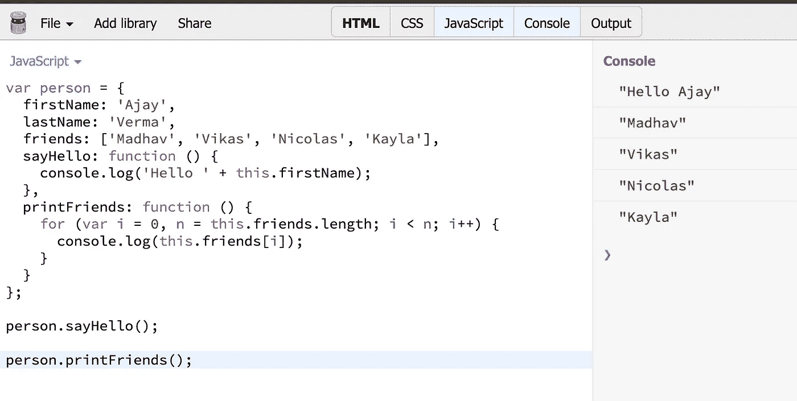
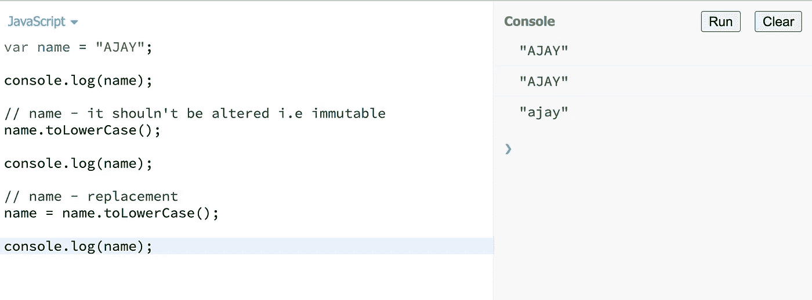

# JavaScript 对象深度:初学者综合指南

> 原文：<https://javascript.plainenglish.io/objects-in-javascript-344af1e5a081?source=collection_archive---------18----------------------->

## 深入探究 JavaScript 核心。


Photo by [Mohammad Rahmani](https://unsplash.com/@afgprogrammer?utm_source=unsplash&utm_medium=referral&utm_content=creditCopyText) on unsplash

这是 JavaScript 中需要掌握的核心概念之一。

# JavaScript 中的 Object 是什么？

JavaScript 中的对象只是一个包含键值对的映射。它非常类似于:

1.  C 中的结构
2.  java 中的 HashMap
3.  c++中的 unordered_map
4.  python 中的字典

所以，如果你来自上述编程语言，理解 JavaScript 对象和构造函数对你来说将是小菜一碟。

***注:-*** 对象在其他编程语言中有时也被称为 ***【关联数组】*** 。

键值可以是函数、数组、对象或任何其他原语。如果一个键的值是一个原语或任何其他对象(PS:在 JavaScript 中数组也是一个对象)那么它被称为 ***属性*** 但是如果它是一个函数那么它被称为 ***方法*** 。

举个例子，



Person Object

在上面的代码中，一个人是一个对象，它有键***【say hello】***和 ***friends*** ，分别以函数和数组为值。

你可能听说过—

在 JavaScript 中，几乎所有东西都是对象。所以现在的问题是——剩下的不是物体的是什么？ **Ans** —原语

# 原始的

原始数据(原始值、原始数据类型)不是对象，也没有任何方法。有 7 种原始数据类型—字符串、数字、大整数、布尔、未定义、符号和空。

所有的原语都是不可变的，也就是说，它们可以被替换，但不能被改变。让我们用一个例子来理解这一点:



Primitive — immutability example

# 如何用 JavaScript 创建一个对象？

一开始创造一个物体可能看起来很奇怪，但是一旦你习惯了，你就会爱上它。

对象语法用花括号括起来。并且由冒号分隔的键-值对被添加到对象内部，冒号后面有一个逗号。

```
var obj = { 
 name: ‘xyz’, 
 age: 26
}
```

我们还可以创建一个空对象，并在进行过程中添加属性。

```
var obj = {}; // empty or blank object
obj.name = ‘xyz’;
obj.age = 26;
```

两个对象声明是相同的。

在下一部分中，我们将详细了解创建对象的其他方法。

如果你喜欢我的文章，请在媒体上关注我。

*更多内容请看*[***plain English . io***](https://plainenglish.io/)*。报名参加我们的* [***免费周报***](http://newsletter.plainenglish.io/) *。关注我们关于*[***Twitter***](https://twitter.com/inPlainEngHQ)*和*[***LinkedIn***](https://www.linkedin.com/company/inplainenglish/)*。加入我们的* [***社区不和谐***](https://discord.gg/GtDtUAvyhW) *。*