# 游戏的剖析:精灵和物体

> 原文：<https://javascript.plainenglish.io/objects-sprites-in-a-javascript-game-f378090a1d82?source=collection_archive---------7----------------------->


[Image by upklyak](https://www.freepik.com/free-vector/web-development-programmer-engineering-coding-website-augmented-reality-interface-screens-developer-project-engineer-programming-software-application-design-cartoon-illustration_10798281.htm#query=web%20development&position=0&from_view=search&track=sph) on Freepik

在我们周围的世界里，我们无时无刻不在开门关门，理所当然地认为只有门开着的时候我们才能走进去。

在一个模拟探索迷宫的游戏中，一扇门仅仅是各种各样的像素。然而玩家只能在门开着的时候穿过它。游戏怎么知道门是开着的还是关着的？

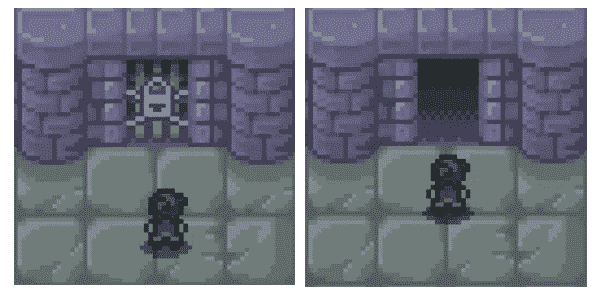

A door opening.

在我正在开发的一个游戏中，*朗达尔*的盗贼，你引导玩家穿过一个有各种门和怪物的地牢。除了跟踪门的状态，游戏引擎还必须跟踪玩家和敌人的位置。让我们来看看游戏是如何显示这些东西并跟踪它们的状态的。

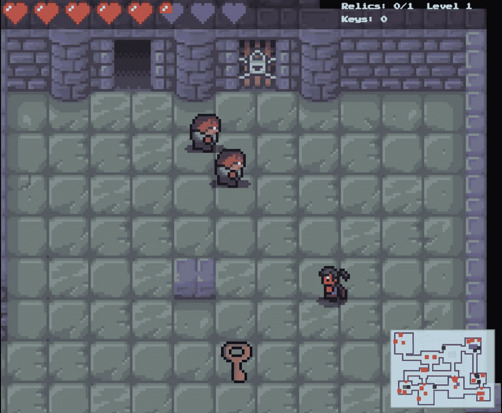

游戏由三组元素组成:

*   构成楼层地板和墙壁的瓷砖
*   称为精灵的独立图像
*   显示玩家状态和地图的用户界面(UI)

每个组都绘制在自己的 HTML `<canvas>`元素上。在 HTML 页面上，`<canvas>`元素层层叠加，就像老式动画中的醋酸纤维片。在下面的例子中，有三层:瓷砖层，精灵层和用户界面层。

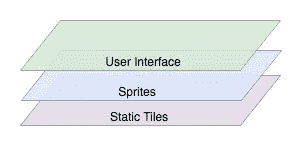

Each canvas element acts as a visible layer in the game.

sprite 和 tile 层每秒钟被重绘多次，从而产生动画。这允许精灵平滑地移动和改变帧。当地精向右走时，精灵会在每个瞬间显示下面的一个画面。

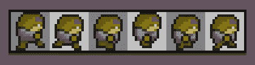

The goblin walk cycle frames for when it’s facing right.

门也是一个精灵，当玩家精灵用钥匙靠近它时，门会翻转九个动画帧，以动画形式显示一个解锁效果。

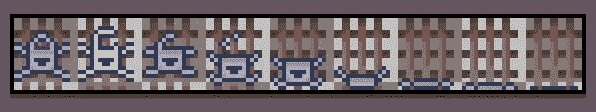

The animation frames for the door unlock sequence.

解锁后，门会翻转九帧来制作开门效果的动画。

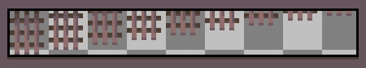

The animation frames for the opening of the door.

每当玩家的精灵在攻击、行走或受到伤害时，它会翻转特定的帧序列。下面是雪碧面对前方时的攻击序列。

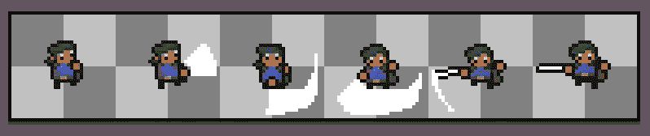

The player sprite attack sequence.

# 画布 API

浏览器渲染和更新游戏环境的能力是通过 HTML5 Canvas，一个应用程序编程接口(API)实现的。你可以把画布想象成一组特殊的命令，用来在`<canvas>`元素上绘制东西。

为了让游戏中的事情发生，我编写了使用这些 API 命令的代码。当在游戏中执行命令时，游戏元素被绘制到它们各自的画布层上。

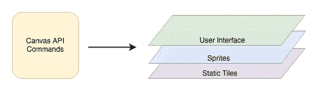

在瓷砖和精灵层，当地下居民四处游荡时，玩家被周围的环境包围。在 UI 层，重要的统计数据在顶部，而按钮和地图在底部。

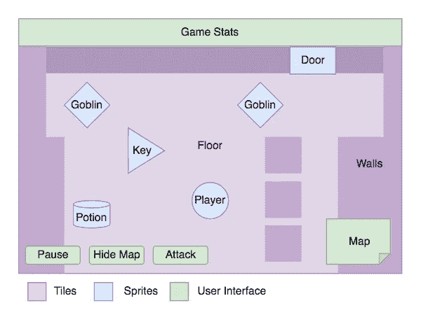

The game elements on their corresponding layers.

为了让这些命令起作用，为了让游戏世界有意义，游戏引擎需要知道每个精灵从一个时刻到下一个时刻都去了哪里，做了什么。虽然 Canvas API 帮助游戏快速运行，但它什么都不记得。如果你需要知道一扇门是开着还是关着，一个地精在什么位置，或者玩家去过哪里，不要问`<canvas>`元素。

因此，这给我们留下了一个问题:从一个时刻到另一个时刻，我们如何存储和检索每个精灵的状态？输入 JavaScript 对象。

# 目标

在游戏引擎中，每个精灵的状态都存储在一个称为对象的数据中。这些对象一起为游戏引擎提供了所有活动精灵的信息。

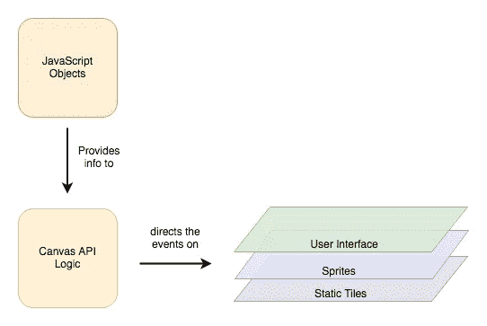

JavaScript objects store the state of each sprite

一个对象可以被认为是属性的集合。在游戏中，有不同类型的物体，其中一种叫做`Sprite`。下图显示了一个`Sprite`对象的属性。

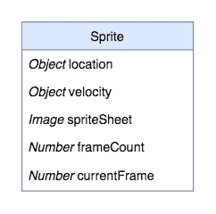

An example of the object for a sprite.

每次重新绘制画布时，游戏引擎都会使用每个对象的属性，在正确的位置用正确的帧绘制相应的精灵。例如，它使用代表药剂的对象的`location`属性在下面房间的正确位置渲染药剂。

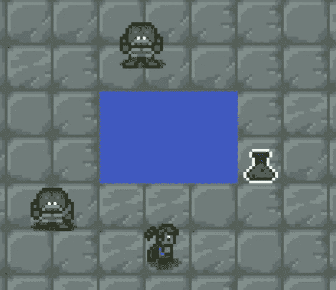

A potion sprite is placed in a room.

在幕后，药剂、玩家和妖精的下落由代表他们的物品的`location`属性决定。

因为每个对象都映射到一个精灵，并且因为不同的精灵有不同的需求，所以拥有不同类型的对象是有帮助的。这就是类出现的地方。

# 班级

一个*类*是一个特定类型的对象。虽然一些编程语言已经有很长时间了，但类是 JavaScript 的新成员，是在 ECMAScript 2015 (ES6)中引入的。在空课上是这样开始的:

```
class Sprite {
  constructor() {
  }
}
```

然后，您可以添加由传入参数定义的属性。

```
class Sprite {
  constructor(frameCount) {
     frameCount = frameCount
  }
}
```

下面是一个 sprite 类的例子，它具有位置、速度、sprite 工作表图像、帧数和当前帧的属性。

```
class Sprite {
  constructor(location, frameCount, spriteSheet) {
     this.location = location;
     this.frameCount = frameCount;
     this.spriteSheet = spriteSheet;

     this.currentFrame = 0;
     this.velocity = {
         x:0,
         y:0
     };

  }
}
```

如果我想为魔药精灵创建一个新的对象，我首先要定义位置、帧数和图像。

```
const location = {x:3, y:4};

const frameCount = 3;

const spriteSheet = new Inage();

spriteSheet.src = ‘/path/to/file’;
```

然后我可以使用这些常量实例化一个新的`Sprite`对象。

```
let potion = new Sprite(location, frameCount, spriteSheet);
```

因为速度坐标总是从零开始，并且当前帧索引总是从零开始，所以我只传入位置、帧数和 sprite 工作表图像的值。

# 遗产

在为可收集的物品创建对象时，比如钥匙、药水和遗物，一个通用的 sprite 类会很方便。也就是说，我们的门、玩家和地精精灵都需要一个拥有更多属性的更复杂的职业。

例如，当一个玩家对象有一个位置、帧数和当前帧时，它还需要关于她有多少个键、她的健康状况和她面对什么方向的属性。

我们如何在添加新属性的同时重用 sprite 属性？这就是继承概念的由来。通过继承，我可以创建一个播放器类，它继承了 sprite 类的属性，但也有一些自己的属性。然后我可以对敌人和门职业做同样的事情。

下图显示了从 sprite 类继承的门、敌人和玩家类。

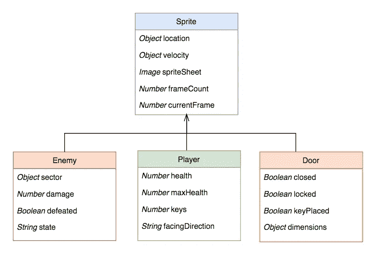

Class inheritance.

# 敌人阶级

让我们来看看`Enemy`对象的独特属性。

*   `sector`圈定敌人可以水平和垂直移动多远。
*   `damage`是敌人对玩家造成的伤害
*   `state`描述它在做什么(例如站着不动和走路。)
*   `defeated`从`false`开始，但当敌人被击败时切换到`true`，触发消失效果。

与其说是一个普通的敌人，不如说是有一系列的敌人可以遭遇，所以我开发了一系列继承自`Enemy`并有自己独特属性的敌人子类。

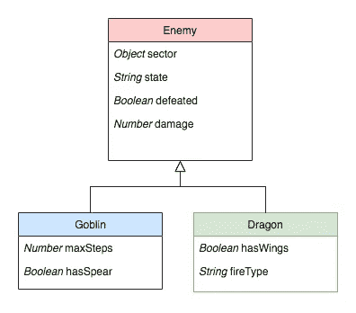

Examples of enemy inheritance.

# 门

与玩家和敌人一样，我的`Door`职业继承了`Sprite`的属性，但也有自己的四个属性:`locked`、`closed`、`keyPlaced`和`dimensions`。

*   当门的`locked`属性设置为`true`时，需要钥匙才能打开。

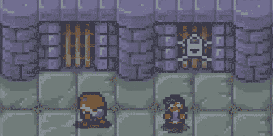

An unlocked door on the left and a locked one on the right.

*   当门打开时，门的`closed`属性被设置为`false`。当玩家拿着钥匙触摸一扇锁着的门或一扇未锁的门时，就会发生这种情况。


Eureka!

*   当等级创建算法分发钥匙时，当放置钥匙时，锁定门的`keyPlaced`属性被设置为`true`。

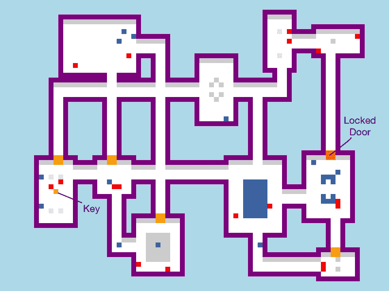

A dungeon with the locked door on the right and its key on the left.

*   由于门精灵的尺寸可以变化，`dimensions`属性存储它的宽度和高度。

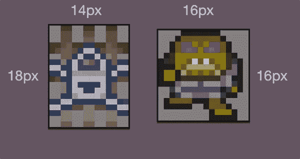

Don’t worry, the doorway is slightly wider so the goblins don’t get stuck.

# 对象方法

除了每个类都有属性之外，每个类也都有方法——允许它做事情的函数。几个例子:

*   sprite 类有一些基本的方法，用于将其图像绘制到画布上，用 sprite 帧制作动画，以及碰撞检测。
*   敌人有移动、攻击和承受伤害的方法。
*   玩家职业有先进的方法来检测与墙壁、门和敌人的碰撞。
*   door 类有解锁和打开的方法。

流氓、妖精和门都继承自一个公共的`Sprite`类——尽管他们看起来和行为不同，但他们的运动和动画是由相似的代码管理的。在幕后工作的对象，以及产生它们的类，提供了存储和更新每个 sprite 状态的有效方法。

# 阶级继承的危险

在我第一次尝试这个游戏时，我用 Objective-C 为 iOS 写的，我的类继承链太复杂了。我正在使用 Cocos2D 库，它有一个名为`CCSprite.`的现成类，我也刚刚在一个类中探索了对象继承，并且很高兴应用我所学到的东西。

嗯，事情有点失控了。下面是我的类继承树七年前的样子，就在我把这个项目“搁置”之前(然后停止了。)

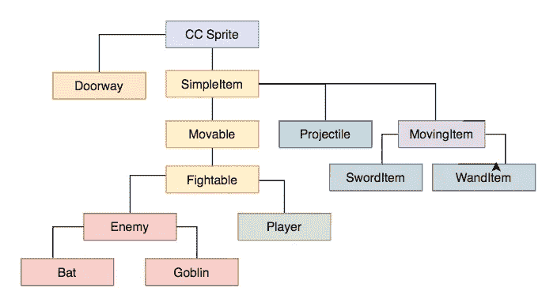

This inheritance pattern was not maintainable.

这马上就有一些问题。

*   黄色的继承链太高了。因此，很难跟踪属性和方法的位置。
*   各种类之间的联系过于紧密，这也使得跟踪属性和方法变得很困难。
*   继承模式并不直观。谁会想到一只`Enemy`会是`SimpleItem`的曾孙？？

因此，这个继承方案是不可维护的。所以对于这个新版本，我对我的类更加节省，只在减少重复的时候创建一个新类。

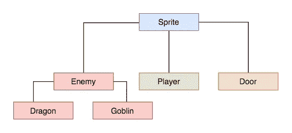

The current inheritance pattern, which is far easier to maintain.

因此，虽然类继承帮助我重用代码，但我尽量少用。必须注意不要构建太复杂的类继承模式，以免代码变得难以处理。

虽然很难说什么是长期可维护的，

即使现在我看着我的班级，我也试着问自己:

*   六个月后我能理解这个代码吗？
*   我休息一段时间后返回代码会是顺利的重新进入吗？
*   或者我的继承模式会变成摇摇欲坠的叠人塔吗？

只要继承模式保持可管理，JavaScript 中基于类的对象对于跟踪游戏中精灵的状态是有用的——如果它们工作正常，你就不会看到你的玩家走进门。

[](https://betterprogramming.pub/building-a-better-dungeon-level-b04d133a6ca) [## 建造一个更好的地下城关卡

### 我如何更新算法以更好地匹配图形。

better 编程. pub](https://betterprogramming.pub/building-a-better-dungeon-level-b04d133a6ca) 

*更多内容请看*[***plain English . io***](https://plainenglish.io/)*。报名参加我们的* [***免费周报***](http://newsletter.plainenglish.io/) *。关注我们关于*[***Twitter***](https://twitter.com/inPlainEngHQ)[***LinkedIn***](https://www.linkedin.com/company/inplainenglish/)*[***YouTube***](https://www.youtube.com/channel/UCtipWUghju290NWcn8jhyAw)*[***不和***](https://discord.gg/GtDtUAvyhW) ***。*****

*****对缩放您的软件启动感兴趣*** *？检查* [***电路***](https://circuit.ooo?utm=publication-post-cta) *。***