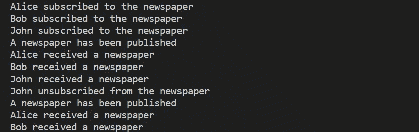

# 观察者模式简介

> 原文：<https://javascript.plainenglish.io/observer-pattern-a-brief-introduction-cb733a13c87f?source=collection_archive---------4----------------------->

## 使用 TypeScript 开发简单 UI 并遵循 Observer 设计模式的指南。

Photo by [Jeff Chien](https://unsplash.com/@junfungchien?utm_source=medium&utm_medium=referral) on [Unsplash](https://unsplash.com?utm_source=medium&utm_medium=referral)

在本文中，我们将理解观察者设计模式的含义以及我们可以在哪里使用它。我们还将通过一个简单的代码来更好地理解这个概念。最后，我们将开发一个简单的 web 页面，它可以被视为应用程序的个人资料页面。在此页面上，用户将被允许加载图像。一旦图像被加载，它将显示在两个地方，即。导航栏和个人资料页面。

根据[维基百科](https://en.wikipedia.org/wiki/Observer_pattern)，*“****观察者模式*** *是一个软件设计模式，其中一个名为* ***主题*** *的对象维护着一个其依赖者的列表，名为* ***观察者*** *，并自动通知它们任何状态变化，通常是通过调用它们的方法之一。”*

实现这种设计模式的理想情况是，当我们的应用程序中有许多依赖于某个事件发生的组件时。这里我们实际上定义了一个一对多的依赖关系。

现在，让我们看一个简单的代码片段:

上面的代码可以用一个著名的类比来理解。有一家通讯社每天出版报纸。想要阅读的人，必须订阅一份**。新闻机构将存储客户信息以通知他们。订阅后，客户将在代理机构**出版**后立即收到报纸。如果他们不想再看报纸，他们可以退订，他们就不会再收到报纸了。**

**上述代码的输出如下:**

****

**现在，我们将开发一个简单的网页，允许用户上传一张图片作为他的个人资料图片。开发完成后，页面将如下所示:**

****

**该页面的 HTML 如下所示—**

**类型脚本代码如下:**

**这里，我们有两个**观察者**、`profilePhotoObserver1`和`profilePhotoObserver2`。在创建这些观察者实例时，我们传递两个`image`元素的`id`，即。`profile_pic_1`和`profile_pic_2`作为构造函数中的参数。这两个观察者已经订阅了主题`profilePhotoSubject`,如果用户上传了一张新照片，这个主题会通知观察者。观察者一收到通知，就会更新 UI 中的照片。**

**我希望这个博客能帮助我的读者以一种有趣的方式理解这个概念。如需此网页的完整代码，请访问以下知识库:**

** [## GitHub-souvik-pl/OBSERVER _ PATTERN

### 此时您不能执行该操作。您已使用另一个标签页或窗口登录。您已在另一个选项卡中注销，或者…

github.com](https://github.com/souvik-pl/OBSERVER_PATTERN) 

## 参考

维基百科:

 [## 观察者模式-维基百科

### 观察者模式是一种软件设计模式，在这种模式中，一个名为 subject 的对象维护着它的…

en.wikipedia.org](https://en.wikipedia.org/wiki/Observer_pattern) 

*更多内容请看*[***plain English . io***](https://plainenglish.io/)*。报名参加我们的* [***免费周报***](http://newsletter.plainenglish.io/) *。关注我们关于*[***Twitter***](https://twitter.com/inPlainEngHQ)*和*[***LinkedIn***](https://www.linkedin.com/company/inplainenglish/)*。加入我们的* [***社区不和谐***](https://discord.gg/GtDtUAvyhW) *。***