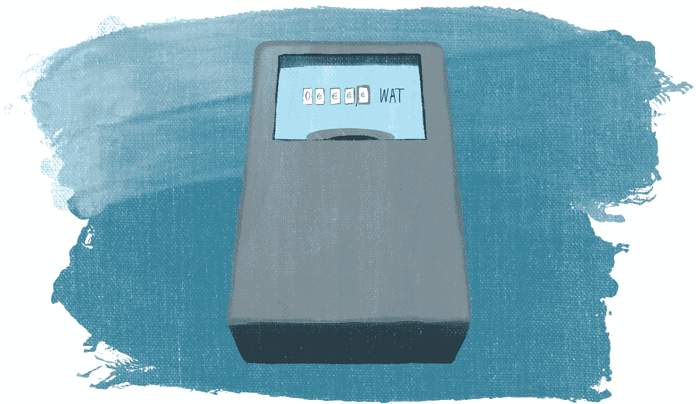

# 我的天啊:项目介绍

> 原文：<https://javascript.plainenglish.io/oh-my-bill-project-introduction-94aa6fbe4660?source=collection_archive---------5----------------------->

Illustration by the author

当我指导那些正在进入 IT 领域的人时，我注意到他们倾向于使用的学习资源存在差距。有很多课程可以让你**跟随**申请人。不幸的是，跟随某人并不是一个人通常的工作方式。通常，你得到一组需求，从那里，你开始计算出一个允许用户实现他们目标的解决方案。

为了让我的学员有机会体验真实世界的工作流程，我向他们描述了一个简单但有用的应用程序。在这里，我将展示一个改进的项目介绍，这样您也能够重复类似的练习。

# 项目概述

作为一个经历过天气灾难和能源危机的人，我想精确监控我的用电量。我想创建一个应用程序，它可以:

*   我制定了我的能源价格——固定的月费用，以及每个用电单位的费用
*   我可以随时记录我的电表值
*   该应用程序显示每天或每小时的估计能源成本，因此我可以根据预算调整空调或暖气

# 目标

应用程序的用户应该能够“实时”监控他们的能耗。与其等上一两个月才收到账单，他们应该对自己到目前为止使用了多少能源有一个可靠的估计。所以，当他们发现自己处在一个新的情境中时，比如:

*   搬到一个新地方，
*   安装新的供暖或空调设备，或
*   关税的变化，

他们将能够看到和控制他们的支出。

第二个用例是评估使用不同设备的成本。例如，通过控制运行的内容和时间，用户可以估计:

*   运行洗衣机或洗碗机要花多少钱
*   将恒温器保持在不同的温度
*   像 2020 年一样烤了一整天

# 用户故事

用户故事从他们的角度描述了用户可以在应用程序中做什么。他们提醒程序员人们将如何使用应用程序，他们测试可用于确保应用程序按预期工作的场景。正如您将在示例中看到的，用户故事的格式通常有些重复。

# 配置费率

作为用户，我想通过设置来配置我的能源价格:

*   固定成本——维护、连接或提供商称之为账单中不取决于使用情况的部分
*   单位能源成本——根据消耗量支付多少费用

这些值应该保存在应用程序中，并且每隔几个月才更改一次:当费率发生变化时。

# 记录测量值

作为一名用户，我想记录我当前的电能表读数。我希望存储这些数据以备后用——这样我就可以创建一个读数日志，用于估计给定时间内的消耗量。例如:

*   我每天早上记录电表的值，以创建不同恒温器设置的使用日志。
*   我在启动洗衣机之前记录仪表，在它运行时我保持我的其他使用最小化，然后在程序完成后我记录数值。

# 审查使用情况和成本估算

作为一名用户，我希望能够阅读基于我收集的数据的成本估算。首先，它可以是一个简单的开始时间、结束时间、能量消耗和成本的表格。在进一步的互动中，如果能有一些每日或每小时能耗的图表就太好了。

# 可交付成果

我的学员的第一个练习是在一张纸上画出他们在该应用中看到的界面。这被证明是一个非常好的想法——显然，我心目中的“显而易见”界面是显而易见的，每个人对如何实现它都有略微不同的想法。当你和客户一起工作时，尽快得到他们的反馈是很重要的，不要浪费时间去做他们不需要的东西。

这是我之前在[如何为你的项目](https://how-to.dev/how-to-collect-inputs-for-your-project)收集输入中介绍的方法。当我有了足够多的不同人处理这个项目的方法的例子时，我也会在博客上分享它们——但是这个练习的目标是从一张白纸和需求开始。这迫使人们去想象一个实现需求的接口。

# 注册更多

您有兴趣了解如何从需求到部署的应用程序构建项目吗？在此注册[以获得本系列新文章的更新。](https://how-to-dev.ck.page/00d82c3622)

# 在评论中分享！

如果你亲自尝试，请在评论中分享你的草图！你会惊讶于不同的人对相同需求的解释方式。

另外，你对能源效率感兴趣吗？这个应用程序是我很久以前看过的一篇博文中所示方法的穷人版——对大多数人来说有点矫枉过正。

*最初发布于*[*https://how-to . dev*](https://how-to.dev/oh-my-bill-project-introduction)*。*

*更多内容请看*[***plain English . io***](https://plainenglish.io/)*。报名参加我们的* [***免费周报***](http://newsletter.plainenglish.io/) *。关注我们关于*[***Twitter***](https://twitter.com/inPlainEngHQ)[***LinkedIn***](https://www.linkedin.com/company/inplainenglish/)*[***YouTube***](https://www.youtube.com/channel/UCtipWUghju290NWcn8jhyAw)*[***不和***](https://discord.gg/GtDtUAvyhW) *。对增长黑客感兴趣？检查* [***电路***](https://circuit.ooo/) *。***