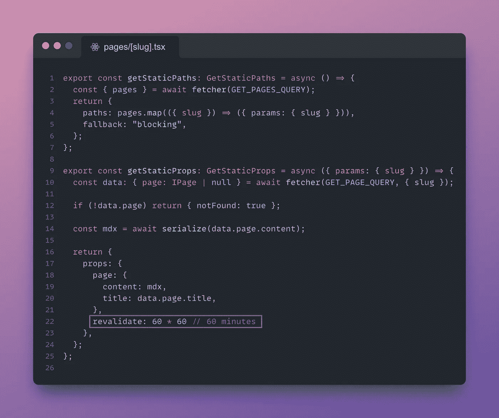
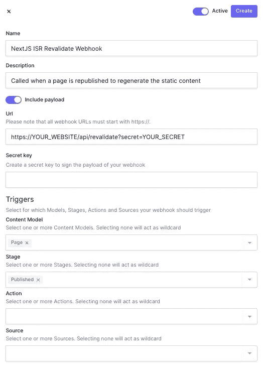

# 使用 Next.js & Hygraph 按需增量静态再生

> 原文：<https://javascript.plainenglish.io/on-demand-incremental-static-regeneration-with-next-js-hygraph-3ed325fa5b?source=collection_archive---------3----------------------->

Photo by [AltumCode](https://unsplash.com/@altumcode?utm_source=medium&utm_medium=referral) on [Unsplash](https://unsplash.com?utm_source=medium&utm_medium=referral)

对于我的[个人网站](https://nextglabs.com)，我使用 [Hygraph](https://hygraph.com) (又名 GraphCMS)作为一个无头 CMS。我使用服务器端呈现(SSR)来获取和生成静态页面路由和内容。

Next.js 允许我们在构建应用程序后更新静态页面。多亏了增量静态再生(ISR ),我们可以在每页的基础上使用静态生成**,而不需要重建整个站点！**

有了 ISR，我们可以在扩展到数百万页的同时获得静态的好处。

为了实现这一点，我使用了`revalidate`选项，每 60 分钟重新生成一次静态页面(第 22 行)。

ISR — Revalidate option for dynamic routes

最近，我在 hygraph 上更新了我的网站的一些内容，发现如果信息需要立即更新，我的访问者将不得不等待长达 60 分钟(最坏的情况)才能看到更新的数据。**太可怕了**！

为了缓解这个问题，我使用了**按需静态重新验证。**这意味着*更新的*静态页面仅在 Hygraph 上的内容更新时重新生成。以下是如何做到这一点。

# 如何设置按需静态重新验证

## 1.创建 ISR 重新验证 API 路线

Next.js ISR Revalidate API Route

使用您选择的秘密将秘密`REVALIDATE_TOKEN`添加到`.env`文件中是非常必要的。

> **⚠️重要提示:**如果你在 hygraph 中使用的键不是`slug`，你必须更新第 17 行的代码。

## 2.创建一个 Hygraph 网页挂钩

接下来，我需要在 Hygraph 上创建一个新的 webhook，它将在页面重新发布(内容更改)时调用我们刚刚创建的 API 端点。

登录你的 Hygraph 帐户，然后从侧边栏(左下方)选择 Webhooks 标签。现在点击“创建”按钮。

按照以下方式设置 webhook，确保根据您的用例选择正确的内容模型。对于我的个人网站，我使用的是`Page`模式。当`Published`页面发布或取消发布时，触发 webhook。

必须启用`Include payload`选项**来发送我们想要重新验证的页面`slug`以及请求。然后，重新验证端点处理请求正文。**

****

**Next.js ISR — hygraph Webhook Setup**

> ****⚠️重要提示:**确保用你的网站基本 URL 替换`YOUR_WEBSITE`，用你在`.env`文件中定义的秘密令牌替换`YOUR_SECRET`。**

## **3.从 getStaticProps 中删除重新验证选项**

**在`pages/[slug].tsx`中，你需要移除`revalidate`选项，如果你以前用过的话。其值默认为`false`。**

## **4.部署和测试**

**构建和部署应用程序。您还必须在您的主机上设置`REVALIDATE_TOKEN` 环境变量。如果您使用的是 Vercel，请查看[环境变量](https://vercel.com/docs/concepts/projects/environment-variables)文档。**

**在你的一个页面上做一个微小的内容改变。重新验证应该开始，静态内容立即重新生成！**

## **5.解决纷争**

**如果您遇到任何问题，您可以在 Hygraph 中检查 webhook 日志。响应应该是带有`{ revalidated: true }`的`200`。**

**如果没有，您可以进一步调查失败的 webhook 事件的原因。**

**一些可能的原因:URL 不正确，webhook URL 和/或环境变量中的机密丢失或不正确。**

**如果您仍然不能解决问题，请联系我。我很乐意帮忙😊**

# **源代码**

**你可以在这个库里找到我的网站[的源代码。如果你想支持我，一定要打碎👏🏼按钮，尽可能多的次数，并启动⭐仓库](https://github.com/nextglabs/nextglabs.com)**

****如果你喜欢阅读媒体上的优质内容，请关注我并订阅，以便在我发布时自动接收我的故事。编码快乐！** 🥳**

** [## 成为有史以来最差的软件工程师:一个幽默的笑话

### 💡这个故事只是为了幽默。我们都需要时不时地开开玩笑，找点乐子。所以不要…

javascript.plainenglish.io](/become-the-worst-software-engineer-ever-a-humorous-take-c4d9eb3fc492)  [## 如何在 Typescript 中构建和测试反应查询组件

### React-Query 太牛了！但是测试使用它的组件可能有点棘手。以下是如何无痛测试…

medium.com](https://medium.com/next-generation-web/how-to-build-test-react-query-components-in-typescript-9527dc9924da)  [## 软件工程师如何被炒，快。

### 我以自由职业者的身份为一家中型公司工作，我们必须通过雇佣新的软件工程师来扩大我们的团队。但是…

javascript.plainenglish.io](/how-to-get-fired-as-a-software-engineer-fast-e99e6fe0d908) 

*更多内容请看*[***plain English . io***](https://plainenglish.io/)*。报名参加我们的* [***免费周报***](http://newsletter.plainenglish.io/) *。关注我们关于*[***Twitter***](https://twitter.com/inPlainEngHQ)*和*[***LinkedIn***](https://www.linkedin.com/company/inplainenglish/)*。查看我们的* [***社区不和谐***](https://discord.gg/GtDtUAvyhW) *加入我们的* [***人才集体***](https://inplainenglish.pallet.com/talent/welcome) *。***