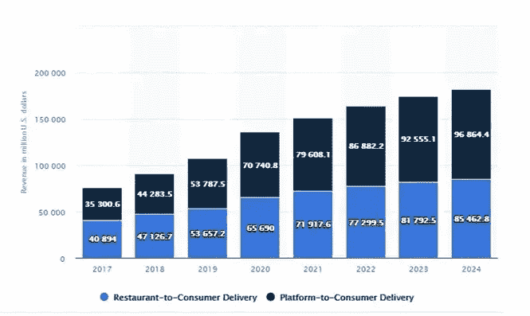
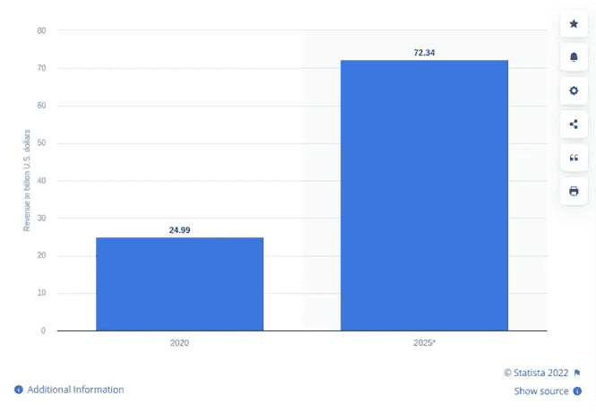

# 按需服务应用——它们对您的业务非常重要的原因

> 原文：<https://javascript.plainenglish.io/on-demand-service-apps-reasons-why-they-are-important-for-your-business-d8a4e5c8c6c?source=collection_archive---------21----------------------->

on-demand service apps

世界正在经历不断的变化。技术进步；应用程序在确保人们可以通过指尖获得快速服务来使他们的生活更加便利方面大有作为。因此，这导致了按需应用的出现。

有了这些应用程序，客户只需点击几下，添加一些细节，如他们的位置细节，提出他们想要的请求，点击他们希望用于该请求的支付模式，然后提出请求。

因此，由于提供容易和方便的服务，因此，它们已成为一个受欢迎的市场，特别是在疫情之后。

在下面的文字中，我将思考这些应用程序的本质，列举它们如此受欢迎的原因。

接下来，我列出了流行的点播应用，以及它们在推动这个市场的经济发展中所扮演的角色。

让我们开始吧。

# 按需应用程序—简介

构成点播服务 app 最多的点播 app；和[按需交付应用](https://www.peppyocean.com/multi-delivery-app-development/)分别是帮助客户直接从智能手机订购商品和服务的解决方案。

这是为了帮助客户在通过这些解决方案预订服务时，从舒适的家中获得最大的便利。

所有这些因素都是市场因此成为抢手货的重要原因；也是大多数企业希望在其运营中包含的内容。

这些解决方案如此受欢迎的一些其他原因将在下文中讨论。

# 为什么点播应用在最近几年越来越受欢迎的原因是节省开支

有了这款应用，运营成本大幅下降。尤其是与运输相关的成本，如运输成本、员工维护成本等；大幅下降。

> ***保证 100%便利***

智能手机革命让消费者享受到了便利的生活。这是通过帮助他们找到商品，并通过设备本身的应用程序直接订购。这样既节省了时间又保证了 100%的便利性。

> *为企业开启新机遇*

*通过面向企业的应用程序，扩展变得非常容易。这是指接触到更大比例的客户；同时增加收入。这有助于为那些第一次打基础的人打开新机会的大门。*

*请看下图，深入了解这些解决方案带来的好处。*

**

*benefits of on demand app*

*观察上图，您可以了解按需应用程序提供的不同支持。*

*所以现在，让我列出各种各样的解决方案，这些解决方案特别有助于点播应用市场成为如此受欢迎的市场；毕竟。*

# *不同形式的按需应用*

*有不同形式的点播应用，比如送餐应用、冥想应用等等。然而，在下文中，我列出了五大支柱，以及它们在提振按需经济方面发挥的作用。*

***它们是-***

*   *食物配送应用程序*
*   *杂货店送货应用程序*
*   *交通应用*
*   *家庭服务应用程序*
*   *洗衣服务应用程序*

*在下面的几行中，我回顾了所有这些应用，并对它们进行了讨论，阐述了它们在提高整体点播市场利润方面发挥的作用。*

## *1.按需送餐应用*

*看下面的图表:*

**

*图像来源——statista.com*

*上图描绘了该应用如何帮助在线食品配送市场成为一个创收市场，以及在未来几年。*

*这是因为它提供了快速下订单的便利。拥有多家餐厅、餐食定制等多种功能，客户可以找到自己选择的餐厅，定制自己想吃的餐，然后在舒适的家中享用美食。*

*这一切都是为了确保食品配送业务总体上；以无缝的方式持续盈利增长。*

## *2.按需杂货店送货应用程序*

*在推动按需经济的五大应用中，紧随其后的是[按需杂货配送应用](https://www.peppyocean.com/grocery-delivery-app-development/)。*

*这些应用程序允许客户将他们选择的家用物品直接送到他们家门口。客户只需要访问该应用程序，并从他们想要的订单中选择类别。接下来，他们选择一个或多个项目，同时付款，或保存该项目以备后用。最后，他们选择交付订单的时间和日期，然后确认请求。*

*由于这种便利，杂货店送货应用程序在消费者中获得了显著地位。同时，它也帮助超市提高了他们在网上的知名度，并从他们收到的订单中赚取了大量的钱。*

*最后，它还特别帮助了杂货按需行业成为一个创收行业，不仅在当前时代如此，在未来也是如此。*

*尤其是 Instamart、Blinkit 等应用的出现。按需杂货配送市场已经成为一个受欢迎的市场。*

*请看下面的图表，以更好地了解这一领域。*

**

*图像来源——statista.com*

*上图描述了当前十年食品和杂货市场的当前收入，以及未来几年(2025 年)的收入；收入增加了 723.4 亿美元。*

*这足以表明该行业的盈利性质，因为它为客户提供了便利水平。*

## *3.按需交通应用*

*2009 年优步的出现使得按需运输行业见证了经济的增长。由于高度的便利性，它为客户提供了从指尖获得快速骑行的途径，使其成为当前时代的趋势市场。*

*尤其是；由于像实时跟踪、应用内呼叫等功能。除了能够连接之外，乘客和司机还可以无缝地知道彼此的位置；并且知道对方的下落。*

*所有这些因素都导致了按需运输应用程序负责帮助按需经济，特别是成为一个趋势市场。*

*看看下面的图片，深入了解我在说什么。*

**

*看着上面的这张图片，您可以很好地理解为您的企业获取按需交通应用程序是一个有利可图的提议。这将有助于你在短时间内获得丰厚的收入。*

## *4.按需家庭服务应用*

*这些应用程序帮助客户方便地联系杂工。这确保了诸如管道、修理等任务。，得到迅速执行。*

*这款应用运行流畅。客户只需进入应用程序，点击他们需要帮助的服务，然后就会看到服务提供商的列表。从列表中，客户可以选择一个适合他们需求的，并预订服务，点击时间，日期和支付方式，他们将选择支付服务费用。*

*通过这些步骤，服务提供商接收请求并确认它。最后，他们到达客户所在地并交付服务。*

*这种无缝的服务交付模式使得按需家庭服务市场成为市场中的知名品牌。预计 2026 年[按需家庭服务市场](https://www.technavio.com/report/online-on-demand-home-services-market-size-industry-analysis)的收入将增长 47.5 亿美元，CAGR 为 60.77%。*

## *5.按需洗衣服务应用*

*最后，按需应用类别中的另一个受欢迎的应用是按需洗衣服务应用，它为按需经济带来了革命性的增长。*

*由于该应用程序中的独特功能允许无缝洗衣服务，如洗涤、清洁、熨烫、蒸汽等类别，客户可以选择自己喜欢的服务。接下来，他们可以点击应用程序中的洗衣店列表；顾客可以通过点击需要取洗衣物的时间和日期进行选择。最后，他们提出请求。*

*   *洗衣房收到请求并确认*
*   *为提货指定送货司机*
*   *提货后，送货员按照日期送洗衣物*

*除了简单的功能，该应用程序还提供了特殊的提及需求。所有这一切导致越来越多的实体洗衣店采用应用程序来教育新客户他们在商店提供的服务，他们的设定功能等等。*

*这也导致[按需洗衣市场](https://www.verifiedmarketresearch.com/product/online-on-demand-laundry-service-market/)成为一个趋势市场。到 2030 年，按需洗衣服务应用程序将帮助干洗市场产生约 276.3 亿美元的收入，CAGR 为 35.56%。*

# *包扎*

*按需应用的出现有助于客户获得触手可及的便捷服务。它还支持送货和服务专业人员获得工作机会和商店等。，以获得健康的能见度。*

*因此，如果你希望在按需领域取得成功，现在正是时候。疫情已经表明，按需市场无疑是一个富有成效的市场。因此，今天就联系一家按需应用程序开发公司，获得一款能为您带来最大价值的应用程序，帮助您的客户；和送货专业人员。通过在交付按需应用开发服务的同时采用最佳实践，他们将为您提供易于用户操作的解决方案，最终实现投资回报最大化。*

**更多内容请看*[***plain English . io***](https://plainenglish.io/)*。报名参加我们的* [***免费周报***](http://newsletter.plainenglish.io/) *。关注我们关于*[***Twitter***](https://twitter.com/inPlainEngHQ)*和*[***LinkedIn***](https://www.linkedin.com/company/inplainenglish/)*。查看我们的* [***社区不和谐***](https://discord.gg/GtDtUAvyhW) *加入我们的* [***人才集体***](https://inplainenglish.pallet.com/talent/welcome) *。**