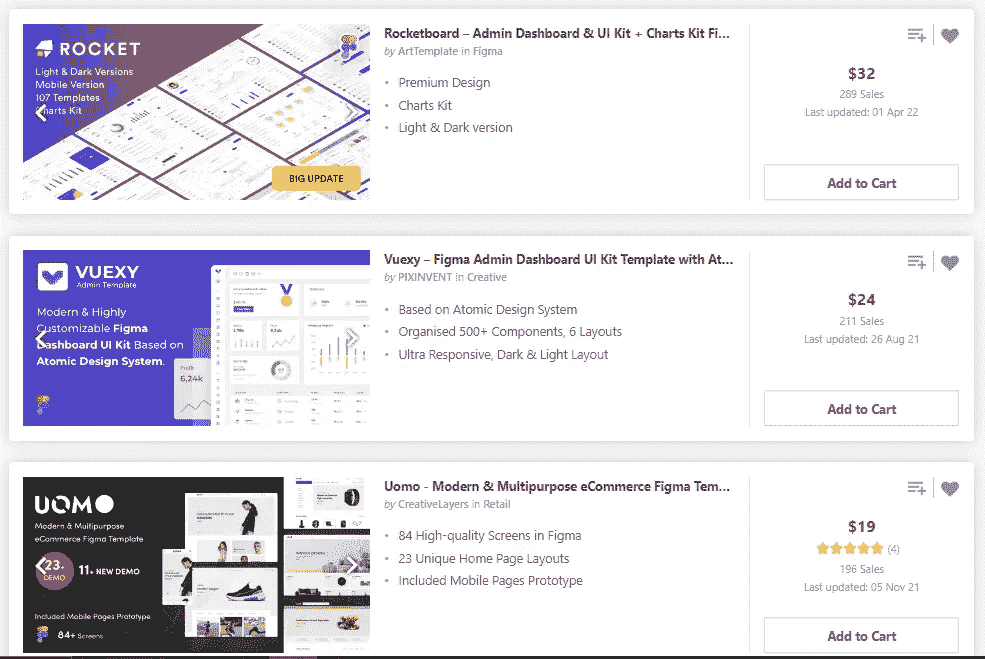

# 一个没人谈论的新编程侧骗局

> 原文：<https://javascript.plainenglish.io/one-new-programming-side-hustle-that-no-one-is-talking-about-87c2f40b58f7?source=collection_archive---------1----------------------->

## 请不要指望博客、YouTube 视频或自由职业。

Photo by [Brooke Cagle](https://unsplash.com/@brookecagle?utm_source=medium&utm_medium=referral) on [Unsplash](https://unsplash.com?utm_source=medium&utm_medium=referral)

从一开始，我就想学习一些东西，以便赚很多钱。但我知道，再想下去也不会帮我赚到钱；我需要尽快开始。

老实说，我不知道从哪里开始。我当时听说过[网络开发](/im-a-self-taught-web-developer-and-here-are-the-resources-that-i-used-d7f37c47cc1a)并决定试一试。

老实说，在我学习网络开发的第一年，我没有赚到任何钱。我找不到任何工作(T2)自由职业很难，也没有人愿意付钱给我。

快进到今天，我有[多个收入流](/as-a-wealthy-programmer-here-are-my-7-stupidly-simple-income-streams-1b5192006114)，以及各种[侧推](/11-stupidly-simple-side-hustles-to-earn-extra-money-as-a-programmer-23fd30ca5cda)，我想告诉你们一个新的，你们大多数人可能都不知道的。

因为我是一名网络开发人员，它与网络开发有关，但它是另外一种东西，通过设计代码平台来赚钱。

我们开始吧。

# 通过使用设计为平台编写代码来赚钱

如果你[跟我](https://nitinfab.medium.com/)一样，你可能知道有几种赚钱的方法，比如卖设计，卖代码，通过画布网站赚钱。

但是你有没有意识到你可以通过使用设计来编码平台来赚钱？

如果没有，请继续阅读。

本质上，作为一个网络开发者，你有客户，你必须创建设计，建立网站，并把它们交付给你的客户。

如果你努力工作几个月，你会有足够的客户，但由于你的工作量，你不得不对大多数客户说不。

我也经历过类似的经历。然后我开始利用设计对平台进行编码。通过使用这种平台，您可以轻松节省 90%以上的时间。

让我举个例子。假设你有一个网络开发项目。从头开始开发一个网页至少需要一个小时。

借助从设计到代码的平台，您可以在几分钟内构建它。

因此，您可能会承担许多任务，工作更多，并赚很多钱。

# 大多数从设计到代码的平台都可以自由使用

是的，大多数从设计到代码的平台都可以在一定程度上自由使用。

名单有点长，像是:

1.  Sketch2Code
2.  好极了
3.  Fronty
4.  周一英雄
5.  超新星

还有更多。

我为所有这些平台写了一个指南，你可以[阅读](/best-design-to-code-platforms-to-make-your-web-development-journey-easier-4ef5125ad9fa)。

# 你不需要客户

但是，尼廷，我们不是专家，我们没有客户，我们也没有太多的联系，所以我们如何从中赚钱？

你不需要任何客户，我的朋友。你只需要专注于你的技能。

学习 UI 设计，利用设计到编码的平台开发应用，并在网上销售。

是的，你可以在网上出售你的项目。

但是人们会在网上购买吗？是的，绝对的。

src: Themeforest

这是一个真实的例子。我去了一个叫 Themeforest 的网站，寻找 Figma UI 布局。

你可以看到，开发者提供的 UI 模板售价分别为 32 美元、24 美元和 19 美元，销售额大幅提高。

以 Rocketboard UI 模板为例。它售价 32 美元，迄今已售出 289 台。所以设计师一共赚了 9248 美元(包括设计师要付给平台的佣金)。

不是还有很多吗？

我相信我们大多数人不可能在这么短的时间内达到这样的回报。不过，赚 1000 美元也是有可能的。这就是你用单边骗局能赚到的钱。

 [## 如何用这种简单的方法每月多赚 500 美元

### 没有废话，请不要期待博客，YouTube，自由职业者，或媒体

javascript.plainenglish.io](/how-to-make-an-extra-500-every-month-with-this-easy-side-hustle-bac6fd48cdfe) 

更具体地说，由于我的工作量，我总是拒绝我的客户。然而，使用这些网站后，我试图获得额外的客户。

我的生活发生了什么变化？更准确地说，我变得更有效率，能够做更多的工作，而且因为这些平台节省了如此多的时间，我每小时的工作效率比预计的提高了很多。

老实说，利用我的网络开发技能，我现在每个月可以轻松赚到将近 5000 美元。不代表你不用编码；这是你的选择。

我只是想和你分享一些帮助我赚更多钱的东西。

就这样——谢谢。

[*如果你喜欢看这样的故事，并想帮助我成为一名作家，可以考虑成为一名中等会员*](https://nitinfab.medium.com/membership) *。它每月花费 5 美元，给你* [*无限制访问媒体内容*](https://nitinfab.medium.com/membership) *。如果你通过我的链接注册，我会得到一点佣金。*

*更多内容看*[**o**](https://plainenglish.io/)**。报名参加我们的* [***免费周报***](http://newsletter.plainenglish.io/) *。关注我们关于*[***Twitter***](https://twitter.com/inPlainEngHQ)*和*[***LinkedIn***](https://www.linkedin.com/company/inplainenglish/)*。查看我们的* [***社区不和谐***](https://discord.gg/GtDtUAvyhW) *，加入我们的* [***人才集体***](https://inplainenglish.pallet.com/talent/welcome) *。**