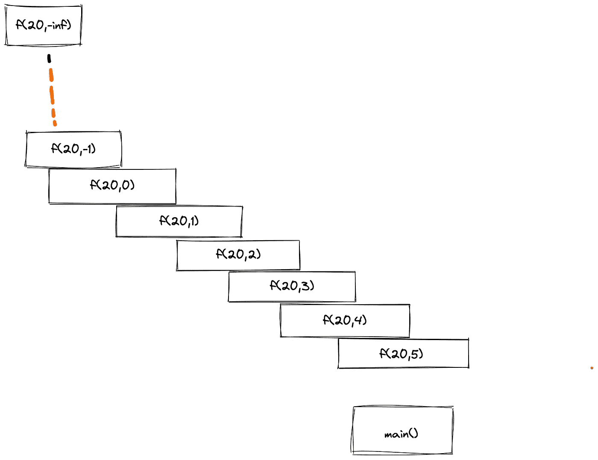
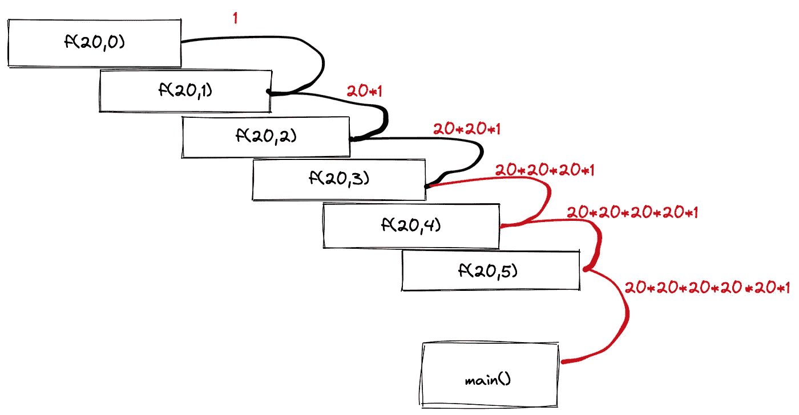
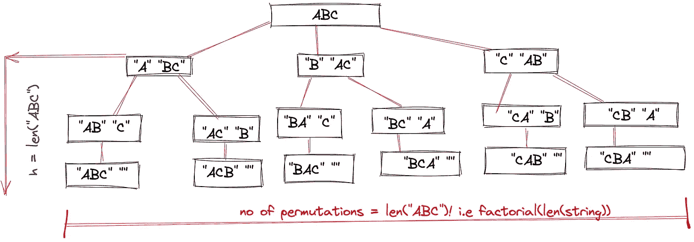

# 理解递归函数的一个停止点

> 原文：<https://javascript.plainenglish.io/one-stop-point-recursive-function-2fbcf511517a?source=collection_archive---------5----------------------->


Photo by [Sean Stratton](https://unsplash.com/@seanstratton?utm_source=medium&utm_medium=referral) on [Unsplash](https://unsplash.com?utm_source=medium&utm_medium=referral)

**什么是递归函数？**

一个调用自身的函数叫做递归函数，就这么简单。

**递归背后的基本思想是什么？**

所以，这个想法是，你可以将较小的工作块委托给这个功能。最后，您将这些较小的结果组合成一个实际的解决方案。

**举例:**

你想计算 20 ⁰.

我们来看看解决它的过程。

```
result = 20*20*20………*20 //10 times
```

我们也可以把它写成

```
result = 20*20*20⁸
```

我们可以把它写成

```
result = 20*20⁹
```

因此:

f(a，n) = a*f(a，n-1)

这里，a=20，n=10

即 f(20，10) = 20*f(20，10–1)= 20 * f(20，9)=20*20*f(20，8)=20*20*20*f(20，7)= 20 * 20 * 20 * f(20，6)

我希望，到目前为止，你能理解这个模式。

所以，让我们来写函数

```
int power(int a, int n){
   int result = a*f(n-1);
   return result}E.g power(20,10)
```

那么，你认为，这样会返回正确的结果吗？还是代码会卡死？

如果您将上面的代码形象化，它看起来会像下面这样:



如果你观察函数调用，函数调用永远不会结束。这段代码将不断调用一个新函数，直到内存耗尽，遇到**“堆栈溢出错误”**。这样，你的程序会意外停止运行。

所以，不要担心，我们有一个解决方案。不管怎样，我们会修改上面的代码。以便它如预期的那样停止，适合于我们期望的结果。

在检查下面的解决方案之前，你能自己尝试更改代码吗？

好吧，没关系。

我来透露一下解决办法。

```
int power(int a, int n){
   if(n==0) return 1 // since a^0 is 1 for every a int result = a*f(n-1);
   return result}E.g power(20,10)
```

如果你想试着想象上面的代码，请看下面的图片。



# **让我们来看一个更经典的递归例子——字符串的置换**

例如:考虑一个字符串“ABC”

我们现在需要打印字符串“ABC”的所有可能排列

可能的解决方案如下

**“农行”、“ACB”、“北汽”、“BCA”、“CAB”、“CBA”**

排列总数=阶乘(长度(“ABC”))

在上面的例子中是 3！即 6 个

让我们看看实际的实现代码。

测试用例 1:permutationsofstring("，" ABC ")；

我们传递两个参数，一个是空字符串，另一个是实际字符串。

我们遍历字符串

1.  一个接一个地挑选字符，并将该字符附加到输出字符串中。
2.  我们继续计算剩余字符的排列。

一旦 rest 字符串为空，我们将打印输出字符串。

> **如果你想可视化代码。你可以在下面看到。**



如果你仔细观察，你会发现树的高度是给定的字符串长度。

*更多内容请看*[***plain English . io***](https://plainenglish.io/)*。报名参加我们的* [***免费周报***](http://newsletter.plainenglish.io/) *。关注我们关于*[***Twitter***](https://twitter.com/inPlainEngHQ)*和*[***LinkedIn***](https://www.linkedin.com/company/inplainenglish/)*。查看我们的* [***社区不和谐***](https://discord.gg/GtDtUAvyhW) *加入我们的* [***人才集体***](https://inplainenglish.pallet.com/talent/welcome) *。*