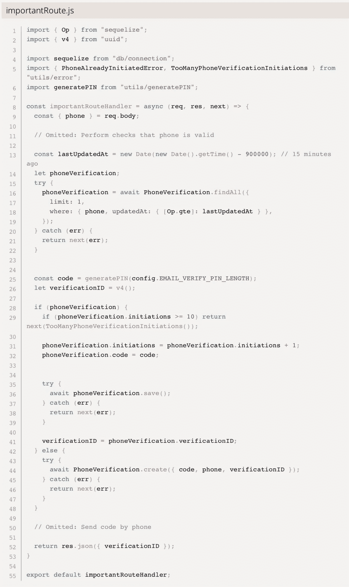
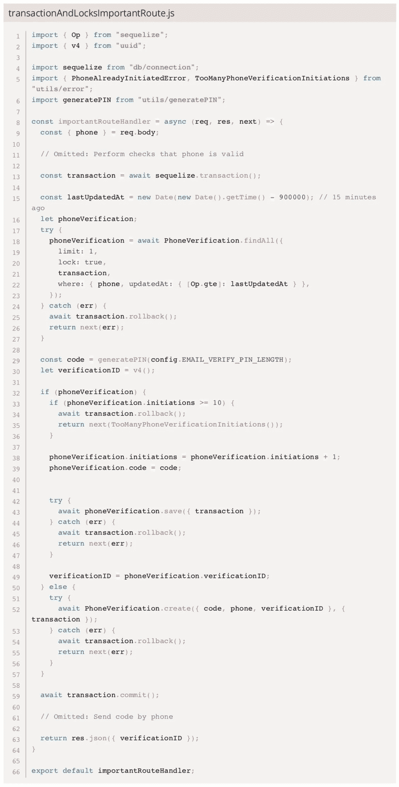
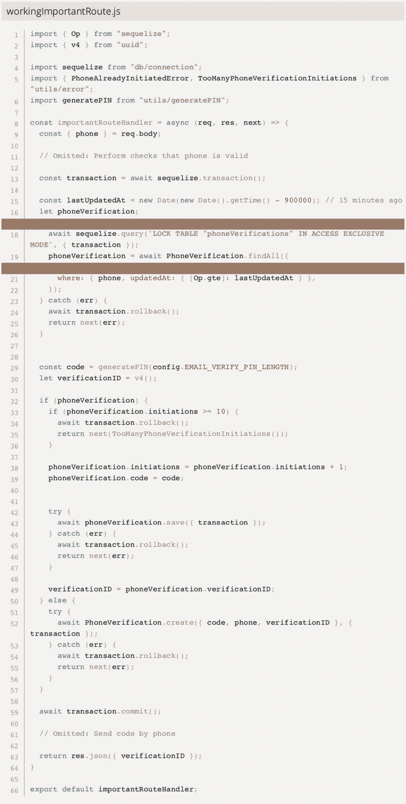

# 用 Sequelize 管理数据库需要知道的一件事

> 原文：<https://javascript.plainenglish.io/one-thing-to-know-when-managing-your-database-with-sequelize-a52f937d423d?source=collection_archive---------5----------------------->

## 见解和技巧，使您的序列使用应用程序更健壮，不受竞争条件的影响。

最近，当我试图访问一个并发应用程序中的 PostgreSQL 数据库时，比如 Node.js express 服务器，我偶然发现了一个特别严重的问题。这个特殊的问题导致了安全相关代码中令人讨厌的竞争情况。Sequelize 提供了[事务和锁](https://sequelize.org/docs/v6/other-topics/transactions/)来确保在我们的应用程序中没有任何虚假的事情发生，但是这些特性很难使用并且没有很好的文档记录。出于这个原因，我想为您提供一些见解和技巧，让您使用序列的应用程序更加健壮，不受竞争条件的影响。

下面的给出了我遇到的问题的代码示例[。该路由接受将被验证的电话号码。我们首先检查电话号码是否已经在过去 15 分钟内提交，以进行验证。如果是这种情况，我们会增加发起次数，这样用户在给定的时间窗口内发起同一封邮件的次数就不会超过 10 次。如果没有，我们在数据库中插入一个新条目。在这两种情况下，我们随后通过 SMS 发送验证码，并将验证 ID 返回给应用程序。](https://schneider-lukas.com/blog/sequelize-transactions-and-locks-for-preventing-race-conditions#server-example)

这都是非常标准的代码。但问题是，如果一个用户快速提交多个请求，他可以躲过 10 次以上的初始化。这个错误是由于两个请求都可能在它们中的任何一个设法修改条目或创建新条目之前从数据库中读取 phoneVerification 条目。这种错误被称为[序列化异常](https://www.postgresql.org/docs/current/transaction-iso.html)。

为了解决这个问题，我们希望使用 Sequelize 的事务和锁特性，如下一个代码示例中的[所示。在大多数情况下，使用 Sequelize 提供的锁完全没问题。但是锁只对现有的行起作用，对我们将来可能想要创建的行不起作用。并且由于用于电话验证的表条目可能在路由的开始处不存在，所以我们可能无法锁定它。](https://schneider-lukas.com/blog/sequelize-transactions-and-locks-for-preventing-race-conditions#lock-example)

克服这个问题的一个方法是[配置 Sequelize 使用 SERIALIZABLE 作为隔离级别](https://sequelize.org/docs/v6/other-topics/transactions/#isolation-levels)。虽然这样做效果很好，但每次违反隔离时都会导致异常。代码中必须注意这一点，如果发生异常，必须重新执行查询。因为这需要*大量*的代码更改，并且引入了各种各样的新挑战，所以这对我来说不是一个可行的解决方案。

第二种方法，也是我选择的方法，是简单地锁定整个表。现在，Sequelize 只允许您执行行级锁。这意味着您只能锁定某一行(并且该行必须已经存在)。但是幸运的是，我们可以用 Sequelize 执行[原始查询](https://sequelize.org/docs/v6/core-concepts/raw-queries/)。这个补丁只是要求我们在事务开始时锁定表，一旦事务被提交(或回滚)，锁就会被释放。你可以在下面找到最终的工作代码[。](https://schneider-lukas.com/blog/sequelize-transactions-and-locks-for-preventing-race-conditions#final-example)

作为最后的警告，您应该谨慎使用表锁！它们会降低应用程序代码的速度，因为它们锁定了整个表，如果不小心的话，甚至会导致死锁。在大多数情况下，如果您使用 PostgreSQL，您可能希望使用 Sequelize 完全支持的[行级锁](https://sequelize.org/docs/v6/other-topics/transactions/#locks)，或者使用[咨询锁](https://www.postgresql.org/docs/current/explicit-locking.html#ADVISORY-LOCKS)。

*原载于*[*https://schneider-lukas.com*](https://schneider-lukas.com/blog/sequelize-transactions-and-locks-for-preventing-race-conditions)*。*

*更多内容请看*[***plain English . io***](https://plainenglish.io/)*。报名参加我们的* [***免费周报***](http://newsletter.plainenglish.io/) *。关注我们关于*[***Twitter***](https://twitter.com/inPlainEngHQ)[***LinkedIn***](https://www.linkedin.com/company/inplainenglish/)*，以及* [***不和***](https://discord.gg/GtDtUAvyhW) *。*