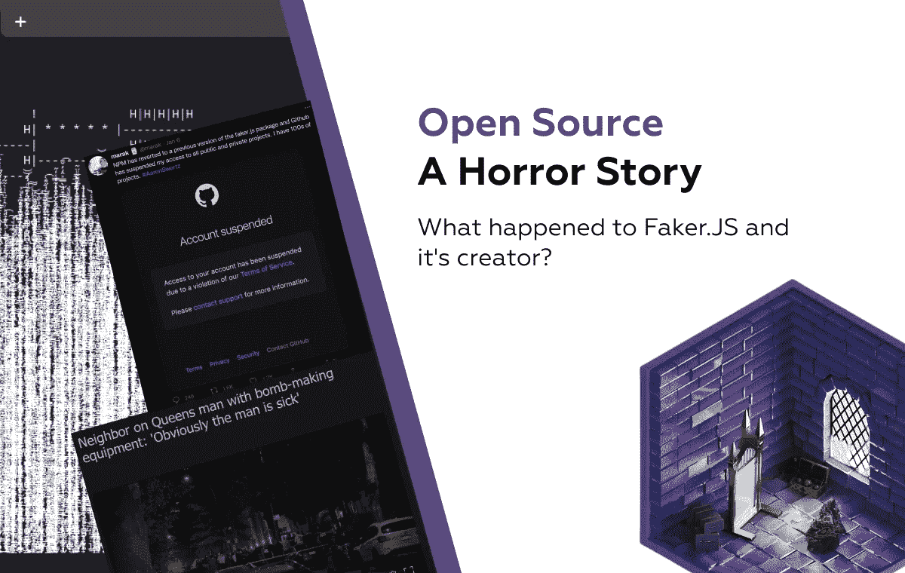
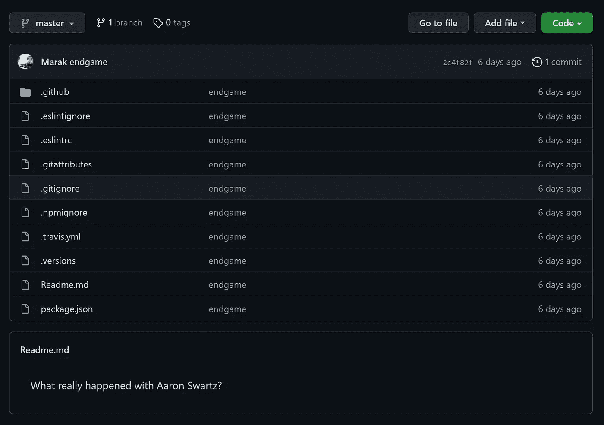
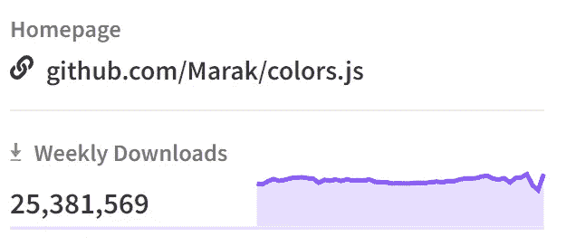
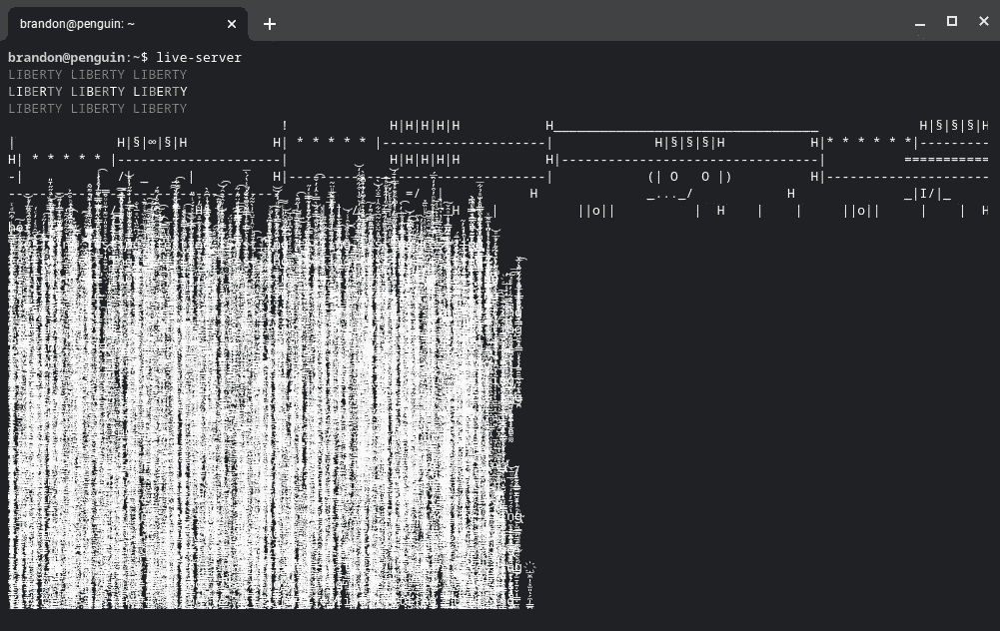
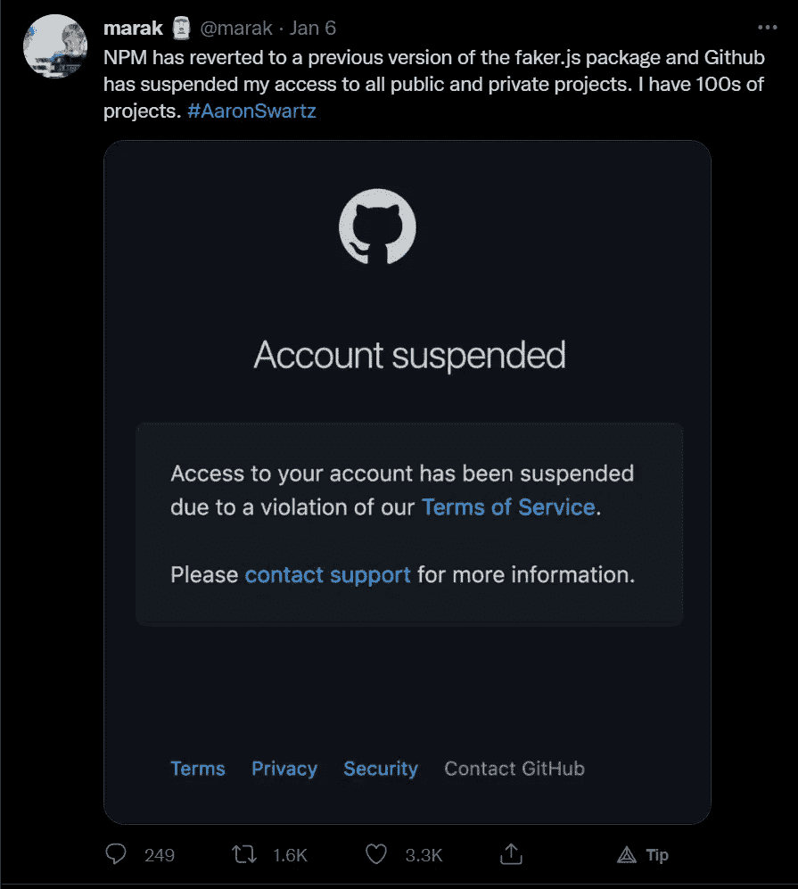

# 开源——一个恐怖故事

> 原文：<https://javascript.plainenglish.io/open-source-a-horror-story-c14caba386a8?source=collection_archive---------0----------------------->



## Faker.js 和它的创造者后来怎么样了？

最近开源社区的事情变得很疯狂，这是一个思想失控的故事。

# 自由之梦

一个明媚的早晨，你醒来，决定建造一些东西。什么，谁，如何充斥着你的大脑，但你的心看到了一个更大的目的，那就是让它免费用于这个开发商居住，浮动，空间岩石上的所有灵魂。

这就是 8 年前最受欢迎的随机 JS 数据生成库 [Faker](https://www.npmjs.com/package/faker) 对 Marak 的开始。这是一个真诚和诚实的努力，免费推出这样一个方便的工具，无论是大公司还是小团队，都利用了更快的&更平滑的测试数据种子生成器。

Faker 为许多人提供了一种服务，这种服务可能并不被认为是必不可少的，也不像许多 Redditers 建议的那样，很难或很昂贵，但它仍然很受欢迎，每周下载量超过 240 万次。

# 绝望的呼喊

2020 年 10 月，Marak 向 Faker 库添加了一个提交，确认了开源中最可怕的情况。缺乏资金。当你创造了一个软件，人们使用它，你期望从中赚钱，但这对于完全基于捐赠的开源库是无效的。这些年来，Faker 代码库中添加的无数特性增加了维护成本和项目投入的时间。

业内众所周知的事实是，不管你的开源库有多棒，如果一家大型科技公司不赞助它，你就差不多破产了。马拉克知道这一点，并在他的帖子中非常明确地指出，他将停止维持，直到他收到全额工资，因为他没有收入。

> 深入挖掘之后，我发现了一个更加令人不安的信息。马拉克度过的艰难岁月可能是他自己的错，因为据称他为了伤害他人而制造了**炸弹** 后，他在[的房子被烧毁。这样的行为不应该被支持。](https://abc7ny.com/suspicious-package-queens-astoria-fire/6425363/)

过了一段时间，情况有所好转，Faker 推出了一项全新的服务，旨在利用云环境中的现有功能实现大规模使用，但这不会持续太久。

我们现在在这里，距离 faker cloud[发布已经将近一年了，这种情况正在达到一个神秘的结局。最受欢迎的开源 JS 库之一的史诗迅速转向了黑暗面。](http://fakercloud.com/)

2022 年 1 月 5 日，Marak 发布了 Faker 的新版本，有意版本为 6.6.6。这标志着这个库不可预见的消亡，它实际上已经从 NPM 和 Github 中完全删除了。

“Endgame”提交包括删除所有源文件，除了一些 config 和 Readme.md 文件。



Endgame of faker

现在，有趣的地方来了，这个最后的提交给读者文件添加了一个神秘的行，当我写这篇文章的时候，这个行仍然困扰着我。

> 艾伦·施瓦茨到底怎么了？

# 一线希望

为什么马拉克会写这个，谁是亚伦？

艾伦·施瓦茨是开源 OG 的程序员之一，他写了让博客成为可能的东西，RSS 格式。他还在 Reddit 上工作了一段时间，并在信息自由方面开展了积极的工作。他认为所有的数据都应该是可访问的，这可能导致了他的最终死亡。


2011 年，他通过网络内的一台电脑入侵了麻省理工学院，并试图公开几篇学术文章。他被逮捕并被指控犯有多项重罪，包括破门而入、有线欺诈(通过欺诈性信息发布信息)和几项与计算机相关的欺诈。大量的指控是由于在他长期的行动主义生涯和争取信息自由的努力之后，他进行了长期的追求。

上级可能想通过判处他 35 年监禁或承认他后来否认的罪行来杀鸡儆猴。

信息自由是我们所有人都应该努力争取的，Aaron 可能想提醒我们，如果你相信你的事业，有时站起来反对行业巨头是值得的。

马拉克通过指出亚伦·施瓦茨的阴谋使他的故事病毒化的做法是不必要的，因为这可能会伤害他剩下的亲属，我们不应该将马拉克的“活动家”工作与他之前的其他人进行比较。

# 可疑的行为

在 Faker & FakerCloud 从互联网上消失的几天后，Marak 对他维护的另一个库 colors.js 进行了一次有争议的更新。



一个更受欢迎的库，在 Github 上有超过 4.5k 个 stars，因此新版本包含一个无限循环让很多人感到惊讶。



在报道这个问题的 [Github 线程](https://github.com/Marak/colors.js/issues/285)中，根据马拉克的说法，似乎 ASCII Art (liberty)错误被错误地发布了，甚至看起来他正在修复它。随着时间的推移，人们开始认为这是有目的的，并要求立即修复，但他无处可寻。

这种伪装下的对 colors.js 的破坏是显而易见的，可以归类为一种激进行为，反对那些贪婪、忘恩负义、使用软件却不支持其创造者的公司。虽然远非如此，但这是想要造成损害的破坏性愿望的结果。这无疑对 colors.js 的所有用户造成了附带损害，其规模尚待确定。

截至目前，Github 已经暂停了 Marak 的账户，拒绝他访问数百个存储库。



这可能会恢复到现在，所以我们需要小心，当使用他的任何剩余包。

您可以使用此[单行](https://twitter.com/bitandbang/status/1480621529335533570)搜索此类包裹:

```
npm access ls-packages | jq keys
```

# 恐怖的结局

人们不能把他最近的行为看作是一种虐待，也不能轻视他，因为他想要伤害开源社区的想法是卑鄙的。

很难想象有一天，我们的一个依赖项会通过一个激进的宣传提交被劫持，我们所有的代码都会崩溃，甚至更糟糕的是，提交中包含了一个可能几天都不会被注意到的重大安全问题。

这在很大程度上要感谢[**key tonelem**](https://twitter.com/keystonelemur?s=20)给这种情况带来光明。

希望你喜欢这个“恐怖”的故事，不要忘记鼓掌，并遵循更多的软件相关的内容🚀。

*更多内容参见*[](http://plainenglish.io/)**。报名参加我们的* [***免费周报***T21*。在我们的*](http://newsletter.plainenglish.io/) [***社区不和谐***](https://discord.gg/GtDtUAvyhW) *获得独家写作机会和建议。**