# 使用 Medusa 和 11ty 的开源网络商店

> 原文：<https://javascript.plainenglish.io/open-source-webshop-with-medusa-and-11ty-4d477f38bac4?source=collection_archive---------4----------------------->

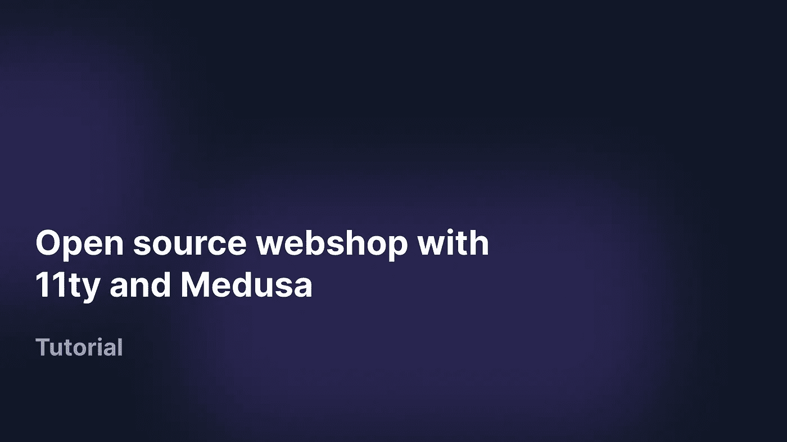

在本教程中，您将学习如何使用 Medusa 和 11ty 构建一个现代电子商务店面。您将使用 Medusa 的无头商业引擎和管理面板创建我们商店的后端，使用 11ty 框架和 Tailwind CSS 创建商店的前端。

[Medusa](https://www.medusajs.com/) 是一个开源的 Shopify 替代方案，提供了一个专注于最大化开发者灵活性的无头商务解决方案。 [11ty](https://www.11ty.dev/) 是一个非常灵活简单的静态站点生成器，用于构建现代网站。

在本教程中，您将学习如何:

1.  设置美杜莎的后端服务器
2.  安装数字海洋空间以简化文件管理
3.  设置 Medusa 的管理面板，以便更轻松地管理您的在线商店
4.  用 11ty 和 TailwindCSS 搭建一个简单的店面

[在这里](https://www.youtube.com/watch?v=o-XvG73Dm2s&)你可以找到整个店铺的视频

# 先决条件

要完成本教程，请确保:

*   Node.js 和 NPM 安装在您的本地机器上。您可以按照链接中的说明[在您的本地计算机上完全安装 Node.js 和 npm。](https://phoenixnap.com/kb/install-node-js-npm-on-windows)
*   使用 GitHub 帐户在本地安装 Git。按照这里的说明[安装 git，并在这里创建一个 GitHub 账户](https://git-scm.com/book/en/v2/Getting-Started-Installing-Git)[。](https://github.com/)
*   数字海洋账户。在此创建一个数字海洋账户[。](https://www.digitalocean.com/)

# 为什么是美杜莎？

*   **开源** — Medusa 是一款开源软件，可用作您的网络商店的商业后端，其背后有一个大型支持社区，您可以在此处访问。
*   **无头架构** — Medusa 的无头架构可以轻松构建任何类型的前端(例如 11ty)，并与您喜欢的 CMS、支付、履行解决方案等集成。
*   **多市场支持** — Medusa 本身支持多种货币，并允许您设置使用本地运输和支付提供商进行全球设置。
*   **完全可定制** —我们的可扩展架构可以轻松定制任何类型的高级用例，并且可以轻松构建定制逻辑和集成。

# Medusa 后端安装和设置

本教程的第一步是设置 Medusa 服务器和管理面板。Medusa 为管理您的商务项目提供了 3 个核心组件——一个为您的前端消费提供 REST APIs 的无头商务引擎、一个可定制的前端和一个用于管理您的商店的管理面板。

在这个项目中，我们将只利用无头商业引擎和管理面板，因为我们将建立 11ty 的店面。要设置后端服务器，首先要安装 Medusa CLI。

```
npm install -g @medusajs/medusa-cli
```

然后使用安装的 CLI 创建一个新项目。

```
medusa new <my-medusa-store> --seed
```

更改为项目的首选名称。导航到生成的文件夹，并创建一个新用户。

```
cd <my-medusa-store>
medusa user -e <some@email.com> -p <some_password>
```

将[**【some@email.com】**](mailto:****some@email.com)更改为您的首选邮箱，将 **< some_password >** 更改为您的首选密码。

最后，启动创建的服务器。

```
medusa develop
```

可以在 [http://localhost:9000](http://localhost:9000) 访问服务器。

**设置数字海洋空间用于上传图像**安装 Medusa 服务器后，下一步将是设置数字海洋空间用于存储我们上传的图像。为此:

*   打开您的 DigitalOcean 帐户。导航到共享空间。使用默认设置创建新空间。
*   选择创建的空间，点击**管理密钥。**

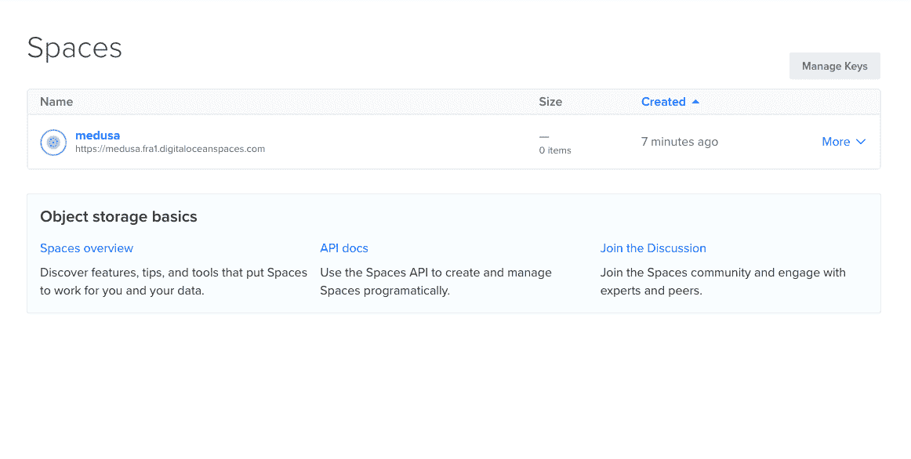

*   点击**生成新密钥。**

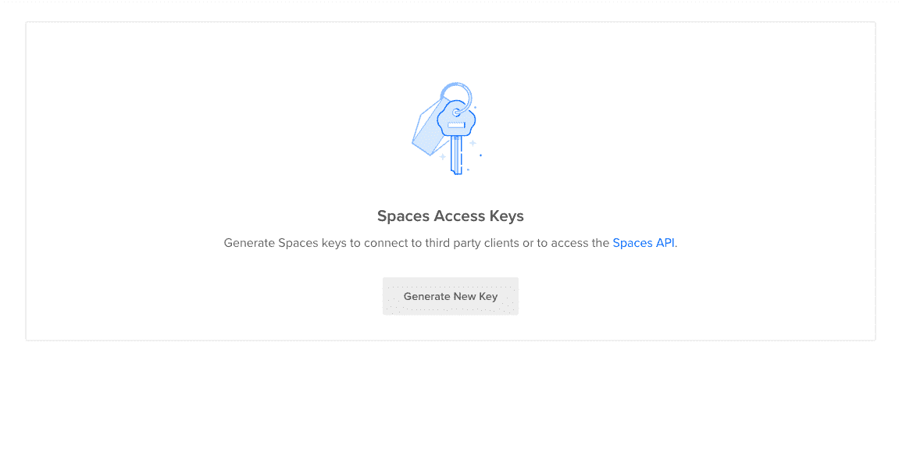

*   添加密钥名并保存。

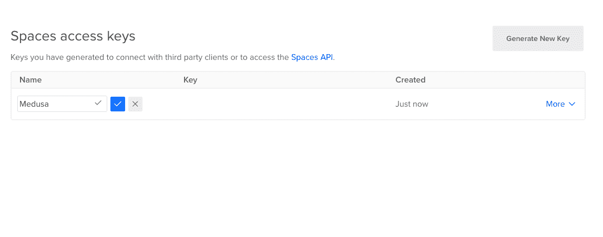

将自动生成密钥 ID 和密钥，并将密钥复制到安全的地方。现在，导航回 medusa 项目文件夹，并安装 **medusa-file-spaces** 包。

```
npm install medusa-file-spaces
```

然后打开 medusa-config.js 文件，将以下代码示例添加到插件部分。

```
{
    resolve: `medusa-file-spaces`,
    options: {
        spaces_url: "https://test.fra1.digitaloceanspaces.com",
        bucket: "test",
        endpoint: "fra1.digitaloceanspaces.com",
        access_key_id: "YOUR-ACCESS-KEY",
        secret_access_key: "YOUR-SECRET-KEY",
    },
},
```

将 **spaes_url** 更改为您创建的数字海洋空间的 url，将 **bucket** 更改为空间的名称，将 **access_key_id** 更改为生成的密钥 id，将 **secret_access_key** 更改为生成的密钥。

**设置并安装 Medusa 管理面板** Medusa 提供了一个管理面板，可以轻松配置和管理我们的商店。要设置管理面板，您应该首先从 GitHub 克隆管理库。

```
git clone https://github.com/medusajs/admin <medusa-admin>
```

更改为您喜欢的文件夹名称。然后导航到管理文件夹

```
cd <medusa-admin>
```

安装所有需要的软件包

```
npm install
```

最后，启动管理面板

```
npm start
```

管理面板将在[http://localhost:**7000**/](http://localhost:7000/)加载。

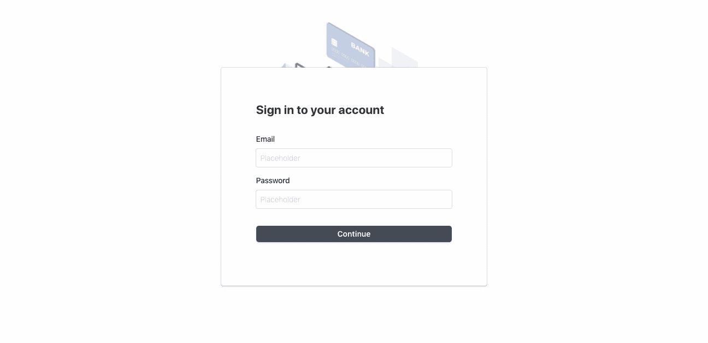

使用服务器的用户邮件和密码登录，以访问管理仪表板。

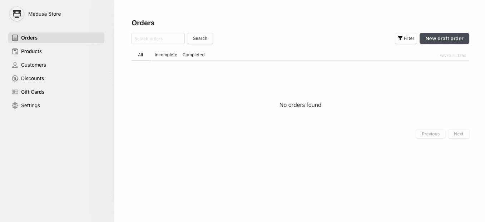

**向商店添加产品**现在我们已经完全设置好了 Medusa 服务器和管理面板，下一步将是向我们的商店添加产品。我们将通过管理面板做到这一点，因为管理面板比直接向服务器发送 API 请求要容易得多。

要将产品添加到商店:

1.  在侧边菜单上选择产品，然后点击窗口右侧的**新产品**。

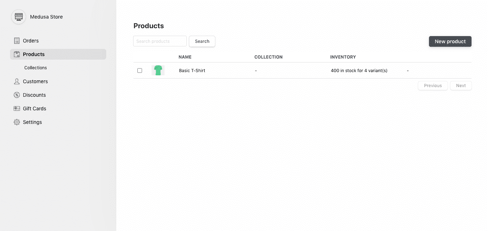

1.  添加您的产品信息，点击**保存**注册新产品。

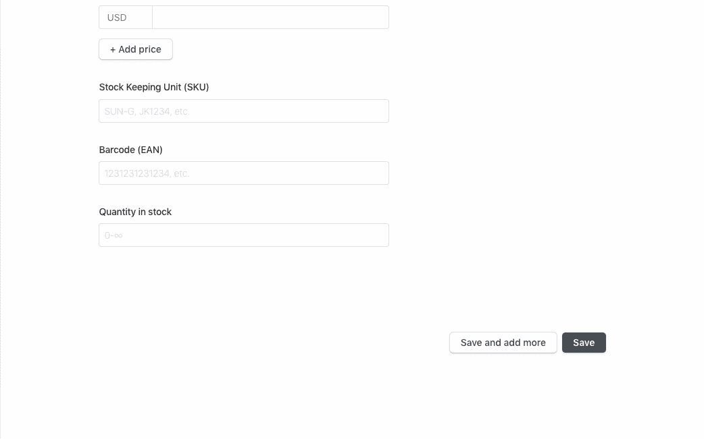

1.  点击下一步**发布**发布新产品。

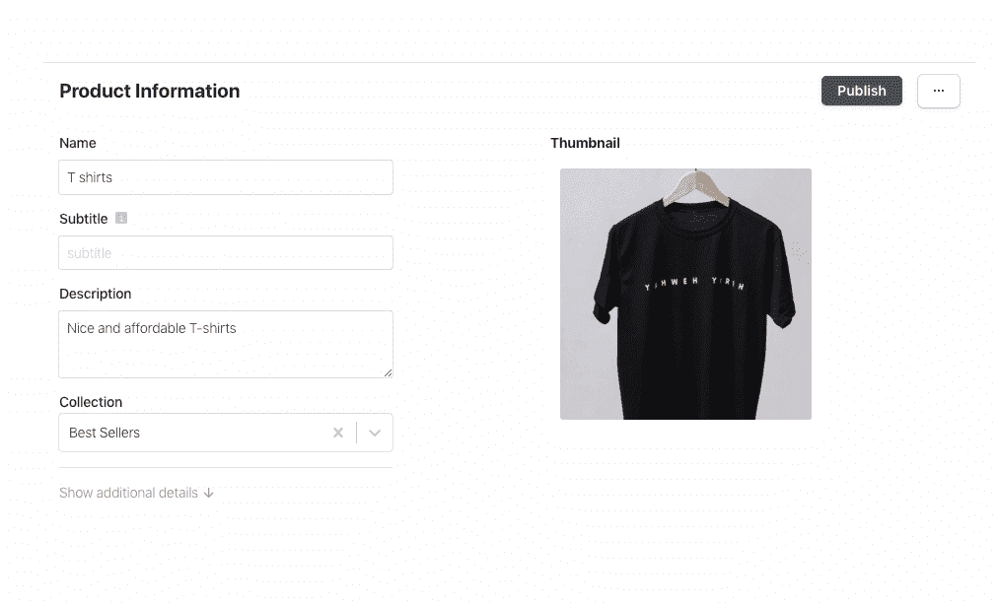

请确保向您的商店添加至少 3 种产品，这是完成本特定教程的前端设置所必需的。对于每种产品，请确保添加:

*   缩略图图像
*   4 张产品图片
*   产品名称
*   产品说明
*   手柄(手柄应该是 slug 格式，即 t 恤衫、面罩等。)

**创建产品系列**将产品添加到您的商店后，下一步是将它们分组到系列中。在本教程中，我们将使用:

*   每周销售收集
*   畅销书集

要创建收藏:

1.  在侧边栏菜单中选择产品下的集合。点击右上角的**新收藏**创建新收藏。

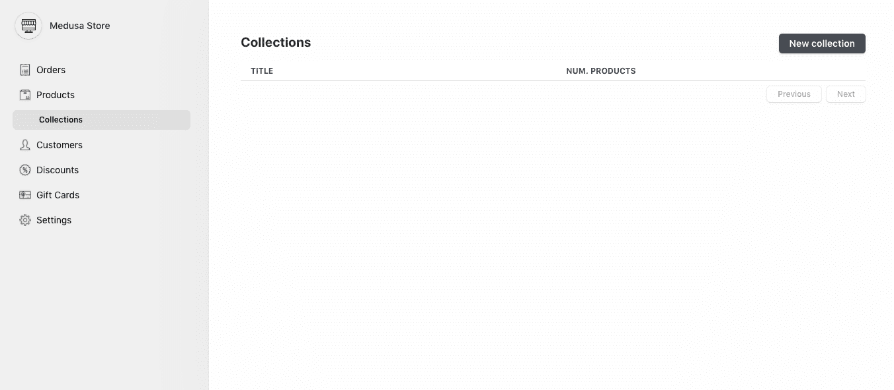

1.  添加收藏标题和句柄，然后点击**保存**。

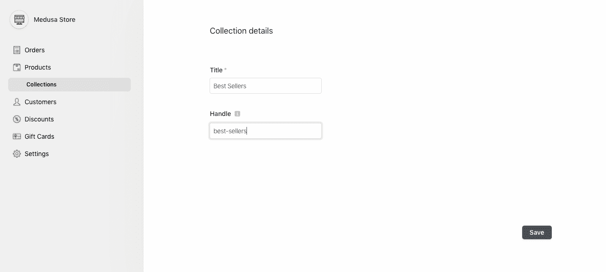

要将产品添加到集合中，

1.  单击产品页面上的产品，显示产品信息页面。

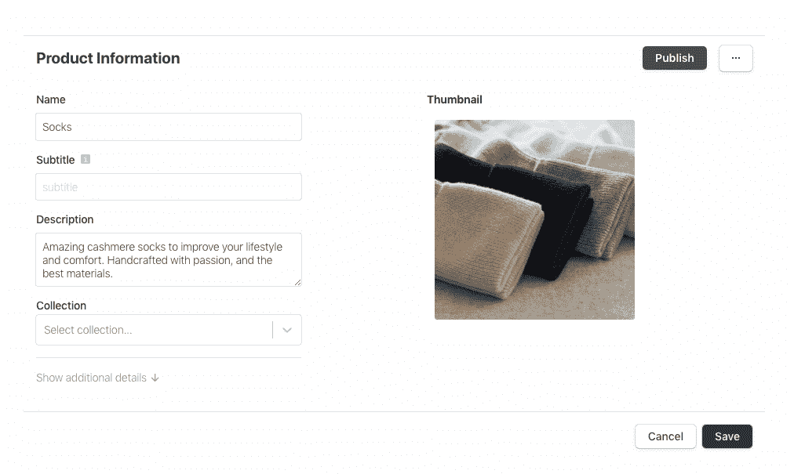

1.  单击集合下拉列表并选择一个集合，将产品添加到该集合中。

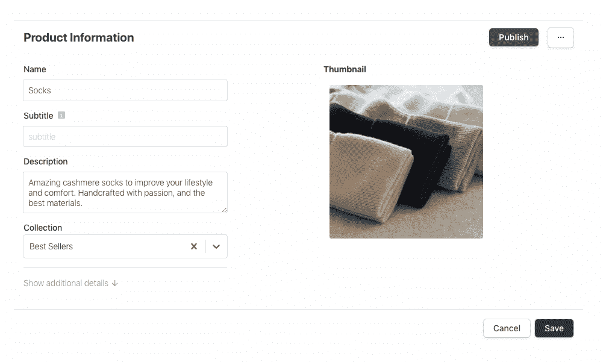

1.  点击**保存**保存您的更改。确保将您的每件产品都添加到一个系列中。

# 11ty 店面安装和设置

现在我们的 Medusa 设置已经完成，添加了产品，我们教程的下一步将是使用 11ty 前端框架为我们的商店创建店面。11ty 是一个简单的静态站点生成器，默认情况下没有配置，它是一个灵活的框架，允许同时使用多种模板语言，如 Nunjucks、Liquid、JavaScript、markdown 等。

要安装 11ty，请使用您店面的首选名称创建一个新文件夹。导航到该文件夹，并使用 npm 初始化该文件夹。

```
npm init -y
```

package.json 文件将被添加到该文件夹中。然后使用以下命令将 11ty 安装到该文件夹中。

```
npm install --save-dev @11ty/eleventy
```

使用以下命令确认您的安装。

```
npx @11ty/eleventy
```

如果安装成功，您应该会得到与此类似的响应。

```
Wrote 0 files in 0.03 seconds (v0.12.1)
```

现在我们已经完成了我们的 11ty 设置，下一步是将 TailwindCSS 安装到前端。TailwindCSS 是一个实用优先的 CSS 框架，用于构建现代网站。访问[https://tailwindcss.com/](https://tailwindcss.com/)了解更多关于 CSS 框架的信息。

将 TailwindCSS 添加到 11ty 首先，安装 TailwindCSS 及其依赖项。

```
npm install tailwindcss postcss-cli autoprefixer
```

然后用下面的命令生成您的顺风配置文件。

```
npx tailwind init
```

创建一个名为 **postcss.config.js** 的新文件，并将以下内容添加到该文件中。

```
// postcss.config.js
module.exports = {
  plugins: {
    tailwindcss: {},
    autoprefixer: {},
  }
}
```

创建一个 CSS 文件夹，并将名为 index.css 的文件添加到该文件夹中。然后将下面的代码片段添加到 c **ss/index.css** 文件中。

```
@tailwind base;
@tailwind components;
@tailwind utilities;
```

最后，用下面的代码片段更新 package.json 文件。

```
"scripts": {
   "dev": "postcss css/index.css -o _site/css/index.css && eleventy --serve --quiet",
   "build": "postcss css/index.css -o _site/css/index.css"
 },
```

要启动 11ty 服务器，运行 **npm run dev** 。服务器会在[打开 http://localhost:8080/。](http://localhost:8080/.)

**创建店面文件结构** 11ty 是一个非常灵活的框架，不需要任何配置。由我们决定如何建立我们的项目。将一个 src 文件夹添加到您的根文件夹中，这是存储我们文件的主文件夹。另外，将一个 **_includes** 和一个 **_helper** 文件夹添加到 src 文件夹中。组件文件将存储在 **src/_includes** 文件夹中，而数据文件将存储在 **src/_helpers** 文件夹中。

将一个 **.eleventy.js** 文件添加到您的根文件夹中，并将以下代码片段添加到. eleventy.js 中。

```
const HtmlMin = require('html-minifier');
const ErrorOverlay = require('eleventy-plugin-error-overlay');
 module.exports = eleventyConfig => {
 eleventyConfig.setTemplateFormats(['md']);
 eleventyConfig.addPlugin(ErrorOverlay);
 eleventyConfig.addTransform('htmlmin', (content, outputPath) => {
   if (outputPath.endsWith('.html')) {
     const minified = HtmlMin.minify(content, {
       useShortDoctype: true,
       removeComments: true,
       collapseWhitespace: true,
     });
     return minified;
   }
   return content;
 });
 return {
   dir: {
   input: "src",
   output: "_site",
   includes: "_includes",
   data: "_helpers",
   },
   jsDataFileSuffix: '.data',
 };
};
```

. eleventy.js 文件是我们主要的 11ty 配置文件。代码示例只是通知 11ty 我们的数据文件和包含文件存储在哪里，以及输出数据存储在哪里。我们还为这个项目添加了一个 **html-minifier** 插件和**eleventy-plugin-error-overlay**。

最后，用下面的命令安装这两个插件。

```
npm install html-minifier eleventy-plugin-error-overlay
```

完成设置后，您的文件结构应该如下所示:

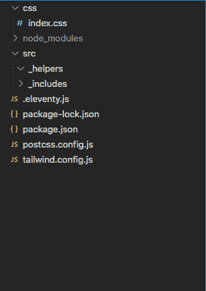

创建店面的布局下一步是创建店面的布局。我们将主要使用 Nunjucks 作为我们选择的模板引擎。

首先，将 header.njk 和 footer.njk 文件添加到您的 **_includes** 文件夹中。将以下代码示例添加到 **_includes/header.njk** 文件中，

```
<header class="bg-white text-gray-900 body-font shadow w-full">
  <div
    class="
      container
      mx-auto
      flex flex-wrap
      p-5
      flex-col
      md:flex-row
      items-center
    "
  >
    <nav class="flex flex-wrap items-center text-base md:ml-auto">
      <a
        href="/"
        class="
          mr-5
          hover:text-gray-900
          cursor-pointer
          border-b border-transparent
          hover:border-blue-600
        "
        >Products</a
      >
      <svg
        class="h-5 w-5"
        viewBox="0 0 24 24"
        fill="none"

      >
        <path
          d="M3 3H5L5.4 5M7 13H17L21 5H5.4M7 13L5.4 5M7 13L4.70711 15.2929C4.07714 15.9229 4.52331 17 5.41421 17H17M17 17C15.8954 17 15 17.8954 15 19C15 20.1046 15.8954 21 17 21C18.1046 21 19 20.1046 19 19C19 17.8954 18.1046 17 17 17ZM9 19C9 20.1046 8.10457 21 7 21C5.89543 21 5 20.1046 5 19C5 17.8954 5.89543 17 7 17C8.10457 17 9 17.8954 9 19Z"
          stroke="currentColor"
          stroke-width="2"
          stroke-linecap="round"
          stroke-linejoin="round"
        />
      </svg>
    </nav>
    <a
      href="/"
      class="
        flex
        order-first
        lg:order-first lg:w-2/5
        title-font
        font-medium
        items-center
        lg:items-center
        mb-4
        md:mb-0
      "
    >
      <svg
        width="38"
        height="40"
        viewBox="0 0 38 40"
        fill="none"

      >
        <path
          d="M32.4865 6.48972L23.4254 1.28128C20.4607 -0.427092 16.8279 -0.427092 13.8631 1.28128L4.76024 6.48972C1.83728 8.19809 0 11.3648 0 14.7399V25.1984C0 28.6152 1.83728 31.7402 4.76024 33.4486L13.8214 38.6987C16.7861 40.4071 20.4189 40.4071 23.3836 38.6987L32.4448 33.4486C35.4095 31.7402 37.205 28.6152 37.205 25.1984V14.7399C37.2885 11.3648 35.4512 8.19809 32.4865 6.48972ZM18.6234 29.2819C13.4873 29.2819 9.31169 25.1151 9.31169 19.99C9.31169 14.8649 13.4873 10.6981 18.6234 10.6981C23.7594 10.6981 27.9768 14.8649 27.9768 19.99C27.9768 25.1151 23.8012 29.2819 18.6234 29.2819Z"
          fill="#56FBB1"
        /></svg>
    </a>
  </div>
</header>
```

然后，将以下内容添加到 **_includes/footer.njk** 文件中。

```
<footer class="bg-white h-30 flex items-end text-grey-900 pt-10 sm:mt-10 pt-10">
  <div
    class="
      w-full
      mx-auto
      text-gray-800
      flex flex-wrap
      justify-between
      inset-x-0
      bottom-0
      p-5
    "
  >
    <div>
      <a
        href="/"
        class="
          mr-5
          text-sm
          hover:text-gray-900
          cursor-pointer
          border-b border-transparent
          hover:border-blue-600
        "
        >Create Return</a
      >
      <a
        href="/"
        class="
          mr-5
          text-sm
          hover:text-gray-900
          cursor-pointer
          border-b border-transparent
          hover:border-blue-600
        "
        >FAQ</a
      >
      <a
        href="/"
        class="
          mr-5
          text-sm
          hover:text-gray-900
          cursor-pointer
          border-b border-transparent
          hover:border-blue-600
        "
        >Terms and Shipping</a
      >
    </div>
    <div>
      <a
        href="/"
        class="
          mr-5
          text-sm
          hover:text-gray-900
          cursor-pointer
          border-b border-transparent
          hover:border-blue-600
        "
        >Discord</a
      >
      <a
        href="/"
        class="
          mr-5
          hover:text-gray-900
          cursor-pointer
          border-b border-transparent
          hover:border-blue-600
        "
        >GitHub</a
      >
      <a
        href="/"
        class="
          mr-5
          text-sm
          hover:text-gray-900
          cursor-pointer
          border-b border-transparent
          hover:border-blue-600
        "
        >LinkedIn</a
      >
    </div>
  </div>
</footer>
```

最后，将 layout.njk 文件添加到您的 _incudes 文件夹中。将以下代码示例添加到 **_includes/layout.njk** 文件中。

```
<html>
      <head>
        <title>medusa storefront</title>
        <link rel="stylesheet" href="css/index.css" />
      </head>
      <div></div>
      <div>
        <body>
          <div>
            {{ content | safe }}
          </div>
        </body>
      </div>
      <div></div>
    </html>
```

在这段代码中，我们基本上导入了我们的 CSS 样式表，还用创建的 **header.njk** 和 **footer.njk** 文件包装了页面内容。要使用页面上的布局，只需将 layout.njk 文件添加到页面的 frontmatter。

**将美杜莎服务器的内容导入店面**现在我们已经创建了商店的布局，下一步将是将产品从美杜莎服务器导入店面。为此，我们必须将产品数据作为 11ty 全局数据变量导入。将文件名 products.js 添加到 your _helpers 文件夹中，并将以下代码示例添加到 **_helper/products.js** 文件中。

```
const { default: axios } = require('axios');
 module.exports = async () => {
 try {
   const res = await axios.get('http://localhost:9000/store/products');
   return res.data.products;
 } catch (error) {
   console.error(error);
 }
};
```

此代码向 Medusa 服务器发出 get 请求，并返回响应以存储为 11ty 全局数据。访问此[链接](https://docs.medusajs.com/api/store)以访问 Medusa 提供的 API 端点列表。可以在店面的任何地方访问返回的数据。最后，安装 Axios，因为我们将使用 Axios 进行 api 调用。

```
npm install axios
```

**创建店面主页**店面主页将包括 2 个部分，一个英雄部分和一个产品部分，用于展示我们的产品。将 hero.njk 文件和 product.njk 文件添加到 **_includes** 文件夹中。然后，将以下代码示例添加到 **_includes/hero.njk** 文件中。

```
<div class="w-full mb-10">
      <div class="flex bg-white" style="height: 600px">
        <div
          class="hidden lg:block lg:w-1/2"
          style="clip-path: polygon(10% 0, 100% 0%, 100% 100%, 0 100%)"
        >
          
        </div>
        <div
          class="flex items-center text-center lg:text-left px-8 md:px-12 lg:w-1/2"
        >
          <div>
            <h2 class="text-5xl font-semibold text-gray-800 md:text-4xl">
              Get Free <span class="text-indigo-600">Merch</span>
            </h2>
            <p class="mt-2 text-2xl w-3/4 text-gray-500 md:text-base">
              Contribute to Medusa and get free merch as a token of our appreciation.
            </p>
            <div class="flex justify-center lg:justify-start mt-6">
              <a
                class="
                  px-4
                  py-3
                  bg-indigo-600
                  text-gray-200 text-xs
                  font-semibold
                  rounded
                  hover:text-indigo-600
                "
                href="#"
                >Get Started</a
              >
            </div>
          </div>
        </div>
      </div>
    </div>
```

将以下代码示例添加到 **_includes/product.njk** 文件中。

```
<div  class="
        grid grid-cols-1
        gap-y-10
        sm:grid-cols-2
        gap-x-6
        lg:grid-cols-3
        max-w-6xl
        mx-auto
      "
    >
    
      <a  key="{{ product.id }}"
              href="/{{ product.handle }}.html"
              class="group">
        
        <h3 class="w-1/2 mx-auto text-indigo-600">{{ product.title }}</h3>
        <h3 class="w-1/2 mx-auto text-gray-500">${{ product.variants.0.prices.0.amount }}</h3>
      </a>
    
    </div>
```

在这段代码中，我们基本上使用液体模板引擎展示了我们产品的部分细节。将一个`index.md`文件添加到您的`src`文件夹中，并将以下代码片段添加到`**src/index.md**`文件中。

```
---
    title: Home
    layout: layout.njk
    ---
       
    
```

在这段代码中，我们基本上使用 include 变量导入了 hero.liquid 文件和 product.liquid 文件。我们还实现了我们创建的布局，将它作为前端添加到文件中。当你访问 [http://localhost:8080/](http://localhost:8080/) 时，你应该会看到一个类似这样的页面:

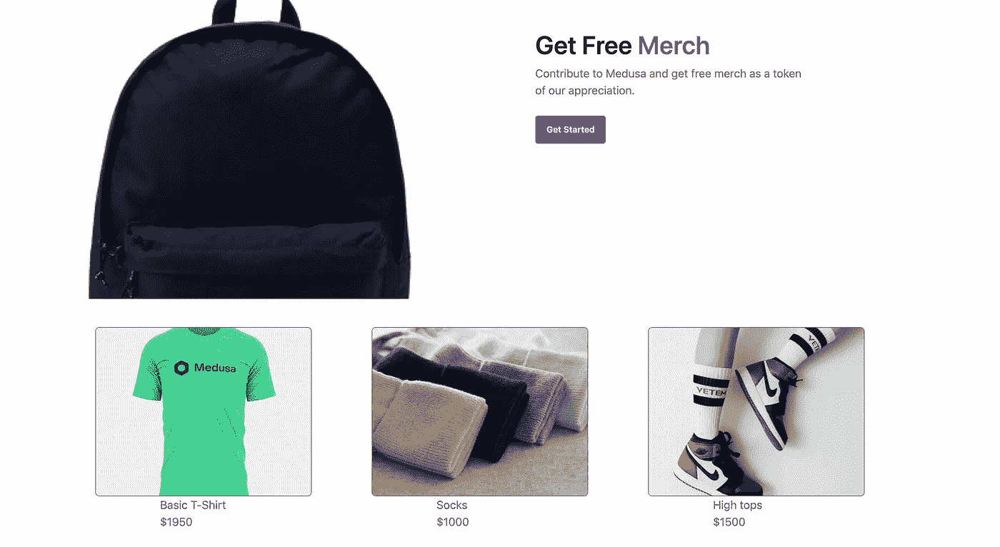

**创建单一产品视图**最后一步是创建单一产品视图，11ty 提供了一个分页变量，允许我们从单个模板创建多个文件。在 src 文件夹中创建一个名为 product.md 的新文件，将以下代码示例添加到 **src/product.md** 文件中。

```
---
    layout: layout.njk
    pagination:
      data: products
      size: 1
      alias: product
    permalink: "/{{ product.handle }}.html"
    title: { { product.title } }
    ---

    <div
      class="
        mt-6
        max-w-2xl
        mx-auto
        sm:px-6
        lg:max-w-7xl lg:px-8 lg:grid lg:grid-cols-3 lg:gap-x-8
      "
    >
      <div class="hidden aspect-w-3 aspect-h-4 rounded-lg overflow-hidden lg:block">
        
      </div>
      <div class="hidden lg:grid lg:grid-cols-1 lg:gap-y-8">
        <div class="aspect-w-3 aspect-h-2 rounded-lg overflow-hidden">
          
        </div>
        <div class="aspect-w-3 aspect-h-2 rounded-lg overflow-hidden">
          
        </div>
      </div>
      <div class="hidden lg:grid lg:grid-cols-1 lg:gap-y-8">
        <div
          class="
            aspect-w-4 aspect-h-2
            sm:rounded-lg sm:overflow-hidden
            lg:aspect-w-3 lg:aspect-h-4
          "
        >
          
        </div>
        <div
          class="
            aspect-w-4 aspect-h-2
            sm:rounded-lg sm:overflow-hidden
            lg:aspect-w-3 lg:aspect-h-4
          "
        >
          
        </div>
      </div>
    </div>
    <div
      class="
        max-w-2xl
        mx-auto
        pt-10
        pb-16
        px-4
        sm:px-6
        lg:max-w-4xl
        lg:pt-16
        lg:pb-24
        lg:px-8
      "
    >
      <div
        class="mt-4 space-y-3 lg:mt-0"
      >
        <h1
          class="
            flex
            justify-center
            mb-5
            text-2xl
            font-extrabold
            tracking-tight
            text-gray-900
            sm:text-3xl
          "
        >
          {{ product.title }}
        </h1>
        <div class="space-y-6">
          <p class="flex justify-center text-gray-900">{{ product.description }}</p>
          <div class="flex justify-center">
            <p class="text-sm font-bold text-gray-900">Product collection -</p>
            <p class="text-sm font-bold text-indigo-700">{{ product.collection.title }}</p>
          </div>
          <div class="flex justify-center">
            <p class="text-sm font-bold text-gray-900">Price -</p>
            <p class="text-sm font-bold text-indigo-700">${{ product.variants.0.prices.0.amount }}</p>
          </div>
         </div>
        <form>
          <div class="flex justify-center space-x-3 mb-5">
            <h1 class=" flex justify-center text-lg font-bold tracking-tight text-gray-900">Quantity -</h1>
            <input type="number" name="quantity" value="1" min="0" max="10" class="flex border-2 rounded-md text-blue-900 px-1 py-1 border-indigo-700" />
          </div>
          <h1 class=" flex justify-center mb-5 text-lg font-bold tracking-tight text-gray-900">Variants</h1>
          <div class="flex mt-2 max-w-xl mx-auto">
          
            <label for="{{ variant.id }}">
              {{ variant.title }}
              <span></span>
            </label>
            <input id="{{ variant.id }}" name="{{ variantId }}" type="radio" value="{{ variant.id }}" class="flex border -ml-24 mt-2 text-blue-900 border-indigo-700 w-full">
          
          </div>
          <button
            type="submit"
            class="
              mt-10
              w-full
              bg-blue-900
              border border-transparent
              rounded-md
              py-3
              px-8
              flex
              items-center
              justify-center
              text-base
              font-medium
              text-white
              hover:bg-indigo-700
              focus:outline-none
              focus:ring-2
              focus:ring-offset-2
              focus:ring-indigo-500
            "
          >
            Add to cart
          </button>
        </form>
      </div>
    </div>
```

在这段代码中，我们简单地遍历了产品数据，并为每个产品创建了一个页面。到产品的链接也是使用 permalink 变量通过句柄生成的。要访问产品页面，只需在您的主页上单击产品，您应该会看到如下页面:

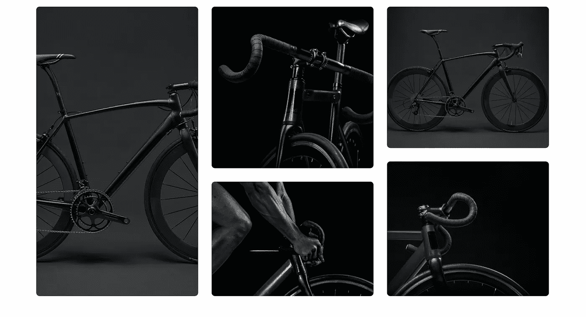

# 结论

在本教程中，我们用 Medusa 和 11ty 创建了一个店面。您可以在这个 GitHub 资源库—[https://github.com/Quadrisheriff/medusa-storefront](https://github.com/Quadrisheriff/medusa-storefront)中访问该项目的代码

想了解更多关于美杜莎的信息，请访问他们的[文档](https://docs.medusajs.com/)或保持更新他们的[不和](https://discord.gg/F87eGuwkTp)，那里的社区随时准备支持你。

有关 11ty 的信息，请访问他们的[网页](https://www.11ty.dev/)或在他们的[不和](https://discord.com/invite/GBkBy9u)中获得帮助。

*更多内容看* [***说白了。报名参加我们的***](http://plainenglish.io/) **[***免费周报***](http://newsletter.plainenglish.io/) *。在我们的* [***社区不和谐***](https://discord.gg/GtDtUAvyhW) *获得独家获取写作机会和建议。***