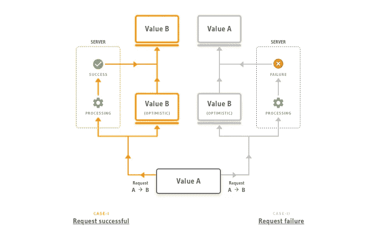

# 乐观的用户界面以及它如何让网络感觉更快

> 原文：<https://javascript.plainenglish.io/optimistic-ui-and-how-it-makes-the-web-feel-faster-8cfccd8402a0?source=collection_archive---------1----------------------->

## 乐观的用户界面，卓越的心理设计模式，让网页感觉稍微快一点

乐观 UI 是一种非常有趣的设计模式，在整个 web 中使用。这是一个独特的方法，使界面比以往任何时候都更快。在本文中，您将发现乐观 UI 是什么，一些常见的陷阱，以及世界各地已经实现它的例子。

Photo by [David Pupaza](https://unsplash.com/@dav420?utm_source=medium&utm_medium=referral) on [Unsplash](https://unsplash.com?utm_source=medium&utm_medium=referral)

# 这个概念

乐观 UI 是一个非常简单的模式，但是在大多数场景中实现起来感觉很落后。当以传统的方式创建软件时，我们发送一个需要处理的请求，当我们确定所述请求已经被处理时，等待向我们的用户显示结果。当使用乐观设计模式时，我们甚至在请求完成处理之前就显示出预期的结果。

[Image explaining optimistic UI from Hasura.io](https://hasura.io/blog/optimistic-ui-and-clobbering/)

可以使用这种方法的一个例子是一些琐碎的、不重要的东西，比如 like-button。当用户点击我们的 like 按钮时，我们会立即将其更改为活动状态。在幕后，我们将请求发送给服务器来处理。这意味着用户界面会立即更新，从而带来看似更快的体验。

对于我们的 like 按钮，如果服务器响应错误，我们可以很容易地恢复到活动状态。这里有一个合适的时机来指出乐观 UI 的一个危险。不要过度，尤其是那些容易失败的动作。

乐观的用户界面很容易让你的用户感到沮丧，因为他们的操作在失败时会被恢复。提供足够的背景说明他们的行动失败的原因对于防止这种情况的发生至关重要。

# 乐观 UI 的真实场景

这种模式已经在世界各地实施，但通常是以非常微妙的方式。在这一部分中，您可以找到一些积极使用该模式来增强用户体验的主要产品。

## Spotify

Spotify 应用充满了这种模式。喜欢歌曲和添加新的歌曲到您的播放列表。所有这些操作都直接显示在用户界面中，并在幕后为您处理。

Photo by [Alexander Shatov](https://unsplash.com/@alexbemore?utm_source=medium&utm_medium=referral) on [Unsplash](https://unsplash.com?utm_source=medium&utm_medium=referral)

## 照片墙

我们之前的 like-button 示例正在野外使用。除了喜欢，Instagram 上的评论区也是用这个图案设计的。

Photo by [Alexander Shatov](https://unsplash.com/@alexbemore?utm_source=medium&utm_medium=referral) on [Unsplash](https://unsplash.com?utm_source=medium&utm_medium=referral)

## 谷歌地图

你注意过这个吗？你在公路上滑行，错过了出口。应用程序很可能需要一段时间才能注意到并更新您的路线。这是因为它已经实现了乐观 UI 模式，并希望您能正确退出！

Photo by [Rajeshwar Bachu](https://unsplash.com/@rajeshwerbatchu7?utm_source=medium&utm_medium=referral) on [Unsplash](https://unsplash.com?utm_source=medium&utm_medium=referral)

# 乐观用户界面的陷阱

像大多数模式一样，乐观 UI 也有缺陷。这里可以找到一些你应该做出决定的因素。

Photo by [Goh Rhy Yan](https://unsplash.com/@gohrhyyan?utm_source=medium&utm_medium=referral) on [Unsplash](https://unsplash.com?utm_source=medium&utm_medium=referral)

## 语境

如前所述，提供上下文对用户来说至关重要。尤其是当他们的操作失败并返回错误时。没有任何消息就恢复到原来的状态，必然会造成挫败感。向用户显示描述性的错误消息在任何应用程序中都是非常重要的，但也是乐观 UI 不可或缺的一部分。

## 纯粹心理上的

乐观的 UI 不应该是解决性能问题的简单方法。这仅仅是心理上的改善，不会让事情变得更快。如果您的基础设施中仍有需要改进的地方，那么这意味着乐观的设计模式不应该出现在您的待办事项列表中！

# 是给你的吗？

决定实现乐观 UI 应该是一个经过深思熟虑的决定。做错了会产生新的挫败感，这是我们极力避免的。如果你小心翼翼地破坏了你的研究，并且有一个很好的模式用例，那么我只能敦促你添加它！

*更多内容请看*[***plain English . io***](https://plainenglish.io/)*。报名参加我们的* [***免费周报***](http://newsletter.plainenglish.io/) *。关注我们关于*[***Twitter***](https://twitter.com/inPlainEngHQ)[***LinkedIn***](https://www.linkedin.com/company/inplainenglish/)*[***YouTube***](https://www.youtube.com/channel/UCtipWUghju290NWcn8jhyAw)*[***不和***](https://discord.gg/GtDtUAvyhW) *。对增长黑客感兴趣？检查* [***电路***](https://circuit.ooo/) *。***