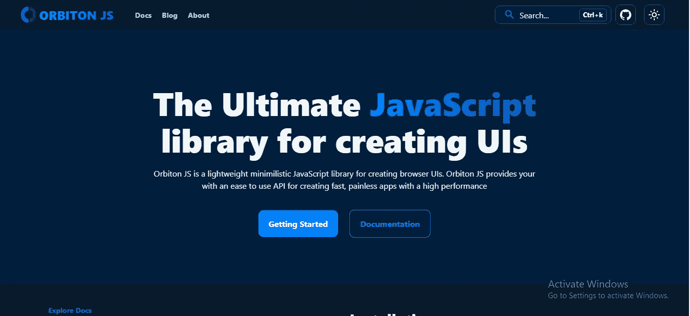

# 认识 Orbiton JS:构建 ui 的终极 JavaScript 库

> 原文：<https://javascript.plainenglish.io/orbiton-js-the-ultimate-javascript-library-for-building-uis-9e91f6953adb?source=collection_archive---------1----------------------->

## 探索 Orbiton JS 的特性，这是一个用于创建浏览器 ui 的轻量级极简 JavaScript 库。

我最近编写了一个新的 JavaScript 框架来创建前端应用程序。 [Orbiton JS](https://orbiton.js.org) 是一个刚出现不到一年的 JavaScript 库。据其 [GitHub repo](https://github.com/orbitonjs/orbiton) 称，该项目于 2021 年底开始，但在其生命的几个月内已经取得了巨大的发展。

这个库利用了 JavaScript 世界的最新趋势，为 JavaScript 的 web 开发带来了全新的面貌。老实说，这个库还很年轻，还没有发展成为一个产品化的库，但是根据它的发展速度，如果它在庆祝它的第一个生日之前就崩溃了，也不会感到惊讶。

我可能不是 JavaScript 开发方面的专家，但我认为我们都应该为这样一个年轻的新星库做出贡献，甚至只是支持它以使它进步。

不管怎样，让我们来看看这个框架中的哪些特性吸引了我的眼球。

根据框架的架构，很明显，库的作者试图让它尽可能靠近穹顶，使它更快，性能更高。我实际上想要一些证明，所以我决定在我最好的一些框架和 Orbiton JS 中构建一个最小的应用程序。我在 React、Vue.js 和 Svelte 中构建了它们。我没有使用 SSR，因为我想在浏览器中测试每个的性能。我使用 lighthouse 运行性能测试。

根据结果，我得到了苗条首先是由[轨道](https://orbiton.js.org)然后 Vue.js 和最后反应。这些是平均结果，因为有时结果会发生变化。

Orbiton JS 还使用 JavaScript 生态系统中已经存在的工具来简化从其他框架的转换。

*   根据这个[博客](https://orbiton.js.org/docs/how-to-guides/jsx-in-orbiton)，它使用 JSX 作为默认的模板语法。
*   它也有巴别塔和 SWC 插件，将 JSX 转换成有效的 JavaScript。所以你可以使用任何你想要的工具。

这个库有一个主要的缺点，那就是它利用了虚拟 Dom。这个库的作者试图保留它，因为他们想让 Orbiton 在任何规模的应用程序中都是可移植的。所以他们阻止自己在一个编译好的库上制作 Orbiton。

这个博客可能很小，但是如果你想了解更多关于 Orbiton JS 的信息，你可以访问它的官方文档，甚至让我们在 T2 Github 上给它一颗星，甚至为它的发展做出贡献，来支持这个年轻的项目。

*更多内容看* [***说白了就是***](https://plainenglish.io/) *。报名参加我们的* [***免费周报***](http://newsletter.plainenglish.io/) *。关注我们关于*[***Twitter***](https://twitter.com/inPlainEngHQ)*和*[***LinkedIn***](https://www.linkedin.com/company/inplainenglish/)*。加入我们的* [***社区***](https://discord.gg/GtDtUAvyhW) *。*