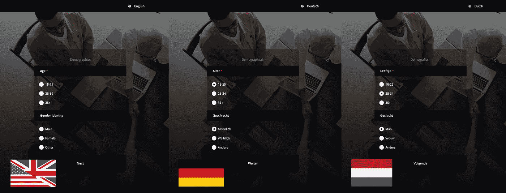

# 使用 SurveyJS 通过 Easy i18n 克服调查中的语言障碍

> 原文：<https://javascript.plainenglish.io/overcome-the-language-barrier-in-your-surveys-with-easy-i18n-using-surveyjs-228cd4248126?source=collection_archive---------13----------------------->

## 了解如何使用 SurveyJS + React 构建一个完全国际化、本地化的调查，而无需使用任何 i18n 库。



A look at the finished product; with three locale options provided. [Background image](https://www.pexels.com/photo/photo-of-people-doing-handshakes-3183197/) by Fauxels @ Pexels.

在全球范围内提供您的调查，适当地本地化，可能是您和数百万潜在收入之间的障碍。毕竟，你的样本规模越大，你的调查就越有效——这就是为什么国际化(*又名* i18n)是至关重要的。

[i18n](https://www.w3.org/International/questions/qa-i18n)——其中 18 代表单词*国际化*中第一个 *i* 和最后一个 *n* 之间的字母数——是从头开始设计调查以支持不同国家和地区的过程，确保它们**准备好**用于国际发布，不需要补丁或临时拼凑的功能。

[SurveyJS](https://surveyjs.io/?utm_source=medium&utm_medium=referral&utm_campaign=JS_in_Plain_English_6) 是一个免费的开源(在 MIT 许可下)JavaScript 库，它可以让你做到这一点——使用各种前端技术设计动态的、数据驱动的、多语言的调查。它附带了一个精简的、可扩展的国际化+本地化解决方案，不需要单独的 i18n 库或定制代码。

让我们建立一个自己的多语言调查，看看这有多简单。

# 游戏计划

Try out the finished survey here if you’d like. It’s a short example that can be expanded, and used to gauge how collaboration is valued within your organization.

SurveyJS 通过两步流程简化了我们的国际化和本地化流程:

1.  第一个是基于选择的语言环境自动翻译 UI 元素。这只是一个变量，可以从回答者的系统区域设置中提取(并且**不**与地理定位相同)，或者在你的应用程序的用户界面中手动设置。翻译后的字符串以[字典文件](https://github.com/surveyjs/survey-library/tree/master/src/localization)的形式发布，来源于社区，支持 30 多种语言，如果需要可以被覆盖。

您可以像这样在 JavaScript 中手动设置区域设置(如果您设计的应用程序支持通过 UI 更改语言，这就是您应该做的)。

```
survey.locale = “fr”;
```

或者在 JSON 模式中作为默认值。

```
“locale”: “fr”
```

2.第二阶段是手动翻译调查内容(任何不属于股票用户界面的内容。换句话说，这是你的实际调查)——问题、选择、标题、描述等。—由于 SurveyJS 的数据驱动方法而得以简化。调查被定义为用 JSON 编写的数据模型(模式),它位于与应用程序其余部分的 JavaScript 和 CSS 不同的层上。

在这个 JSON 模式中，使用嵌套键来表示每个字符串的名称空间/区域，每个值都是问题/选择/标题/描述的实际翻译字符串。这是许多 JavaScript 本地化库使用的常见模式(例如:i18 next)——只是，在这里除了 SurveyJS 本身，你不需要任何东西。

```
const surveyJson = { “elements”: [{ “type”: “text”, “name”: “firstname” “title”: { “default”: “Enter your first name”, “de”: “Geben Sie Ihren Vornamen ein”, “fr”: “Entrez votre prénom” } }]};
```

使用这种设计模式，您的开发团队可以用他们的母语编写所有的字符串作为默认语言，然后将 JSON 发送给您的本地化团队，本地化团队将发送回相同的 JSON 调查模式，编辑后包括其他语言的翻译字符串。

# 代码

在这个例子中，我们将使用 React，但是 SurveyJS 作为组件库提供给 [React](https://www.npmjs.com/package/survey-react-ui) 、 [Angular](https://www.npmjs.com/package/survey-angular) 、 [Vue.js](https://www.npmjs.com/package/survey-vue-ui) 、 [Knockout](https://surveyjs.io/Documentation/Library?id=get-started-knockout&utm_source=medium&utm_medium=referral&utm_campaign=JS_in_Plain_English_6) ，当然还有 [jQuery](https://surveyjs.io/Documentation/Library?id=get-started-jquery&utm_source=medium&utm_medium=referral&utm_campaign=JS_in_Plain_English_6) ，所以您已经基本了解了。

首先是 JSON 模式。

在调查模型中，您可以看到我们刚刚讨论过的模式。问题和页面标题/描述是一个包含每个区域设置的键值对的对象，所有可能的选择也是如此——但是每个都有一个**单一返回值，该值只在您的开发团队使用的本地语言中出现，并且它是以编程方式使用的值。**

```
{ value: “male”, text: { “default”: “Male”, “de”: “Männlich”, “nl”: “Man” },}
```

一个可能的选择可以有不同的字符串，每个区域设置一个，但只有一个单一的值被传回并在应用程序的逻辑中使用。

您还会注意到，您不必为每个可能的地区提供键-值对——`default`值将用于任何没有明确定义的地区字符串。

接下来是 JavaScript/React 代码。

Our React code is relatively simple. We did our heavy lifting in the survey definition itself.

首先，确保导入 SurveyJS 本地化模块，或者作为 HTML 的`<head>`标签中的`<script>`，或者作为呈现调查的组件中的导入。

`<script src=”[https://unpkg.com/survey-core/survey.i18n.min.js](https://unpkg.com/survey-core/survey.i18n.min.js)"></script>`

`import “survey-core/survey.i18n”;`

在这个例子中，我们将只支持 3 种语言，作为道具传递，可以通过下拉菜单选择。`Dropdown`是一个相当简单的 React 组件。

Remember: values flow down the component tree, and events propagate up to parents.

您唯一需要警惕的是，您不希望在呈现您的调查的组件(这里是 App)中将 locale 设置为状态变量。每当通过下拉菜单选择一种新语言时，这将强制重新呈现整个调查，重置它并丢失所有进度。

请将它放在`Dropdown`组件中，因为无论何时我们使用它来更改语言，您都*希望*用当前选择重新呈现它。

至于`App`，你可以有一个函数来改变区域设置(这个函数使用`surveyjs.setLocale = newLocale`来设置区域设置)，把它传递给`Dropdown`，后者将在自己的`onChange`事件上调用它。双赢的局面。

最后，CSS 超出了本文的范围，但是如果您想要一些灵感，这里就有。

The design pattern here is to define custom CSS classes as overrides for SurveyJS UI elements in JavaScript, then code those classes in CSS.

检查[这里的](https://www.surveyjs.io/Examples/Library/?id=survey-customcss&platform=jQuery&utm_source=medium&utm_medium=referral&utm_campaign=JS_in_Plain_English_6#content-docs)以获得您可以覆盖的 SurveyJS CSS 类和属性的列表。

# 所有这些，还有自由软件！

使用 SurveyJS，我们不需要定制的 JavaScript 代码来构建和适当地国际化/本地化这个调查，也不需要使用任何专门的 i18n/l10n 库。事实上，我们唯一使用的库——survey js 本身——是免费的、开源的、自托管的，非常适合在任何平台上发布多个分散的本地化调查。

能用母语阅读问题的受访者越多，你的回答率就越高。对产品的控制越多，在应对不同文化、货币和监管/税收制度时就越灵活。因此，使用 SurveyJS 来**简化您的调查代码的创建和维护**在这个极其快速的实现和周转时间至关重要的行业中是很有意义的。

使用这种模式，您的开发团队可以专注于只使用一种语言的应用程序代码/业务逻辑，将样板文件传递给您的本地化团队，他们只需要编辑翻译后的字符串，并将 JSON 模式发送回来，就可以使用了。

*更多内容请看*[***plain English . io***](https://plainenglish.io/)*。报名参加我们的* [***免费周报***](http://newsletter.plainenglish.io/) *。关注我们关于*[***Twitter***](https://twitter.com/inPlainEngHQ)[***LinkedIn***](https://www.linkedin.com/company/inplainenglish/)*，以及* [***不和***](https://discord.gg/GtDtUAvyhW) *。*