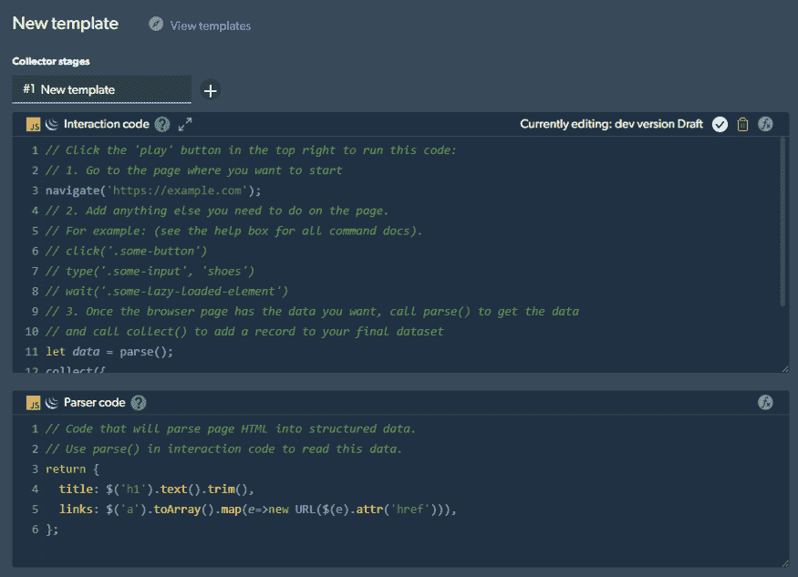

# 克服开发者面临的 3 大网络抓取挑战

> 原文：<https://javascript.plainenglish.io/overcoming-3-major-web-scraping-challenges-that-developers-face-1e664ffe4783?source=collection_archive---------9----------------------->

## 如何通过 Bright Data 的 web Scraper IDE 克服开发人员面临的 3 个主要 Web 抓取限制—动态网站、网站交互和指纹管理。


Photo by [Elisa Ventur](https://unsplash.com/@elisa_ventur?utm_source=unsplash&utm_medium=referral&utm_content=creditCopyText) on [Unsplash](https://unsplash.com/s/photos/laptop-sad?utm_source=unsplash&utm_medium=referral&utm_content=creditCopyText)

当抓取网站时，许多令人不快的问题可能会出现，扰乱我们的应用程序需要如何工作。在我们的应用程序进入部署状态之前，注意并处理这些问题是至关重要的。解决这些问题可以防止开发后状态中的突发错误，并增强您的开发人员体验。

在这份综合指南中，我们将重点介绍如何借助[亮数据](https://brightdata.grsm.io/bright-data-5-001)解决开发者在抓取网站时面临的三个最常见的挑战。通过其强大的 Web Scraper IDE，我们可以绕过与 Web 抓取相关的常见障碍。

事不宜迟，我们来看三大难点。

# 1.动态网站

首先，让我们解决动态网站的问题，以及它们如何对抓取过程产生负面影响。当我们通常抓取静态网站时，我们的日志中不会显示错误，这是因为当用户进入静态网站时，静态网站已经加载了它们的内容。

但是动态网站却不是这样，这个就是问题所在。动态网站是用代码构建的，一旦页面加载到浏览器上，这些代码就会呈现出来。因此，在加载页面之前，要抓取的内容是不存在的。这类网站从数据库或其他外部来源检索数据。

这使我们的数据收集工作变得复杂，这对开发人员理解这一点至关重要。但是不要担心，我们有办法解决这个问题。这正是光明数据的用武之地。 [Bright Data](https://brightdata.grsm.io/bright-data-5-002) 使用无头网络驱动程序从网站上抓取数据，然后以面向对象的格式返回。

无头 web 驱动程序使用一种技术，允许我们模拟用户进入的网站。这意味着我们可以等到页面上的某些元素被完全加载，然后抓取它们的内容，类似于真实用户等待查看信息。我们可以在我们的 Web Scraper IDE 中使用一个预构建的命令`wait()`,它将等待一个元素在页面上可见，并将选择器作为参数。

```
wait(‘#element’);
```

# 2.与网站互动

在从网站上抓取实际信息之前，需要与网站进行交互，这也可能导致潜在的问题。例如，这种形式的交互可以是填写搜索输入、点击某些按钮或按下按键和快捷键。

简单来说，每当必须与网站的内容进行交互时，我们需要一种方法来实现这一点，以便成功地抓取网站。如前所述，Bright Data 使用无头网络驱动程序来模拟网站及其流量，这现在也派上了用场。Web 驱动程序还让我们以编程方式与网站内容进行交互，而无需实际接触网站。


亮数据支持我们在这种情况下交互时可能需要的所有命令。假设你已经注册了 Bright Data，那么首先，我们需要登录，然后继续进入这个[页面](https://brightdata.grsm.io/bright-data-5-003)。在那里，我们将开发一个自我管理的收集器，并单击**“从头开始”**。现在，我们将看到一个通过交互和解析器代码管理收集器的地方。



页面的交互代码部分是收集者听取导航指令、输入文本、点击事物和返回收集的数据的地方。当输入带有两个参数的`type()`命令时——一个选择器和一个文本，采集器将在某个输入中输入一个文本。

```
type(‘#input’, ‘Sample search text’);
```

接下来，我们有由`click()`、`right_click()`和`hover()`命令组成的鼠标事件，这些命令将一个选择器作为参数，并如其名称所示执行动作。我们要讨论的最后一个命令是`press_key()`,它将我们要按的键作为参数。这些名称是长格式的，例如，'**回车**或'**退格**'。

```
click(‘#button’);
press_key(‘Enter’);
```

当我们完成为数据收集器生成代码之后，我们可以转到解析器代码。这将选择我们想要抓取的实际元素，并再次将它们的值返回给交互代码。从那里，我们可以收集作为参数传递给`collect()`函数的对象中的数据。

在这些代码编辑器旁边，我们有一个预览窗口，它将使用无头驱动程序运行模拟，并返回解析器代码中预定义的数据。要运行模拟，请按窗口左上角的播放按钮。


# 3.网站阻止(指纹管理)

我们要解决的最后一个障碍是，当网站阻止我们访问或收集公开可用数据时。这是通过一个名为**设备指纹**的过程完成的，该过程涉及收集相关信息，如用户访问网站时的浏览器参数、IP 地址、行为模式、硬件等。

通常，收集此类数据是为了判断是否有特定用户正在浏览网站；但它也可以用来区分真正的人和机器人或网络爬虫，并限制对后者的访问。

掌握指纹识别的艺术很可能是解除封锁的关键因素，因为它解决了核心问题，而不仅仅是症状，如重新捕获。

让我们来看几个与指纹相关的封锁实例以及如何克服它们。

## 3.1.标头和 HTTP/TLS 协议级块

一个主要的指纹配置是使用**头**，软件开发人员试图通过这个配置来阻止网络运行。

当我们发送一个请求时，我们的 scraper 代码可能不总是以正确的顺序发送标题，以成功地模仿浏览器的真实请求。网站可以将从当前请求中检索到的数据与早期会话中的浏览器标题字段(如标题大小写和顺序、TLS 和 HTTP 协议的版本)进行比较，如果存在不匹配，这可以揭示该请求不是由普通用户发出的，而是由网络爬虫发出的。

为了解决这个问题，您必须确保标题和大小写值与预期的浏览器相匹配。幸运的是，Bright Data 的 Web Scraper IDE 使用了[解锁器基础设施](https://brightdata.grsm.io/bright-data-5-005)，它带有一个不断增长的针对特定网站的标题请求库。它会根据目标网站的要求自动配置用户代理和其他标头，这样您就可以避免被检测到并被阻止为“爬虫”。


此外，unlocker 基础设施允许您轻松升级 HTTP 协议，并轮换 TLS/SSL 指纹，以便使请求与浏览器头的协议版本相匹配，并且您的请求看起来是真实的。它可以在解码(收到请求时)和编码(发送响应时)过程中有效地处理 HTTP 头管理。

## 3.2.浏览器级块

浏览器指纹是网站使用的一种技术，用于根据用户 web 浏览器的独特配置来识别和跟踪个人用户。这可能包括浏览器版本、操作系统、屏幕分辨率、安装的插件和其他详细信息。如果你的 scraper 发送的请求不能模拟这个信息，它会再次被目标站点拦截。

Bright Data 的 Web Scraper IDE 的解锁器基础架构通过对[浏览器指纹](https://brightdata.grsm.io/bright-data-5-006)信息的近乎完美的模拟，轻松解决了这一问题，这些信息包括**插件、字体、浏览器版本、cookies、HTML5 canvas 元素或 WebGL 指纹、Web 音频 API 指纹、操作系统、屏幕分辨率**等。Web Unlocker 可以模仿连接到任何给定系统的所有设备，包括它们对应的驱动、鼠标移动、屏幕分辨率以及其他设备属性，实现**全设备枚举模仿。**

## 3.3.地理位置块

再来看另一个主要障碍，网站可以根据你的 IP 指纹来设置地理位置屏蔽。一些网站将访问完全限制在特定的地理位置。其他人根据位置自定义和限制内容，从而限制您可以访问的数据。然而，在其他情况下，你可能需要你的抓取服务无法访问的特定区域的数据，因为根据你使用的代理网络的类型，复杂的网站可以很容易地检测到你并阻止你访问这些数据。

不用说，代理在绕过地理位置封锁方面很有用。但是如前所述，*并不是所有类型的代理都适用于每种场景或每种网站*。这也是 Bright Data 的 Web Scraper IDE 大放异彩的地方，它提供了四种不同类型的代理服务，几乎涵盖了所有可能的用例。这些类型包括:

住宅代理

数据中心代理

ISP 代理

移动代理


虽然数据中心代理是从最简单的目标站点获取数据的非常快速且经济高效的解决方案，但对于复杂的站点，它可能会遇到麻烦。与此同时，ISP 代理可以让你被目标网站当作一个真实的个体来对待，包括查看内容、执行广告验证等附加好处，以及根据特定国家和城市收集数据。住宅和移动代理也有其特定的使用案例和理想场景。

同样，您可以选择最适合您的抓取需求的代理服务。

## 3.4.限速的

最后，一种防止爬虫抓取网站的常见做法叫做**限速**。当你的设备流量异常时(这通常发生在抓取网站时)，目标网站可以限制一个 IP 在给定时间内发出的请求数量。

为了绕过速率限制，开发人员可以利用代理，并确保在一定数量的请求后发生 IP 轮换，这很容易通过 Bright Data 的 unlocker 基础设施来实现，该基础设施可以自动进行 IP 地址轮换。


总而言之，为 Bright Data 的 Web Scraper IDE 提供动力的 [unlocker 基础设施](https://brightdata.grsm.io/bright-data-5-008)是一个强大的解除阻塞工具，无论目标站点出现什么问题，无论是目标站点根据大量请求将活动分类为“可疑”,还是根据位置拒绝请求或识别不可接受的头参数，都可以实时分析这个问题，在每个域的基础上重新调整设置，并确保用户获得最佳成功率。

# 结论

如今，Web 抓取对于收集数据和执行数据分析是不可或缺的。开发人员必须了解抓取软件可能面临的限制，以及除非在我们的应用程序进入生产模式之前得到解决，否则这些看似微小的障碍可能会成为重大问题。

Bright Data 的 [Web Scraper IDE](https://brightdata.grsm.io/bright-data-5-002) 可以在这些挑战滚雪球成为开发后状态中的主要问题之前，有效地克服它们。

在这篇文章中，我们讨论了全世界开发者面临的最常见的 web 抓取挑战以及他们的解决方案。如需任何帮助，请随时查阅这篇文章，并查看光明数据的[网站](https://brightdata.grsm.io/bright-data-5-001)以了解更多信息。

*更多内容请看*[***plain English . io***](https://plainenglish.io/)*。报名参加我们的* [***免费周报***](http://newsletter.plainenglish.io/) *。关注我们关于*[***Twitter***](https://twitter.com/inPlainEngHQ)[***LinkedIn***](https://www.linkedin.com/company/inplainenglish/)*[***YouTube***](https://www.youtube.com/channel/UCtipWUghju290NWcn8jhyAw)***，以及****[***不和***](https://discord.gg/GtDtUAvyhW) *对成长黑客感兴趣？检查* [***电路***](https://circuit.ooo/) ***。*****