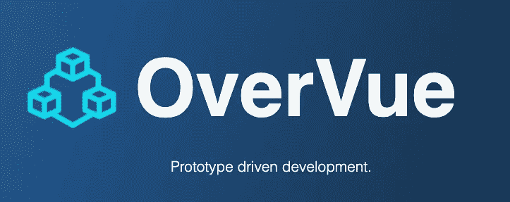
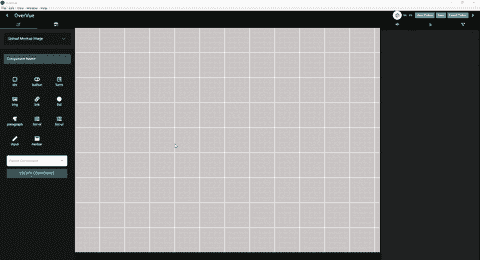
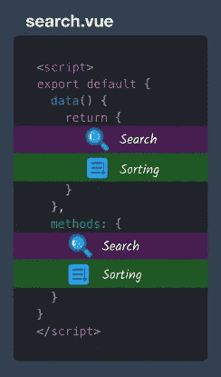
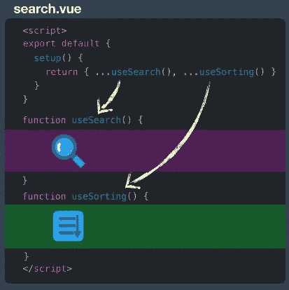
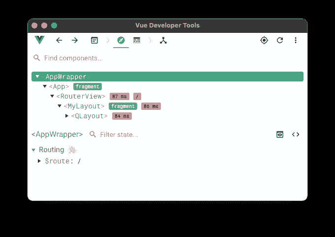

# OverVue 5.0:快速开始使用 Vue 3

> 原文：<https://javascript.plainenglish.io/overvue-5-0-get-started-with-vue-3-fast-873d8c3dcfa5?source=collection_archive---------4----------------------->

## 快速实现 Vue 3 创意的原型工具



**over value**是一款 Vue 原型工具，最初于 2019 年推出。它可以让工程师快速方便地起草原型和导出样板代码，以便在他们喜欢的 IDE 中使用。从那时起，OverVue 已经经历了四次迭代，并在整个前端开发人员社区中使用，截至本文撰写之时，已经在 GitHub 上获得了超过 2，100 颗星。然而，它的底层依赖关系已经过时并停留在过去。为了保持 OverVue 在开源世界的相关性，它需要一些重大升级，尤其是 Vue 3。



Vue 3 是该框架的最新主要迭代，于 2020 年 9 月正式推出。现在它变得越来越受欢迎，我们的团队看到了给 OverVue 一个彻底检查的绝佳机会。进入 OverVue 5.0:业界最流行的(现在也是最新的)开源 Vue 原型工具。

那么，Vue 3 有什么新功能？

# 组合 API

随着组件的增长，一个常见的问题是它们变得可读性更差，因此可维护性更差。为了解决这个问题，Vue 3 引入了 Composition API。目前，特性(或逻辑关注点)是由组件选项组织的。在下面的示例中，搜索和排序功能的逻辑位于数据对象和方法中。在较大的组件中，特性通常将相关代码分解成其他选项，如 props、computed 和 lifecycle methods。



Vue 2.x syntax ([source](https://www.youtube.com/watch?v=6HUjDKVn0e0))

使用组合 API，我们可以通过将搜索和排序代码放在一起，使组件更具可读性。这都是从**设置方法**开始的。在 Vue 3 中，你编写所谓的**组合函数**来保存每个特性的所有逻辑。然后从 setup 方法中调用它们，您将获得与 Vue 2.x 中相同的功能。



Vue 3.x Composition API syntax ([source](https://www.youtube.com/watch?v=6HUjDKVn0e0))

这只是组合 API 支持的众多新特性之一，更多信息可以在 [Vue 文档](https://v3.vuejs.org/guide/composition-api-introduction.html#why-composition-api)中找到。

# 本机类型脚本支持

尽管以前版本的 Vue 可以被修改以与 TypeScript 一起使用，但这种支持并不成熟，可能会导致许多问题。有了 Vue 3，TypeScript 被开箱即用地支持，并被视为一等公民。随着应用程序的增长，它们可以很容易地利用静态类型来防止运行时错误。

# <teleport>组件</teleport>

门户是 React 世界中众所周知的概念，该特性是在 Vue 3 的 beta 版本中以相同的名称创建的。发射时，名字改成了**瞬移**。当处理开发人员希望在当前层次结构中呈现的模态或其他条件组件时，transport 非常方便。在下面的示例中，当 modalOpen 的值为 true 时，PopUp 组件将在 id 为“teleport-target”的 div 中呈现。

```
*<!-- In some nested Vue component -->* 
<NestedComponent>
   <teleport to="#teleport-target">
    <div v-if="modalOpen">
     <PopUp />
    </div>
   </teleport>
 </NestedComponent> 
*<!-- before closing body tag in index.html -->* 
<div id="teleport-target"></div>
```

*代码片段来源:VueSchool*

# 碎片

由于 Vue 3 中的片段，模板现在可以有多个根组件。

**Vue 2.x**

```
<!-- Layout.vue -->
<template>
  <div>
    <header>...</header>
    <main>...</main>
    <footer>...</footer>
  </div>
</template>Native TypeScript Support
```

**Vue 3.x**

```
<!-- Layout.vue -->
<template>
  <header>...</header>
  <main v-bind="$attrs">...</main>
  <footer>...</footer>
</template>
```

# OverVue 5.0 中的其他更新

**Vue 开发工具 6.0**

Vue Devtools 已经升级到 6.0 版，并且利用了 Quasar 框架，现在当应用程序在开发模式下运行时会自动启动。下面的远程 devtool 窗口将立即打开并连接到应用程序实例，以便于调试！



Vue Devtools 6.0

**依赖关系**

该团队借此机会还升级了以下主要依赖项，确保 OverVue 与最新技术的持续兼容性。

*   类星体 1.0 到类星体 2.4.2
*   Vuex 3 至 Vuex 4.0.2
*   电子 5.0.13 至电子 16.0.4

# 后续步骤

现在，OverVue 已经升级到 Vue 3，它准备进行更多的迭代。我们希望看到一个 TypeScript 导出的选项，一个在 TypeScript 中重写的应用程序(包括 Vuex 迁移到 Pinia)，以及通过相关测试导出项目的能力。如果您想投稿，请访问下面的链接，并确保在 GitHub 上开始并分叉我们的资源库！

[网站](http://overvue.io)|[GitHub](https://github.com/open-source-labs/OverVue)|[LinkedIn](https://www.linkedin.com/company/overvue-5-0)

# 谢谢大家！

非常感谢来到我们面前的 OverVue 开发者: **Dean Ohashi、Dean Chung、Drew Nguyen、Joseph Eisele、Alexander Havas、Keriann Lin、Joju Alaode、Allison Pratt、Faraz Moallemi、Sean Grace、Terry Tilley、Nicholas Schillaci、Alex Lu、Jeffrey Sul、Kenneth Lee、Ryan Bender 和 Sonny Nguyen。**

## OverVue 5.0 团队:

**加布里埃拉·科克哈比—** [**领英**](https://www.linkedin.com/in/kokhabigabriella/)**/**[**GitHub**](https://github.com/gkokhabi)

**罗斯·拉默森—** [**领英**](https://www.linkedin.com/in/lamerson28/)**/**[**GitHub**](https://github.com/lamerson28)

**Shanon Lee—**[**LinkedIn**](https://www.linkedin.com/in/shanonlee541/)**/**[**GitHub**](https://github.com/shanon98lee/)

**Zoew McGrath—**[**LinkedIn**](https://www.linkedin.com/in/zoew-m/)**/**[**GitHub**](https://github.com/Z-McGrath)

*更多内容请看*[*plain English . io*](http://plainenglish.io/)*。报名参加我们的* [*免费每周简讯*](http://newsletter.plainenglish.io/) *。在我们的* [*社区*](https://discord.gg/GtDtUAvyhW) *获得独家写作机会和建议。*