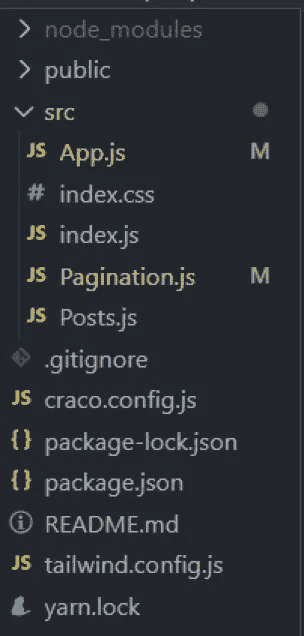
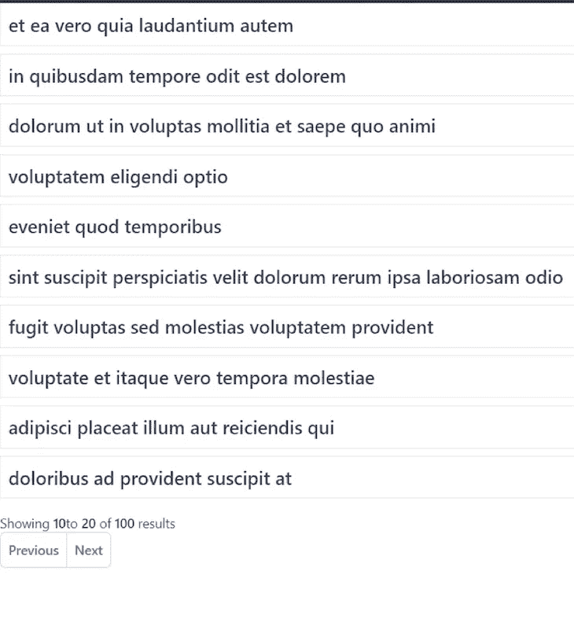
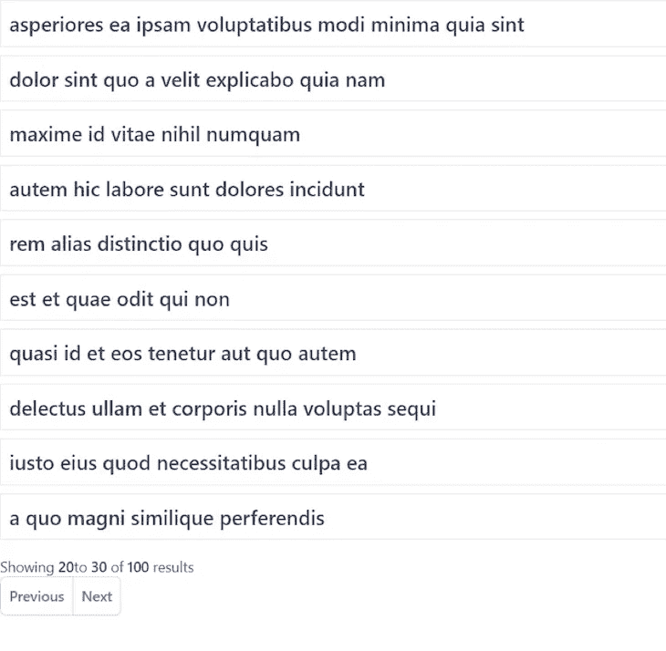
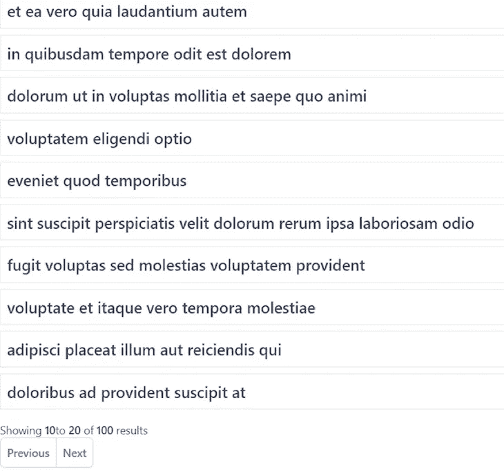
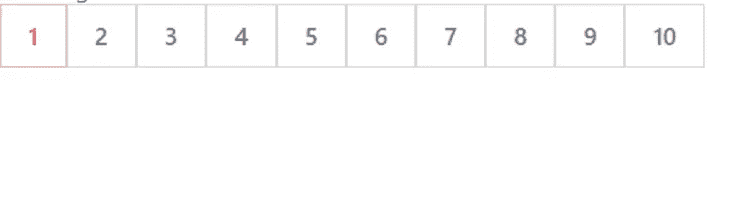
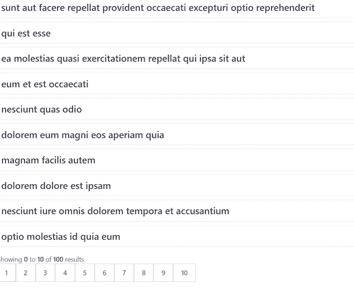
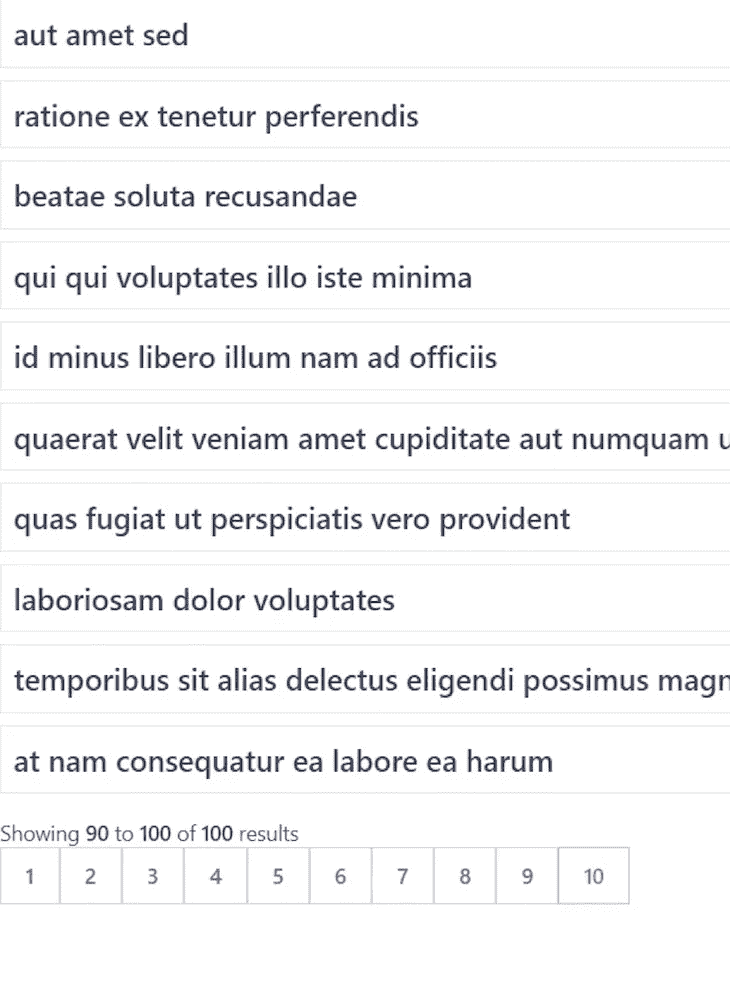

# 带有 React 和 Tailwind CSS 的分页组件

> 原文：<https://javascript.plainenglish.io/pagination-components-with-react-and-tailwind-css-c0acf945a396?source=collection_archive---------8----------------------->


Source: [https://ordinarycoders.com/](https://ordinarycoders.com/)

分页，也称为分页，将网页上的信息分成不同的页面，可以使用按钮或编号列表进行导航。分页可以改善你的网站的组织，有利于 UX，并最终提高整体排名。您可以向 web、桌面或移动应用程序添加分页，并在客户端或服务器端实现它。

在本教程中，我们将使用 React 和 Tailwind CSS 在客户端创建两种不同类型的分页组件。一个将使用按钮导航，一个将使用编号列表。我们开始吧！

# 在 React 项目中使用顺风 CSS

首先，通过运行以下命令，在您的本地计算机上建立一个新的 React 项目:

```
npx create-react-app my-app
cd my-app
```

接下来，我们将在目录中安装 Tailwind CSS 和其他一些依赖项:

```
npm install -D tailwindcss@npm:@tailwindcss/postcss7-compat postcss@^7 autoprefixer@^9
```

我们需要安装 Create React 应用程序，但是，它不能本地覆盖 PostCSS 配置。因此，我们将安装 CRACO，[CRA 的配置层](https://blog.logrocket.com/tailwind-css-configure-create-react-app/)，以及我们的`package.json`中的一些其他脚本:

```
npm install @craco/craco
```

项目的`scripts`部分应该类似于下面的代码块:

```
"scripts": {
    "start": "craco start",
    "build": "craco build",
    "test": "craco test",
    "eject": "react-scripts eject"
  },
```

现在，让我们创建一个名为`craco.config.js`的新文件，并添加 Tailwind CSS 和`autoprefixer`作为 PostCSS 插件:

```
module.exports = {
  style: {
    postcss: {
      plugins: [require("tailwindcss"), require("autoprefixer")],
    },
  },
};
```

接下来，我们将使用以下命令创建一个名为`tailwind.config.js`的文件:

```
npx tailwindcss-cli@latest init
```

要完成对 Tailwind CSS 的配置，请在您的`default index.css`文件中添加以下代码:

```
@tailwind base;
@tailwind components;
@tailwind utilities;
```

现在我们的项目已经完全设置好了，我们可以开始构建我们的分页组件了！

# 构建分页组件

我们的项目将遵循下图中的结构。让我们深入了解一下这些文件和文件夹:



`Pagination.js`将保存处理和显示分页组件的逻辑。这个文件夹中的代码对于两种类型的分页都是不同的，所以我们稍后再看一遍。

`Posts.js`是一个静态的`POST`元素，它将从 API 中获取随机数据。如下面的代码块所示，`Posts.js`的数据和结构对于两种类型的分页都是相同的:

```
import React from "react";const Posts = ({ posts, loading }) => {
  if (loading) {
    return <h2>Loading...</h2>;
  } return (
    <div>
      <ul>
        {posts.map((post) => (
          <li
            key={post.id}
            className='text-gray-700 font-semibold text-xl mb-2 border p-2'
          >
            {post.title}
          </li>
        ))}
      </ul>
    </div>
  );
};export default Posts;
```

# 使用导航按钮分页

我们将创建的第一种分页组件使用“下一页”和“上一页”按钮来浏览网页上的数据。我们的`App.js`文件将类似于下面的代码块:

```
import React, { useState, useEffect } from "react";
import Posts from "./Posts";
import Pagination from "./Pagination";
import axios from "axios";const App = () => {
  const [posts, setPosts] = useState([]);
  const [loading, setLoading] = useState(false);
  const [currentPage, setCurrentPage] = useState(1);
  const [postsPerPage] = useState(10); useEffect(() => {
    const fetchPosts = async () => {
      setLoading(true);
      const res = await axios.get("https://jsonplaceholder.typicode.com/posts");
      setPosts(res.data);
      setLoading(false);
    }; fetchPosts();
  }, []); // Get current posts
  const indexOfLastPost = currentPage * postsPerPage;
  const indexOfFirstPost = indexOfLastPost - postsPerPage;
  const currentPosts = posts.slice(indexOfFirstPost, indexOfLastPost); // Change page
  const paginateFront = () => setCurrentPage(currentPage + 1);
  const paginateBack = () => setCurrentPage(currentPage - 1); return (
    <div>
      <Posts posts={currentPosts} />
      <Pagination
        postsPerPage={postsPerPage}
        totalPosts={posts.length}
        paginateBack={paginateBack}
        paginateFront={paginateFront}
        currentPage={currentPage}
      />
    </div>
  );
};export default App;
```

在我们的`App.js`文件中，`posts`中的数据来自后端。让我们回顾一下分页组件中使用这些数据的一些函数:

*   `currentPage`:向用户显示他们当前所在的页面
*   `postsPerPage`:每页显示的文章总数
*   `currentPosts`:当前页面的文章数组

为了得到`currentPosts`，我们需要将`indexOfFirstPost`和`indexOfLastPost`传递给`slice()`函数。

为了在页面之间来回移动，我们将使用`paginateFront`和`paginateBack`。这些函数简单地增加或减少`currentPage`，并且`currentPosts`作为结果被计算。

# `Pagination.js`文件

现在，让我们看看我们的`Pagination.js`文件:

```
import React from "react";export default function Pagination({
  postsPerPage,
  totalPosts,
  paginateFront,
  paginateBack,
  currentPage,
}) {
 return (
    <div className='py-2'>
      <div>
        <p className='text-sm text-gray-700'>
          Showing
          <span className='font-medium'>{currentPage * postsPerPage - 10}</span>
          to
          <span className='font-medium'> {currentPage * postsPerPage} </span>
          of
          <span className='font-medium'> {totalPosts} </span>
          results
        </p>
      </div>
      <nav className='block'></nav>
      <div>
        <nav
          className='relative z-0 inline-flex rounded-md shadow-sm -space-x-px'
          aria-label='Pagination'
        >
          <a
            onClick={() => {
              paginateBack();
            }}
            href='#'
            className='relative inline-flex items-center px-2 py-2 rounded-l-md border border-gray-300 bg-white text-sm font-medium text-gray-500 hover:bg-gray-50'
          >
            <span>Previous</span>
          </a> <a
            onClick={() => {
              paginateFront();
            }}
            href='#'
            className='relative inline-flex items-center px-2 py-2 rounded-r-md border border-gray-300 bg-white text-sm font-medium text-gray-500 hover:bg-gray-50'
          >
            <span>Next</span>
          </a>
        </nav>
      </div>
    </div>
  );
}
```

分页组件接受呈现页面当前信息的道具，而 Tailwind CSS 实用程序类消除了对外部 CSS 的需求。

当我们运行上面的代码时，我们将收到以下结果:



在上图中，我们的分页组件显示了 100 个结果中的 10 到 20 个。让我们点击下一个按钮，看看会发生什么:



现在，我们可以看到结果 20 到 30。当我们点击“上一步”按钮时，我们将返回结果 10 至 20:



# 使用编号列表分页

我们将构建的第二个分页组件使用一个编号列表进行导航，而不是使用 Next 和 Previous 按钮。我们必须对我们的`App.js`文件和发送到分页组件的属性做一些修改。

更新您的`App.js`文件，看起来像下面的代码块:

```
import React, { useState, useEffect } from "react";
import Posts from "./Posts";
import Pagination from "./Pagination";
import axios from "axios";const App = () => {
  const [posts, setPosts] = useState([]);
  const [loading, setLoading] = useState(false);
  const [currentPage, setCurrentPage] = useState(1);
  const [postsPerPage] = useState(10); useEffect(() => {
    const fetchPosts = async () => {
      setLoading(true);
      const res = await axios.get("https://jsonplaceholder.typicode.com/posts");
      setPosts(res.data);
      setLoading(false);
    }; fetchPosts();
  }, []); // Get current posts
  const indexOfLastPost = currentPage * postsPerPage;
  const indexOfFirstPost = indexOfLastPost - postsPerPage;
  const currentPosts = posts.slice(indexOfFirstPost, indexOfLastPost); // Change page
  const paginate = (pageNumber) => setCurrentPage(pageNumber);
  return (
    <div>
      <Posts posts={currentPosts} />
      <Pagination
        postsPerPage={postsPerPage}
        totalPosts={posts.length}
        paginate={paginate}
        currentPage={currentPage}
      />
    </div>
  );
};export default App;
```

现在，我们有了一个单独的分页函数，它只更新`currentPage`来设置`currentPosts`，而不是像之前的分页组件那样传递`indexOfFirstPost`和`indexOfLastPost`。

让我们看看使用编号列表的分页组件的代码:

```
import React from "react";export default function Pagination({
  postsPerPage,
  totalPosts,
  paginate,
  currentPage,
}) {
  const pageNumbers = []; for (let i = 1; i <= Math.ceil(totalPosts / postsPerPage); i++) {
    pageNumbers.push(i);
  } return (
    <div className='py-2'>
      <div>
        <p className='text-sm text-gray-700'>
          Showing
          <span className='font-medium'>
            {" "}
            {currentPage * postsPerPage - 10}{" "}
          </span>
          to
          <span className='font-medium'> {currentPage * postsPerPage} </span>
          of
          <span className='font-medium'> {totalPosts} </span>
          results
        </p>
      </div>
      <nav className='block'>
        <ul className='flex pl-0 rounded list-none flex-wrap'>
          <li>
            {pageNumbers.map((number) => (
              <a
                onClick={() => {
                  paginate(number);
                }}
                href='#'
                className={
                  currentPage === number
                    ? "bg-blue border-red-300 text-red-500 hover:bg-blue-200 relative inline-flex items-center px-4 py-2 border text-sm font-medium"
                    : "bg-white border-gray-300 text-gray-500 hover:bg-blue-200 relative inline-flex items-center px-4 py-2 border text-sm font-medium"
                }
              >
                {number}
              </a>
            ))}
          </li>
        </ul>
      </nav>
    </div>
  );
}
```

我们创建了一个数组，可以动态计算给定数据量所需的页数。然后，它将数据追加到`pageNumbers`数组中。

现在，我们将创建一个无序列表，通过循环遍历我们的`pageNumbers`数组来呈现列表项。创建一个无序列表将为页面生成一个导航组件，如下图所示:



在`map`函数中，我们为每个页码附加了一个点击处理程序。单击时，每个按钮将分页到其特定的页面。`currentPage`将被设置在我们的`App.js`文件中，我们将得到一个更新的`currentPosts`数组，它将在前端呈现所需的内容。

让我们突出显示页面导航组件中的活动页面:

```
<a
    onClick={() => {
      paginate(number);
    }}
    href='#'
    className={
      currentPage === number
        ? "bg-blue border-red-300 text-red-500 hover:bg-blue-200 relative inline-flex items-center px-4 py-2 border text-sm font-medium"
        : "bg-white border-gray-300 text-gray-500 hover:bg-blue-200 relative inline-flex items-center px-4 py-2 border text-sm font-medium"
    }
  >
  {number}
</a>
```

对于`<a>`标签，我们根据检查设置不同的顺风 CSS 类。如果我们的`<a>`标签的`pageNumber`等于`currentPage`，我们将通过给它一个红色边框和字体颜色来区分它和其他`<a>`标签。

让我们再次运行该项目以查看输出。在第一页，我们将看到以下内容:



当我们导航到第十页时，我们将看到以下内容:



# 结论

现在，您应该对分页有了透彻的理解！分页是提高应用程序 UX 的一个很好的特性。我们回顾了使用 Tailwind CSS、导航按钮和编号列表在 React 应用程序中实现分页的两种方法。最佳选择取决于您的应用程序和数据的性质。

*更多内容看* [***说白了。报名参加我们的***](https://plainenglish.io/) **[***免费周报***](http://newsletter.plainenglish.io/) *。关注我们关于* [***推特***](https://twitter.com/inPlainEngHQ) ，[***LinkedIn***](https://www.linkedin.com/company/inplainenglish/)*，*[***YouTube***](https://www.youtube.com/channel/UCtipWUghju290NWcn8jhyAw)*，* [***不和***](https://discord.gg/GtDtUAvyhW) *。***