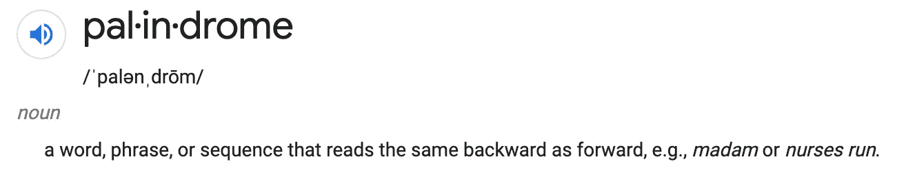

# 带有 JavaScript 的回文检查器

> 原文：<https://javascript.plainenglish.io/palindrome-checker-a9fd81509c11?source=collection_archive---------24----------------------->

## 如何用 JavaScript 检查回文

Photo by [Safar Safarov](https://unsplash.com/@safarslife?utm_source=medium&utm_medium=referral) on [Unsplash](https://unsplash.com?utm_source=medium&utm_medium=referral)

是时候发布一个超快速算法帖子，挑战小比例了…

我想检查一个输入字符串是否是回文。

**我的方法:**

*   检查每个字母与其镜像字母是否相等
*   如果这些不匹配，这不是一个回文

假设我的输入是:

这些是我需要的比较:

因此，如果我迭代输入，最多，我需要到字符串的中间来得到我的答案，这使得最坏情况下的时间复杂度为 n / 2。

虽然，从技术上讲，这仍然只是 O(n)…

# 继续编码！

现在你知道了！

这个解决方案的美妙之处在于，它用这样一种简单的方法处理偶数和奇数长度的字符串。

*更多内容看* [***说白了。报名参加我们的***](https://plainenglish.io/) **[***免费周报***](http://newsletter.plainenglish.io/) *。关注我们关于* [***推特***](https://twitter.com/inPlainEngHQ)[***LinkedIn***](https://www.linkedin.com/company/inplainenglish/)*[***YouTube***](https://www.youtube.com/channel/UCtipWUghju290NWcn8jhyAw)*[***不和***](https://discord.gg/GtDtUAvyhW) *。*****