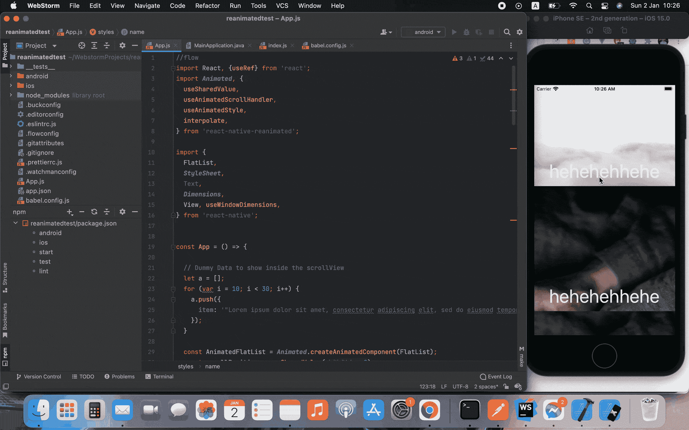

# React Native 中滚动视图项目的视差效果

> 原文：<https://javascript.plainenglish.io/parallax-effect-to-scroll-view-items-in-react-native-a2265ce81cba?source=collection_archive---------0----------------------->

## 在 React Native 中创建视差滚动效果。

如今，动画是用户体验的一个非常重要的部分，它们允许你在你的界面中传达真实可信的动作，并且极大地提高了用户界面的质量。

在过去的几天里，我在 React Native 中搜索一个包来创建这种视差滚动效果，(这里有一个用 flutter[https://docs . flutter . dev/assets/images/docs/cookbook/effects/parallax scrolling . gif](https://docs.flutter.dev/assets/images/docs/cookbook/effects/ParallaxScrolling.gif)做的例子)，但我没有好的库来帮助我，所以我决定自己动手，使用[软件大厦](https://medium.com/u/23d9a033fed2?source=post_page-----a2265ce81cba--------------------------------)提供给我们的 Reanimated 2 从头开始创建它。

至于今天，这是我们将要得到的结果:



Final Outcome

让我们深入研究一下。首先，我们必须创建我们的项目:

```
npx react-native init parallaxAnimation
```

初始化我们的项目后，我们需要使用我们的`Reanimated Library`。

```
yarn add react-native-reanimated
```

然后我们就要按照安装指南来了，这里都列出来了:[https://docs . SW mansion . com/react-native-reanimated/docs/fundamentals/installation](https://docs.swmansion.com/react-native-reanimated/docs/fundamentals/installation)

正如我们所知，Reactived 是一个 react 本地库，允许创建流畅的动画和交互，在 UI 线程上运行，并帮助我们做神奇的🪄

与 react-native 动画 API 一样，它提供动画。视图、滚动视图等等…它还提供了布局动画。

让我们动手做一些代码。

这是我们的基本代码:

Basic code gist

首先，我们必须将我们的视图、ScrollView 等转换成一些动画组件。

因此，我们将把滚动视图转换成动画视图:

```
import Animated from 'react-native-reanimated'<FlatList></FlatList> => <Animated.FlatList></Animated.FlatList>
```

注意:如果您的建议列表中没有显示平面列表，我们可以通过执行以下操作来创建它:

```
const AnimatedFlatList = Animated.createAnimatedComponent(FlatList)then we use it as :<AnimatedFlatList></AnimatedFlatList>
```

在将我们的平面列表转换成动画组件后，只要我们滚动，我们就必须检索我们的滚动位置，这里我们将使用 useSharedValue 来存储 scrollY，并使用 AnimatedscrollHandler 来处理滚动事件(Scroll、Momentum 等)。):

```
const scrollPosition = useSharedValue(0);
```

然后，

```
const handleScroll = useAnimatedScrollHandler(
    {
      onScroll: event => {
        scrollPosition.value = event.contentOffset.y;
      }
    }
);
```

之后，我们将它绑定到我们的 FlatList，并将 scrollEventThrottle 设置为 16，以捕获所有滚动事件:

```
<AnimatedFlatList
    onScroll={handleScroll} 
    scrollEventThrottle={16}
   ...
/>
```

现在我们已经保存了滚动位置，我们需要将它作为一个道具传递给组件。

现在我们必须为动画设置输入范围，这样我们就可以在这个范围内`Interpolate`值。

首先，我们必须将项目组件转换为动画组件，我们只制作图像动画(我们将使其在 Y 轴上平移，因此图像将成为动画组件:

```
const Item=({index, scrollPosition})=>{
  return (
      <View key={index} style={styles.scrollContent}>
        <Animated.Image
          style={[{
           height: ***Dimensions***.get('screen').height*2,
           width: ***Dimensions***.get('window').width,
           resizeMode:'cover',
        }]} 
          source={{uri:'https://random.imagecdn.app/1920/1080'}}/>
      <Text 
        style={[
          {color: 'white', position: 'absolute',zIndex:99, 
          fontSize: 50, bottom: 10}]}
        >
         hehehehhehe
        </Text>
      </View>
  )
}
```

现在，我们必须添加我们的动画样式，这可以通过使用动画样式钩子来完成，我们的组件应该看起来像这样:

```
const Item=({index, scrollPosition})=>{ const {height, width} = useWindowDimensions() const imageAnimatedStyle = useAnimatedStyle(() => {
    const translateY = interpolate(
        scrollPosition.value,
        [(index-1)* height/2, index*height/2, (index+1)*height/2],
        [-100, 0, 100],
    );
    return {
      transform: [{translateY}],
    };
  }, []); return (
      <View key={index} style={styles.scrollContent}>
        <Animated.Image
          style={[{
           height: ***height****1.5,
           width: ***width***,
           resizeMode:'cover',
         },
         ***imageAnimatedStyle***             
        ]} 
          source={{uri:'https://random.imagecdn.app/1920/1080'}}/>
      <Text 
        style={[
          {color: 'white', position: 'absolute',zIndex:99, 
          fontSize: 50, bottom: 10}]}
        >
         hehehehhehe
        </Text>
      </View>
  )
}
```

现在让我们一步一步地解释代码:

首先，我们从 props 中检索我们的滚动位置，然后我们通过滚动位置进行插值，这样我们的范围将是我们的项目、上一个和下一个，这样我们就可以知道我们是向上滚动还是向下滚动，然后我们将动画样式附加到图像样式的其余部分。

现在我们就像在玩 Y 轴上图像的位置，我们将上下移动一点点来获得这个漂亮的视差效果。

下面是最终的代码:

Final code

编码快乐！

*更多内容看* [*说白了。报名参加我们的*](http://plainenglish.io/) [*免费每周简讯*](http://newsletter.plainenglish.io/) *。在我们的* [*社区*](https://discord.gg/GtDtUAvyhW) *获得独家写作机会和建议。*