# 常见的 JavaScript 错误和最佳实践

> 原文：<https://javascript.plainenglish.io/part-2-common-javascript-mistakes-and-best-practices-8d60b210617e?source=collection_archive---------2----------------------->

## 第 2 部分:每个 JavaScript 开发人员都应该熟悉的基本 JavaScript 编程技能。


Photo by [Clay Banks](https://unsplash.com/@claybanks?utm_source=medium&utm_medium=referral) on [Unsplash](https://unsplash.com?utm_source=medium&utm_medium=referral)

ES6 发布后，JavaScript 开发人员采用了 ES6 标准，并开始在日常编程中使用它们。但是等等，我们不是经常使用这些功能吗？就像传播一个对象并制作它的副本，以确保我们没有改变原始对象的值。但是你知道通过传播和克隆对象，你可能会也可能不会改变原始对象的值。让我们看一个例子。

# **1。浅层复制**

你有一个对象:

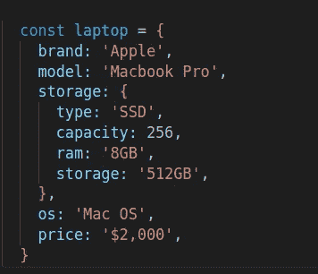

Original laptop object

在这里，我们需要这个 laptop 对象的一个副本，因此对该副本的任何更改都不会改变这个原始的 laptop 对象。

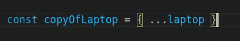

Making a clone of laptop object

现在将 ***copyOfLaptop*** 中的属性改为***copyOfLaptop . brand = " Dell "*。**

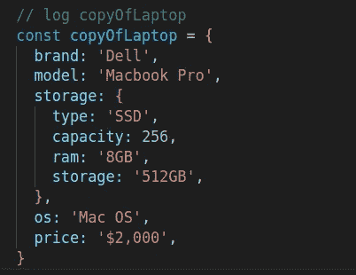

after changing property in cloned object

如果您检查原始的 laptop 对象，它将保持不变。


Original laptop object log after changing the brand value in cloned object

似乎意料之中？也许…

但是你猜怎么着？如果我在***copyofliptop***(克隆的那个)内改变嵌套层次对象 *storage* 的值，你觉得会不会变异原来的对象？

让我们检查一下。

我们想更改 ***copyOfLaptop 中的存储类型和容量。***

```
*copyOfLaptop.storage.type = “HDD”, 
copyOfLaptop.storage.capacity = “500”*
```

它改变了***copyofliptop***中的值，但是原始对象呢？

让我们检查原始(笔记本电脑)对象。

…你猜怎么着？

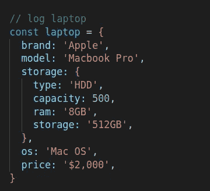

Log of the original object which mutates by its clone

**原因？** 🧐

这是因为我们使用了 spread 操作符来克隆对象。它基本上克隆了一个完整的对象，但它只是防止了 JSON 本身第一层的变异。

也就是说，如果您更改了***copy of laptop****，*中的品牌、型号、操作系统或价格(位于对象的第一层)，原始对象将不会改变这些值。但是，如果您在嵌套数组或除 JSON 第一层之外的任何更深的层中更改值，它也会同时操作原始 JSON 值，因为两者共享相同的地址或位置。这叫浅抄。

👉**更好的解决方案**

**深度复制/深度克隆**

在我们不确定一个对象是否可以有嵌套层次的任何情况下，我们都可以使用深度克隆。

```
***const copyOfLaptop = JSON.parse(JSON.stringify(laptop));***
```

这将使用不同的地址复制整个对象，因此它永远不会改变原始的 JSON。

> ***注意* :** *使用****JSON . parse(JSON . stringify())****不会帮助你深度复制一个对象内部的任何函数。*

# **2。for…each 还是 findIndex 还是 find？**

让我们假设我们有一个名为 ***laptopList*** 的对象数组，并希望将操作系统值操作为“Windows 11”，其中 brand = "DELL "。

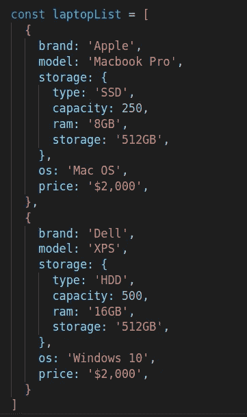

Array of objects

现在你可能猜对了在这种情况下该用什么。但是在我的代码评审中，我看到很多开发者在这里使用 forEach 或者 findIndex 来匹配值。这就是我在这里包括这个例子的原因。

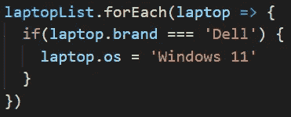

Iterate through the array to check the matching object using forEach

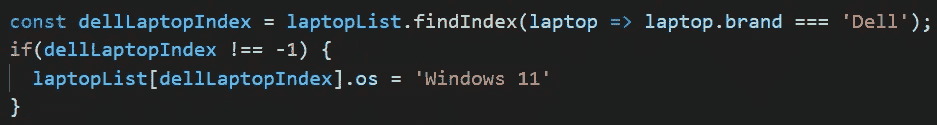

Iterate through the array using findIndex

👉**更好的解决方案**

**使用查找**

首先，只需确保匹配值应该是唯一的，这意味着一个数组中只有一个对象具有“Dell”品牌。如果是这样，您可以使用 **find** 迭代器来迭代和操作对象。

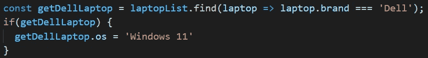

Update values using the find inside an array

这将操作品牌为“Dell”的原始阵列的特定对象值。

# **3。开关还是对象？**

有时，我们有一个值要比较，根据选择的值，我们必须提供它的结果。

我们通常避免 if…else 语句，因为它会导致多个 if…else 语句，并且代码会失去良好的可读性和速度。因此，我们使用 switch-case 语句来代替 if..否则。但是如果你有多种选择呢？switch-case 语句阅读和理解起来也很冗长。

我们来举个例子。

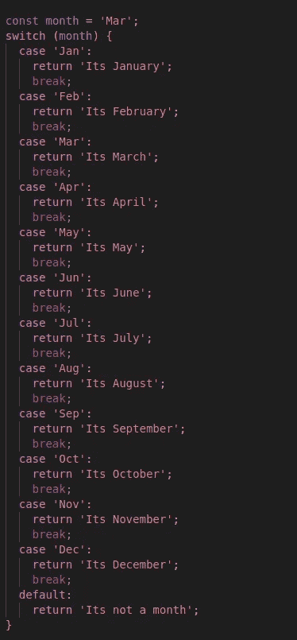

这里，它看起来很长，它接受一个输入并提供一个匹配的输出。

👉**更好的解决方案**

在这里使用 switch 完全没问题，但是如果您想要一个好的可读代码示例来解决这个问题，您可以在这里使用一个对象来解决这个问题。

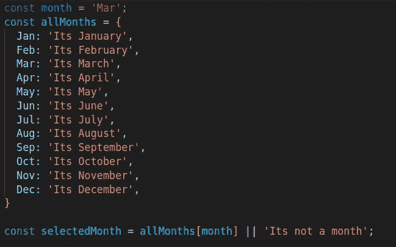

Use object instead of the switch statement

我想澄清一下，用什么完全取决于你。使用对象不会降低时间复杂度，但是我在这里提到的原因是为了提高代码的可读性。

# 4.等待还是承诺？

在 ES6 之后，我们非常习惯异步等待语法。我们通常在返回结果是承诺的地方使用它。

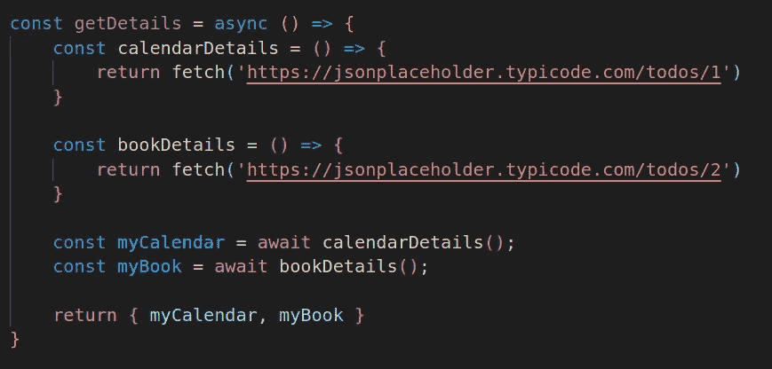

Using await for function execution

我们不得不举一个随机的例子，我们假设 fetch 将获得书和日历的细节。

👉**更好的解决方案**

如果函数不依赖于彼此的输出来进一步处理，请使用 Promise.all。使用它不仅有利于可读性，而且它允许函数独立执行，不像 await 语法那样需要等待其他函数执行完毕。

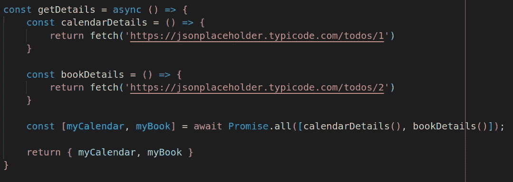

Using Promise.all for function execution

所以现在就这样了。我希望你喜欢这篇文章，并从中学到一些东西。你可以随时在社交媒体上联系我，寻求任何建议或意见。

此外，如果您还没有阅读 [**常见 JavaScript 错误和最佳实践:第 1 部分**](https://hardik-thakar.medium.com/basic-javascript-mistakes-and-best-practices-aa97ffc0e553) ，那么请继续查看。

*更多内容请看*[***plain English . io***](https://plainenglish.io/)*。报名参加我们的* [***免费周报***](http://newsletter.plainenglish.io/) *。关注我们关于*[***Twitter***](https://twitter.com/inPlainEngHQ)[***LinkedIn***](https://www.linkedin.com/company/inplainenglish/)*[***YouTube***](https://www.youtube.com/channel/UCtipWUghju290NWcn8jhyAw)*[***不和***](https://discord.gg/GtDtUAvyhW) *。***