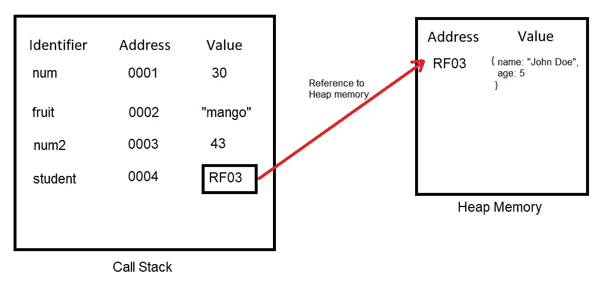
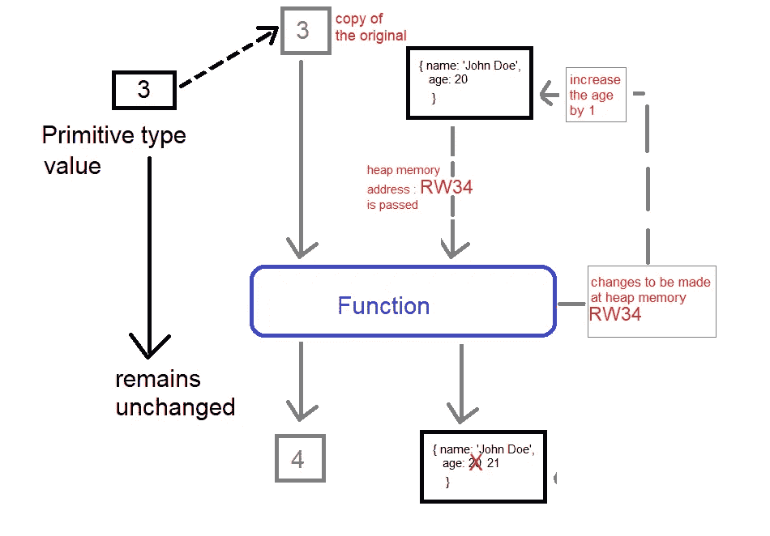

# JavaScript 中按值传递与按引用传递

> 原文：<https://javascript.plainenglish.io/pass-by-value-v-s-pass-by-reference-in-javascript-2f4b5fb494f1?source=collection_archive---------12----------------------->

The above image is created by Divyojyoti Ghosh(me) on [www.canva.com](http://www.canva.com/) using different elements available for making designs.

JavaScript 不支持按引用传递，它是一种按值传递的语言。但是，当我们传递对象时，传递的值实际上是它的引用地址。对象也称为引用类型值。

在讨论按值传递和按引用传递之前，让我们了解一下基元类型值和引用类型值之间的区别。

## 原始类型

Javascript 是一种动态类型语言，这意味着变量可以有任何数据类型的值。变量的数据类型是根据它的值分配的，我们使用 typeOf()运算符来知道数据类型。根据浏览器支持的 ECMAScript 标准，有 5 到 7 种原始数据类型。

1.  布尔型
2.  线
3.  数字
4.  空
5.  不明确的
6.  符号(ES2015)
7.  bigint (ES2020)

## 参考类型

除了基本数据类型之外，只有一种数据类型，即 object，也称为 reference type。引用类型变量有一组键值对，也称为变量/对象的属性。对象是用花括号中的属性定义的。下面的代码定义了一个对象，`student` 及其两个属性，`name`和`age`

## 这些值存储在哪里？

在上面的代码中，`num`、**、**、**、**、**、**、`num2`有原始类型值，`student`有引用类型值。

引用类型值(对象)存储在堆内存中，不像基元类型值存储在调用堆栈的执行上下文中。对于对象，调用堆栈将其堆内存地址存储为一个值。

下图可以帮助我们理解值的存储-

Fig 1: Primitive and Reference type value storage

## 按值传递和按引用传递

在 JavaScript 中，我们只把值作为参数传递给函数，但是当我们传递一个对象时，我们把它的地址作为值传递。对基元类型参数所做的任何更改都不会影响原始值，但是对引用类型参数的属性所做的任何更改都会更改实际对象的属性值。

让我们借助下面的代码来理解这一点—

Pass of primitive type value and reference type value

`year`是一个原始类型值，当它被传递给一个函数时，函数对它所做的任何更改都不会影响原始值，因为该值的副本被传递给了该函数。因此，它的副本增加 1。鉴于`john`对象是一个引用类型，它的地址作为一个值传递给`changeYear`函数，该函数直接对作为一个值传递的地址所指向的对象进行修改。因此 age 属性的值增加了 1。

## 结论

JavaScript 中没有按引用传递，但是当传递对象时，它们的堆内存地址作为一个值传递，因此，对对象的任何更改都是在原始对象上完成的，这与原始类型值不同。

## 资源

[https://www.javascripttutorial.net/javascript-data-types](https://www.javascripttutorial.net/javascript-data-types)/

https://www.udemy.com/course/the-complete-javascript-course

【https://gist.github.com/ 

*更多内容看* [***说白了就是 io***](https://plainenglish.io/) *。报名参加我们的* [***免费周报***](http://newsletter.plainenglish.io/) *。关注我们关于*[***Twitter***](https://twitter.com/inPlainEngHQ)，[***LinkedIn***](https://www.linkedin.com/company/inplainenglish/)***，***[***YouTube***](https://www.youtube.com/channel/UCtipWUghju290NWcn8jhyAw)***，以及*******不和*** *对成长黑客感兴趣？检查出* [***电路***](https://circuit.ooo/) ***。****