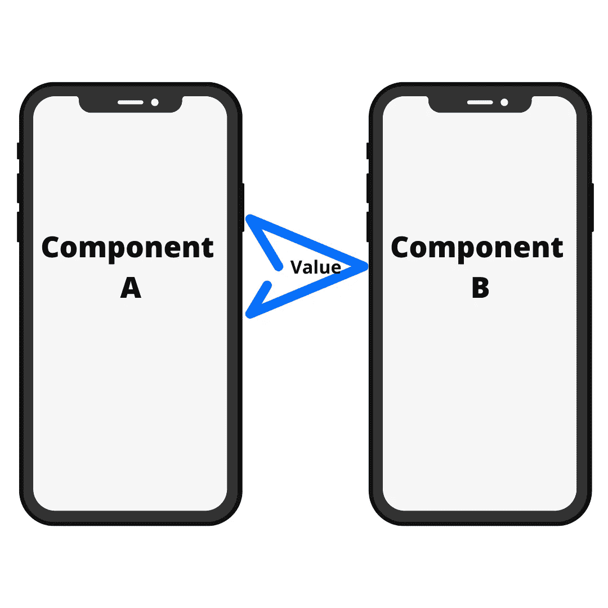

# 在 React Native Expo 应用程序中将值从一个屏幕组件传递到另一个组件

> 原文：<https://javascript.plainenglish.io/pass-the-value-from-one-screen-component-to-another-in-react-native-expo-apps-470dd096174e?source=collection_archive---------5----------------------->

## 如何在 React 本地 Expo 应用程序中使用 React 导航传递值



Passing Value Between Two Components

各位原生开发者好！

我叫 Rohit Kumar Thakur。我一般写 React Native、Django、数据科学、机器学习和 Python。

假设你有两个屏幕，**屏幕 A** 和**屏幕 B** 。在本文中，我将向您展示如何使用 react-navigation 将值信息从一个屏幕组件传递到另一个组件。这里我们将使用堆栈导航来完成我们的工作。所以，不浪费任何时间，让我们开始这个项目。

下面是本文的分步视频教程:

# 项目设置

*   选择您选择的目录
*   在同一个目录中，打开命令提示符或终端。
*   使用命令`expo init Info`初始化并展示应用程序
*   选择空白模板并继续下载依赖项
*   使用命令:`cd Info`导航到新构建的目录
*   安装以下 JavaScript 库:

```
npm install [@react](http://twitter.com/react)-navigation/nativeexpo install react-native-screens react-native-safe-area-contextnpm install [@react](http://twitter.com/react)-navigation/stackexpo install react-native-gesture-handler
```

现在，在您喜欢的代码编辑器中打开这个项目。哦！VS 代码？很好。

# 密码

在项目文件夹中创建一个文件夹，并将该文件夹命名为“Screens”。

在 Screens 文件夹中，创建两个 JavaScript 文件， **Home.js** 和 **Detail.js**

***App.js***

```
import  { createStackNavigator } from '[@react](http://twitter.com/react)-navigation/stack';
import  { NavigationContainer } from '[@react](http://twitter.com/react)-navigation/native';
import Home from './Screens/Home';
import Detail from './Screens/Detail';const Stack =  createStackNavigator();function App() {
  return (
    <Stack.Navigator>
      <Stack.Screen name="Home" component={Home} />
      <Stack.Screen name='Detail' component={Detail} />
    </Stack.Navigator>
  )
}export  default () => {
  return(
    <NavigationContainer>
      <App/>
    </NavigationContainer>
  )
}
```

在 App.js 中，我们只是为两个屏幕组件添加了堆栈导航。

***Home.js***

```
import { View, Text, TextInput, Button, StyleSheet } from 'react-native'
import React, { useState } from 'react'
import { useNavigation } from '[@react](http://twitter.com/react)-navigation/native'const Home = () => {
    const navigation = useNavigation();
    const [name, setName] = useState('');
  return (
    <View style={{flex:1, alignItems:'center', justifyContent:'center'}}>
      <Text>Please Enter Your Name to Pass it to second screen</Text>
      <TextInput 
        value={name}
        onChangeText={(username) => setName(username)}
        placeholder={'Enter Your Name'}
        style={styles.inputStyle} 
      />
      <Button 
        title='Go Next'
        mode='contained'
        onPress={() => navigation.navigate('Detail', {
            paramKey: name
        })}
      />
    </View>
  )
}export default Homeconst styles = StyleSheet.create({
    inputStyle: {
        width:'80%',
        height:44,
        padding:10,
        marginVertical:10,
        backgroundColor:'#DBDBD6',
    }
})
```

在 Home.js 中，我们使用 React 导航来传递值。按下按钮后，我们将导航到详细信息屏幕，并将“名称”作为 paramKey 传递。

***Detail.js***

```
import { View, Text } from 'react-native'
import React from 'react'const Detail = ({route}) => {
  return (
    <View style={{flex:1, justifyContent:'center', alignItems:'center'}}>
      <Text style={{fontSize:40}}>{route.params.paramKey}</Text>
    </View>
  )
}export default Detail
```

现在，只需使用上面的代码在详细信息屏幕上显示名称。

运行应用程序，您将获得期望的输出。如有困惑，可以参考视频。

现在，鼓掌，鼓掌，鼓掌！并关注更多关于 React Native expo 的基于项目的文章。

感谢阅读。

*更多内容请看*[***plain English . io***](https://plainenglish.io/)*。报名参加我们的* [***免费周报***](http://newsletter.plainenglish.io/) *。关注我们关于*[***Twitter***](https://twitter.com/inPlainEngHQ)*和*[***LinkedIn***](https://www.linkedin.com/company/inplainenglish/)*。加入我们的* [***社区不和谐***](https://discord.gg/GtDtUAvyhW) *。*