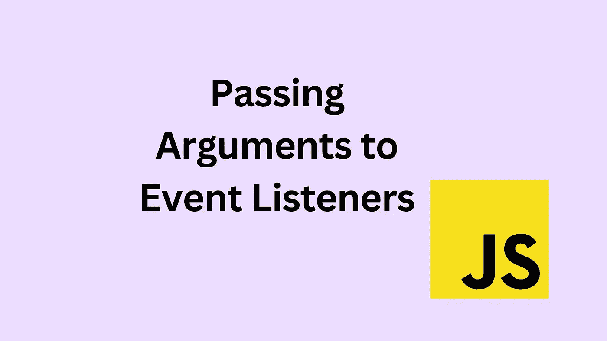

# 在 JavaScript 中将参数传递给事件侦听器

> 原文：<https://javascript.plainenglish.io/passing-arguments-to-event-listeners-in-javascript-1a81bc397ecb?source=collection_archive---------0----------------------->

## 你可能不知道的 JavaScript 要点



事件是 JavaScript 和 DOM 交互的基本组成部分。很多时候我们只需要访问事件处理程序中的事件对象。因为默认情况下事件对象被传递给事件处理程序，所以我们不需要担心向函数传递任何东西。然而，在某些情况下，我们确实需要向函数传递参数。做这件事有不同的方法。这是我觉得最直观的方法。

当事件处理程序在不同的事件中重复使用时，向事件处理程序传递参数特别有用。例如，我们希望根据单击的按钮传递不同的内容，但函数的逻辑是相同的。在这种情况下，我们应该重用该函数，可以只传入不同的内容。

## 例子

我们从下面的代码开始。

```
// we want to pass this to the event handler
let newContent = "Lorem ipsum";

// something like this but with an argument 
btn.addEventListener("click", changeContent);

function changeContent(content) { 
    targetNode.innerText = content;
}
```

让我们假设`targetNode`和`btn`都是引用 DOM 中元素的变量。`targetNode`是我们想要替换内容的地方，而`btn`是应该触发这个的按钮。我们需要给`btn`添加一个事件监听器，我们还想将新内容传递给事件处理程序。

如何将`newContent`作为参数传递给事件处理程序？

让我们从不可能的开始。不可能将参数直接传递给函数，因为这与调用函数是一样的。

```
btn.addEventListener("click", changeContent(newContent)); // WRONG!
```

效果将与以下内容相同:

```
changeContent(newContent);
```

该函数将在该行被解析后立即执行。我们当然不希望在事件没有被触发的情况下执行事件处理程序。此外，当事件触发时，事件处理程序将不会执行。

有效的方法是使用匿名函数。

```
btn.addEventListener("click", () => { changeContent(newContent) });
```

这是可行的，因为我们没有像上面那样直接调用函数。我们正在传递一个函数定义，它将被用作回调函数，在传递参数的同时调用我们的实际函数。由于外部(匿名)函数调用另一个完成实际工作的函数，我称之为匿名函数/委托方法。

这里我们不必使用箭头函数，我们也可以只传递一个普通的匿名函数。

```
btn.addEventListener("click", function(){
    changeContent(newContent) 
});
```

根据你的选择，`this`关键字有所不同，但那是另一篇文章的主题。

我们也可以访问事件对象，但是我们需要将它传递给函数，并调整函数定义。

```
btn.addEventListener("click", (event) => { 
    changeContent(event, newContent) 
}); 

function changeContent(event, content) { 
    targetNode.innerText = content; 
}
```

## 旁注

由于事件处理程序只不过是一个回调函数，所以您可以使用相同的方法将参数传递给任何其他回调函数。

```
setTimeout(function(){ sayHi("@kathimalati") }, 1000);
function sayHi(name) {
    alert(`Hi ${name}`);
}
```

# 其他方法

一如既往，有不同的方法来实现我们想要的。还有一个选项是使用`bind`向函数传递值。这样你就不会把它作为一个参数传入，而是通过关键字`this`让它可用。你可以在这里阅读更多关于 T2 的信息。我选择了匿名函数/委托方法，因为我发现这是最直观的。

感谢您的阅读！我希望你喜欢这篇文章。关注我以获得更多关于 web 开发的见解。

## 更多参考

[](https://developer.mozilla.org/en-US/docs/Web/API/EventTarget/addEventListener?retiredLocale=de#the_event_listener_callback) [## event target . addevent listener()-Web API | MDN

### EventTarget 接口的 addEventListener()方法设置了一个函数，每当…

developer.mozilla.org](https://developer.mozilla.org/en-US/docs/Web/API/EventTarget/addEventListener?retiredLocale=de#the_event_listener_callback) 

*更多内容看* [***说白了就是***](https://plainenglish.io/) *。报名参加我们的* [***免费周报***](http://newsletter.plainenglish.io/) *。关注我们关于* [***推特***](https://twitter.com/inPlainEngHQ) ， [***领英***](https://www.linkedin.com/company/inplainenglish/) ***，***[***YouTube***](https://www.youtube.com/channel/UCtipWUghju290NWcn8jhyAw)***，以及****[***不和***](https://discord.gg/GtDtUAvyhW) *