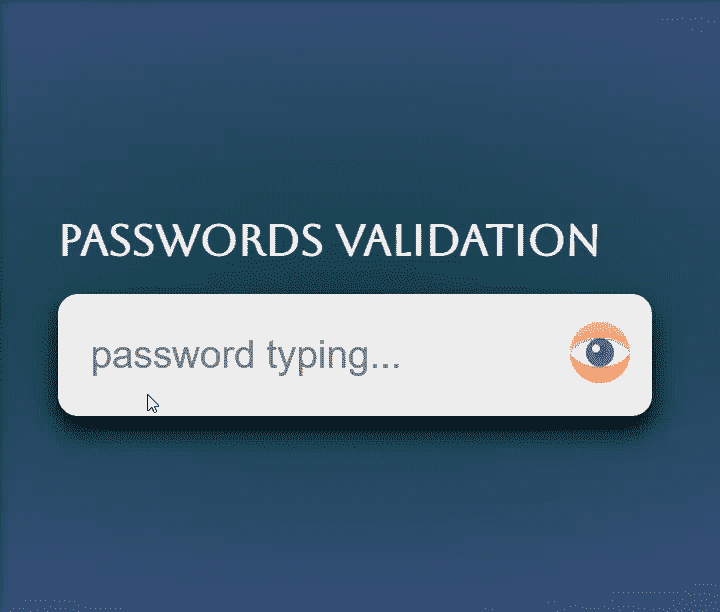
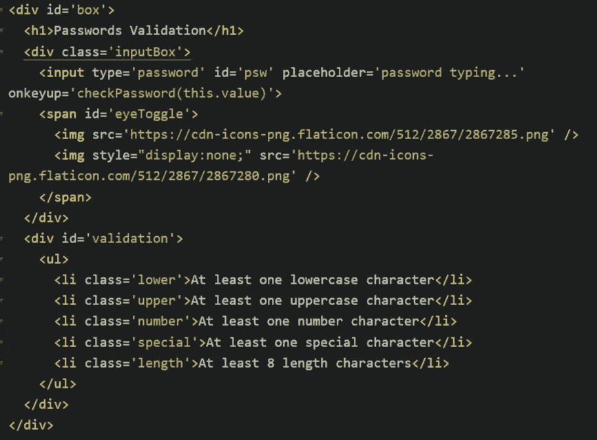
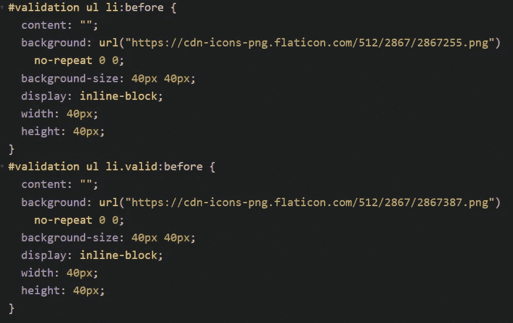
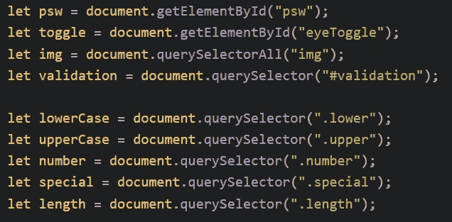
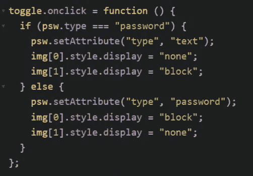
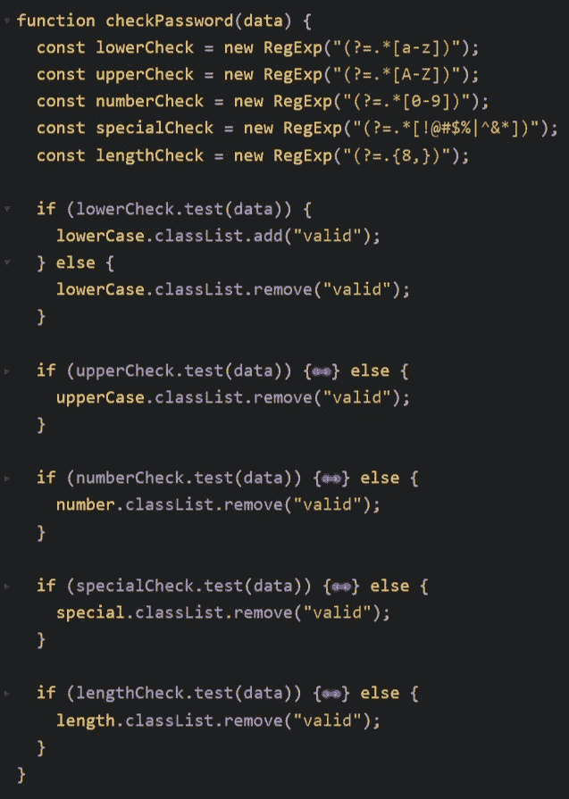
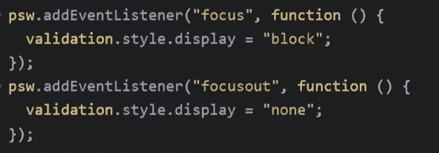

# 使用 JavaScript 进行密码验证

> 原文：<https://javascript.plainenglish.io/password-validation-with-javascript-ccc03f13b39c?source=collection_archive---------9----------------------->

## 特点:

*   使用正则表达式验证输入值
*   隐藏和显示密码
*   根据验证切换图像

**HTML**

`eyeToggle`包括两个在 JavaScript 中切换的图像。

验证结构有 5 个验证项目。

`onkeyup` 验证功能`checkPassword()`。

**CSS**

当编码 CSS 时，我发现很难在`:before`中调整图像的大小。

**无法调整使用** `**::before**` **伪元素创建的图像的大小？**

经过搜索，我发现它必须设置*背景尺寸*和*块尺寸*。这里查一下。

图片来自 flaticon:

 [## 由扁平图标设计的免水化图标

### 自由矢量图标。下载成千上万的 SVG，PSD，PNG，EPS 格式的免费医疗图标或图标…

www.flaticon.com](https://www.flaticon.com/free-icon/hydration_2867255?related_id=2867255&origin=pack)  [## 由平面图标设计的生理自由图标

### 现在下载 SVG，PSD，PNG，EPS 格式或网络字体的矢量图标。Flaticon，最大的免费数据库…

www.flaticon.com](https://www.flaticon.com/free-icon/physiology_2867387?related_id=2867387)  [## 由平面图标设计的裸眼图标

### 自由矢量图标。下载成千上万的 SVG，PSD，PNG，EPS 格式的免费医疗图标或图标…

www.flaticon.com](https://www.flaticon.com/free-icon/eye_2867280?related_id=2867280)  [## 扁平图标设计的睫毛自由图标

### 自由矢量图标。下载成千上万的 SVG，PSD，PNG，EPS 格式的免费医疗图标或图标…

www.flaticon.com](https://www.flaticon.com/free-icon/eyelashes_2867285?related_id=2867285&origin=pack) 

**JS**

选择所有 DOM

点击`eyeToggle`时，如果输入的是密码，则转为显示密码的文本，同时显示睁眼图像。同样的，

当 `onkeyup`发生时，根据数据值运行函数`checkPassword()`。

使用正则表达式进行验证，**小写**是【a-z】，**大写**e if【A-Z】，**数字**是【0–9】，**特价**是！@#$%^ & *、**长度**根据需要大于 8。

> `**?=**`是一个正向前瞻，一种类型的[零宽度断言](http://www.regular-expressions.info/lookaround.html)。它的意思是，被捕获的匹配必须跟在括号内的内容后面，但这部分没有被捕获。
> 
> `**.***`只是表示“0 个或以上的任意字符”。
> 
> 它分为两部分:
> 
> `.` -“点”表示任何字符
> 
> `*` -表示“前面的正则表达式标记的 0 个或多个实例”

合格后添加`valid`类。

首先隐藏验证列表。当关注输入时，显示它们。

我从*在线教程*中学到了 JavaScript，这里是 [YouTube 视频](https://www.youtube.com/watch?v=Hi8DVOaZ0Ug)。

## 我的代码如下:

> 继续做你想做的事。在通往顶峰的路上向我们所有人问好。
> 
> 请跟随并成为我的学习伙伴。和平。✌️

*更多内容看* [***说白了。报名参加我们的***](https://plainenglish.io/) **[***免费周报***](http://newsletter.plainenglish.io/) *。关注我们关于* [***推特***](https://twitter.com/inPlainEngHQ) ，[***LinkedIn***](https://www.linkedin.com/company/inplainenglish/)*，*[***YouTube***](https://www.youtube.com/channel/UCtipWUghju290NWcn8jhyAw)*，以及* [***不和***](https://discord.gg/GtDtUAvyhW) *。***