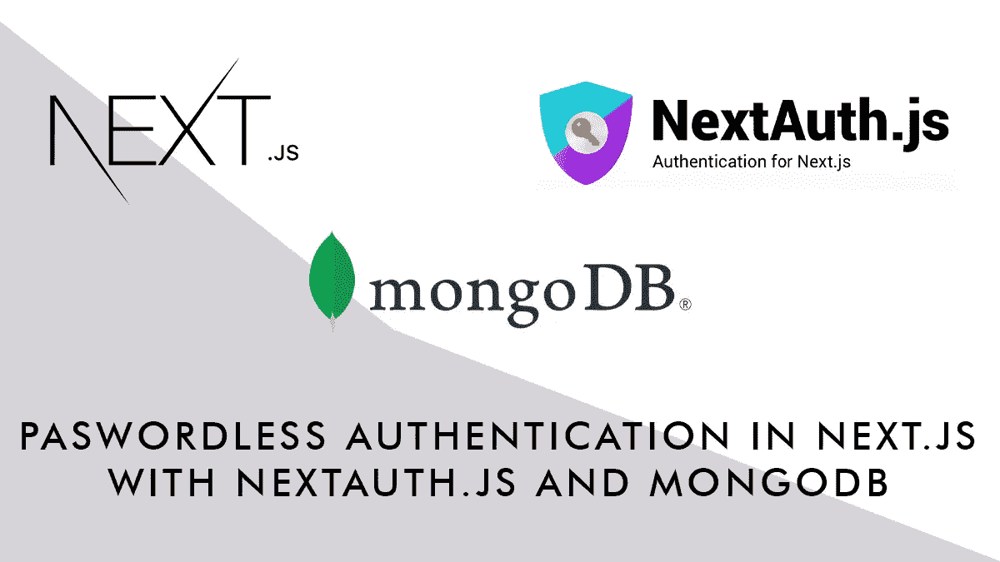
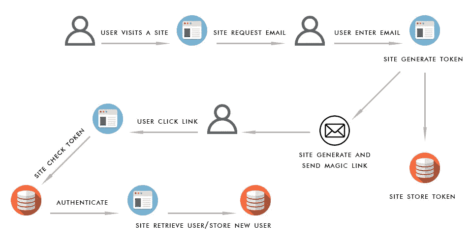
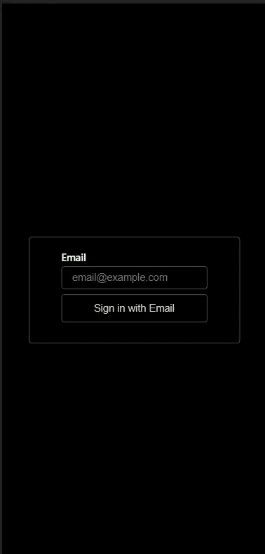
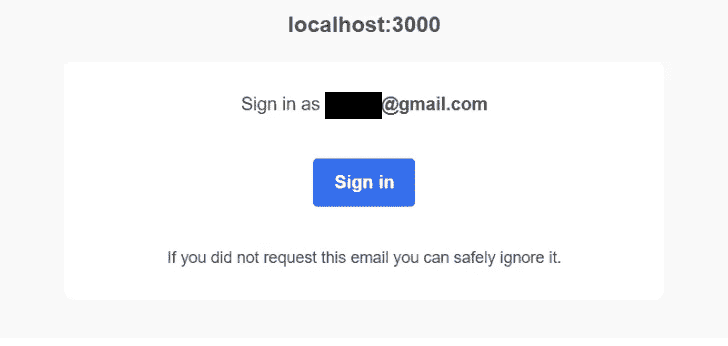

# 使用 NextAuth.js 和 MongoDB 在 Next.js 中进行无密码身份验证

> 原文：<https://javascript.plainenglish.io/passwordless-authentication-in-next-js-with-nextauth-js-and-mongodb-19760c79184?source=collection_archive---------2----------------------->

## 关于使用 NextAuth.js 和 MongoDB 进行无密码身份验证的指南。



无密码身份验证允许用户无需提供和注册密码即可登录网站。即使它不能被认为是完全安全的(就像每一种登录方法一样)，它也完全绕过了用户对密码的选择，这通常是登录过程中最薄弱的部分。

在无密码登录中，所谓的所有权因素用于身份验证:一次性密码、注册的设备访问、生物识别和发送到用户电子邮件的神奇链接，这是我们将实现的。

## 工作流程

在我们的例子中(使用神奇链接的无密码认证)，用户向他/她想要登录的服务/网站提供一个电子邮件地址，网站将生成一个一次性令牌，该令牌被发送到用户的电子邮件(在登录链接内)并存储在服务器上的某个位置。

一旦用户点击链接，令牌就会与服务器上的令牌进行核对，如果匹配，用户就通过了身份验证。用户也存储在服务器上，这样在下次使用相同的电子邮件登录时，用户将被识别。



Magic Link Authentication Workflow

为了在 Next.js 应用程序中集成这种身份验证，我们将使用 NextAuth.js，它是 Next.js 的一个身份验证解决方案，支持广泛的身份验证方法和数据库支持，我们选择将数据存储在 MongoDB 服务器上，因为从我们的测试来看，它看起来更可靠，更容易实现

[](https://next-auth.js.org/) [## NextAuth.js

### Next.js 的身份验证

next-auth.js.org](https://next-auth.js.org/) 

## **先决条件**

要跟进，您需要:

*   Next.js 的基础知识，尤其是路由/页面系统。
*   MongoDB 数据库访问可以是本地的，也可以是远程托管的(比如 [MongoDB Atlas](https://www.mongodb.com/it-it/cloud/atlas/register)
*   节点包管理的基本知识
*   你可以访问 SMTP 服务器来发送电子邮件，你可以使用本地服务器或远程服务(例如 [Mailjet](https://www.mailjet.com/) 或 [Sendinblue](https://sendinblue.com) ，如果你使用 Google Workspace，你也可以使用 Gmail SMTP)

## 设置应用程序

使用以下命令创建一个新的 Next.js 应用程序:

```
npx create-next-app some-project-name
```

安装所需的模块:

```
npm install nodemailer
npm install next-auth [@next](http://twitter.com/next)-auth/mongodb-adapter mongodb
```

创建密钥(在开发中是可选的，但在生产中是必需的)

```
openssl rand -base64 32
```

此时，您可以用所有需要的配置设置您的环境文件`.env.local`:

您需要填写您的 SMTP 服务器数据、您希望发送电子邮件的电子邮件地址、到 MongoDB 服务器的连接字符串。在这里，您可以添加应用程序的密钥和基本 URL。

创建文件`**pages/lib/mongodb.js**`，根据 Next.js 文档和示例，这是连接到 MongoDB 服务器并与应用程序共享连接的正确方式:

我们现在需要一个页面来响应所有 NextAuth.js API 端点(登录表单、错误、通知)。我们将通过创建以下文件来使用 Next.js 总括路由:`**pages/api/auth/[...nextauth].js**`。它将自动显示预定义的 NextAuth.js 页面(稍后将详细介绍定制)。

在这个文件中，我们简单地定义了哪个是用于存储数据的适配器(MongoDB ),哪个是我们将在应用程序中使用的身份验证方法(在本例中，我们只使用电子邮件，但我们可以在以后添加更多)及其配置。我们还指定要使用 JWT，这样就不会在每次请求时都查询数据库。

如果您转到以下 URL，我们现在可以测试身份验证了:

```
**http://localhost:3000/api/auth/signin**
```

您将看到一个请求您发送电子邮件的表单(它使用标准的 NextAuth.js 前端):



提交您的电子邮件地址将会给您发送一封带有登录按钮的电子邮件。点击登录按钮，您将返回到该网站:



目前，身份验证工作流工作正常，但是我们需要一种方法来检查用户是否经过身份验证，页面是否受到保护等等。

为了实现这一点，我们需要将所有的应用程序页面包装在一个由 NextAuth.js 提供的 SessionProvider 中，它将处理用户会话和身份验证状态。首先，我们需要修改`**_app.js**`文件以包含 SessionProvider，这样 session 参数在站点范围内可用，并可用于检查用户是否经过身份验证:

然后我们可以用一种基本的方式修改我们的`index.js`文件，这样我们就可以知道我们是否通过了身份验证:

在文件中，我们检查用户的会话，如果它存在，我们假设用户已经过身份验证； **signIn** 和 **signOut** 是提供的两个 NextAuth.js API 端点。 **useSession** 对象还包含一个*状态*，它可以有三个值:`loading | authenticated | unauthenticated`，这也可以用于更精细地控制向用户显示什么。

使用 useSession，只有通过身份验证的用户才能访问单个页面，未通过身份验证的用户将看到登录表单，并在成功登录后被重定向到他们启动的页面:

## 用户化

所有的 NextAuth.js 页面(登录表单、错误页面、通知)和电子邮件消息都可以定制。

可以通过在`**[...nextauth].js**`中添加`**pages**` 部分来定制页面:

您可能需要定制**登录**页面，只需创建一个`pages/auth/signin.js`，它将向签名 API 端点发送电子邮件地址(和一个 csfrToken ):

电子邮件定制仍将在`**[...nextauth].js**`中进行，您需要将一个函数传递给 EmailProvider()的`**sendVerificationRequest**` 选项:

## 下一步是什么

NextAuth.js 支持多种认证服务，你可以用社交登录来扩展你的登录表单(像脸书、推特和谷歌)。它还支持任意凭证登录，如果您已经有一个带有登录数据的用户基础，您可以将 NextAuth.js 插入其中。

现在你知道了。感谢您的阅读。

*更多内容看* [***说白了。报名参加我们的***](http://plainenglish.io/) **[***免费周报***](http://newsletter.plainenglish.io/) *。在我们的* [***社区不和谐***](https://discord.gg/GtDtUAvyhW) *获得独家获取写作机会和建议。***