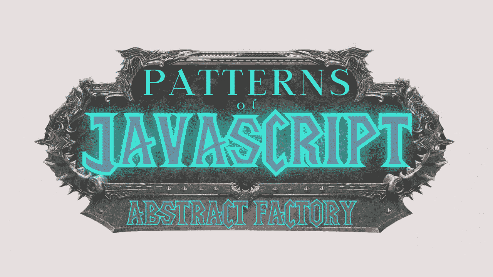
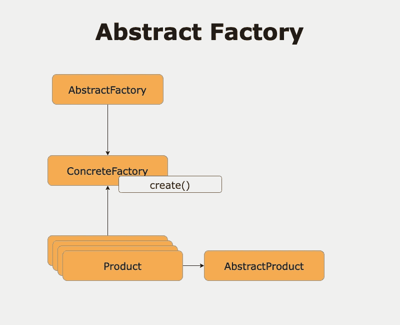
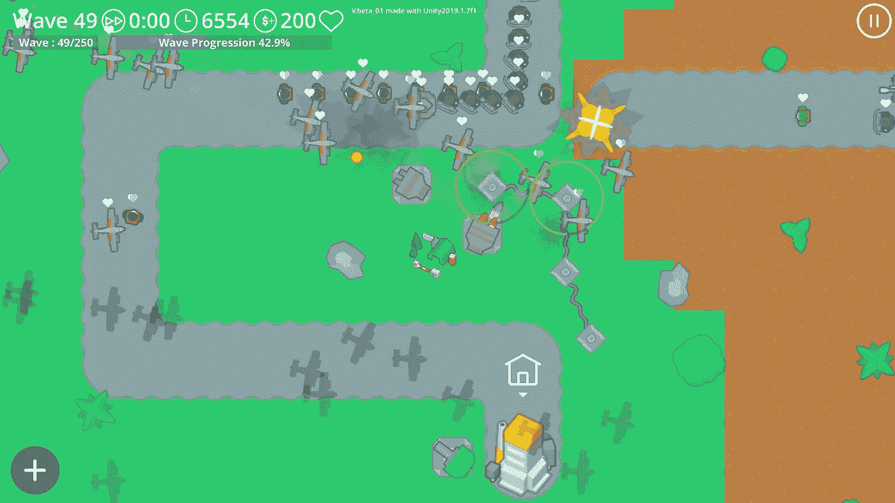
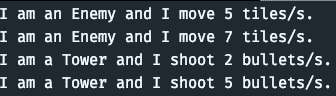

# JavaScript 模式:塔防解释的抽象工厂模式

> 原文：<https://javascript.plainenglish.io/patterns-of-javascript-abstract-factory-pattern-explained-by-tower-defense-46a36776a391?source=collection_archive---------4----------------------->

## 用塔防深入解释抽象工厂



Image made by the [Author](http://www.arnoldcode.com/) via Canva.com

***抽象工厂*** 允许你从代码的任何其他部分(客户端)创建具有共同概念的对象。

所有的模式分为三类:*创造型*，*结构型* & *行为型*。这种模式被归类为创造性的。你会看到*为什么。*

抽象工厂允许您的代码委托对象创建，同时将更广泛的逻辑封装到工厂控件中。

不是通过调用`new`操作符来创建对象，而是由工厂来调用与实例化相关的函数。例如，对象缓存、对象的共享或重用、复杂逻辑、维护对象和类型计数的应用程序，以及与不同资源或设备交互的对象。

# 简而言之，抽象工厂

这就像一个工厂方法([深度文章](https://medium.com/p/402c69426650))，但是它创建了共享一个公共概念的对象。在表面之下，它对多个对象有一个抽象的概念。换句话说，“工厂是创建对象的代理”

# 何时&为什么使用抽象工厂

抽象工厂模式用于创建相似的对象，但是它们的行为不同。[工厂方法](https://medium.com/p/402c69426650)和抽象工厂已经合并成一个更通用的模式，叫做工厂。

调用另一个函数(工厂)而不是用`new()`操作符实例化一个对象可能过于复杂。但是构造函数对创建过程的控制是有限的(T21)。所以你会想把控制权交给一个拥有更广泛知识的工厂。

什么是更广泛的知识，哪里需要？

在创建过程与其他操作(如缓存、共享或重用以及复杂逻辑)相关的场景中。

简而言之，维护对象计数的应用程序和与不同资源或设备交互的对象。

经验法则:如果你的应用需要控制对象的创建，就使用工厂。

# 模式概述



这种模式包括:

*   ***AbstractFactory:***JavaScript 并没有为你提供创建 abstract factory 的工具。它通常是一个产品界面。
*   ***混凝土工厂:*** `EnemyFactory`，`TowerFactory`都是混凝土工厂的例子。新的敌人/塔(产品)是由工厂对象“制造”的。新产品通过`create`方式退货。
*   ***产品:*** 工厂创建产品实例。在示例代码中:`Enemy`，`Tower`
*   ***AbstractProduct:***JavaScript 也没有设置 abstract product 的工具。它们通常用于创建产品界面。

虽然 JavaScript 不支持所有部分，但我们仍然可以构建这种模式。请看下面成功使用这种模式的例子。

> 如果您想使用整个模式(包括接口)，您需要切换到 TypesScript。

# 示例 1:简单的抽象工厂



Captures from [**OrdinaryDev83**](https://forum.unity.com/members/ordinarydev83.623548/) **—** [**TomsTD**](https://play.google.com/store/apps/details?id=com.Char3Studio.TomsTD&pli=1)

假设您想要构建该功能:

*   点击按钮 A 建造一座塔
*   点击按钮 B 产生一个敌人
*   关于已经创建的内容及其统计的日志信息

由于 JavaScript 的原因，JavaScript 示例不能使用抽象类。

## 产品

抽象类和接口确保派生类有一致的接口。在 JavaScript 中，我们负责确保每个“具体”对象都有相同的接口定义。您可以通过确保您的对象具有相同的属性和方法来实现这一点。

***产品—敌人***

```
function Enemy(movementSpeed) {
    this.movementSpeed = movementSpeed;
    this.info = function () {
        console.log("I am an Enemy and I move " + movementSpeed + ' tiles/s.');
    };
}
```

***混凝土成品-塔***

```
function Tower(firingSpeed) {
    this.firingSpeed = firingSpeed;
    this.info = function () {
        console.log("I am a Tower and I shoot " + firingSpeed + ' bullets/s.');
    };
}
```

两者都有一个速度和一个叫做`info`的方法。

## 工厂

这个例子需要两个具体的工厂:`EnemyFactory`和`TowerFactory`。`Enemy`实例在第一个中创建，而`Tower`实例在第二个中创建。

***混凝土工厂——敌人***

```
function EnemyFactory() {

    this.create = function (movementSpeed) {
        return new Enemy(movementSpeed);
    };
}
```

***混凝土工厂—塔楼***

```
function TowerFactory() {

    this.create = function (firingSpeed) {
        return new Tower(firingSpeed);
    };
}
```

## 运行代码和给工厂打电话

两个产品都是`entity`类型(具有相同的接口)，所以客户端可以用相同的方式对待它们。

我们创建了一个有两个敌人和两座塔的阵列。然后我们询问每个实体它们是什么，它们的速度是多少。

***-客户端(呼叫者)*代码**

```
function run() {
    var entities = [];
    var enemyFactory = new EnemyFactory();
    var vendorFactory = new TowerFactory();

    entities.push(enemyFactory.create(5));
    entities.push(enemyFactory.create(7));
    entities.push(vendorFactory.create(2));
    entities.push(vendorFactory.create(5));

    for (var i = 0, len = entities.length; i < len; i++) {
        entities[i].info();
    }
}

run()
```



Console Output of Example 1

# 示例 2:带有抽象产品的 Fullborn 模式


[All Rights Reserved to Craig's Art blog](https://tearascal.tumblr.com/post/159804371478/wip-animation-for-monsters-monocles-new)

你真的希望有一个名为`Entity`的类来启用一种模式，你可以在游戏中的实体的所有创建过程中使用这种模式。

你可以很容易地为你的游戏实现统计/成就/排名列表。使用 JavaScript 类语法，您可以创建一个类似于*抽象产品的基类。*

## ***基类，又名*抽象工厂**

```
class Entity {

    type;
    speed;
    speedRelation = 'move' |'shoot';
    what = 'tiles' | 'bullets'

    info = function() {
        console.log(`I am ${this.type} and I ${this.speedRelation} ${this.speed} ${this.what}/s.`);
    }

    init = function(){
        console.log(`There is no init-function for ${this.constructor.name}.`);
    }
}
```

这必须包含所有其他混凝土产品必须满足的最小重叠属性。您需要有以下字段:

*   `type`:已经创建了什么混凝土类型(混凝土产品)
*   `speed`:这个实体有多快
*   `speedRelation`:参考移动(敌人)或射击(塔)的速度值
*   `what`:与`speedRelation`的关系不是*瓦片*(敌人)就是*子弹*(塔)

以及以下方法:

*   `info`:打印一个实体的多条信息(`type`、`speed`、`speedRelation`、`what`)
*   `init`:调用具体产品的初始化例程。如果没有，调用类`Entity`中的默认值。

## 混凝土产品

每个具体的产品需要通过`extends`从你的基类继承。

***混凝土产品——敌人***

```
class Enemy extends Entity {
    constructor(speed) {
        super();
        this.type = 'Enemy';
        this.speed = speed;
        this.speedRelation = 'move';
        this.what = 'tiles';
    }

    init = function () {
        this.run();
    }

    run = function () {
        console.log('Enemy starts to run.');
    }
}
```

***混凝土产品—塔***

如您所见，该塔没有 init 类。稍后调用`init`，将使用`Entity`类中的回退并打印出简单信息。

```
class Tower extends Entity {
    constructor(speed) {
        super();
        this.type = 'Tower';
        this.speed = speed;
        this.speedRelation = 'shoot';
        this.what = 'bullets';
    }
}
```

## 混凝土工厂

这些只需要很小的重构就可以将`speed`转发给期望的构造函数。

***混凝土工厂——敌人***

```
function EnemyFactory() {
        this.create = function (speed) {
        return new Enemy(speed);
    };
}
```

***混凝土工厂—塔楼***

```
function TowerFactory() {

    this.create = function (speed) {
        return new Tower(speed);
    };
}
```

## 运行代码和给工厂打电话

***-客户端(调用者)*-代码**

```
function run() {
    var entities = [];
    var enemyFactory = new EnemyFactory();
    var vendorFactory = new TowerFactory();

    entities.push(enemyFactory.create(5));
    entities.push(enemyFactory.create(7));
    entities.push(vendorFactory.create(2));
    entities.push(vendorFactory.create(5));

    for (var i = 0, len = entities.length; i < len; i++) {
        entities[i].info();
        entities[i].init();
    }
}

run()
```


The output of Example 2

现在，您有两个工厂来创建共享一个公共库的不同对象，它们得到相同的处理(`info()` & `init()`，如果具体产品中没有对象，还有一个后备)。

# 一个开放点:“更广泛的知识？”

我说:*“所以你会想把控制权交给一个拥有更广泛知识的工厂。”*

*你不想在*一个具体的产品中实现这个，而是在工厂中实现。

此外，这是你可以快速实现游戏的统计数据、成就和排名列表的时候。

这个例子实现了保存当前情况的统计数据:

*   建了多少座塔？
*   滋生了多少敌人？

## Stats 对象

```
const MAP_STATS = {
    enemiesCount: 0,
    towerCount: 0,
}
```

## 写入 Stats 对象—编辑工厂，而不是产品

***混凝土工厂—塔楼***

```
function TowerFactory() {

    this.create = function (speed) {
        // add following line
        MAP_STATS.towerCount++;
        return new Tower(speed);
    };
}
```

***混凝土工厂——敌人***

```
function EnemyFactory() {

    this.create = function (speed) {
        // add following line
        MAP_STATS.enemiesCount++;
        return new Enemy(speed);
    };
}
```

## 运行代码和给工厂打电话

***-客户端(呼叫者)-代码***

```
function run() {
    var entities = [];
    var enemyFactory = new EnemyFactory();
    var vendorFactory = new TowerFactory();

    entities.push(enemyFactory.create(5));
    entities.push(enemyFactory.create(7));
    entities.push(vendorFactory.create(2));
    entities.push(vendorFactory.create(5));

    for (var i = 0, len = entities.length; i < len; i++) {
        entities[i].info();
        entities[i].init();
    }

    // add following line
    console.log(`Map Stats: 
      Enemies: ${MAP_STATS.enemiesCount},
      Towers: ${MAP_STATS.towerCount}`
    );
}

run()
```


The output Example 2 With MAP_STATS

你现在有两个工厂，每当一个新的敌人或塔被创造出来的时候，它们就会写入你的全球统计数据。你可以开发一个特性，每当有敌人死亡，死亡计数器就会上升。

# 少了什么？正确！抽象工厂

*如何实现？*

使用同样的技术，您可以创建一个基本工厂作为抽象工厂，而不需要接口的支持。

既然你现在对抽象工厂模式有信心，我相信你也能实现一个没有接口的抽象工厂😉

[***节省你和网络开发人员的时间，专注于重要的主题。***](https://arnoldcodeacademy.ck.page/26-web-dev-cheat-sheets)

*更多内容请看* [***说白了就是***](https://plainenglish.io/) *。报名参加我们的* [***免费每周简讯***](http://newsletter.plainenglish.io/) *。关注我们关于*[***Twitter***](https://twitter.com/inPlainEngHQ)，[***LinkedIn***](https://www.linkedin.com/company/inplainenglish/)*，*[***YouTube***](https://www.youtube.com/channel/UCtipWUghju290NWcn8jhyAw)*，以及* [***不和***](https://discord.gg/GtDtUAvyhW)**。对增长黑客感兴趣？检查出* [***电路***](https://circuit.ooo/) *。**