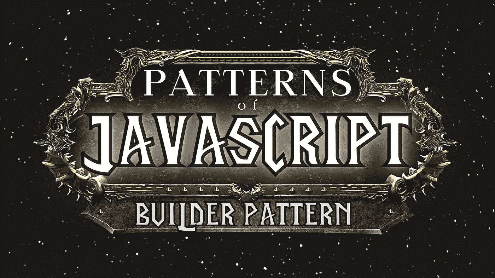
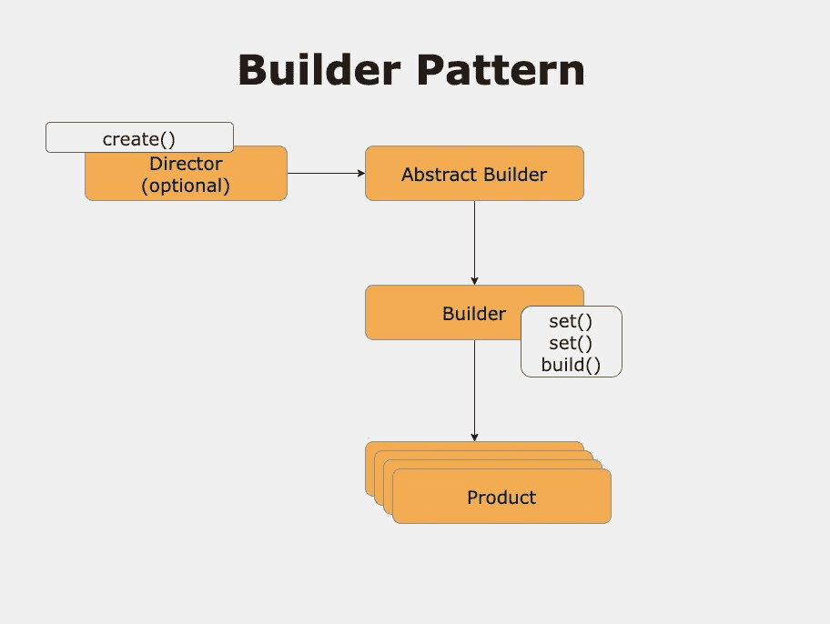
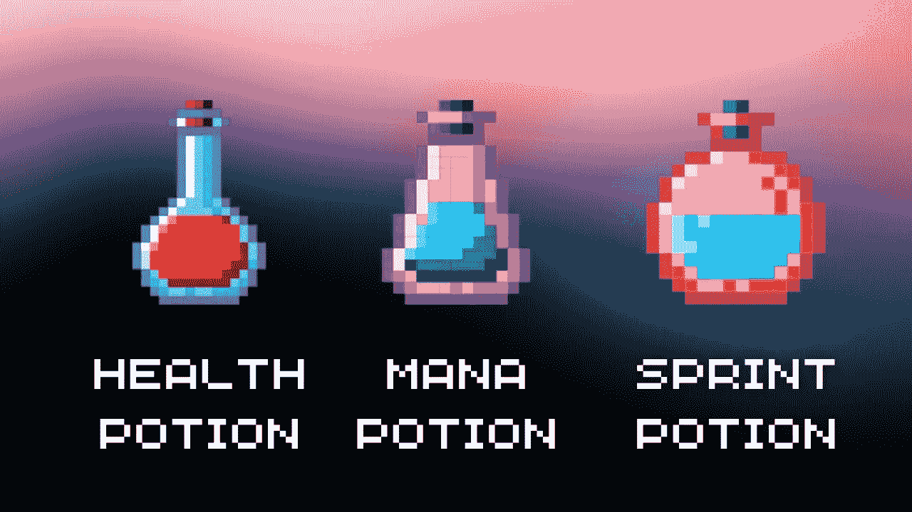
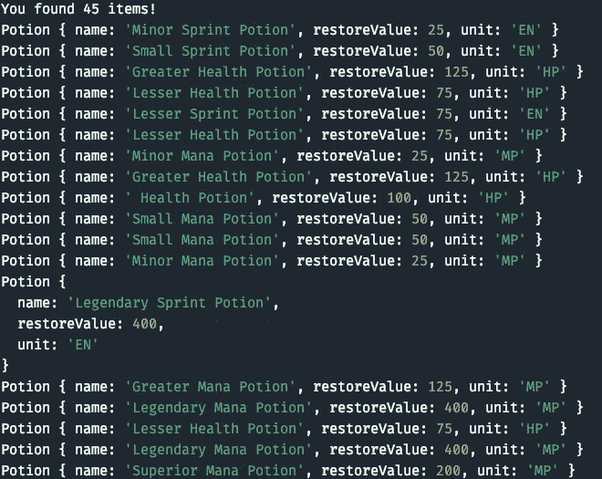
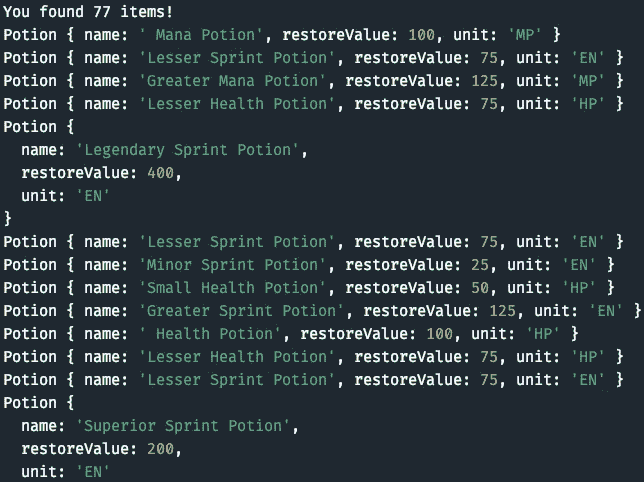

# JavaScript 模式:构建器模式

> 原文：<https://javascript.plainenglish.io/patterns-of-javascript-builder-pattern-fb6cd3aca35b?source=collection_archive---------4----------------------->

## 用一个自动填充的战利品箱来解释



Image made by the [Author](http://www.arnoldcode.com/) via Canva.com

用 JavaScript 开发时，很快就很难创建复杂的对象。随着时间的推移，当你的应用程序增长时，它会很快变得令人不知所措。

***构建器设计模式将帮助你把这个复杂的*** 分解成简单的小步骤。本文中有两个*操作指南*和详细示例。

# 简而言之，构建器模式

这种模式让调用代码(客户端)通过指定类型和内容来构造一个复杂的对象。所有构造细节都被隐藏。

# 何时&为什么使用构建器模式

许多人使用 *Builder* 来简化创建复杂对象的客户端代码。客户仍然可以告诉做什么，但不知道细节。

最好的例子是一个重复但也非常复杂的复合对象。有了构建器，你就获得了封装的力量( [GoF 模式](https://www.gofpatterns.com/))。

通常，最后一步会创建新的对象，因此*构建者*很容易参与到流畅的接口中，这将多个方法调用链接在一起。

***经验法则*** *:如果你的对象很复杂，它的构造器需要很多参数，你最好用一个构造器。*

# 模式概述



**该模式涉及:**

*   **Director:** *一个类，可以用来定义方法，确保步骤按照特定的顺序执行，构建日常对象(可选)。*
*   **抽象构建器→具体构建器:** *多步构建器接口。组装产品并维护它。返回新创建的产品。例 1 中的* `class PotionBuilder` *。(由于没有抽象构建者，具体构建者是抽象构建者和构建者的混合体)*
*   **产品:**组装起来的复杂物件。在示例代码`Potion`中。

# 示例 1:简单的药剂生成器



Image made by the [Author](http://www.arnoldcode.com/) via Canva.com

## 产品

让我们从我们渴望的产品开始:一个`Potion`:

定义一个有意义的药剂，需要一个`name`、一个`restoreValue`和一个`unit`被药剂恢复(*生命值、法力值或者耐力值*)。

```
class Potion {
    constructor(name, restoreValue, unit) {
        this.name = name
        this.restoreValue = restoreValue // in lbs
        this.unit = unit
    }

    drink() {
        console.log(`Consuming: ${this.name}. It restored ${this.restoreValue} ${this.unit}.`)
    }
}
```

出于演示的目的，它有方法`drink()`在以后使用它并得到一个漂亮的`console`打印输出。

## 混凝土建筑商/建筑商

***构建器*** 被称为`PotionBuilder`，分别执行每个构建步骤。你将能够锁住它们。

```
class PotionBuilder {
    constructor(name) {
        this.name = name;
    }

    setRestoreValue(value) {
        this.restore = value;
        return this
    }

    setUnitToRestore(unit) {
        this.unit = unit;
        return this;
    }

    build() {
        if (!('restore' in this)) {
            throw new Error('Restore value is missing')
        }
        if (!('unit' in this)) {
            throw new Error('Unit to restore is missing')
        }
        return new Potion(this.name, this.restore, this.unit)
    }
}
```

它有一个构造函数来给药剂命名，还有两个方法来设置创建过程的值:`setRestoreValue()`和`setUnitToRestore()`。

只要不调用`build()`方法，药剂就存在于构建器的字段中，可以被下一次调用覆盖。`build()`是返回药剂实例的方法。

如果您在设置`restoreValue`或`unit`之前继续`build()`，则会抛出一个错误，通知您缺少值。

```
throw new Error('Restore value is missing')

// snip

throw new Error('Unit to restore is missing')
```

## 抽象生成器

由于 JavaScript 不支持抽象类，你不能创建***abstract builder***。

> 如果您想为自己构建一个控制器，请确保所有的 ***构建器*** 为 ***控制器*** 的工作实现相同的多步骤接口。

## 客户，也就是通话代码

要有效地调用构建器并根据需要链接步骤，只需创建一个新的构建器实例并链接所有必要的步骤。

创建对象后，调用`build()`返回对象。

```
const potion = new PotionBuilder('Minor Mana Potion')
    .setRestoreValue(25)
    .setUnitToRestore('MP')
    .build()
```

这种药剂会有以下效果:

*   ***名称*** :少量法力药剂
*   ***恢复*** : 25
*   ***单位恢复:*** 法力点(MP)

# 运行代码

```
class PotionBuilder {
    constructor(name) {
        this.name = name;
    }

    setRestoreValue(value) {
        this.restore = value;
        return this
    }

    setUnitToRestore(unit) {
        this.unit = unit;
        return this;
    }

    build() {
        if (!('restore' in this)) {
            throw new Error('Restore value is missing')
        }
        if (!('unit' in this)) {
            throw new Error('Unit to restore is missing')
        }
        return new Potion(this.name, this.restore, this.unit)
    }
}

class Potion {
    constructor(name, restoreValue, unit) {
        this.name = name
        this.restoreValue = restoreValue // in lbs
        this.unit = unit
    }

    drink() {
        console.log(`Consuming: ${this.name}. It restored ${this.restoreValue} ${this.unit}.`)
    }
}

const potion = new PotionBuilder('Minor Mana Potion')
    .setRestoreValue(25)
    .setUnitToRestore('MP')
    .build()

potion.drink()
```

包括`potion.drink()`的最后一行，你立即喝完饮料，得到以下打印结果:


Printout for Example 1

# 例 2:自填式百宝箱


Image made by the [Author](http://www.arnoldcode.com/) via Canva.com

*虽然什么都说了******但是我要给你看一个很酷的东西** *。****

***我想给你看一个能自己创造内容的箱子。***

****软件开发*的主要目标是创造:***

> ***消耗配置文件的代码***
> 
> ***产生你想要的任何结果。***

******

***Printout for Example 2***

***那你需要什么？***

*   ***代码从`Example 1`开始没有任何变化***
*   ***可以说，一个“导演”将是一个新的类别`Chest`***
*   ***几个`random`数字***
*   ****记忆跨度短，要遵循指令*😉***

## ***步骤 1:创建配置***

***正如我之前说过的，我想要的圣诞礼物就是一个配置(`options`):***

```
*options = {
    kinds: ['Health', 'Mana', 'Sprint'],
    units: ['HP', 'MP', 'EN'],
    prefixes: ['Minor', 'Small', 'Lesser', '', 'Greater', 'Superior', 'Legendary'],
    restoreValues: [25, 50, 75, 100, 125, 200, 400],
}*
```

## ***步骤 2:将配置添加到新的控制器类***

***config 是我们类中的一个字段。`Chest`:***

```
*class Chest {
    options = {
        kinds: ['Health', 'Mana', 'Sprint'],
        units: ['HP', 'MP', 'EN'],
        prefixes: ['Minor', 'Small', 'Lesser', '', 'Greater', 'Superior', 'Legendary'],
        restoreValues: [25, 50, 75, 100, 125, 200, 400],
    }
}*
```

## ***步骤 3:自主创建内容***

***修改该类，使其具有一个名为`content`的字段来存储可查询的项目。在`constructor`中，一个新的方法`createLoot()`将被调用:***

```
*class Chest {
    options = {
        kinds: ['Health', 'Mana', 'Sprint'],
        units: ['HP', 'MP', 'EN'],
        prefixes: ['Minor', 'Small', 'Lesser', '', 'Greater', 'Superior', 'Legendary'],
        restoreValues: [25, 50, 75, 100, 125, 200, 400],
    }

    content = [];

    constructor() {
        this.createLoot();
    }
}*
```

***解释:***

*   ******种类*** :建造药剂的种类***
*   ******单位*** :恢复的种类(必须与*种类*有相同的索引链接)***
*   ******前缀*** :表示药剂恢复多少的名称***
*   ******恢复值*** :与前缀挂钩的索引，保证少量药剂不会恢复 400 单位的 HP/MP/EN(durance)***

****结果可能各不相同，所以这里有几个例子****

*   ***次要生命药剂恢复 25 点生命***
*   ***传奇法力药水恢复 400 MP***
*   ***小冲刺药水回复 50 EN***

## ***第四步:随机生成器***

***现在你需要一些随机物品来制造大量的药剂:***

```
*createLoot() {
    const lootCount = Math.floor(Math.random() * 100);

    for (let i = 0; i < lootCount; i++) {
        const randomKind = Math.floor(Math.random() * this.options.kinds.length);
        const randomPrefix = Math.floor(Math.random() * this.options.prefixes.length);

        const potionName = this.options.prefixes[randomPrefix] + ' ' + this.options.kinds[randomKind] + ' Potion';
        const unit = this.options.units[randomKind];
        const restoreValue = this.options.restoreValues[randomPrefix];

        const potion =
            new PotionBuilder(potionName)
                .setUnitToRestore(unit)
                .setRestoreValue(restoreValue)
                .build()
        this.content.push(potion)
    }
}*
```

******他们都是做什么的？******

*   ******lootCount*** :指定箱子要装多少物品***
*   ******for 循环*** :迭代`lootCount`用 *PotionBuilder* 构建每一项***
*   ******randomKind*** :访问`options`配置和数组的数字。准确地说是`options.kinds`和`options.units`(记住它们需要相同的索引)***
*   ******randomPrefix*** :访问`options`配置和数组的数字。
    准确地说是`options.prefixes`和`options.restoreValues`(记住它们需要相同的索引)***
*   ******药剂名称*** :随机生成的药剂名称***
*   ******单位*** :它将恢复的随机生成的单位***
*   ******恢复值*** :药剂将恢复的随机生成值***
*   ******药水*** :每次迭代使用`PotionBuilder`实例并根据方法设置值而创建的药水***
*   ***最后，每种药剂都会被推入箱子的`content`阵列中***

## ***第五步:打开箱子***

***您需要为箱子添加一个处理方法，以决定打开箱子时会发生什么:***

```
*open() {
    console.log(`You found ${this.content.length} items!`);
    this.content.forEach(item => console.log(item))
}*
```

## ***第六步:保持概述***

***这是整个班级:***

```
*class Chest {
    options = {
        kinds: ['Health', 'Mana', 'Sprint'],
        units: ['HP', 'MP', 'EN'],
        prefixes: ['Minor', 'Small', 'Lesser', '', 'Greater', 'Superior', 'Legendary'],
        restoreValues: [25, 50, 75, 100, 125, 200, 400],
    }

    content = [];

    constructor() {
        this.createLoot();
    }

    createLoot() {
        const lootCount = Math.floor(Math.random() * 100);

        for (let i = 0; i < lootCount; i++) {
            const randomKind = Math.floor(Math.random() * this.options.kinds.length);
            const randomPrefix = Math.floor(Math.random() * this.options.prefixes.length);

            const potionName = this.options.prefixes[randomPrefix] + ' ' + this.options.kinds[randomKind] + ' Potion';
            const unit = this.options.units[randomKind];
            const restoreValue = this.options.restoreValues[randomPrefix];

            const potion =
                new PotionBuilder(potionName)
                    .setUnitToRestore(unit)
                    .setRestoreValue(restoreValue)
                    .build()
            this.content.push(potion)
        }
    }

    open() {
        console.log(`You found ${this.content.length} items!`);
        this.content.forEach(item => console.log(item))
    }

}*
```

## ***最后一步:运行代码***

***如果所有内容都在同一个文件中，那么只需添加以下代码:***

```
*const bossLoot = new Chest();
bossLoot.open();*
```

***执行 JS 文件:***

```
*node builder_pattern.js*
```

******

***Printout for Example 2***

# ***如果您希望将类和执行代码分开:***

***[](https://medium.com/nerd-for-tech/esmodules-in-javascript-3-minute-guide-04-3e7c7240c5d4) [## JavaScript 中的 ESModules 分钟指南#04

### 获取备忘单&学习如何用 ES 模块导入和导出 JS 代码

medium.com](https://medium.com/nerd-for-tech/esmodules-in-javascript-3-minute-guide-04-3e7c7240c5d4) 

[***节省自己大量的时间，专注于重要的主题。***](https://arnoldcodeacademy.ck.page/26-web-dev-cheat-sheets)

*更多内容看* [***说白了就是 io***](https://plainenglish.io/) *。报名参加我们的* [***免费周报***](http://newsletter.plainenglish.io/) *。关注我们关于* [***推特***](https://twitter.com/inPlainEngHQ) ， [***领英***](https://www.linkedin.com/company/inplainenglish/) *，*[***YouTube***](https://www.youtube.com/channel/UCtipWUghju290NWcn8jhyAw)*[***不和***](https://discord.gg/GtDtUAvyhW) *。对增长黑客感兴趣？检查* [***电路***](https://circuit.ooo/) *。*****