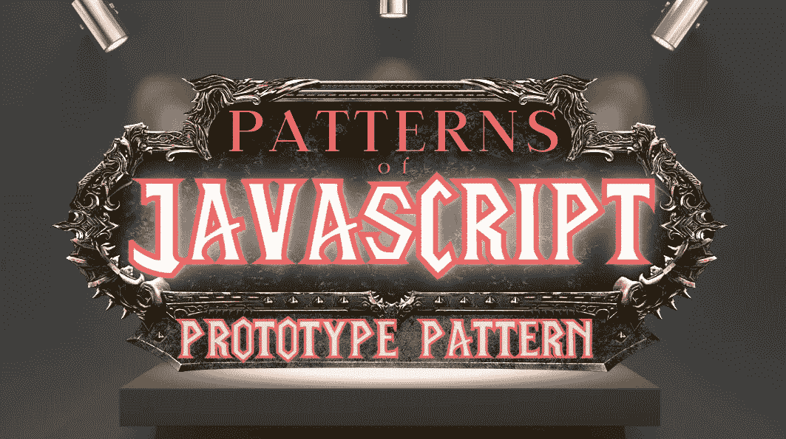
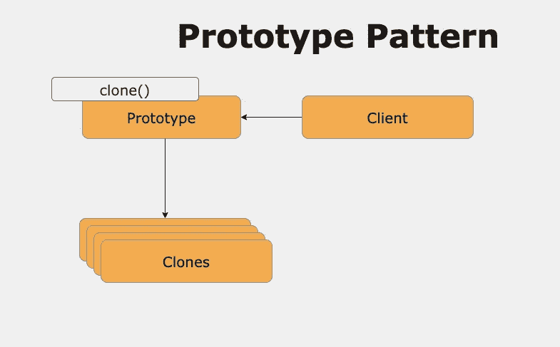
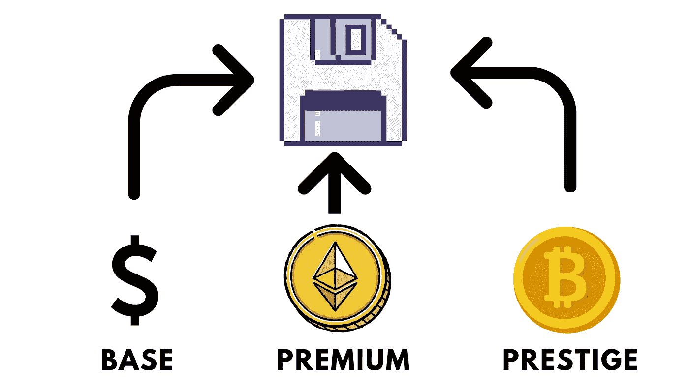
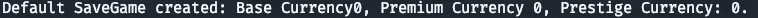
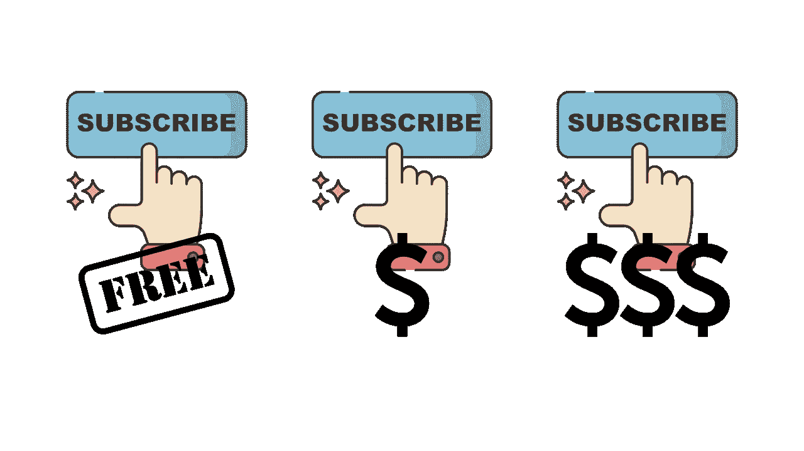
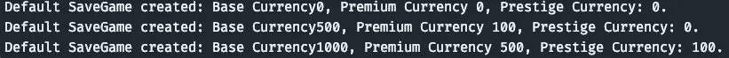

# JavaScript 模式:原型模式(创造性)

> 原文：<https://javascript.plainenglish.io/patterns-of-javascript-prototype-pattern-creational-6f7ae6c03ce9?source=collection_archive---------11----------------------->

## 默认解释为基于订阅的 savegames



Image made by the [Author](http://www.arnoldcode.com/) via Canva.com

***原型模式*** 允许您通过*克隆现有对象而不是创建新对象来创建对象。您也可以根据需要定制它们。*

使用这种模式可以获得以下优势:

*   不需要子类化
*   隐藏创建对象的复杂性
*   在不知道对象类型的情况下获取新对象
*   运行时删除或添加新对象

总的来说，每种模式都属于 3 类中的一类:创造型、结构型和行为型。这种模式被归类为创造性的。你会明白为什么。

> 本文是系列文章的一部分。你会在最后找到其他模式。

# 简而言之，原型模式

*原型模式*使用`clone()`创建新对象。不是返回未初始化的对象，而是返回一个已经初始化的对象。初始化的是基于原型——或示例对象。

*经验法则:当创建对象是昂贵的或资源密集型的时，遵循这种模式。*

> 您可能知道这种模式的名称是“属性模式”。

# 何时&为什么使用原型模式

当用默认值初始化业务对象时，原型模式会很有帮助。克隆它们会接管它们的默认值。

作为一种原型语言，JavaScript 使用原型模式创建新对象，包括它们的原型。

[](https://medium.com/geekculture/javascripts-prototype-inheritance-explained-for-dummies-32b6c4a8a2ef) [## 为傻瓜解释 JavaScripts 原型继承

### 别傻了，读一读原型，让你的整个职业生涯受益

medium.com](https://medium.com/geekculture/javascripts-prototype-inheritance-explained-for-dummies-32b6c4a8a2ef) 

# 模式概述



为了正确地获得这种模式，您需要以下内容:

*   ***客户端:*** 通过克隆一个原型制作一个新的对象。*举例:* `run()` *函数。*
*   ***原型:*** 创建接口克隆自身。*例如:* `SaveGamePrototype`。
*   ***克隆:*** 这些是要使用的克隆对象。*例如:* `SaveGame`。

# 示例 1:默认的开始保存游戏



Image made by the [Author](http://www.arnoldcode.com/) via Canva.com

这个例子将创建一个基础`SaveGame`来进一步工作。这个看你的商业逻辑了。现在，我将创建一个有 3 种货币的`SaveGame`:

*   *基础货币*
*   *溢价货币*
*   *信誉货币*

对于任何一个*默认用户*，我总是想为所有三种货币提供一个`0`。

## 概观

给定一个`SaveGamePrototype`对象，示例代码创建对象的克隆。`SaveGame`原型在其构造器中被接受。

`clone`方法生成新的`SaveGame`对象，用原型构造函数初始化它们的属性值。

以下部分展示了经典的原型模式实现。

## 拯救游戏(零号病人)

这个克隆人(零号病人)有你需要的蓝图。

```
function SaveGame(base, premium, prestige) {

    this.currency = base;
    this.premiumCurrency = premium;
    this.prestigeCurrency = prestige;

    this.info = function () {
        console.log("Default SaveGame created: Base Currency" + this.currency + ", Premium Currency " + this.premiumCurrency +
            ", Prestige Currency: " + this.prestigeCurrency + ".");
    };
}
```

它保存所有 3 种货币的值，并在调用`info()`时将它们打印到控制台。

这将由下一节中的原型来克隆。

## 原型

`SaveGamePrototype`接受一个`proto`类型并保存到它的私有字段中，称为`this.proto`。

```
function SaveGamePrototype(proto) {
    this.proto = proto;

    this.clone = function () {
        const saveGame = new SaveGame();

        saveGame.currency = proto.currency;
        saveGame.premiumCurrency = proto.premiumCurrency;
        saveGame.prestigeCurrency = proto.prestigeCurrency;

        return saveGame;
    };
}
```

调用`clone()`函数时，它将使用保存的所有货币的默认值(`0`、`0`、`0`)创建一个新的`SaveGame`。

## 客户端(也称为执行代码)

使用`const proto`，您可以根据自己的需求创建一个原型。在这种情况下，我想给任何默认用户`0`货币。

```
function run() {

    const proto = new SaveGame(0, 0, 0);
    const prototype = new SaveGamePrototype(proto);

    const saveGame = prototype.clone();
    saveGame.info();
}
```

`const prototype`保存原型对象，您将从其进一步克隆`SaveGames`。最后用`clone()`创建一个专用的`SaveGame`。

## 整个示例和打印输出

```
function SaveGamePrototype(proto) {
    this.proto = proto;

    this.clone = function () {
        const saveGame = new SaveGame();

        saveGame.currency = proto.currency;
        saveGame.premiumCurrency = proto.premiumCurrency;
        saveGame.prestigeCurrency = proto.prestigeCurrency;

        return saveGame;
    };
}

function SaveGame(base, premium, prestige) {

    this.currency = base;
    this.premiumCurrency = premium;
    this.prestigeCurrency = prestige;

    this.info = function () {
        console.log("Default SaveGame created: Base Currency" + this.currency + ", Premium Currency " + this.premiumCurrency +
            ", Prestige Currency: " + this.prestigeCurrency + ".");
    };
}

function run() {

    const proto = new SaveGame(0, 0, 0);
    const prototype = new SaveGamePrototype(proto);

    const saveGame = prototype.clone();
    saveGame.info();
}

run();
```



Console Printout for Example 1

# 示例 2:保存不同订阅的游戏



Image made by the [Author](http://www.arnoldcode.com/) via Canva.com

这个例子将创建 3 个 base `SaveGame`来使用。货币值将取决于所选择的订阅。

您将为选择的每个订阅模式创建一个`SaveGame`:

*   免费用户:0，0，0
*   高级用户:500，100，0
*   高级用户:1000，500，100

## 拯救游戏(零号病人)

这里不需要改变什么。

## 原型

这里不需要改变什么。

但是您应该添加一些默认函数来生成所有三个基于订阅的保存游戏。为了更好地区分它们，为它们分别创建一个“构建器”

```
function getFreeUserSaveGame() {
    return new SaveGame(0, 0, 0);
}
```

```
function getPremiumUserSaveGame() {
    return new SaveGame(500, 100, 0);
}
```

```
function getPrestigeUserSaveGame() {
    return new SaveGame(1000, 500, 100);
}
```

我将调用放入一个名为`initSubscriptionsDefaults`的初始化函数中:

```
function initSubscriptionDefaults() {
    const freeUser = getFreeUserSaveGame();
    const premiumUser = getPremiumUserSaveGame();
    const prestigeUser = getPrestigeUserSaveGame();

    const prototypeFreeUser = new SaveGamePrototype(freeUser);
    const prototypePremiumUser = new SaveGamePrototype(premiumUser);
    const prototypePrestigeUser = new SaveGamePrototype(prestigeUser);

    return [prototypeFreeUser, prototypePremiumUser, prototypePrestigeUser]
}
```

这将返回一个包含我的用例提供的所有 3 种默认原型的数组(记住，三个订阅=三个 savegames)。

## 客户代码

要将它们打印出来，您将把`run()`函数分解成一行:

```
function run() {

    // Your logic to just take one of them (make a wrapper)

    initSubscriptionDefaults().forEach(s => s.clone().info())
}
```

它返回所有三个原型，对它们进行迭代(`.forEach()`)，并对每个原型调用`info()`方法。



Console Printout for Example 1

## 你可能的逻辑

想象一下，你必须实现一个服务，花费$0、$5 或$10，并为你的游戏授予用户不同的起始货币。你可以很粗略地这样实现*:*

```
*function run() {

    const userPayment = 5 // $0, $5 or $10

    let prototype = null;

    switch (userPayment) {
        case 5:
            prototype = new SaveGamePrototype(getPremiumUserSaveGame());
            break;
        case 10:
            prototype = new SaveGamePrototype(getPrestigeUserSaveGame());
            break;
        default:
            prototype = new SaveGamePrototype(getFreeUserSaveGame());
            break;
    }

    const userSaveGame = prototype.clone()

    userSaveGame.info()
}*
```

*使用这种模式允许您访问始终相似的处理例程。只有原型的创建会根据您的业务逻辑进行区分。*

*[*轻松识别代码味道，并用最佳实践模式替换它们。获取"* ***"所有代码闻起来像一行程序*** *"-Cheatsheets。*](https://arnoldcodeacademy.ck.page/code-smells-cheat-sheet)*

# *进一步解释 JavaScript 模式*

*   *[构建器模式](/patterns-of-javascript-builder-pattern-fb6cd3aca35b)*
*   *[抽象工厂](/patterns-of-javascript-abstract-factory-pattern-explained-by-tower-defense-46a36776a391)*
*   *[工厂方法](/world-of-javascript-factory-method-explained-by-tower-defense-spawner-402c69426650)*

**更多内容请看* [***说白了就是***](https://plainenglish.io/) *。**

**报名参加我们的* [***免费每周简讯***](http://newsletter.plainenglish.io/) *。关注我们* [***推特***](https://twitter.com/inPlainEngHQ) ，[***LinkedIn***](https://www.linkedin.com/company/inplainenglish/)*，*[***YouTube***](https://www.youtube.com/channel/UCtipWUghju290NWcn8jhyAw)*，* [***不和***](https://discord.gg/GtDtUAvyhW) ***。****

****有兴趣规模化你的软件创业*** *？检查* [***电路***](https://circuit.ooo?utm=publication-post-cta) *。**