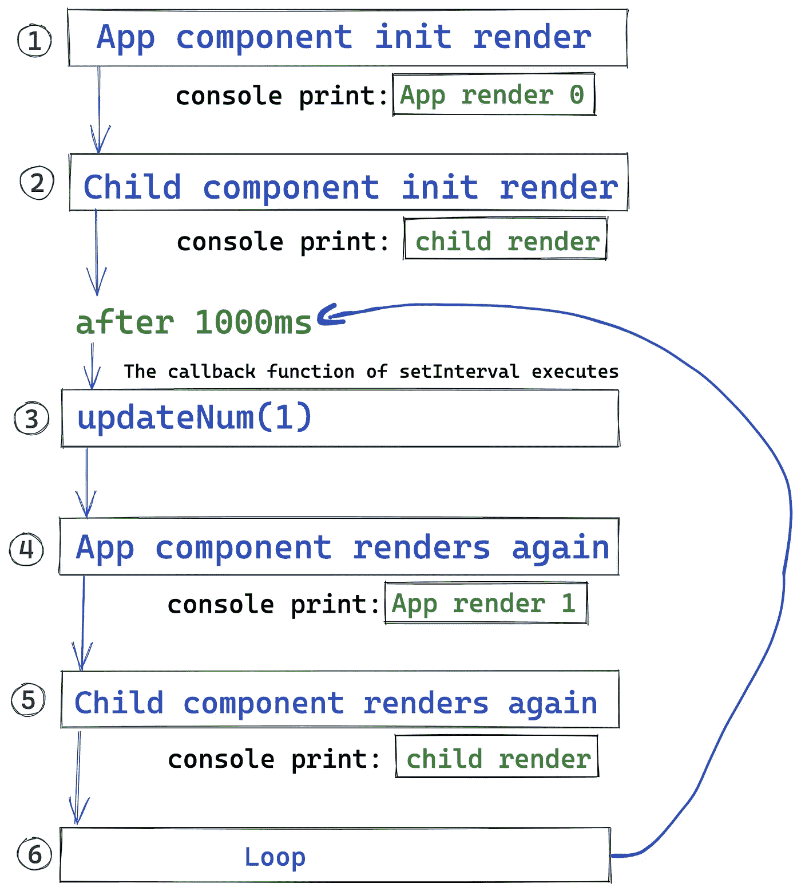
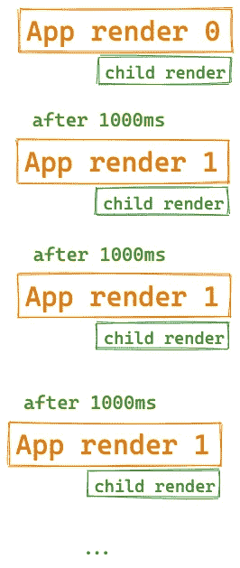
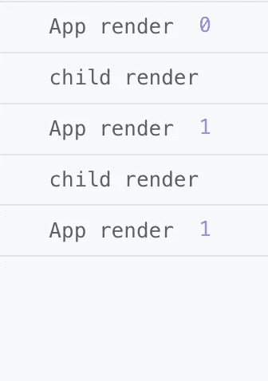
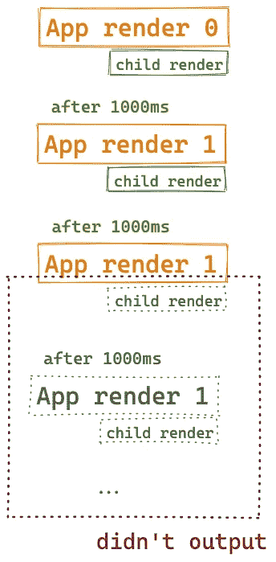
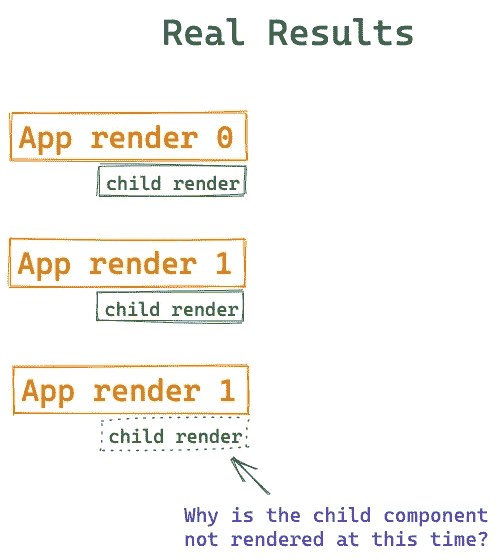
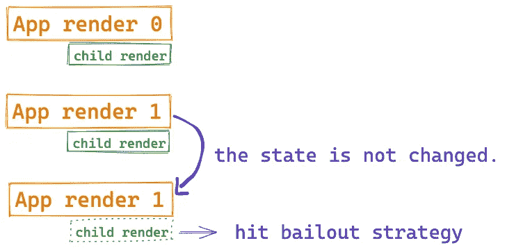
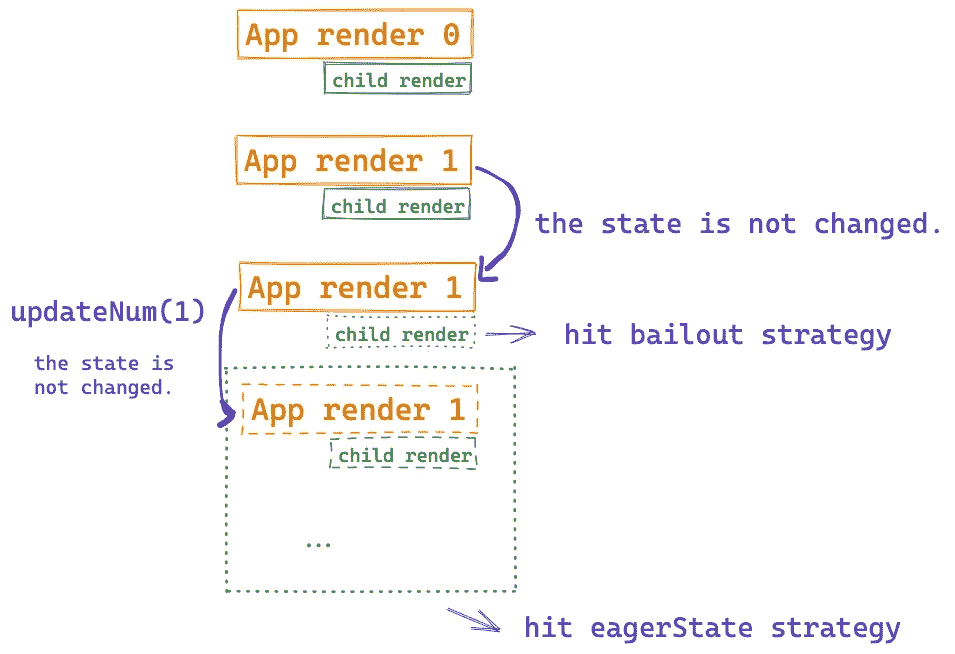

# 你不知道的 React 内部的性能优化策略

> 原文：<https://javascript.plainenglish.io/performance-optimization-strategies-inside-react-you-dont-know-1d46714b483d?source=collection_archive---------0----------------------->

## 成为反应冠军之路。


Photo by [Lautaro Andreani](https://unsplash.com/es/@lautaroandreani?utm_source=medium&utm_medium=referral) on [Unsplash](https://unsplash.com?utm_source=medium&utm_medium=referral)

你知道 React 中有哪些性能优化策略吗？

Vue.js 有自己的模板语法，所以在编译阶段可以采用很多性能优化策略。尽管 React 是一个完整的运行时库，但它的性能优化策略集中在运行时阶段。

在本文中，我打算与您讨论 React 中的一些性能优化策略，以帮助您更深入地了解 React。

# 问题

请阅读以下代码:

您认为这样一个 React 组件将如何工作？或者说组件挂载后控制台会打印多少条信息？

你的答案是什么？

*注意:如果您计划执行这段代码，请不要启用严格模式，因为这会干扰我们的实验。*

```
// remove this code
root.render(
  <StrictMode>
    <App />
  </StrictMode>
);// add this code
root.render(<App />);
```

# 理论分析

如果不考虑任何性能优化策略，我们只是进行纯理论分析，那么代码的运行逻辑应该是这样的:

(*首先我们要知道，一般来说，父组件渲染完之后，子组件也会一起渲染。)*

1.  第一次渲染 App 组件时，控制台打印`App render 0`。
2.  然后子组件第一次渲染，控制台打印`child render`。
3.  1000 毫秒后，`setInterval`的回调函数被触发，执行`updateNum(1)`。
4.  App 组件再次渲染并打印`App render 1`。
5.  子组件再次呈现，打印`child render`。
6.  每隔 1000 毫秒重复步骤 3 至 5

在图表中:



所以控制台打印结果是:



但注意，以上结果只是理论分析。由于 React 做了很多性能优化措施，实际输出可能和我们想的不一样。

如果您开始一个真正的 React 项目，它应该是这样的:



```
App render 0child render App render 1child render App render 1
```

这里我们可以看到，理论分析的结果与实际操作的结果是不一致的。



那么你知道发生了什么，为什么后续流程没有执行吗？在本文中，我们将一起讨论这个问题。

# 优化策略 1:救市

我们之前提到过，一般来说，父组件渲染完之后，子组件也会一起渲染。但是看之前的运行结果，最后一次 App 渲染之后，它的子组件就没有渲染了。为什么？



这是由于 React 内部采用了一种称为**紧急救助**的性能优化策略。具体来说:当`useState`更新的状态与当前状态相同时(使用`Object.is`进行比较)，React 不会渲染组件的后代组件。

如果前后状态相同，那么真的没有必要重新渲染子组件。



但需要注意的是，救市策略只针对当前组件的子组件，当前组件本身仍可能呈现。这是因为在大多数情况下，只有当前组件渲染时，`useState`才会被执行，状态可以被计算出来，然后与当前状态进行比较。

就我们的演示而言，新的`num`只能在执行 App render 和`useState`之后才能计算。

# 优化策略 2: **eagerState**

但是救市策略只针对目标组件的后代组件，那么为什么对于目标组件 App 来说，`App render 1`执行两次后就不执行了呢？

这就是另一种优化策略发挥作用的地方。

React 的工作流程可以简单地概括为:

*   交互(比如点击事件，`useEffect`)触发更新
*   组件树重新渲染

刚刚提到的`bailout`发生在步骤 2:组件树开始渲染后，命中救市的组件的后代组件将不会被渲染。

其实还有一个更前端的优化策略:当第一步如果发现状态没有改变就触发更新时，第二步根本不会继续。

在这个演示中，当执行`updateNum(1)`时，新的`num`会立即计算出来，然后与当前的 num 进行比较。如果相等，则不会渲染组件树。

这种“提前计算状态的时机”的策略被称为`eagerState`。

