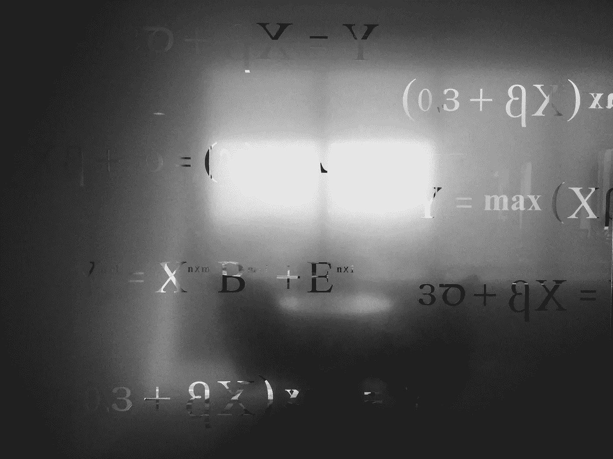

# 在 JavaScript 中执行集合操作

> 原文：<https://javascript.plainenglish.io/performing-set-operations-in-javascript-a8afed1a4a9f?source=collection_archive---------10----------------------->

## 讨论集合运算和在 JavaScript 中执行这些集合运算的代码片段。

Photo by [Saad Ahmad](https://unsplash.com/@saadahmad_umn?utm_source=unsplash&utm_medium=referral&utm_content=creditCopyText) on [Unsplash](https://unsplash.com/s/photos/maths?utm_source=unsplash&utm_medium=referral&utm_content=creditCopyText)

在本文中，我们将讨论集合操作和在 JavaScript 中执行这些集合操作的代码片段。集合只不过是对象的集合，在编程术语中，你可以说是像字符串、数字等原始数据类型的集合。通常，在解决数据结构和算法相关的问题时，你需要找到数组之间或数组联合之间的公共元素，在这种情况下集合运算非常方便。

# **1。联合操作**

并集运算将两个集合的元素合并为一个。

在上面的代码示例中，你可以看到我们已经创建了包含所有`setA`元素的变量`unionSet`，然后我们循环遍历`setB`并将每个元素添加到`unionSet`。

由于集合只包含唯一的元素，任何存在的公共元素都将被忽略。

# **2。相交操作**

对两个集合执行的交集运算给出了两个集合中的公共元素。

在上面的代码中，你可以看到我们已经创建了名为`intersectionSet`的新集合，然后我们循环遍历`setB`的每个元素，并检查该元素是否出现在`setA`中。如果元素存在，那么我们将它添加到`intersectionSet`。

# **3。差分运算**

两个集合之间的集合差运算，给出了在一个集合中存在而在另一个集合中不存在的元素。

在这里的`differenceOperation`函数中，我们循环遍历来自`setB`的元素，并删除来自`setA`的元素，这些元素出现在`setB`中。

# 4.子集操作

两个集合之间的子集运算告诉我们一个集合中的所有元素是否都存在于另一个集合中。

在上面的例子中，我们循环遍历`setB`中的所有元素，并检查该元素是否出现在`setA`中。

这篇文章就是这么说的。感谢阅读。欢迎在评论区分享你的想法。