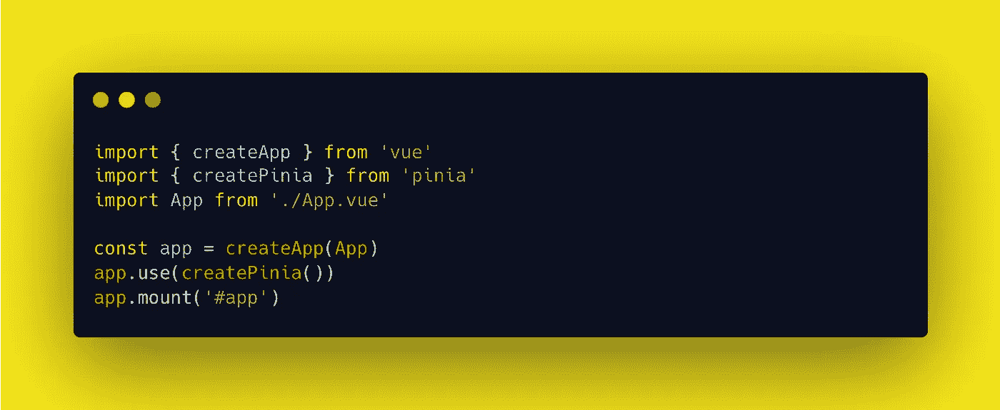
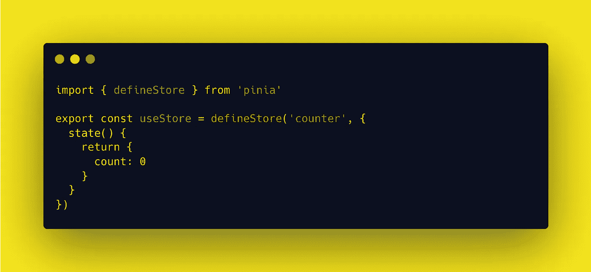
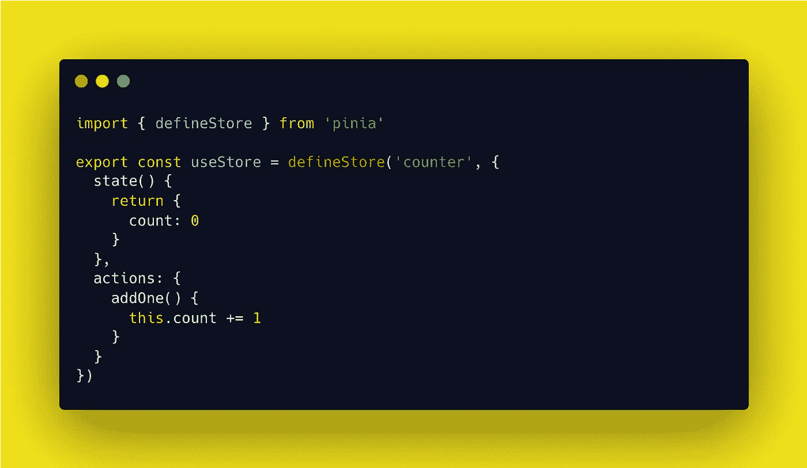
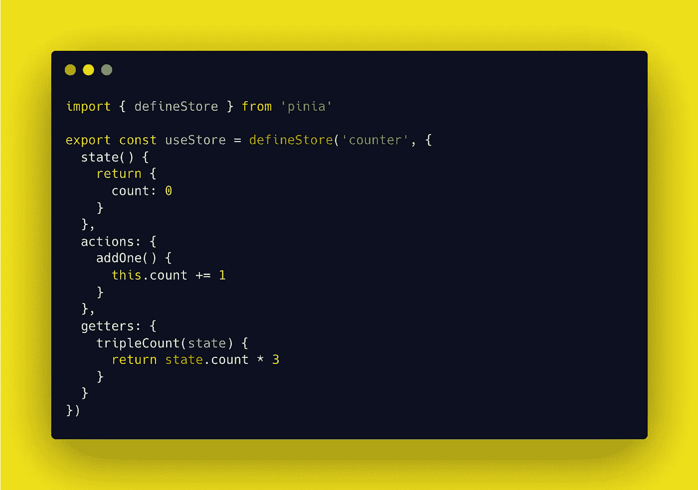
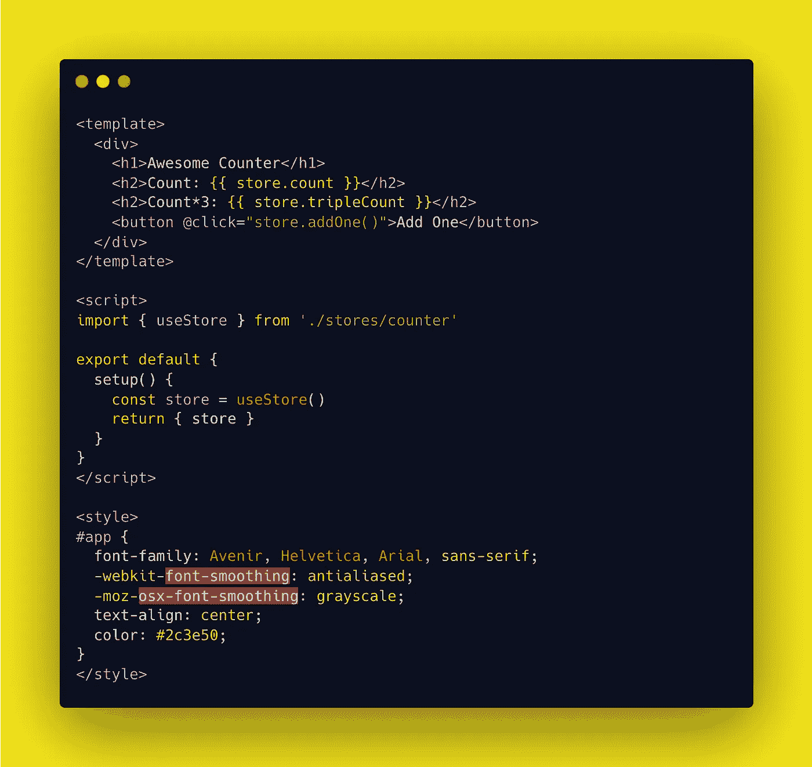
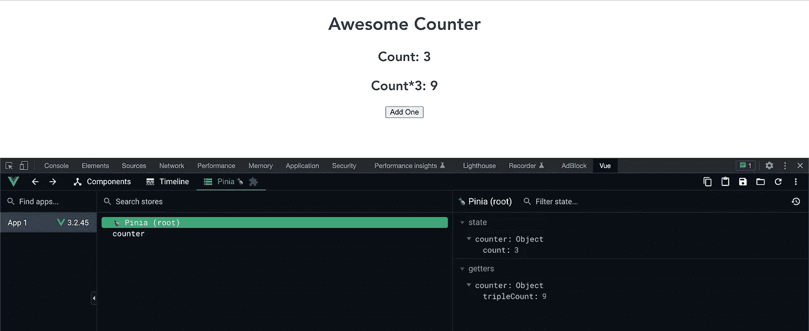

# 使用 Pinia 在 Vue 3 中轻松管理状态

> 原文：<https://javascript.plainenglish.io/pinia-state-management-in-vue-3-d093a33d66c?source=collection_archive---------3----------------------->

Image by [Pexels](https://pixabay.com/users/pexels-2286921/?utm_source=link-attribution&utm_medium=referral&utm_campaign=image&utm_content=1245817) from [Pixabay](https://pixabay.com//?utm_source=link-attribution&utm_medium=referral&utm_campaign=image&utm_content=1245817)

当使用 Vue 3 时，有常见的方法将数据从**父**组件发送到**子**组件，反之亦然。一般来说，`props`用于将数据从**父**发送到**子**，事件`$emits`用于将数据从子发送到父。`provide`和`inject`可用于从祖父母向孙子女发送数据。

对于路由器和功能都很少的简单 app 来说，这可能就足够了。然而，对于一个大型复杂的项目，状态管理可能变得至关重要。

# 🍍皮尼亚来救援了。

**Pinia** 是一个运行在[组合 API](https://vuejs.org/api/composition-api-setup.html) 上的状态管理库。通过 Pinia，变量可以在单个对象中声明，并在所有组件中使用。在 Pinia 之前， **Vuex** 是常用的，可以作为替代。

Pinia 的组成如下:

*   **状态**:店铺的中心部分
*   **动作**:类似于方法，用于为状态定义业务逻辑
*   **Getter** :相当于状态的计算值

# 我们来试试吧！

让我们通过一个简单的计数器应用程序来尝试使用 Pinia。注意每个组件(**状态**、**动作**、**获取**)是如何被使用和调用的。

要使用 Pinia，首先使用`npm install pinia`将其安装到我们的 Vue 项目中。

然后，在 main.js 文件中，我们导入`createPinia`方法并使用`app.use`调用该方法。

现在我们在项目中创建一个名为`stores`的文件夹，文件名为`counter.js`来存储我们的数据。从文件夹的名称可以看出，我们可能有多个使用 Pinia 的商店。

## 构成部分 1:国家

状态包含我们希望在组件之间分发的数据。我们使用 Pinia 的`defineStore`方法将状态对象定义到变量`**useStore**`中。`state()`中的对象包含我们可以操作的`count`数据。

## 构成部分 2:行动

动作是调用状态对象突变的方法。接下来，我们在`actions`内部创建一个`*addOne()*`方法，当在外部调用时，将一个方法添加到我们的`count`数据中。

## 组件 3:吸气剂

Getters 的作用类似于计算组件，当状态改变时会重新计算。因此，我们使用`state`作为参数来调用 getter。方法`*tripleCount(state)*`将返回三倍的电流`count`。

## 将数据连接到用户界面

要使用它，我们需要做的就是创建一个 Vue 文件来读取我们商店中的数据。让我们在`App.vue`中做这件事。

我们称之为使用 import 直接导入我们的数据。然后，我们在`setup()`内调用它，利用组合 API ( `data()`也可以)。对于我们的输出，我们分别为`count` state 和`tripleCount` getter 创建一个头。我们有一个按钮，使用`addOne()`动作将我们的计数增加 1。

同样，我们可以为不同的数据创建更多的存储，并创建更多的组件来读取我们的反应数据。一个额外的好处是 Pinia 既轻便又能支持 Typescript。

这是我们的最终输出。

好消息是，我们可以使用 Chrome 的 [**Vue 开发工具**](https://chrome.google.com/webstore/detail/vuejs-devtools/nhdogjmejiglipccpnnnanhbledajbpd/related?hl=en) 在 Pinia 中交互跟踪我们的`state`和`getters`。

## 就是这样！

使用 Vue 状态管理还有很多方面，还有 Pinia 的用例。这只是冰山一角。我希望这足够吸引你去订婚。

点击此处了解更多信息！

*   [https://pinia.vuejs.org/](https://pinia.vuejs.org/)
*   [https://vuex.vuejs.org/#what-is-a-state-management-pattern](https://vuex.vuejs.org/#what-is-a-state-management-pattern)

现在我们有了。我希望你已经发现这是有用的。感谢您的阅读！

*更多内容请看*[***plain English . io***](https://plainenglish.io/)*。报名参加我们的* [***免费周报***](http://newsletter.plainenglish.io/) *。关注我们关于*[***Twitter***](https://twitter.com/inPlainEngHQ)[***LinkedIn***](https://www.linkedin.com/company/inplainenglish/)*[***YouTube***](https://www.youtube.com/channel/UCtipWUghju290NWcn8jhyAw)*[***不和***](https://discord.gg/GtDtUAvyhW) ***。*****

*****对缩放您的软件启动感兴趣*** *？检查* [***电路***](https://circuit.ooo?utm=publication-post-cta) *。***