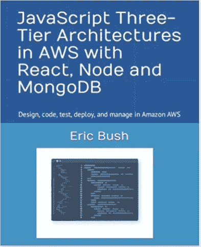

# 平台技术债务排毒

> 原文：<https://javascript.plainenglish.io/platform-tech-debt-detox-b9889d3e0d26?source=collection_archive---------21----------------------->

## 你的技术堆栈需要的不仅仅是新功能的开发，它还需要不断的关注，以保持它没有技术债务。

Licensed from [BrianAJackson](https://www.istockphoto.com/portfolio/BrianAJackson?mediatype=photography) on istockphoto.com

在构建任何软件应用程序的开始，您需要选择您的技术堆栈将由什么组成。您的技术栈是代码语言、框架、操作系统、数据传输协议、标准和其他构建软件应用平台的技术的集合。这些是您用于前端、后端(服务、批处理、ETL、消息总线/队列、数据库等)的技术，以及您与第三方服务或客户端系统集成的所有技术。

# 明智地选择

一旦你对一个技术栈做出承诺，就很难从它的任何部分切换，因为它会变得如此错综复杂。你必须清楚地从最适合你的员工所知道的，或者他们可以很容易跟上的角度出发，做出你最初的技术选择。

*   **获取价值必须简单快捷。**
*   **它必须被广泛采用，并承诺支持增长和未来相关性。**
*   **它必须是你的员工已经熟练或能够熟练掌握并乐于使用的东西。**

# 好消息是

好消息是，这无疑是一个软件开发人员的大好时机。有很多有用的语言和框架可以利用。它如此伟大的原因之一是有无数的开源项目可供利用。现在有一些框架可以帮助你处理从后端服务到前端 GUI 的每一层架构。在您的开发中，有数百种技术可供选择。

除了可用的语言和开源之外，AWS 云托管还具有惊人的 PaaS(平台即服务)功能，可以完全实现“云原生”。这使得开发人员可以花更多的时间来编写优秀的特性，而不是担心机器是否打了补丁或者如何实现高可用性。

# Sh**(科技债)发生了

这样做的缺点是，所有这些软件和硬件技术的进步都很难跟上。开始一个项目三年后，当新事物出现时，你可能会后悔选择技术堆栈。您可能会发现先前选择的内容有一些限制。更大的问题是，即使你做了选择，也需要你进行版本更新。你真的需要付出持续的努力来跟上你构建平台时所依赖的几十个或者可能几百个组件。

随着时间的推移，语言和框架会被弃用，当它们不再得到支持时，这是一个真正的风险。您可能会发现一个永远无法修复的臭虫。更糟糕的是，可能存在一个被利用的安全漏洞，这个漏洞不会得到解决。此外，您可能无法雇用任何有技能的人，也无法留住希望在传统技术堆栈上工作的员工。

*“生命是痛苦的，殿下。任何告诉你不同的人都是在卖东西”——引用电影《公主新娘》中的话*

技术债务是对旧操作系统、数据库、框架、语言版本等的使用。或者你没有写好的代码是脆弱的、整体的、不可测试的，需要重构，或者以任何方式拖累你。

*“久而久之，制度变得越来越不井井有条了。这种固定迟早会失去任何优势。向前的每一步都与向后的一步相匹配。尽管原则上可以永远使用，但作为进步的基础，这个系统已经磨损了。……全新的、从头开始的重新设计是必要的。”——小佛瑞德·P·布鲁克斯，神话中的人类月:软件工程论文集*

# 需要解毒

我是一个非常注重健康的人，每个月都会做一次身体排毒。这意味着我有一些特殊的补充药丸和排毒茶，并可能做一些空腹排毒我的身体。由于我们摄入的加工食品和水以及我们可能呼吸的坏空气，有害毒素积聚。我们的身体会老化，需要清除废物并再生新细胞。

软件也会老化，随着时间的推移，需要更换和更新。它需要经历一次净化。这可能需要对代码进行一些重构，甚至可能需要对代码库进行一次完整的重写。有代码扫描工具，您可以用来分析健康和需要的技术债务消除。

*“系统程序构建是一个熵减少的过程，因此本质上是亚稳定的。程序维护是一个熵增的过程，即使是最熟练的执行也只会延迟系统陷入不可修复的过时状态。”——小佛瑞德·P·布鲁克斯，神话中的人类月:软件工程论文集*

# 不懈的努力

不解决技术债务的时间越长，就越难消除。在我在 Waypoint path finders([waypoint.co](https://waypoint.co))的工作中，我审查技术平台，作为技术尽职调查工作的一部分。很多时候，我会看到一堆停滞在 20 年前甚至更久的技术。在许多情况下，需要完全重写才能成为现代多租户技术体系。即使拥有更现代技术的公司仍然需要不断更新他们的代码，并适应他们所构建的框架的更新。例如，您可能正在使用一个旧版本的 Oracle 数据库或一个旧版本的 PHP。信不信由你，可能需要几个月才能过渡到新版本，甚至一年或更长时间才能切换到完全不同的技术。

*“系统程序构建是一个熵减少的过程，因此本质上是亚稳态的。程序维护是一个熵增加的过程，即使是最熟练的执行也只能延缓系统陷入不可修复的过时状态。”—小佛瑞德·P·布鲁克斯，神话中的人月:软件工程论文*

# 两年了，已经过时了？

我想写一本关于 JavaScript 编程的书，所以在 2014 年我开始写我的书和一个示例应用程序。我选择了 AngularJS、Node.js 和 Azure DocumentDB，并将其托管在 Azure 中。我会用 2016 年的大部分时间来完成这本书，并在 2016 年 8 月出版。

[Amazon book I wrote](https://www.amazon.com/gp/product/0997196696/)

这本书仅仅用了两年就过时了，我决定重写这本书和附带的示例应用程序。这次我使用 React 和 MongoDB，并将主机转移到 AWS。Angular 已经完全改变了，我发现它不再是一个好的平台。Azure 决定改变对 DocumentDB 的支持，并将其转化为新技术。我也看到 AWS 被吹捧为领先的云平台提供商，并希望利用这一势头(我从 Azure 转向 AWS，并一直很高兴我这样做了)。

这些变化要求我在 2018 年对我的书进行重大重写。现在是 2022 年，这本书和示例应用程序又有点过时了。我决定重写大约四分之一的代码，并刚刚出版了我的最新书籍，标题是“AWS 中的 JavaScript 三层架构与 React、Node.js 和 MongoDB:亚马逊 AWS 中的设计、编码、测试、部署和管理”([在亚马逊](https://www.amazon.com/dp/0997196696/)上找到它)。

为了更新我的示例应用程序，我做的第一件事是运行“npm audit”、“npx npm-check-updates”，然后运行“npx npm-check-updates -u”来获取更新。

我花了大约三个星期的时间才真正修复了应用程序中所有已经损坏并且需要更新的部分。例如，NPM 模块反应-导航路由发生了变化，服务器端点安全设置模块发生了变化。Node.js MongoDB 驱动程序经历了一次重大更新，需要我做一些更改。Bootstrap 的图像字体使用已经消失，需要用字体 Awesome 来代替。我一直在派生一个后台进程来卸载主进程。我把代码重写了一遍，以便在 AWS Lambda 中运行。然后就是我之前用 Enzyme 和 Selenium 做 UI 测试已经过时了，所以更新到了 [React 测试库](https://testing-library.com/)。

# 结论

管理层必须同意，在工程进度中，一定比例的时间不仅需要用于修复 bug，还需要用于清除技术债务。所有的技术债务都需要输入到你的项目跟踪系统中，进行优先排序和安排。在某个时候(希望不是很多年)，对于架构的给定层，完全重写是不可避免的。这就是软件技术的本质。

*更多内容看* [***说白了。报名参加我们的***](https://plainenglish.io/) **[***免费周报***](http://newsletter.plainenglish.io/) *。关注我们关于*[***Twitter***](https://twitter.com/inPlainEngHQ)*和*[***LinkedIn***](https://www.linkedin.com/company/inplainenglish/)*。加入我们的* [***社区***](https://discord.gg/GtDtUAvyhW) *。***