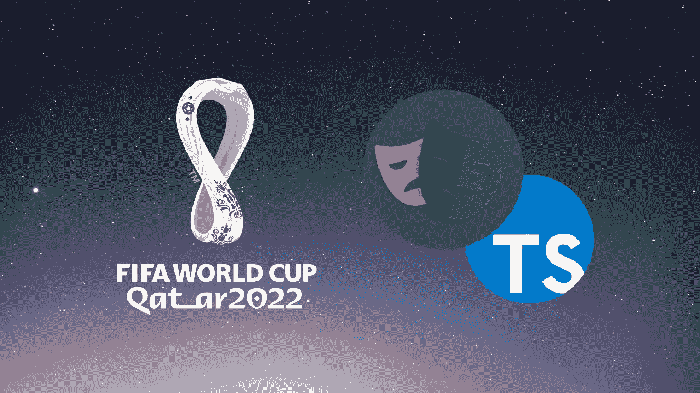

# 国际足联世界杯网站上带打字教程的剧作家

> 原文：<https://javascript.plainenglish.io/playwright-with-typescript-tutorial-on-fifa-world-cup-site-356186d54ebd?source=collection_archive---------4----------------------->

## 使用剧作家和打字稿自动化 FIFA 世界杯网站。

在这个视频中，我们将使用剧作家和打字稿自动化国际足联世界杯网站。让我们快速回顾一下剧作家:

剧作家是当今市场上最受欢迎的端到端自动化工具之一。它支持多种语言，如 Typescript、JavaScript、Python 等。Net 和 Java。它支持所有主流浏览器，如 Chrome、Firefox 和 Safari 等。开始使用剧作家很容易，只需几个步骤，您就可以运行您的第一个测试。

下面的视频将涵盖以下主题-

*   **设置和安装**:我们将经历安装和设置剧作家的过程，以及必要的依赖项和工具。
*   **项目和配置概述:**我们将提供项目结构和配置的概述，包括如何定义和组织测试，以及如何定制设置和偏好。
*   **编写第一个剧作家测试:**我们将向您展示如何使用 Typescript 和剧作家 API 编写您的第一个剧作家测试。这将包括语法和概念的介绍，以及创建和运行您的第一个测试的逐步指南。
*   剧作家页面定位器:我们将解释如何使用剧作家页面定位器，这是一个识别和选择网页元素的强大工具。
*   **使用多个元素:**我们将演示如何在一个页面上使用多个元素并从中检索文本。
*   **禁用 HTML 报告:**我们将向您展示如何禁用 HTML 报告，这是剧作家的一个特性，它可以自动生成测试结果的 HTML 报告。
*   **剧作家调试器/检查器:**我们将向您介绍剧作家调试器和检查器，它们是实时调试和检查您的测试的强大工具。这将包括不同调试器和检查器特性的概述，以及如何使用它们来诊断和修复测试中的问题。
*   还有更多..

**👩🏻‍💻访问源代码** [**这里**](https://subscribepage.io/fifa-pw) **。**

要了解更多关于剧作家的知识，请点击这里查看我关于剧作家的全部课程

[https://automationbro.com/playwright-course](https://automationbro.com/playwright-course)

👩🏻‍💻是时候加入 SDET 大学学院来推进你的职业生涯了👇🏻
[加入学院](https://bit.ly/3Vcqv69)

📧订阅我的[邮件列表](https://automationbro.com/mailing-list)以获取更多类似的内容，并成为令人惊叹的免费赠品的一部分。

👍你也可以在这里关注我的内容

*   [推特](https://twitter.com/automationbro)
*   [领英](https://www.linkedin.com/company/automation-bro)

…

感谢阅读！

*更多内容看* [***说白了就是 io***](https://plainenglish.io/) *。报名参加我们的* [***免费周报***](http://newsletter.plainenglish.io/) *。关注我们关于* [***推特***](https://twitter.com/inPlainEngHQ) ， [***领英***](https://www.linkedin.com/company/inplainenglish/) *，*[***YouTube***](https://www.youtube.com/channel/UCtipWUghju290NWcn8jhyAw)*[***不和***](https://discord.gg/GtDtUAvyhW) *。对增长黑客感兴趣？检查* [***电路***](https://circuit.ooo/) *。**