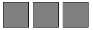

# 在 React 中使用样式化组件混合的聚合填充 CSS

> 原文：<https://javascript.plainenglish.io/polyfill-flex-gap-using-mixin-function-with-styled-components-201be7951fd3?source=collection_archive---------7----------------------->

## 以挠性间隙聚合填充物为例


Image from Envato Elements (license code: WKRCBG5HQ3)

# 风格组件和弹性间隙简介

[Styled-components](https://styled-components.com/) 是一种向 React 项目添加样式的现代方法。与使用单独管道将样式代码编译成 CSS 的 SCSS/萨斯不同，styled-component 允许我们使用类似 SCSS 的语法混合 JavaScript 来编写 CSS，并且它将生成的样式应用到目标 React 组件，而无需担心类名冲突。

CSS 属性`gap`是 flexbox 特性家族中的一颗新星。它用于表示 flex 容器中子项目之间的间距，而没有令人头疼的`margin`。

想象一下:

*   我们将一个`StyledParent`组件定义为 flex 容器，这意味着其中的子项之间应该有一个空格`8px`
*   我们将一个`StyledChild`组件定义为 flex 项，它呈现一个具有固定高度和宽度的灰色框
*   我们在一个`StyledParent`中放置了三个`StyledChild`，代码如下:

然后我们可以看到在三个灰色框之间应用了`8px`间距:



更深入的解释[1]和浏览器兼容性状态[2]可以在参考资料部分找到。

# **使用 mixins 的带样式组件的聚合填充物**

在应用程序需要运行的浏览器中，并非所有现代 CSS 属性都受支持，您可以选择不使用它们或应用 polyfill。

polyfill CSS 的一种传统方式是使用一种后处理工具，如`PostCSS`来识别 polyfill，并在捆绑后将其添加到最终的样式表中。但是有了`styled-components`，我们又多了一个选择——`mixins`。

`mixins`的概念类似于 SCSS/萨斯:一个生成可重用 CSS 块的函数——在我们的上下文中，它只是一个 JavaScript 函数！

也就是说，我们想要编写一个 JavaScript 函数来:

*   检测浏览器是否支持该功能
*   如果支持，我们可以生成不带 polyfill 的最新版本的 CSS
*   如果不支持，我们生成多填充 CSS

例如，我们想替换…

```
export const StyledParent = styled.div`
  display: flex;
  **gap: 8px;**
`;
```

…与…

```
export const StyledParentWithMixin = styled.div`
  display: flex;
  **${flexGap("8px")}**
`;
```

…实施非常简单

> 注意:本文提供的多填充代码并不是涵盖所有边缘情况的完整解决方案，但它适用于简单的用途(例如，`gap`使用绝对值)

你可能想知道为什么我们需要用 JavaScript 而不是`supports`来检测 CSS 特性支持——这是因为有时不使用 JavaScript 很难做到这一点[3]。

检测代码可以在下面找到:

Modified from [https://github.com/Modernizr/Modernizr/blob/master/feature-detects/css/flexgap.js](https://github.com/Modernizr/Modernizr/blob/master/feature-detects/css/flexgap.js)

这里需要注意的是，实际的检测逻辑将在运行时只运行一次，并将缓存的结果用于所有后续调用，因此性能不会受到影响。

# 操场

# 参考

*   [1] [gap | CSS-Tricks](https://css-tricks.com/almanac/properties/g/gap/)
*   [2] [我可以使用 flex-gap 吗？](https://caniuse.com/flexbox-gap)
*   [3] [如何检测浏览器对 Flexbox Gap 的支持？](https://ishadeed.com/article/flexbox-gap/)

*更多内容看* [***说白了。报名参加我们的***](http://plainenglish.io/) **[***免费周报***](http://newsletter.plainenglish.io/) *。在我们的* [***社区不和谐***](https://discord.gg/GtDtUAvyhW) *获得独家获取写作机会和建议。***