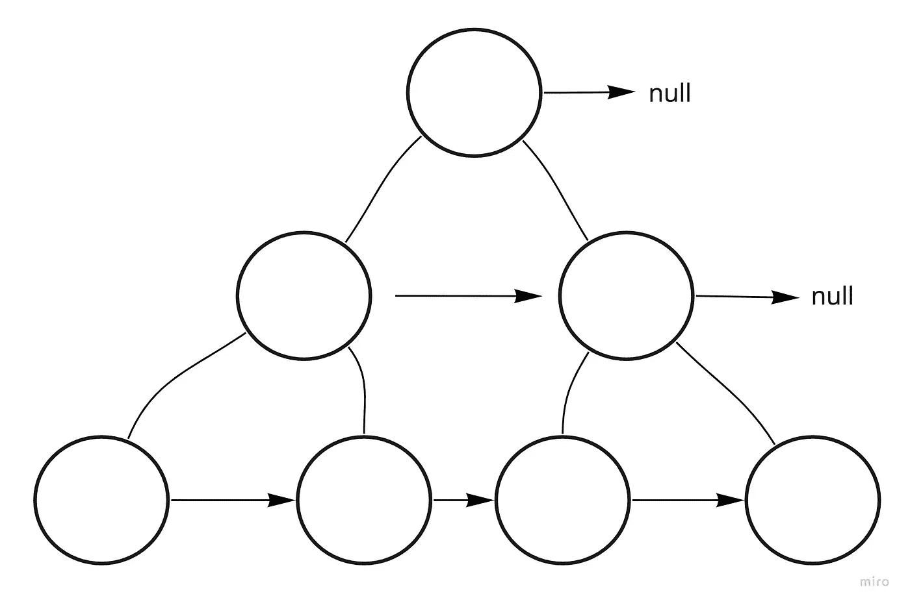

# 用 JavaScript 填充二叉树中的右下指针

> 原文：<https://javascript.plainenglish.io/populating-next-right-pointers-in-binary-tree-e22538ce9939?source=collection_archive---------17----------------------->

## Leetcode 问题的简单解法。

就在最近，我终于转到真正享受 Leetcode 问题。当然，我仍在不断完善我的技能，我想分享一个最近的解决方案。

这是一个中级的[问题](https://leetcode.com/problems/populating-next-right-pointers-in-each-node/),要求完美二叉树的每个节点上的“下一个”属性指向右边的节点，如果右边没有节点，该属性保持为空。

坦白地说，这是一个幼稚的解决方案，而且绝不是高性能的，但是对我来说，在进入更复杂的重构和方法之前看到这样的解决方案通常会有所帮助。

我们开始使用的构造函数:

思考方法:

考虑如何在树中移动，以便轻松访问同一层的下一个节点，这让人想起了使用队列的广度优先遍历。这样，当我们在队列中移动时，如果手边的节点符合我们的标准，那么它的“下一个”指针可以很容易地指向队列中的下一个节点。

但是这些标准是什么呢？为了决定是否应该指向队列中的下一个值，我们真正需要知道什么？…

……当前节点*是当前级别的最后一个节点吗？*

如果是，那么指针(默认情况下)将保持为空，我们可以继续。在所有其他情况下，我们可以将“next”分配给队列中的下一个。

因此，通过在我们访问过的每个节点上增加一个计数器，我们可以评估它，并确定我们当前是否在一个级别的末尾。每个级别的开始(就我们的计数器而言)将是 2 的幂。

给定我们当前的计数，这个助手会给我们 2 的下一次幂，或者更确切地说是下一关开始的计数。所以，为了确定我们现在的节点是否在一层的末端-

现在，对于每个被访问的节点，我们可以很容易地确定它的下一个指针是保持为空，还是指向队列中的下一个。

下面是主要功能:

同样，虽然 Leetcode 接受了这一点，但它还远远没有优化。但是作为第一个想到的方法，它是有效和简单的。

*更多内容请看*[***plain English . io***](https://plainenglish.io/)*。报名参加我们的* [***免费周报***](http://newsletter.plainenglish.io/) *。关注我们关于*[***Twitter***](https://twitter.com/inPlainEngHQ)*和*[***LinkedIn***](https://www.linkedin.com/company/inplainenglish/)*。加入我们的* [***社区不和谐***](https://discord.gg/GtDtUAvyhW) *。*