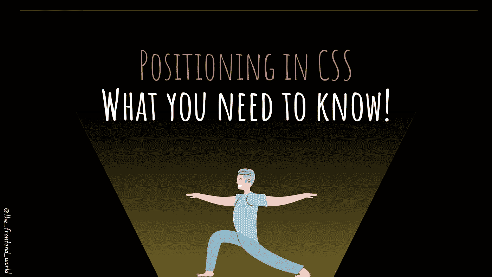
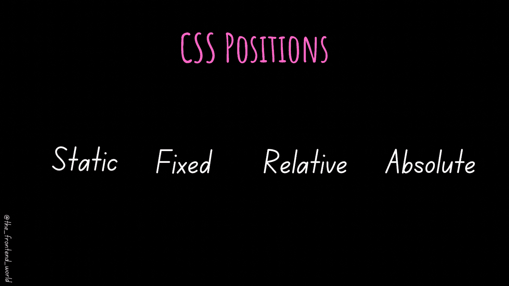
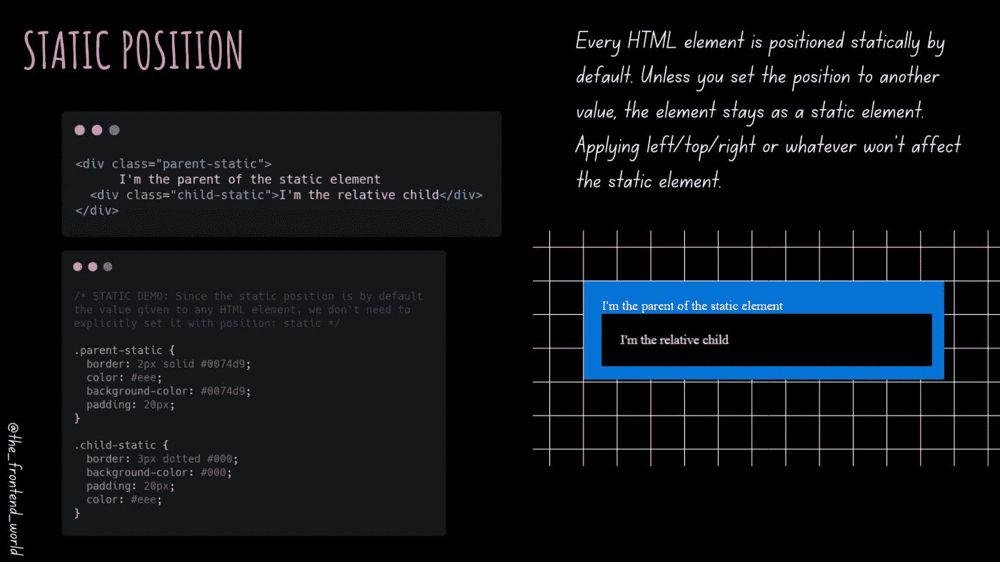
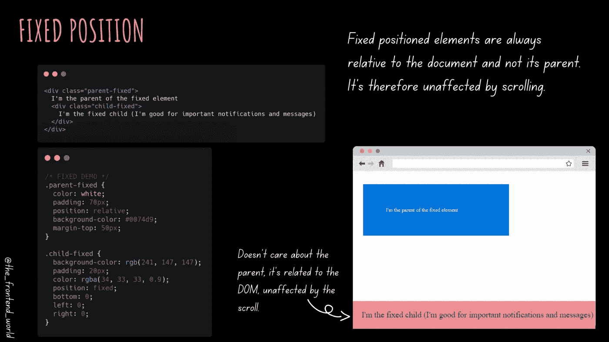
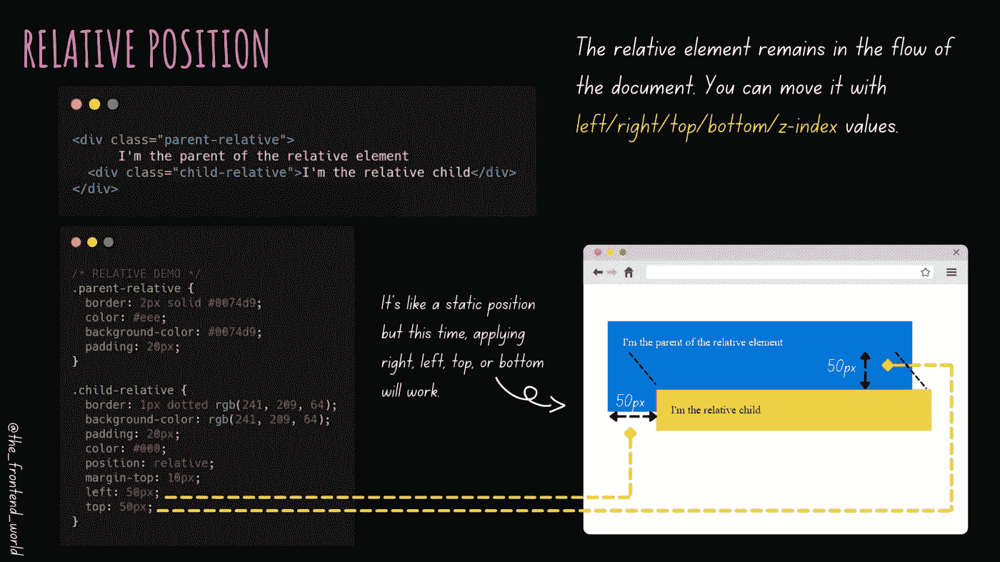
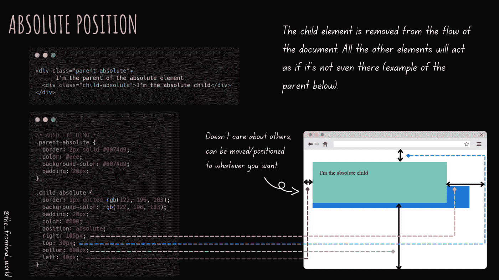

# CSS 中的定位指南

> 原文：<https://javascript.plainenglish.io/positioning-in-css-62ded441ef4d?source=collection_archive---------12----------------------->

## 你需要知道的！

By FAM

在 CSS 中，定位是必修课。没有 web 应用前端元素的正确定位，我们看不到任何有意义的东西，对吗？

这篇文章将会给你一些关于 CSS 定位的基本知识和一个关于它的终生的心理图像！

让我们的故事开始吧！

# CSS 定位是什么？

CSS 中的位置是一个 ***属性*** ，它赋予你在应用程序的前端或用户界面上定位元素的权力。它有不同的选择:

*   一个`static`位置(默认位置)
*   一个`fixed`位置
*   一个`relative`的位置
*   一个`absolute`位置

By FAM

# CSS 位置选项…让我们开始吧！

## —`static`的位置

此选项将静态地将元素定位在顶部、底部、左侧或右侧。顺便说一下，这个位置选项或值是每个 HTML 元素的默认值。

因为静态位置是默认给任何 HTML 元素的值，所以我们不需要显式地设置它`***position: static***`

By FAM

## -固定位置

固定位置是使元素相对于视口的位置。

因此，元素的固定位置是相对于文档的，所以它的值不受滚动的影响。即使在滚动时，它也固定在文档上。

By FAM

## -`relative`位置

相对位置顾名思义就是相对于其当前位置。这就像一个静态的位置，我们可以用左/右/上/下值来移动。

By FAM

## -绝对位置

绝对位置是指元素相对于没有静态位置的最近的父元素的位置。

By FAM

# 源代码

您可以在 [2022 Web 程序报告](https://github.com/famzila/2022-WEB-PROGRAM/blob/main/Chapter3/positioning.html)中找到示例源代码。

您可以获取代码并使用它，或者使用提供的 [stackblitz](https://stackblitz.com/edit/web-platform-zrejgk?file=index.html) 项目并使用 CSS 值和位置属性。尝试一下吧！

By FAM

# 视频版本

By FAM

下一篇文章将教你先进的 CSS 定位技术。

今天就到这里，看阿雅🙋

如果您有任何问题或反馈，请点击评论或通过 LinkedIn 联系我— **我洗耳恭听！**

[**想请我喝杯咖啡吗？☕️**](https://www.buymeacoffee.com/fatimaamzil)

> 让我们为 2022 年打造一个更好的‘我们’！

## 了解有关 2022 年网络快车计划的更多信息:

I- [网络常识](https://medium.com/geekculture/2022-web-program-chapter-n-1-is-done-499fb0707220?source=your_stories_page----------------------------------------)

[II-网页框架:HTML](https://famzil.medium.com/your-html-essentials-69d9b2349355?source=your_stories_page----------------------------------------)

## 网页风格:CSS(当前章节)

*   [选择器(从基本到复杂)](/selectors-from-basic-to-complex-4f4f48316731?source=your_stories_page----------------------------------------)
*   [箱型](https://medium.com/geekculture/box-model-b67b40bb8930?source=your_stories_page----------------------------------------)
*   [排版](https://levelup.gitconnected.com/the-web-typography-eb92cdd9b534?source=your_stories_page----------------------------------------)

> **定位**

*   布局:柔性和网格
*   阴影、颜色和渐变
*   过渡和变换以及动画
*   响应式设计(媒体询问)

 [## 2022 网络计划启动！

### 改变来自心态和习惯

medium.com](https://medium.com/geekculture/2022-web-program-is-launched-f38a3280af1a) 

与想成为 web 开发人员的人分享该程序！这将有助于保持进步，并在旅途中互相帮助。

> 如果你喜欢我的文章， [**订阅**](https://famzil.medium.com/subscribe) 获取我的最新。如果你自己喜欢体验媒介，可以考虑通过[**注册**](https://famzil.medium.com/membership) 会员来支持我和其他成千上万的作家。它每个月只需要 5 美元，它支持我们，作家，你也有机会用你的作品赚钱。当然，你可以随时取消会员资格。通过注册[这个链接](https://famzil.medium.com/membership)，你将直接用你的一部分费用来支持我，不会花你更多的钱。如果你这样做了，万分感谢！

让我们在 [**上**取得联系****](https://medium.com/@famzil/)**[**Linkedin**](https://www.linkedin.com/in/fatima-amzil-9031ba95/)**[**脸书**](https://www.facebook.com/The-Front-End-World)**[**insta gram**](https://www.instagram.com/the_frontend_world/)**[**YouTube**](https://www.youtube.com/channel/UCaxr-f9r6P1u7Y7SKFHi12g)**或**********

****** [## 通过我的推荐链接——FAM 加入 Medium

### 作为一个媒体会员，你的会员费的一部分会给你阅读的作家，你可以完全接触到每一个故事…

famzil.medium.com](https://famzil.medium.com/membership) 

*更多内容看* [***说白了就是***](https://plainenglish.io/) *。报名参加我们的* [***免费周报***](http://newsletter.plainenglish.io/) *。关注我们关于*[***Twitter***](https://twitter.com/inPlainEngHQ)*和*[***LinkedIn***](https://www.linkedin.com/company/inplainenglish/)*。加入我们的* [***社区不和谐***](https://discord.gg/GtDtUAvyhW) *。*******