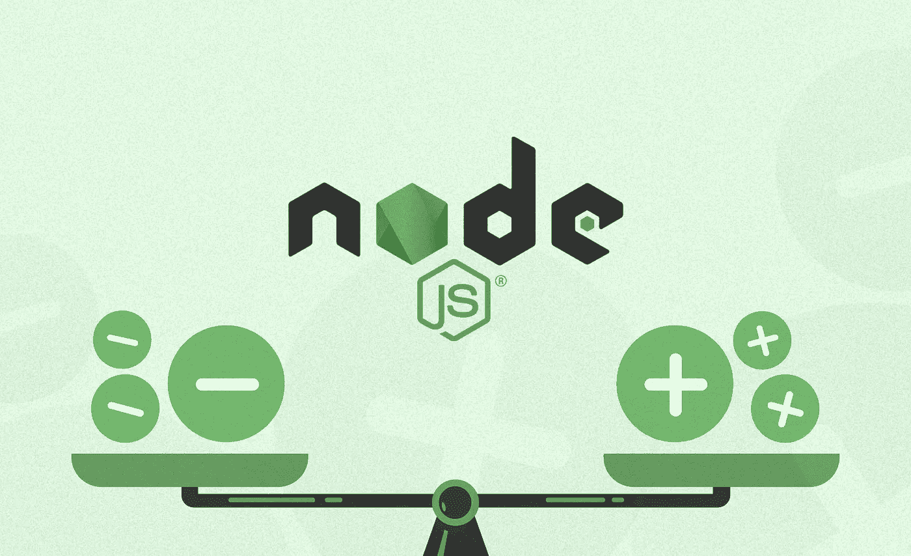
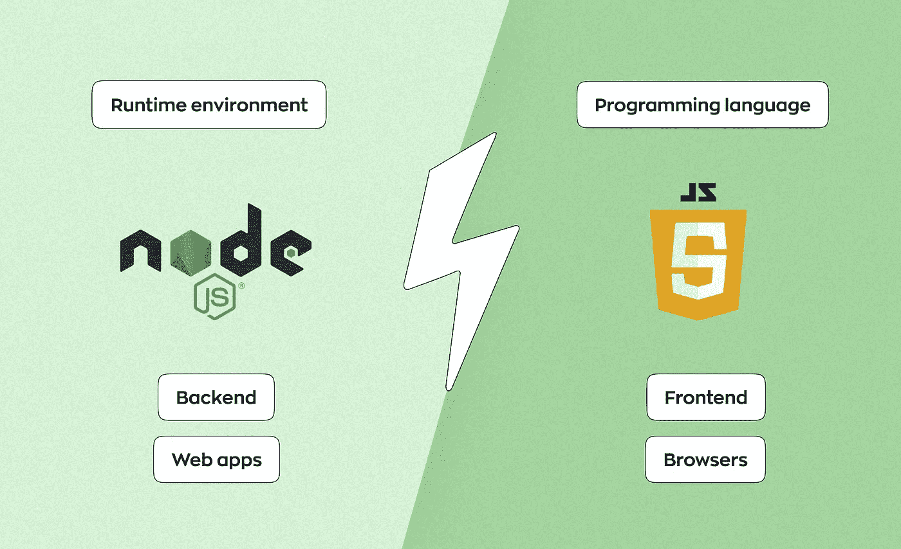
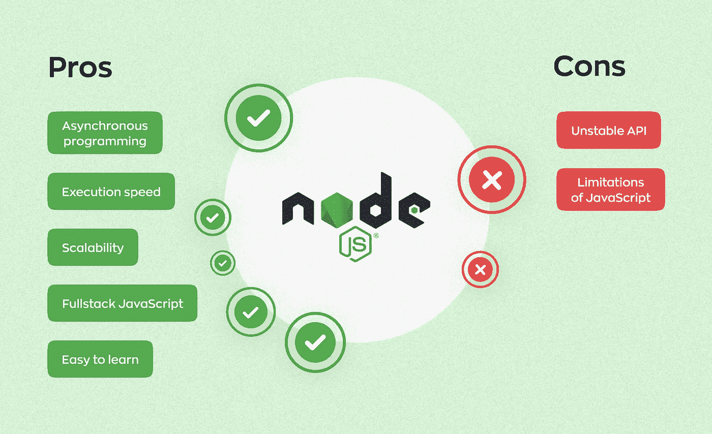

# Node.js Web 开发的积极和消极方面

> 原文：<https://javascript.plainenglish.io/positive-and-negative-aspects-of-node-js-web-development-a6215b46c047?source=collection_archive---------8----------------------->

为应用程序选择技术堆栈可能是一个相当大的挑战，因为许多因素会影响技术的有效性。当涉及到开发社交媒体应用程序、信使和流媒体服务时，许多开发人员选择 Node.js。但为什么它被认为是创建此类平台的最佳工具之一？在本文中，我们将研究这种技术的优缺点，理清 Node.js 是否是一种编程语言，它应该用于哪些项目，以及它是否适合您。

# Node.js 是什么？

Node.js 是一个 JavaScript 运行时环境，运行在 V8 引擎上，在 web 浏览器之外执行 js 代码。简单来说，Node.js 在完整的前端语言中增加了后端部分，这使得开发者不仅可以创建网站，还可以创建不需要使用浏览器的可扩展 web 应用。Node.js 是开源的、轻量级的、快速的。

Ryan Dahl 早在 2009 年就推出了 Node.js，最初，它只支持 Mac OS X 和 Linux。在此之前，还有另一种在服务器端执行 JS 的解决方案，叫做 Netscape 的 Live Wire，但它没有取得成功。

Node.js 的发布让 JavaScript 从脚本语言变成了编程语言。它在程序员，尤其是初创公司中也非常受欢迎。他们看到了 JavaScript tech stack 在速度、前端和后端开发人员之间的交互以及相对较低的培训和整体项目成本方面的优势，如果您的团队中有一名全栈 JS 工程师，这些优势可以进一步降低。

# Node.js vs JavaScript:有什么区别？

*   **JS** 是一种编程语言，而 **Node.js** 的意思是运行时环境。
*   **JS** 用于前端开发，而 **Node.js** 用于后端
*   **JS** 代码只能在浏览器中运行，而 **Node.js** 允许我们在浏览器之外运行。

# Node.js pros

## 异步编程

由于异步 I/O 模型，可以处理新的请求，而不是等待以前的请求完成。因此，使用 Node.js 开发的 web 应用程序的主要优点是，与使用多线程模型创建的应用程序相比，它们具有更高的性能，并且可以处理更多的并发请求。当成千上万的用户同时连接到应用程序的服务器时，它可以轻松应对负载，因为没有必要为每个连接创建单独的线程。

## 执行速度

就 web 应用程序而言，执行速度指的是在服务器上处理一个请求并生成对客户端的响应所需的时间。Node.js 速度很快，这要归功于它的异步特性和 V8 引擎。你可以看一下[和 Node.js](https://www.toptal.com/back-end/server-side-io-performance-node-php-java-go) 相比，Go、PHP、Java 是如何处理请求的，自己看看。许多大公司转而使用 Node.js 来提高性能，并取得了显著的改进。例如，PayPal 从 Java 迁移到 Node.js，发现响应时间[减少了 35%](https://medium.com/paypal-engineering/node-js-at-paypal-4e2d1d08ce4f)。

## 可量测性

当您的业务开始增长时，应用程序需要扩展以适应新的需求。Node.js 允许我们使用微服务架构将应用分成更小的部分——这样，你就可以在需要的时候放大或缩小应用。该工具可让您轻松地横向和纵向扩展应用程序，以提高其性能。

## 全栈 JavaScript

如果您打算使用基于 js 的技术栈，Node.js 是一项很好的技术。这样，web 应用程序的服务器端和客户端就可以使用一种语言。这对创业公司和小公司来说尤其有利可图，因为他们可以只雇佣一名 JS 开发人员并节省预算。您可以将 Node.js 与基于 js 的前端技术结合起来用于不同的目的。例如，Angular.js plus Node.js tech stack 的好处之一就是它非常适合构建单页面应用程序。

## 简单易学

Node.js 的主要前提是学习 JavaScript。如果开发人员已经了解 JS，那么学习 Node.js 将比学习一种基于完全不同的编程语言的后端技术花费更少的时间和精力。

# Node.js cons

## 不稳定的 API

频繁的 API 更改可能是 Node.js 最关键的缺点之一。对其当前版本的 API 进行了许多更改，但并非所有这些更改都是向后兼容的。为了保持与 Node.js API 最新版本的兼容性，开发人员需要在每次出现新版本时对可用的代码库进行更改。

## JavaScript 的局限性

Node.js 不能处理非常高的计算密集型任务。因为运行时是基于 JavaScript 的，所以它被设计成单线程的。正如我们前面所说的，该技术对传入的请求进行优先级排序，这对于轻任务来说很好，但是重任务会降低工作速度。

如果你对 React Native framework 感兴趣，请查看我们的另一篇[文章](https://ronas-it.medium.com/what-is-react-native-framework-and-how-can-cross-platform-apps-boost-your-business-305f410c123d)了解更多信息。

# Node.js 是用来做什么的？

## 实时应用

实时应用传输实时文本、音频和视频数据——这些是社交媒体应用、流媒体平台、信使等等。这种应用需要速度和可伸缩性，这就是为什么 Node.js 是开发它们的好选择。Node.js 可以轻松处理高流量的实时流，因此，用户在交换数据或更新时不会遇到任何延迟。

## 物联网应用

物联网是一个由各种自动化设备和传感器组成的生态系统，它们可以在没有人工干预的情况下相互交换数据。物联网设备会产生大量需要快速处理的请求。Node.js 可以快速有效地处理这些请求，并可以在 Node.js 服务器上存储设备生成的大量数据。

## 单页应用程序

单页应用程序是浏览器中存储动态变化数据的页面。SPAs 的加载速度比普通网站快得多，可以显著改善用户体验，尤其是在用户使用低速互联网连接的情况下。Node.js 是构建 spa 的一项伟大技术，因为它可以处理密集的工作负载。另外，大多数 spa 都是用 JavaScript 写的，而 Node.js 是基于它的。

## 机器学习

JS 开发人员现在可以使用 TensorFlow.js 构建和训练 ML 模型，tensor flow . JS 是一个开源库，它提供了 JavaScript 机器学习功能。它支持 Node.js，所以 TensorFlow 也可以用在 web 应用中，这样就不需要使用 Python 了。

# 用 Node.js 构建的著名项目

1.  Paypal。该公司将应用程序从 Java 迁移到 JS+Node.js。开发时间比使用 Java 少两倍。Node.js 还帮助他们建立浏览器和服务器之间的交互，因为双方都是用同一种语言编写的。
2.  **易贝。**大多数情况下，易贝拥有基于 Java 的技术平台。过去，生成和转换数据需要大量资源和时间。为了改善用户体验，并使代码具有可维护性和可扩展性，他们转向 Node.js。此外，他们还建立了服务的交互，并使网站能够不断更新。
3.  **网飞。**回到 2015 年，公司后端用 Java，前端用 JavaScript。然后他们决定[迁移到 Node.js](https://netflixtechblog.com/making-netflix-com-faster-f95d15f2e972) 来为应用的两端提供一个共同的语言:后端和前端。该平台已经提高了它的性能——现在页面在几秒钟内就可以加载。

在 Ronas IT，我们在一个消息应用项目中使用了 Node.js。该项目是在 NDA，所以我们不能给你的应用程序或客户的名称。最初，它是一个小型的支持服务应用程序，所以当我们开始这个项目时，我们的主要任务是用最少的资源创建它。所以我们选择 JS 作为开发语言，后端部分选择 Node.js。我们还在 Cordova 的帮助下创建了移动应用程序，这是一个用 JavaScript 构建移动应用程序的平台。这样，只需要一个开发人员就可以做所有的事情。

然后我们的客户决定把这个应用变成一个大的信使。根据之前工作的经验，我们决定将移动应用从 JS 迁移到本地语言——Swift 和 Kotlin。至于后端部分，Node.js 没有问题，所以我们让它保持原样。事实上，它看起来非常灵活，允许我们将应用程序扩展到所需的规模——10 万用户。随后，我们将 Node.js 保留在后端，但切换到更高级别的框架 Adonis。

# Node.js 是适合你的项目的技术吗？

在软件开发中，存在技术表现最佳的特定情况。Node.js 是一个为执行特定任务而定制的强大工具。它非常适合开发实时应用、spa、微服务架构和物联网应用。但是，误用 Node.js 并忽略其特性会导致项目出现大问题。

*更多内容请看*[***plain English . io***](https://plainenglish.io/)*。报名参加我们的* [***免费周报***](http://newsletter.plainenglish.io/) *。关注我们关于*[***Twitter***](https://twitter.com/inPlainEngHQ)[***LinkedIn***](https://www.linkedin.com/company/inplainenglish/)*[***YouTube***](https://www.youtube.com/channel/UCtipWUghju290NWcn8jhyAw)*[***不和***](https://discord.gg/GtDtUAvyhW) ***。*****

*****有兴趣规模化你的软件创业*** *？检查* [***电路***](https://circuit.ooo/?utm=publication-post-cta) *。***