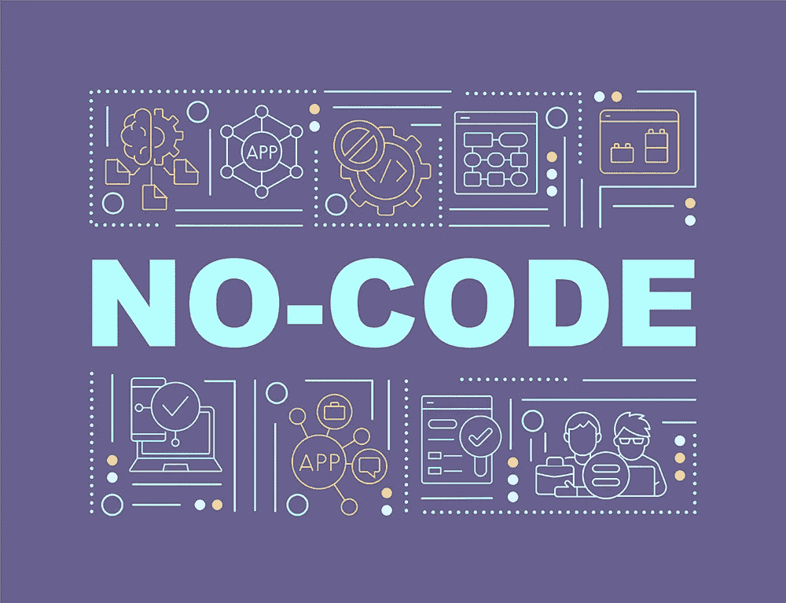
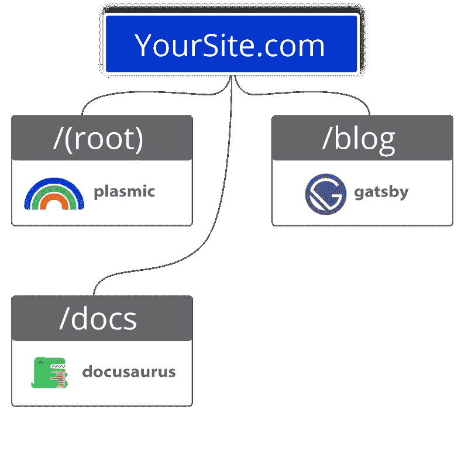

# 解释了无代码工具的优点和缺点

> 原文：<https://javascript.plainenglish.io/positives-and-negatives-of-no-code-tools-explained-fathym-c90cf633fd04?source=collection_archive---------13----------------------->

无代码，没问题？

不一定。

使用无代码应用和网站建设者肯定有很多好处，但是使用它们也有明显的缺点。

让我们来看看无代码构建者的优点和缺点。

## 无代码使用的增加

简单地说，无代码工具已经存在了大约 20 年，它们确实为任何能够设计网站的人打开了大门。根据 Zapier 的无代码报告，无代码工具的使用在过去的两年(2020-2022)里蓬勃发展。

他们不仅越来越受欢迎，而且一些人认为他们只会继续快速增长，[预测到 2024 年将增长两倍。](https://www.fathym.com/blog/articles/2022/march/2022-03-04-analyst-says-no-code-space-expected-to-grow-three-times)

因此，很明显，无代码的世界将会一直存在。对一些人来说，这是一个巨大的收获。对于其他人——比如开发人员——来说，任何关于非代码工具的讨论都伴随着一定程度的白眼。

“我可以用典型的 JavaScript 构建更好的东西，”他们争辩道。

是的，看起来非代码工具是一个有分歧的话题，这取决于你问的是谁。首先，积极的一面。

# 无代码应用的优点

## 无需学习或编写代码

no-code 最大的优点就在于它的名字:No code。这意味着用户不需要知道如何编码，甚至不需要知道什么是代码，就可以使用它们。通过这种方式，他们完全降低了所需经验的门槛。

在外行人的世界里，拖放式网站构建器已经变得无处不在，它们消除了创建网站的一些恐惧。无代码工具是对人友好的、用户友好的和[包容的。](https://www.fathym.com/blog/articles/2022/june/2022-06-02-inclusivity-with-low-and-no-code)

## 简单易学

下一个最大的好处是浅的学习曲线和易用性。拖放和设计是如此简单，任何人都可以做到。据 Zapier 称，在过去的两年中，67%的新用户都是自学的。

## 他们节省时间

因为网站的结构已经存在——以及后端的代码——无代码网站可以以令人难以置信的速度建立起来。绝大多数用户报告说他们选择了无代码路线，因为这样可以节省时间(83%)或者帮助他们更快地推出新产品和新功能(73%)。

## 帮助员工获得工作证明

当被问及为什么最近学习无代码工具时，28%的受访者表示要在工作中取得一些成就，这是领先的答案。最重要的是，许多员工看到了领导的积极认可(82%)，生产力提高(80%)，甚至薪酬增加(70%)。

# 无代码工具的缺点

## 设计中的刚性

一个主要的缺点——也是开发人员关注的原因——是无代码工具的刚性。一旦你走上这条路，你就被锁定在他们的设计参数中。

正如我们前面提到的，现成功能的好处是速度和易用性。但是这方面的缺点是不能定制布局、设计等等。虽然这些工具提供了许多选择，但是在使用它们的时候，设计的东西是有限制的。

## 不擅长可扩展性

一个没有代码的网站构建者可能是一个很好的方法，可以在短时间内完成一些事情。但是，如果该公司发展壮大，他们可能会渴望无代码构建器根本无法提供的新的方面和设计。在这一点上，他们要么被迫从头开始——可能是使用更传统的开发人员和 JavaScript 框架——要么只能从无代码工具中获得最大的收益。

但是，考虑到有了 [Fathym 平台，](https://www.fathym.com/dashboard)能够使用多个无代码工具(和/或除这些工具之外的 JavaScript 框架)意味着可伸缩性不是问题。

## 功能有限

当涉及到更大的网站和更大的公司时，无代码构建者很可能根本没有提供足够的功能选项来完成工作。一家大型企业级公司可能希望在他们的首页上显示一段视频，在用户滚动时会有移动的小部件，每个小部件连接到网站的不同部分，然后他们的信息目录在页面底部有许多链接。一切都必须运转，而且要完美无缺。

值得注意的是，大公司比小公司更喜欢定期“修饰”他们的网站。所以，如果你的公司需要经常改变网站的设计，没有代码的构建者可能不是最好的解决方案。

请记住，使用 Fathym，我们的模块化 JAMstack 前端平台允许开发人员和“公民开发人员”使用多种不同的无代码工具来建立您的网站。这意味着你可以为你的不同页面找到你需要的功能，比如一个包含分析和评论部分的博客等等。

正如我们之前讨论过的，如果您真的需要一种特定的、自己开发的功能，该框架还允许在不同的路由(页面)上使用 JavaScript。

## 平台依赖性

无代码工具本身——以及他们的公司——可能是正在寻找自己位置的敏捷技术初创公司。这意味着他们可能会心血来潮改变他们的软件工作方式，这意味着重新学习它是如何工作的，并被迫重新设计网站。更糟糕的是，如果公司改变定价，你会被迫接受，或者跳槽，如果公司因为任何原因倒闭，你会一无所有。

对于典型的 JavaScript 和更深层次的模块化前端，传统开发人员创建代码并拥有它，这意味着如果他们想或需要，他们可以将它带到不同的平台。

# 结论

不管你喜欢还是讨厌它们，无代码工具将会一直存在。

正如前面提到的 Zapier 报告所解释的，在过去的两年中，90%的无代码工具用户都有某种技术经验。这意味着那些完全没有技术经验的人可能很快就会出现增长。因此，我们将很快看到无代码工具用户的整体增长。

无代码工具似乎更适合那些希望从员工身上获得最大收益的中小型企业。这可能意味着，比如说，请一名会计师来创建一个销售点。事实上，在创造性地使用非代码工具和利用员工为公司带来的东西方面，选择是无限的，即使这并不是他们最初被雇来做的事情。

另一方面，当要求营销人员建立自己的网站时，可能会出现其他问题。例如，用户报告不知道如何修复错误(36%的 Zapier)和导致影响网站或团队其他部分的错误(34%)。

至于影响网站其他部分的错误，模块化前端方法将有助于缓解这些潜在的问题，因为网站的一部分不依赖于其他部分。

如果你正在寻找尝试无代码工具，你可以很容易地，在今天的 [Fathym](https://www.fathym.com/dashboard) 免费。模块化的 JAMstack 平台解决了非代码工具有时会出现的问题，如果您愿意，可以自由灵活地使用各种工具和典型的 JavaScript。

*最初发表于*[T5【https://www.fathym.com】](https://www.fathym.com/blog/articles/2022/june/2022-06-28-positives-and-negatives-of-no-code-tools)*。*

*更多内容请看*[***plain English . io***](https://plainenglish.io/)*。报名参加我们的* [***免费周报***](http://newsletter.plainenglish.io/) *。关注我们关于*[***Twitter***](https://twitter.com/inPlainEngHQ)*和*[***LinkedIn***](https://www.linkedin.com/company/inplainenglish/)*。查看我们的* [***社区不和谐***](https://discord.gg/GtDtUAvyhW) *加入我们的* [***人才集体***](https://inplainenglish.pallet.com/talent/welcome) *。*