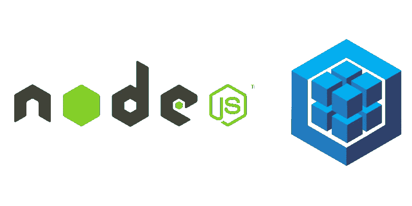

# PostgreSQL & Sequelize:应该使用关系数据库吗？

> 原文：<https://javascript.plainenglish.io/postgresql-sequelize-should-you-use-the-same-5a840814722f?source=collection_archive---------8----------------------->

## 你真的需要一个 ORM 还是你自己可以做？



NodeJS and Sequelize

真正的第一个问题是:

你应该使用关系数据库吗？

我们假设答案是肯定的。那样的话，你可以继续读下去。

Sequelize 是所谓的 ORM(“对象关系管理器”)。
现在，您的应用程序不一定需要这些库来与您的数据库对话。在接下来的几行中，你可以读到我关于 ORM 在哪些地方非常有用，在哪些地方可能没有用的一些想法。

我将假设读者已经了解 PostgreSQL 和 Node.js 的基础知识。

首先，顺序化的基础是什么:

*   它适用于许多不同的数据库:Postgres、MySQL、MariaDB、SQLite 等等
*   您定义您的模型和类型(非常类似于数据库层本身)
*   您可以获得许多现成的功能
*   从应用程序到数据库的所有事务都通过 Sequelize 发生。这个额外的层使得设置安全措施变得更加容易，因此脏数据不会被写入数据库。

## 定义您的模型

现在，这是使用 ORM 最酷的事情之一——在代码中拥有数据库模式和模型。这有点像基础设施的代码，但对于你的数据库。让我们看一个例子:

Example model

拥有这样的`MyDBModel`,允许我在 Sequelize 中使用内置的数据类型，这将自动为我们提供类型检查。上面是一个简单的例子，有一个主键和几个不同的数据类型字段。
现在我们可以使用上面的定义来插入新项目以及执行功能。

假设我们想从具有特定名称的所有行中获取`id`、`name`、`date`和`incrementMe`:

## 1.ORM 方式

A helper function using Sequelize

## 2.SQL 方式

以上将返回与等效的原始 SQL 查询相同的结果:

```
SELECT id, date, name, incrementMe
FROM MODEL
WHERE name = 'YOUR NAME'
ORDER BY date DESC
```

现在，这似乎不是一个大的胜利。但是在第一个例子中，构建额外的逻辑并在代码的许多地方重用该函数要容易得多。这只是一个简单的例子，但是我的观点越深入就越清晰。

## 开箱即用的

对于插入，我们还增加了类型检查的功能。其他有用的功能有:

*   `findOrCreate`这确实如其所说。创建一个条目或检索现有的条目(如果有的话)。
*   这对于创建与分页相关的查询很有用。
*   这些是你可以分配给你的字段的额外“检查”。这些与`type`字段不同，因为它本质上是由 Sequelize 创建的预配置正则表达式。这可能是你将只允许 x 字符在一个特定的领域或你将只允许`isIPv6`在另一个领域。更长的验证列表可以在[这里](https://sequelize.org/docs/v6/core-concepts/validations-and-constraints/)找到

## 结论

许多人都不擅长写 SQL，包括我自己。这很可能是由于我在职业生涯中所扮演的角色，我没有过多关注数据库层。
在非常大的系统中，将重点放在数据库上并尽可能优化它的所有部分会很有帮助。

根据我的经验，这在大型项目中是有意义的，但是在较小的项目中，数据库的东西通常只是你在开始/创建数据库的过程中接触到的东西。由于这些原因，我从未在编写查询和专攻超高级数据库模式方面得到一致的实践。因此，我也发现使用 ORM 是一件令人愉快的事情，因为它看起来更有条理，这让我感觉更舒服。
为了更简单，ORM 有时会为您创建一些查询，但这些查询的性能并不如一个超级熟练的开发人员所能编写的那样好。对于我的用例来说，性能目前还不错。

最后一点:ORM 通常是相对较大的库，所以会有这样的情况，所有增加的代码不会给你带来比额外的代码、构建时间、部署时间等更多的好处。那也正在被添加。

/保持干净！

*更多内容看* [***说白了。报名参加我们的***](https://plainenglish.io/) **[***免费周报***](http://newsletter.plainenglish.io/) *。关注我们关于*[***Twitter***](https://twitter.com/inPlainEngHQ)*和**[***LinkedIn***](https://www.linkedin.com/company/inplainenglish/)*。加入我们的* [***社区***](https://discord.gg/GtDtUAvyhW) *。****