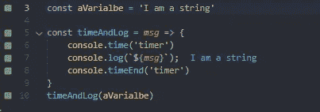

# 如何在媒体上最好地显示你的代码

> 原文：<https://javascript.plainenglish.io/presenting-code-on-medium-with-examples-30be1c343a7c?source=collection_archive---------2----------------------->

## 如何在媒体上展示你的代码——举例说明。


Code displaying

在 Medium 上的许多 post 需要你显示一些代码，有许多方法可以做到这一点。在这里，我将以不同的格式展示相同的代码片段，以示区别

## 1.Github gist

Github 的要点是很多人都熟悉的。你可以保留你自己的代码片段库+格式是可以的(不像 IDE)+你可以复制粘贴。

Github gist

## 2.沙箱—stack blitz

这是我最近发现的一个服务( [Stackblitz](https://stackblitz.com/) )。这是一个在线 IDE，所以你可以得到你想要的所有格式。您还可以获得完整的项目视图+更多的交互性+复制代码的可用性。我认为在大多数情况下，这是一个很好的选择。

Stackblitz

许多其他服务也提供了一些相同的功能，您可以包含一个在线 ide。荣誉奖:

1.  [Codepen.io](https://codepen.io/)
2.  [JSFiddle](https://jsfiddle.net/)
3.  [CodeSandbox](https://codesandbox.io/)
4.  [Repl.it](https://replit.com/)

## 3.在一条直线上的

这种方法的优点是你不需要第三方服务，你可以复制粘贴。缺点是它看起来很可怕，特别是对于更大的代码片段，格式已经过时了。

```
const aVarialbe = 'I am a string'const timeAndLog = *msg* => { console.time('timer') console.log(`${*msg*}`); console.timeEnd('timer')}timeAndLog(aVarialbe)
```

## 4.图片/截图

这很容易创建+你得到相同的格式，因为在你自己的 IDE。
消极的一面，读者无法复制代码。



Screenshot

其他服务可以帮助你创建可以插入的漂亮图片。服务碳可以很容易地创建这样的东西:

*我错过了什么很酷的东西吗？*

这个题目到此为止。感谢阅读。

*更多内容请看*[***plain English . io***](https://plainenglish.io/)*。报名参加我们的* [***免费周报***](http://newsletter.plainenglish.io/) *。关注我们关于*[***Twitter***](https://twitter.com/inPlainEngHQ)*和*[***LinkedIn***](https://www.linkedin.com/company/inplainenglish/)*。查看我们的* [***社区不和谐***](https://discord.gg/GtDtUAvyhW) *加入我们的* [***人才集体***](https://inplainenglish.pallet.com/talent/welcome) *。*