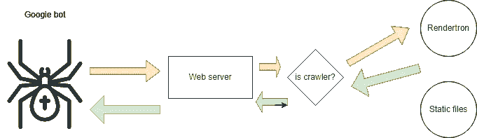
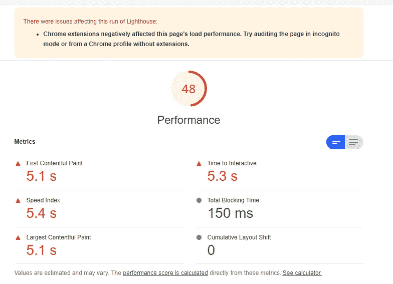
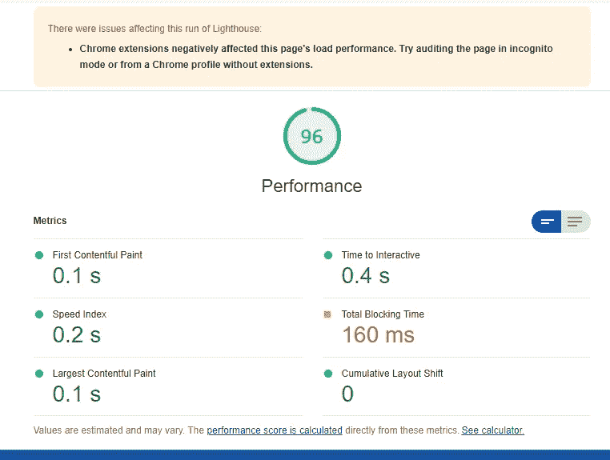

# Rendertron 简介:SEO 性能助推器

> 原文：<https://javascript.plainenglish.io/presenting-rendertron-seo-performance-booster-8f17b58f8cd9?source=collection_archive---------12----------------------->


Photo by [Erik Mclean](https://www.pexels.com/@introspectivedsgn?utm_content=attributionCopyText&utm_medium=referral&utm_source=pexels) from [Pexels](https://www.pexels.com/photo/toy-robot-in-puddle-with-ripples-in-daylight-5895405/?utm_content=attributionCopyText&utm_medium=referral&utm_source=pexels)

[Rendertron](https://github.com/GoogleChrome/rendertron) 是谷歌开源的 Chrome 渲染引擎。它的职责是将 JS 包转换成静态 HTML 文件。这样做的主要原因是爬虫根本不喜欢 JS 捆绑包，他们更喜欢在生成的 HTML 文件上爬行，所以我们必须让他们高兴，以便在搜索中排列我们的页面。像 React 和 Angular 这样的流行框架有一些额外的框架来获得 SSR 或 SSG 功能，如 [Angular Universal](https://angular.io/guide/universal) 或 [Next.js](https://nextjs.org/) ，但所有这些框架都需要额外的学习、基础设施和其他一大堆东西，有时会让我们问自己“真的值得吗？”。

幸运的是，Rendertron 消除了所有这些复杂性，并在 [SEO](https://circuit.ooo/blog/seo-for-beginners) 排名中大幅提升了我们的应用程序。

## 怎么用？

Rendertron 是一个独立的服务，你必须下载并运行。您可以查看[文档](https://github.com/GoogleChrome/rendertron#installing--deploying)了解更多配置，但基本步骤如下

```
git clone https://github.com/GoogleChrome/rendertron.git
cd rendertron
npm install
npm run start
```

运行完这些命令后，我们的渲染引擎就完全可以工作了。我们现在需要做的就是将爬虫重定向到渲染引擎。所以过程如下:每当爬虫请求你的网络应用时，你的网络服务器将检查它是爬虫还是真实用户，如果它是爬虫，它将把请求代理给呈现引擎。渲染引擎本身将解析 JS 包，生成静态 HTML，并将生成的 HTML 返回给爬虫。



为了将请求重定向到 Rendertron，我们可以使用已经[的预制中间件](/<mxGraphModel><root><mxCell id%3D"0"%2F><mxCell id%3D"1" parent%3D"0"%2F><mxCell id%3D"2" value%3D"" style%3D"shape%3DsingleArrow%3Bdirection%3Dwest%3BwhiteSpace%3Dwrap%3Bhtml%3D1%3BfillColor%3D%23d5e8d4%3BstrokeColor%3D%2382b366%3Brotation%3D-15%3B" vertex%3D"1" parent%3D"1"><mxGeometry x%3D"520" y%3D"314" width%3D"100" height%3D"40" as%3D"geometry"%2F><%2FmxCell><%2Froot><%2FmxGraphModel>)或者编写我们自己的中间件，这真的不难做到。

好了，现在是举例子的时候了。

## 例子

假设我们有一个简单的节点网络服务器。

我们所做的一切都是为 index.html 服务

我们正在冻结浏览器 5 秒钟，以模拟我们的网站真的很烂。请记住，它可以是任何流行的框架，如 Angular React 或像这样的普通 JavaScript。

现在让我们在我们的网站上运行 Lighthouse 性能检查器来看看结果。



我们在所有的[核心网络指标](https://web.dev/vitals/#core-web-vitals)统计中都失败了。

现在让我们使用我们的全功率渲染器。

*顺便说一句，我们冻结这个应用这么长时间只是为了举例，但实际上如果你的应用需要 5 秒钟才能加载，即使是谷歌 CEO 也不能帮助提升你的排名！；)*

## 渲染器集成

为了集成 Rendertron，我们将使用预制的[快速中间件](https://github.com/GoogleChrome/rendertron/tree/main/middleware)

我不认为有什么需要解释的，我们只是添加了中间件，仅此而已。

现在让我们再次使用 lighthouse，记住我们需要运行它两次。第一次 Rendertron 将花费与客户端相同的时间进行渲染，因为它需要编译并生成 HTML，所以我们将获得相同的分数。但是在第二次运行时，响应被缓存，如果我们检查它，结果是惊人的。



*查看如何在 docs 中添加缓存功能到 Rendertron，你只需要在项目根目录中添加 config . JSON…*

现在想象一下，如果你有一个非常复杂的 React/Angular/Vue 应用程序，你不必担心服务器端的渲染问题。你知道，它将高度优化爬虫反正。

尽管 Rendertron 是一个很棒的工具，但在开始使用它之前，您仍然需要考虑一些细节。

## 仅适用于爬虫

Rendertron 只对爬虫有好处，对用户本身没有好处，因为它是一个简单生成的静态 HTML 文件，仅此而已。因此，如果你想让应用程序对真实用户来说更快，你必须考虑 SSR 或 SSG 功能

## 基础设施中的附加层

*   你需要把它放在某个地方，这是一个独立的服务
*   你必须以某种方式监控它，否则，如果它死了，没人会关心
*   尽管它是开源和免费的，但它可能会让你为托管它付出额外的预算

## 贮藏

如果你的应用程序很快，你根本不需要缓存页面，它会马上呈现出来，你会得到 SEO 的好处。但如果不是这样，那么你必须考虑缓存，否则你会有良好的 HTML 结构，但糟糕的核心网站活力。

缓存还会带来无效缓存，这是额外的开销

## 大衣料

有一些想法认为使用这样的工具实际上是欺骗和不合法的，如果你使用这样的服务，爬虫会忽略你的页面。他们不明白的是爬虫是你的朋友而不是法官。你帮他们多少，他们也会帮你多少。因此，如果你给他们真正闪亮的网页，它会令人愉快，而不是生气。[更多信息](https://developers.google.com/search/docs/advanced/javascript/dynamic-rendering#cloaking)

# 摘要

我鼓励你试一试。有很多大公司都在使用这样的工具，而且真的很有效。

[Prerender](https://prerender.io/) 这是这个领域的另一个竞争对手，它非常详细地解释了关于动态渲染的一切。

*更多内容看* [***说白了就是***](http://plainenglish.io/) *。报名参加我们的* [***免费周报***](http://newsletter.plainenglish.io/) *。在我们的* [***社区获得独家访问写作机会和建议***](https://discord.gg/GtDtUAvyhW) *。*