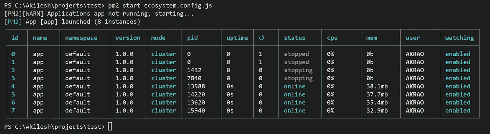

# 用 PM2 实现 Node.js 中的进程管理

> 原文：<https://javascript.plainenglish.io/process-management-in-node-js-with-pm2-ca32d75c94af?source=collection_archive---------3----------------------->


Node.js 非常擅长处理 I/O 操作，但是当涉及到 CPU 密集型任务时，它就不行了。您可以通过运行繁重的操作来轻松地停止应用程序，因为 Node.js 是单线程的，它将阻塞进一步的请求。

现在，为了处理这个问题，您可以与主进程并行地产生子进程，这样每当有新的请求进来时，它就会被这个新的进程处理。Node.js 中的 native cluster 模块允许您手动**配置您的应用程序以生成子进程的集群。但是如果有一个为你处理它的软件包不是更好吗？**

**PM2 是一个进程管理器，负责处理从处理多个进程、设置特定于环境的部署策略到将日志保存到您的系统中的所有事情。这是一个功能丰富的库，在 Node.js 社区中很受欢迎，这篇博文将介绍其中的一些关键特性。所以让我们开始吧！**

**我在 YouTube 上也有这篇文章的视频版本，一定要看看。**

## **基本设置**

**要在你的系统上安装它，你可以输入`npm i -g pm2`。最好是全局安装，这样可以直接在命令行使用 pm2。我们将使用一个简单的具有单一端点的 express 应用程序。因此，在一个空目录中，首先通过键入`npm init -y`创建您的节点项目。之后，你可以通过输入`npm i express`来安装 express。现在，创建一个名为 **main.js** 的文件，并将这段代码片段复制到文件中。**

```
**const app = require("express")()
app.get("/light", (req, res) => {
   console.log("Light request triggered")
   res.send(`Request successful!\n`);
})app.listen(3000, () => console.log("Listening to port 3000"));**
```

**现在通常我们会使用`**node main.js**`来运行我们的应用程序，但是现在我们使用 pm2，我们可以使用`**pm2 start main.js**`。**

****

**这个表显示了名称/id、CPU/内存消耗以及运行应用程序的进程的状态等详细信息。您还可以选择使用`name`标志显式地为您的流程提供一个名称。如果你不给它一个明确的名字，它将使用文件名作为进程的名字。**

**现在在截图中，看起来应用程序已经停止。在牌桌前，您会看到“完成”消息，但在牌桌后，您什么也看不到。但是如果你打开浏览器，进入[http://localhost:3000/light，](http://localhost:3000/light,)你会看到我们从 API 端点发回的“请求成功”消息。因此应用程序仍在运行。只是 pm2 对它进行了守护，本质上意味着它在后台运行进程，仅此而已。您将在一个单独的日志文件中找到日志消息，我们将在这篇博客文章的后面部分查看这个日志文件。**

## **流程管理命令**

*   **在任何时候，您都可以通过输入`pm2 status`或`pm2 ls`或`pm2 list`来查看流程的状态。**
*   **您可以通过使用`pm2 stop`后跟进程的名称或 id(`pm2 stop main`或`pm2 stop 0`)来停止进程。也可以使用`pm2 stop all`停止所有进程。一旦你停止了你的进程，试着向你的应用程序发出一个请求，看看它是否工作。附言:不应该。**
*   **`pm2 delete`后跟进程的名称或 id 将那个进程从列表中删除。(`pm2 delete main`或`pm2 delete 0`)。您也可以使用`pm2 delete all`删除所有进程。**
*   **还有两个命令可以帮助您管理流程。一个是`restart`命令，另一个是`reload`命令。这两个命令本质上都是重新运行一个进程，但区别在于它们是如何执行的。**
*   **A `pm2 restart <process_name/ID>`将首先终止进程，然后再次启动它。因此，当您重新启动一个流程时，会有一些停机时间。**
*   **另一方面，`pm2 reload <process_name/ID>`将在后台创建一个新进程。只有当这个新进程被创建时，它才会杀死旧进程。这确保了在重新加载流程时不会停机。如果由于某种原因重新加载不起作用，在特定的时间后，它最终会退回到经典的重新启动。**

## **热重装**

**当使用 Node.js 运行应用程序时，每次对应用程序进行更改时，都需要重新启动服务器。 [Nodemon](https://www.npmjs.com/package/nodemon) 是一个流行的库，它会在检测到变化时重启服务器。您可以在 pm2 中使用`watch`标志实现同样的事情。因此，在启动任何进程时，如果您在最后提供了 watch 标志，它将侦听更改，然后自动重启服务器(`pm2 start main.js --watch`)**

## **一些其他启动选项**

*   ****max-memory-restart<200 MB>—**该选项将在进程达到某个内存限制时重启进程。您可以用千字节(K)、兆字节(M)或千兆字节(G)来指定内存限制**
*   ****log <文件路径>** — Log 将指定您要在其中存储应用程序日志的文件。尝试启动一个进程，但这一次，在日志文件的末尾使用日志标志。
    `pm2 start main.js --log ./logFile.txt`
    现在，如果你向 light 端点发出一个请求，你会看到在你的项目文件夹中自动生成一个名为 logFile.txt 的文件。**
*   ****重启-延迟<毫秒延迟>** 将在自动重启之间增加一个延迟。**
*   ****时间**标志将为您的所有日志添加时间戳。重新启动你的应用程序，但这一次在末尾附加时间标志。`pm2 restart 0 --time`。现在向端点发出一个请求，您将看到日志文件中记录的消息之前的时间戳。**
*   ****否-自动重启**将禁用自动重启。当您希望执行一次性脚本，并且不希望进程管理器在脚本完成运行后重新启动脚本时，这是有意义的。**
*   ****cron** 标志将根据您添加的 cron 表达式间隔重新启动进程。 [***我有一个单独的视频详细讲解了 cron 的表情，想了解更多的可以去看看。***](https://youtu.be/LmDw-nbVLQk?t=350)**
*   **无守护进程标志不会妖魔化你的 pm2 进程。因此，您现在可以在控制台上看到所有日志和事件，而不是在后台运行它，就像在典型的节点执行中一样。**

**现在，我们在启动时或重启一个进程时手动添加这些选项是没有意义的。相反，我们要做的是添加一个包含所有这些选项的配置文件，这样无论何时我们启动应用程序，它都会在启用这些选项的情况下运行。**

## **创建 pm2 配置文件**

**要生成这个配置文件，在您的控制台中键入`pm2 init simple`。这将创建一个名为 ecosystem.config.js 的文件。如果您正在创建自己的配置文件，请确保它以`.config.js`结尾，以便 PM2 能够将其识别为配置文件。在文件内部，复制以下代码片段。**

```
**module.exports = {
  apps: [{
    name : "app",
    script: "./main.js",
    watch: true,
    ignore_watch : "node_modules",
    time: true,
    out_file : "./scripts.txt",
    error_file : "./error.txt",
    env: {
      "NODE_ENV": "development"
    },
    env_production: {
      "NODE_ENV": "production",
    }
  }]
}**
```

**我将解释我们在这里使用的选项。**

*   **名称:流程的名称**
*   **脚本:要执行的脚本的位置**
*   **观察:跟踪变化并重新开始过程**
*   **ignore_watch:不会跟踪一组文件/文件夹的更改**
*   **时间:会将时间戳附加到日志文件中的日志语句**
*   **out_file 和 error_file:将各自的日志语句添加到这些文件中**

**您还可以添加特定于环境的选项，例如，如果您的环境变量值在测试和生产模式之间发生变化，您可以分别在`env`或`env_production`中添加这些变量。**

**当我们切换到集群模式时，我们将添加一些额外的选项，但是现在，这看起来不错。**

**现在，我们可以运行配置文件(`pm2 start ecosystem.config.js`)而不是使用`pm2 start main.js`，它将依次为我们运行脚本。您可以在 apps 数组中添加多个非 Node.js 应用程序，它仍然可以工作。pm2 并不仅仅局限于 Node.js，你可以用不同的语言运行一个进程，比如 python，比如使用 PM2。**

**现在我们对 pm2 有了一点了解，让我们看看它是如何帮助管理多个流程的。在配置文件中，添加两个额外的选项:exec_mode 和 instances。**

```
**module.exports = {
  apps: [{
    name : "app",
    script: "./main.js",
    watch: true,
    ignore_watch : "node_modules",
    time: true,
    **exec_mode:"cluster",
    instances:"max",**
    out_file : "./scripts.txt",
    error_file : "./error.txt",
    env: {
      "NODE_ENV": "development"
    },
    env_production: {
      "NODE_ENV": "production",
    }
  }]
}**
```

**当您想要为您的应用程序启动一个进程集群时，您需要将 exec_mode 设置为“cluster”。默认设置为“fork”。**

**当建立一个集群时，您需要提到您将需要多少流程实例。您可以通过 **0/max** ，这将加速与您系统中内核数量相等的进程。 **-1** 将比最大值少旋转 1，如果你传入任何其他数字，它将旋转那么多进程。**

**现在，如果您运行配置文件，您将看到许多进程同时运行(在我的例子中是 8 个，因为我有一个 8 核系统)。您还会注意到，执行模式已经更改为“集群”。**

****

**PM2 有一个先进的仪表板，让您监控您的过程。您可以运行您的配置文件，然后使用`pm2 monit`命令打开这个仪表板。**

****

**它为您提供了所有流程的更实时视图。您可以单独检查系统中每个进程的资源消耗和分配情况。还有一个日志部分，你可以实时跟踪你所有的日志。**

## **结论**

**好了，这篇博文到此为止。这是对 pm2 及其便利特性的简要概述。很明显还有更多。我并没有真正讨论任何可以用 pm2 实现的部署策略，这本身就是一个全新的话题。也许在将来，我会为此写一篇单独的博文，但是这篇博文只是为了演示我们如何使用 pm2 来自动化流程管理。**

**[***我在 Youtube 上也有这篇文章的视频版本，你可以去看看。***](https://www.youtube.com/watch?v=od6BPZWx6yc&ab_channel=AkileshRao)**

**这篇文章是我们研究 Node.js 中多任务处理的系列文章的一部分。**

*   **[**node . js 中的多任务处理带子进程**](/multitasking-in-node-js-with-child-process-d82841fd8d29)**
*   **[**使用集群模块**](/multitasking-in-node-js-with-the-cluster-module-ee8480208f86) 在 Node.js 中进行多任务处理**

**如果你有任何疑问或建议，你可以在评论中提出，或者通过我的任何一个社交网站与我联系。干杯！**

**[YouTube](https://www.youtube.com/channel/UCaktnqx_IENyT5T2lJ3F09w)
[LinkedIn](https://www.linkedin.com/in/akilesh-rao-610357137/)
[Twitter](https://twitter.com/themangalorian)
[GitHub](https://github.com/AkileshRao)**

***更多内容请看*[***plain English . io***](https://plainenglish.io/)*。报名参加我们的* [***免费周报***](http://newsletter.plainenglish.io/) *。关注我们关于*[***Twitter***](https://twitter.com/inPlainEngHQ)[***LinkedIn***](https://www.linkedin.com/company/inplainenglish/)*[***YouTube***](https://www.youtube.com/channel/UCtipWUghju290NWcn8jhyAw)***，以及****[***不和***](https://discord.gg/GtDtUAvyhW) *对成长黑客感兴趣？检查* [***电路***](https://circuit.ooo/) ***。*******