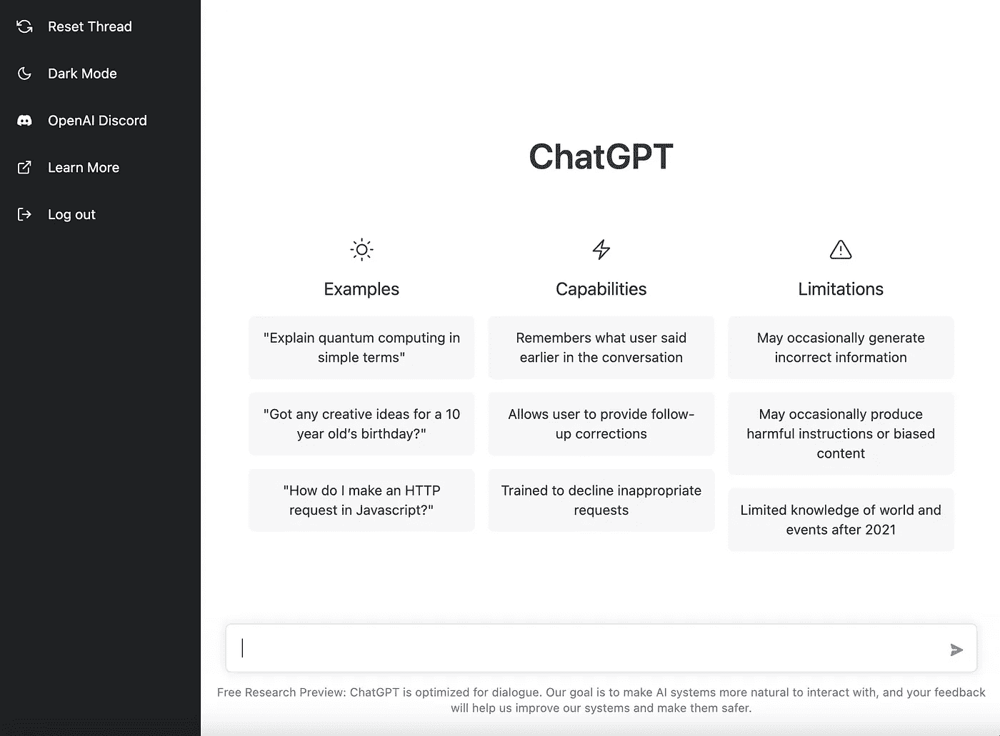

# 程序员们，你们用的是 StackOverflow 还是 Google？这里有更好的

> 原文：<https://javascript.plainenglish.io/programmers-are-you-using-stackoverflow-or-google-heres-something-better-728b44623115?source=collection_archive---------1----------------------->

## 你不会后悔的。


Photo by [Mohammad Rahmani](https://unsplash.com/@afgprogrammer?utm_source=medium&utm_medium=referral) on [Unsplash](https://unsplash.com?utm_source=medium&utm_medium=referral)

我一直很欣赏帮助人们完成工作的新技术。因此，我写了很多关于[免费工具](https://medium.com/swlh/30-killer-tools-that-are-so-valuable-they-feel-illegal-to-know-no-bs-bfde1a56b5df)的文章，它们可能会帮助你更快地完成工作，花更少的时间，甚至改进工作。

而作为程序员，我需要使用各种语言、框架，甚至工具。同样，当我看到 ChatGPT 时，我正在阅读新兴技术。

如果你从未听说过 ChatGPT，它是一个人工智能聊天机器人，本质上可以做你想做的一切。是的，如果你告诉它写颤振代码，它就会写；如果你想解决一个复杂的问题，简单地写下来，几秒钟就能完成，甚至更多。

它不仅仅针对程序员；对大家都有好处。但是，因为这个标题主要是针对程序员的，所以我将继续使用它。

所以让我们开始吧。

要开始使用 ChatGPT，首先，去[网站](https://chat.openai.com/chat)注册一个 OpenAI 账户(如果你还没有的话)。仅此而已；你可以问任何问题并得到答案。



Src: ChatGPT

我们举几个例子。

假设你是一个 web 开发人员，想用一个例子连接 React 和 TailwindCSS。

只需问 ChatGPT，就能收到答案。

像这样:

> 要使用 React 和 TailwindCSS 创建网站，您需要在计算机上安装一些东西:

1.  *Node.js，可以从*[*https://nodejs.org/*](https://nodejs.org/)*下载。这将允许您使用* `*npm*` *命令行工具，您将需要它来安装您需要的其他工具。*
2.  *React JavaScript 库，可以使用以下命令安装:*

```
npm install react
```

*3。Tailwind CSS 库，可以使用下面的命令安装:*

```
npm install tailwindcss
```

> 一旦安装了这些工具，就可以使用以下命令创建一个新的 React 应用程序:

```
npx create-react-app my-app
```

> 这将创建一个名为`my-app`的新目录，其中包含 React 应用程序的初始文件。
> 
> 接下来，您需要配置您的项目来使用 Tailwind CSS。这包括将顺风 CSS 样式添加到项目中，并为顺风创建一个配置文件。
> 
> 为此，首先，在您的`my-app`目录中运行以下命令:

```
npx tailwind init
```

> 这将在您的项目目录中创建一个`tailwind.config.js`文件。这个文件允许你自定义包含在你的项目中的 CSS 样式。
> 
> 接下来，您需要将顺风 CSS 样式添加到项目中。为此，您需要修改项目的`index.css`文件，以包含顺风 CSS 样式。
> 
> 首先，在文本编辑器中打开`index.css`文件，并在文件顶部添加下面一行:

```
@tailwind base;
```

> 接下来，在文件底部添加以下行:

```
@tailwind components;
```

> 最后，在`@tailwind components;`行之后添加以下行:

```
@tailwind utilities;
```

> 这将在您的项目中包含顺风 CSS 样式。
> 
> 现在，您已经将项目配置为使用 Tailwind CSS，您可以在 React 组件中使用 Tailwind CSS 类来向您的网站添加样式。
> 
> 例如，要创建一个带有标题和按钮的简单页面，您可以创建一个 React 组件，如下所示:

```
import React from 'react';

function MyPage() {
  return (
    <div>
      <h1 className="text-4xl font-bold text-center">My Page</h1>
      <button className="bg-blue-500 hover:bg-blue-700 text-white font-bold py-2 px-4 rounded-full">
        Click me!
      </button>
    </div>
  );
}
```

> 在这个例子中，`h1`和`button`元素上的`className`属性使用 Tailwind CSS 类向元素添加样式。
> 
> 更多关于在 React 中使用顺风 CSS 的信息，你可以参考位于[https://tailwindcss.com/](https://tailwindcss.com/)的顺风 CSS 文档。

比我想象的好多了。

所以，如果你是一个网站开发者，你可能会很容易得到你想要的答案。

这还不够吗？

Flutter 开发者 Nitin 呢？不要惊慌，我的朋友，如果你想构建一个 flutter 应用程序，并希望在 flutter 中从静态文件导入 JSON 数据。

只需向 ChatGPT 寻求答案。

你会得到这样的答案，

> 要在 Flutter 应用程序中加载一个静态 JSON 文件，您可以使用`flutter:services`包的`rootBundle`属性将文件加载为`Future<String>`或`Future<List<int>>`，这取决于您正在加载的数据类型。
> 
> 下面是一个如何加载名为`config.json`的静态 JSON 文件并将其解析为`Map<String, dynamic>`对象的示例:

```
import 'dart:convert';
import 'package:flutter/services.dart' show rootBundle;

void main() async {
  // Load the file
  String configJson = await rootBundle.loadString('config.json');

  // Parse the JSON data
  Map<String, dynamic> config = jsonDecode(configJson);

  // Use the data in the app
  print(config);
}
```

> 在本例中，`rootBundle`属性用于将`config.json`文件作为`String`加载。然后使用来自`dart:convert`库的`jsonDecode()`函数将 JSON 数据解析成一个`Map<String, dynamic>`对象。
> 
> 注意，`rootBundle.loadString()`方法返回一个`Future`，所以代码使用`async`和`await`关键字异步加载文件。这可以确保应用程序在文件加载时不会被阻止，并允许应用程序在文件在后台加载时继续运行。
> 
> 您还可以使用`rootBundle.load()`方法将文件加载为`Future<List<int>>`，如果您正在加载二进制数据，这将非常有用。`jsonDecode()`函数也可以用来解析二进制 JSON 数据。
> 
> 希望这有帮助！如果你还有其他问题，请告诉我。

尼廷，那我呢？我是一名 web3 开发者。

这里有一个例子。

假设您想要一个基本的超级分类帐代码，然后只需键入它。您将收到以下内容:

> 当然，这里有一个用 Go 编程语言编写的简单 Hyperledger 程序:

```
package main

import (
    "fmt"

    "github.com/hyperledger/fabric/core/chaincode/shim"
    pb "github.com/hyperledger/fabric/protos/peer"
)

type SimpleChaincode struct{}

func (t *SimpleChaincode) Init(stub shim.ChaincodeStubInterface) pb.Response {
    return shim.Success(nil)
}

func (t *SimpleChaincode) Invoke(stub shim.ChaincodeStubInterface) pb.Response {
    return shim.Error("Unknown function")
}

func main() {
    err := shim.Start(new(SimpleChaincode))
    if err != nil {
        fmt.Printf("Error starting chaincode: %s", err)
    }
}
```

> 该程序定义了一个简单的链码，它是超级分类帐区块链的基本逻辑单元。第一次部署链代码时调用`Init`函数，调用链代码处理事务时调用`Invoke`函数。
> 
> 在这个简单的例子中，`Init`函数简单地返回一个成功的响应，对于任何未知的函数，`Invoke`函数返回一个错误。
> 
> 注意:这只是一个简单的例子来说明超级分类帐链代码的基本结构。它不是一个完整的功能性程序。

同样，无论你是写编程语言，做云工程师，还是做其他任何事情，你都会发现这个聊天机器人相当方便。

所以简而言之，如果你用 StackOverflow 或者 Google，也可以用 ChatGPT。

希望你喜欢。

就这样——谢谢。

[*如果你喜欢看这样的故事，并想帮助我成为一名作家，请考虑成为一名中等会员*](https://nitinfab.medium.com/membership) *。它每月花费 5 美元，给你* [*无限制访问媒体内容*](https://nitinfab.medium.com/membership) *。如果你通过我的链接注册，我会得到一点佣金。*

*更多内容看* [***说白了就是***](https://plainenglish.io/) *。*

*报名参加我们的* [***免费周报***](http://newsletter.plainenglish.io/) *。关注我们关于*[***Twitter***](https://twitter.com/inPlainEngHQ)，[***LinkedIn***](https://www.linkedin.com/company/inplainenglish/)*，*[***YouTube***](https://www.youtube.com/channel/UCtipWUghju290NWcn8jhyAw)*，以及* [***不和***](https://discord.gg/GtDtUAvyhW) ***。***

***有兴趣缩放你的软件启动*** *？检查* [***电路***](https://circuit.ooo?utm=publication-post-cta) *。*