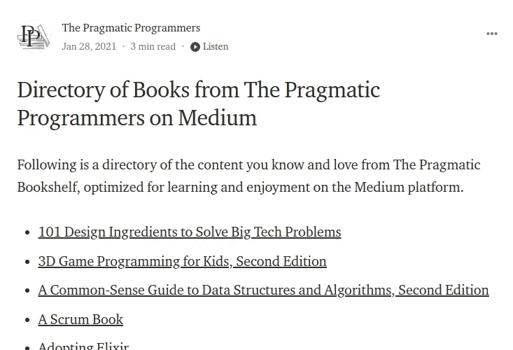

# 成为更好的开发者

> 原文：<https://javascript.plainenglish.io/programming-books-to-become-a-better-developer-518a395f24f0?source=collection_archive---------3----------------------->

## 排名靠前的书籍，一本有声读物，和一些隐藏的宝石，成为一个更好的开发者。

如果你是一名开发人员，你可能明白你将永远不会停止学习新事物。如果这困扰你，你可能选择了错误的工艺！

Photo by [Susan Q Yin](https://unsplash.com/@syinq?utm_source=medium&utm_medium=referral) on [Unsplash](https://unsplash.com?utm_source=medium&utm_medium=referral)

话虽如此，你还是有很多方法可以学习和提高的。YouTube、MOOCs、教程和视频。此外，如果你有幸与优秀的同事一起工作，你可以在工作中学习。

然而，有时我只是喜欢按自己的节奏看书。

现在，我知道拿起一本任何主题的书都会让人感到害怕，即使你知道它会对你的工作有所帮助。

我建议你先做一些研究，看看其他人对某本书的看法。

显然，如果一个或多个作者对某个主题有扎实的知识，你更有可能学到一些东西。

在这篇文章中，我只会提到可以帮助你提高开发能力的通用编程书籍。

***免责声明*** *:这是我的清单，是我个人的看法。我试着考虑了几个因素，其中:*

*   *我的个人经历*
*   *书评*
*   *在线内容或类似材料的可用性*

# 务实的程序员

《务实的程序员》是 1999 年出版的，甚至还不到本世纪！幸运的是，有 20 周年纪念版。

然而，有了下面这些提示，我们确信它不会很快离开程序员最佳书籍的名单。

> **定期投资你的知识组合**
> 
> 让学习成为一种习惯。

[The Pragmatic Bookshelf](https://pragprog.com/titles/tpp20/the-pragmatic-programmer-20th-anniversary-edition/)

正如《实用书架》所报道的那样，“*实用程序员的经验帮助一代程序员检查软件开发的本质，独立于任何特定的语言、框架或方法。*

任何特定语言、框架或方法的独立性是本书经久不衰的原因。

务实的程序员用有趣的轶事案例展示良好的实践，而不是展示技术细节。

在某种程度上，一些概念将会被敏捷方法扩展和结构化。

> 批判性地分析你读到的和听到的
> 
> 不要被供应商、媒体炒作或教条所左右。从你和你的项目的角度分析信息。

根据上面的引用，我们不要教条地看待这本书。

## 开发者评论

许多经验丰富的开发人员可能会在这里或那里找到一些好的建议，但可能会发现整本书“简单”，如果不是被高估的话。

如果你有几年以上的经验，这本书可能对你没什么价值。

如果你是初级开发人员，这本书是一本很好的读物，可以帮助你理解你周围正在发生的事情。

## 我对务实程序员的看法

我听了 Audible 上的实用主义程序员的歌，感觉很棒！怎么推荐都不够！如果你认为他们只是去读这本书，那就试试吧！

Audible 的工作人员在创造流畅体验方面做得非常出色。剧透:作者自己附和！

总的来说，作者和叙述者顺利地阅读了这本书，散步的时候非常愉快。

可能是因为没想到所以才这么激动吧？试试看，让我知道你的想法或者你是否知道类似的有声读物。

## 媒体上的独家内容！

这又是一个意外的惊喜！

似乎他们在 Medium 上组合了一个叫做[的实用程序员](https://medium.com/pragmatic-programmers/directory-of-pragmatic-programmer-books-on-medium-6a5cbadbd4b4)。

他们的简历上写道:“*我们就经典和前沿话题制作及时、实用的书籍和学习资源，帮助你实践自己的技能，加速你的职业生涯。*

我可能会迟到，但这似乎很有趣。不幸的是，这是中等独家内容，我不能读太多。

如果你是付费会员，那就尽情享受吧！

[The Pragmatic Programmers](https://medium.com/pragmatic-programmers/directory-of-pragmatic-programmer-books-on-medium-6a5cbadbd4b4)

## 资源

*   YouTube 上对作者的采访:[实用程序员周年纪念版](https://youtu.be/taCNjiiusRk?t=68)
*   注册时在 Audible 上免费赠送[有声读物](https://amzn.to/3Nmpqom)
*   [务实的程序员](https://medium.com/pragmatic-programmers/directory-of-pragmatic-programmer-books-on-medium-6a5cbadbd4b4)

# 重构

我是在读了这本书的作者马丁·福勒的文章后知道这本书的。

你可以在马丁·福勒的网站上阅读他的免费资料，也可以在 YouTube 上观看一些视频。

马丁·福勒是一名软件工程师，在 ThoughtWorks 工作。他提倡企业软件设计、敏捷软件开发方法和极限编程的最佳实践。

谈到重构，他说

> 重构是一种训练有素的技术，用于重构现有的代码体，改变其内部结构而不改变其外部行为

并继续

它的核心是一系列小的行为保持转换。

每个转换(称为“重构”)做的很少，但是一系列的转换可以产生重大的重组。

由于每次重构都很小，出错的可能性更小。

在每次重构后，系统都保持充分工作，减少了系统在重构过程中被严重破坏的机会。

忒修斯的现代[船](https://en.wikipedia.org/wiki/Ship_of_Theseus)。

Photo by [Austin Neill](https://unsplash.com/@arstyy?utm_source=medium&utm_medium=referral) on [Unsplash](https://unsplash.com?utm_source=medium&utm_medium=referral). I don’t think this is the ship of Theseus.

请注意，马丁·福勒的经典著作《重构》现在已经出了第二版，它不仅仅是一个更新。在很大程度上，它从 Java 转向了 JavaScript。

你应该读哪一本由你决定。

## 开发者评论

同样，经验丰富的开发人员可能会在各处发现有用的信息，但这本书作为一个整体可能不会达到预期。

根据一些评论，如果你有几年的经验，这本书可能对你没什么用。然而，其他高级开发人员认为这本书是一个参考，而不是一本通读的书。

如果你是一个初级开发人员，这是一个很好的概述你可能想做什么。

一般来说，如果你想提高和保持代码的质量，这本书应该在你的阅读清单上。

这不是那种看了一遍就忘了的书。在编写代码时，最好回头仔细检查一下其中列出的类别。

## 资源

*   [马丁·福勒的网站](https://martinfowler.com/)
*   YouTube 上的免费[视频](https://martinfowler.com/videos.html)

# 干净的代码

干净的代码是开发人员的另一个里程碑。

> 代码工作是不够的

Of course, you can find [Clean Code on Amazon](https://www.amazon.com/gp/product/0132350882/ref=x_gr_w_bb_sin?ie=UTF8&tag=x_gr_w_bb_sin-20&linkCode=as2&camp=1789&creative=9325&creativeASIN=0132350882&SubscriptionId=1MGPYB6YW3HWK55XCGG2)

《干净的代码》于 2008 年出版，它一直是亚马逊上最畅销的书籍之一。

这本书可以浓缩成一套原则，例如:

*   吻:保持简单愚蠢。尽可能降低复杂性
*   选择描述性和明确的名称
*   一个函数应该只做一件事

> 您应该像命名第一个孩子一样小心地命名一个变量

上面的樱桃？作者参与创建了[敏捷宣言](https://agilemanifesto.org/)。

尽管他资历颇深，但这本书经常被指责过于关注 Java。

## 开发者评论

如果你是 Java 开发人员，你会喜欢这本书的。

如果你不是，很有可能你会经历一些你甚至不感兴趣的艰难章节。你或许可以跳过那些章节而不会损失太多。

有时，你可以用其他语言来应用这个原则或例子。

总的来说，许多人喜欢这本书的第一部分，认为第二部分有点过了。

## 我对干净代码的看法

在我看来，初学者可能会发现干净的代码没有我上面提到的书那么容易理解。

Java 的流行是毋庸置疑的。但是，很多时候我发现掌握了其中的道理，运用到其他语言中也是可以的。

与其他书不同，这不是我打算买的书。我很幸运，在我工作的地方有它，可以不时地阅读。

## 资源

*   YouTube 上的作者 [6 课系列](https://youtu.be/7EmboKQH8lM?t=219)

# 额外收获:谷歌软件工程

出于某种原因，这本书与上面的其他书相比还是有点不为人知。

Software Engineering at Google

虽然这本书是从谷歌的角度来写工程最佳实践的，但这本书的大部分内容可能对大型组织有用，因为它通常避免将自己与谷歌使用的特定过程或技术联系起来。

> *杰文斯悖论:一种资源的消耗可能会随着其使用效率的提高而增加。*

不过有一个问题。

如果你是一名软件工程师，想要对编程有更深入的技术理解，请三思。

本书中涉及的许多主题对于正在做出可能影响整个组织的决策的技术领导者和顾问是有用的，而不是程序员和单个贡献者。

## 资源

*   [谷歌软件工程](https://www.youtube.com/watch?v=z7bQt9MXrwU&ab_channel=LeadDev)YouTube
*   你可以在网上得到一份[免费的 pdf 文件](https://res.infoq.com/articles/software-engineering-google/en/resources/software_engineering_at_google_extract-1622201647282.pdf)

*更多内容看* [***说白了。报名参加我们的***](https://plainenglish.io/) **[***免费周报***](http://newsletter.plainenglish.io/) *。关注我们关于*[***Twitter***](https://twitter.com/inPlainEngHQ)*和*[***LinkedIn***](https://www.linkedin.com/company/inplainenglish/)*。加入我们的* [***社区***](https://discord.gg/GtDtUAvyhW) *。***