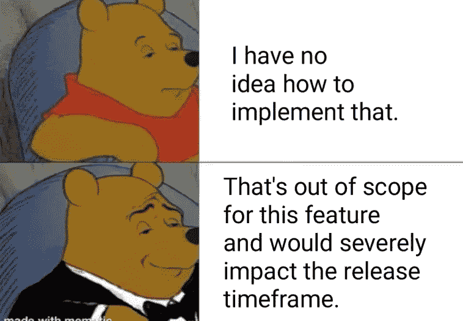
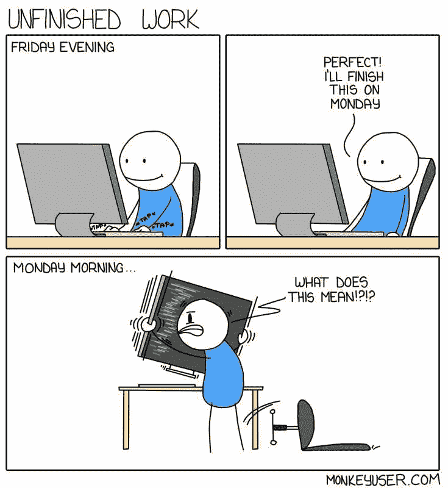
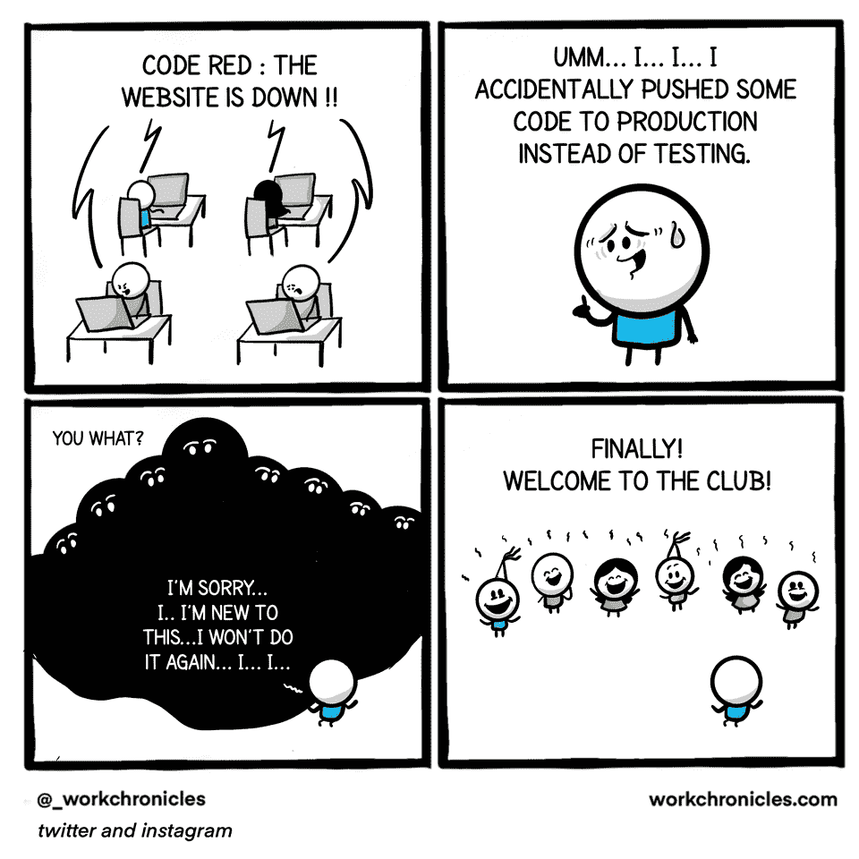

# 编笑话让你笑死

> 原文：<https://javascript.plainenglish.io/programming-jokes-to-make-you-die-laughing-94efd4fecafa?source=collection_archive---------0----------------------->

## 2022 年新的编程笑话

Photo by [Senjuti Kundu](https://unsplash.com/@senjuti?utm_source=medium&utm_medium=referral) on [Unsplash](https://unsplash.com?utm_source=medium&utm_medium=referral)

新的一年，新的开始。作为你的微笑专家，我又想出了一篇文章，汇集了我在社交媒体上发现的流行节目笑话。

这些笑话的用意是让你发笑，纠正你的情绪。因为:

## “笑声是人机最好的刷新按钮”

让我们沉浸在笑声中…

# 让我们齐心协力按时完成这项任务…

Picture Credit:[https://www.monkeyuser.com/](https://www.monkeyuser.com/)

# 它在轨道上…但是轨道有一些问题…

Picture Credit:[https://programmerhumor.io/](https://programmerhumor.io/)

# 隐藏的真相还是现实？

Picture Credit: [https://www.reddit.com/r/ProgrammerHumor](https://www.reddit.com/r/ProgrammerHumor)

# 让我们专注于完成任务，我们稍后会检查错误。一段时间后…

Picture Credit:[https://www.monkeyuser.com/](https://www.monkeyuser.com/)

# 你以前说过吗？

Picture Credit: [https://programmerhumor.io/](https://programmerhumor.io/)

# 提交消息和高级开发人员…他们总是制造麻烦

Picture Credit: [https://www.reddit.com/r/ProgrammerHumor](https://www.reddit.com/r/ProgrammerHumor)

# 送给程序员的好礼物。你犯了罪，你也是调查员。

Picture Credit: [https://programmerhumor.io/](https://programmerhumor.io/)

# 数据工程师就像…

Picture Credit: [https://www.reddit.com/r/ProgrammerHumor](https://www.reddit.com/r/ProgrammerHumor)

# 根据多年的经验，压力水平会发生变化…

Picture Credit: [https://www.facebook.com/programminggeeks.in](https://www.facebook.com/programminggeeks.in)

# 我最好的编程伙伴…

Picture Credit:[https://programmerhumor.io/](https://programmerhumor.io/)

# 你喜欢冒险吗？

Picture Credit: [https://www.facebook.com/programminggeeks.in](https://www.facebook.com/programminggeeks.in)

# 哪种方式适合你？

Picture Credit:[https://www.monkeyuser.com/](https://www.monkeyuser.com/)

# 奖金

# 展示自己的作品总是更好… LOL

[https://www.facebook.com/DZoneInc/photos/a.336758034711/10159513354989712](https://www.facebook.com/DZoneInc/photos/a.336758034711/10159513354989712)

# 发生了很多次…我总是去不同的页面…

[https://www.facebook.com/DZoneInc/photos/a.336758034711/10159513354989712](https://www.facebook.com/DZoneInc/photos/a.336758034711/10159513354989712)

# 为什么编译器不够智能，无法自动修复所有问题？

[https://www.facebook.com/DZoneInc/photos/a.336758034711/10159505422369712/](https://www.facebook.com/DZoneInc/photos/a.336758034711/10159505422369712/)

# 看起来很管用…那应该够了…哈哈…

[https://www.facebook.com/DZoneInc/photos/a.336758034711/10159501229644712/](https://www.facebook.com/DZoneInc/photos/a.336758034711/10159501229644712/)

# 我们周一继续吧…

[https://www.facebook.com/photo?fbid=2965577677092733&set=gm.2875612219372995](https://www.facebook.com/photo?fbid=2965577677092733&set=gm.2875612219372995)

# 时间是可以定义的，程序员

[https://www.facebook.com/photo?fbid=352070916544458&set=gm.2875632262704324](https://www.facebook.com/photo?fbid=352070916544458&set=gm.2875632262704324)

# 你身后藏着可怕的东西…

[https://www.facebook.com/DZoneInc/photos/10159479172079712](https://www.facebook.com/DZoneInc/photos/10159479172079712)

# 那种和平是无法想象的…

[https://www.facebook.com/javascriptJS/photos/a.1387402908063976/2251831714954420/](https://www.facebook.com/javascriptJS/photos/a.1387402908063976/2251831714954420/)

# 在家工作…饼图…老实说，不是真的…

[https://www.facebook.com/yuva.krishna.memes](https://www.facebook.com/yuva.krishna.memes)

# 开发与质量保证版本…

[https://www.monkeyuser.com/2018/happy-flow/?sc=true&dir=random](https://www.monkeyuser.com/2018/happy-flow/?sc=true&dir=random)

# 当任务管理器有责任关闭没有响应的东西时…

[https://www.facebook.com/photo?fbid=10159630257979673&set=gm.2870233513227290](https://www.facebook.com/photo?fbid=10159630257979673&set=gm.2870233513227290)

# 浏览量每天都在增加，是的，人们好奇的看着，怎么会有人这么做呢？英雄联盟

[https://www.facebook.com/ProgrammersCreateLife/](https://www.facebook.com/ProgrammersCreateLife/)

# 打算买床垫？像问答一样思考…这将有助于:D

[https://www.monkeyuser.com/](https://www.monkeyuser.com/)

# 这种情况经常发生…风扇会启动，声音会出现…

[https://www.quora.com/What-are-some-of-the-best-programmer-jokes-and-memes-out-there](https://www.quora.com/What-are-some-of-the-best-programmer-jokes-and-memes-out-there)

# 你的愿望是什么？无 Bug 代码？抱歉 404:未找到

[https://www.facebook.com/techindustan/](https://www.facebook.com/techindustan/)

# 那种只有你的人能理解你的感觉…

[https://www.facebook.com/programminggeeks.in](https://www.facebook.com/programminggeeks.in)

# 当你有很多东西在桶里的时候，没有时间工作…

Source:[https://www.monkeyuser.com/](https://www.monkeyuser.com/)

# 当每个人都建议添加一些功能来美化网站时..结局会是这样的…

[https://www.monkeyuser.com/](https://www.monkeyuser.com/)

# 只有戴眼镜的人才能感受到这一点…

[https://www.facebook.com/JokesTechnical](https://www.facebook.com/JokesTechnical)

# 对不起，这种事不会再发生了..欢迎好友…

[https://www.facebook.com/DZoneInc/photos/10158894902394712](https://www.facebook.com/DZoneInc/photos/10158894902394712)

# 当初级开发给出评估时…项目经理也有同样的感觉…

[https://www.facebook.com/javascriptJS/photos/1559356324201966](https://www.facebook.com/javascriptJS/photos/1559356324201966)

## 请请帮帮我…哈哈…

## 新发明…

## 唯一的焦点应该是代码…如果它不起作用，那么让我们检查语句…

## 简单……不过，让我们问问……

## 又一个可怜的 PJ…

*更多内容请看*[***plain English . io***](http://plainenglish.io/)*。报名参加我们的* [***免费周报***](http://newsletter.plainenglish.io/) *。在我们的* [***社区***](https://discord.gg/GtDtUAvyhW) *获得独家获得写作机会和建议。*